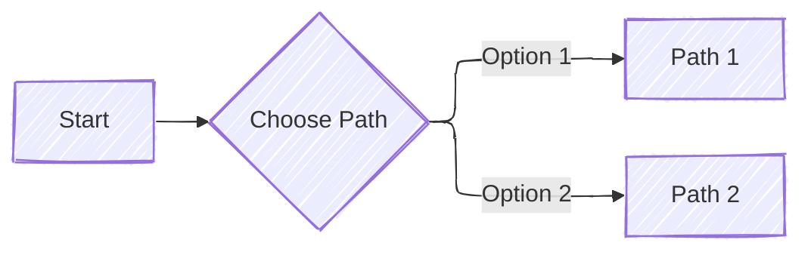
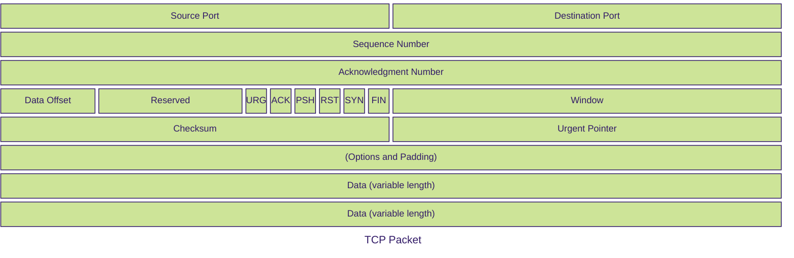

# Mermaid 笔记

mermaid 官网：https://mermaid.js.org/
mermaid 在线编辑器：https://mermaid.live/

下面的笔记是对 Mermaid 语法的整理，涵盖了 Mermaid 的基本概念、图表类型、语法结构和常见用法。主要参考的就是官网的文档部分：https://mermaid.js.org/intro/

## 0 语法框架和 Configuration

https://mermaid.js.org/intro/syntax-reference.html

### Syntax Structure

all Diagrams definitions begin with a declaration of the diagram type, followed by the definitions of the diagram and its contents. This declaration notifies the parser which kind of diagram the code is supposed to generate.

### Diagram Breaking

有一些词会让 parser 没有办法解析图表，下面这些词会让 parser 认为是图表的结束：

| Diagram Breakers                                                       | Reason                                                             | Solution                                          |
| ---------------------------------------------------------------------- | ------------------------------------------------------------------ | ------------------------------------------------- |
| Comments [%%{``}%%](https://github.com/mermaid-js/mermaid/issues/1968) | Similar to Directives confuses the renderer.                       | In comments using %%, avoid using "{}".           |
| Flow-Charts 'end'                                                      | The word "End" can cause Flowcharts and Sequence diagrams to break | Wrap them in quotation marks to prevent breakage. |
| Nodes inside Nodes                                                     | Mermaid gets confused with nested shapes                           | wrap them in quotation marks to prevent breaking  |

### Configuration

可以设置一些配置项来影响图表的渲染效果，下面是一些常用的配置项：

暂时跳过

## 1 Diagram Syntax

正如我们前面说到的，mermaid 的基本语法结构就是第一行先声明这个图标的类型，然后后面一行一行描述这个图表里面的元素。换句话说，从第二行开始的内容是受制于第一行声明的图表类型的。因此我们后面的笔记就是按照图标类型依次介绍。这个和官网的 doc 保持一致。

下面就是各种图表了：

- [[flowchart]]: 流程图

## 2 Configuration

https://mermaid.js.org/intro/syntax-reference.html#configuration

