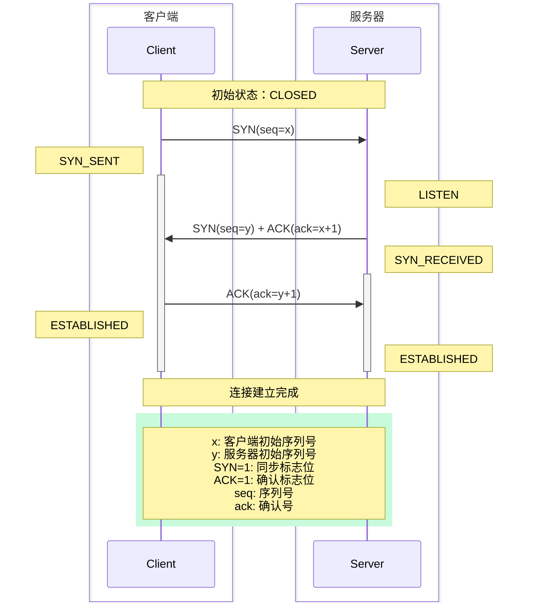
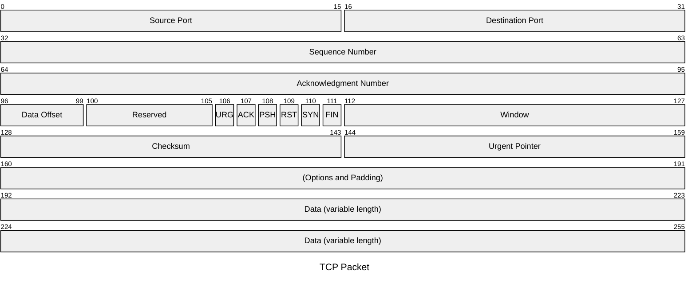
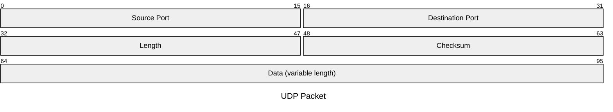

# sequence 图展示 TCP 三次握手

```mermaid
sequenceDiagram
  box 客户端
  participant C as Client
  end
  box 服务器
  participant S as Server
  end

  Note over C,S: 初始状态：CLOSED

  C->>S: SYN(seq=x)
  Note left of C: SYN_SENT
  activate C
  Note right of S: LISTEN

  S->>C: SYN(seq=y) + ACK(ack=x+1)
  Note right of S: SYN_RECEIVED
  activate S

  C->>S: ACK(ack=y+1)
  Note left of C: ESTABLISHED
  Note right of S: ESTABLISHED
  deactivate C
  deactivate S

  Note over C,S: 连接建立完成

  rect rgb(200, 250, 220)
  Note over C,S: x: 客户端初始序列号<br/>y: 服务器初始序列号<br/>SYN=1: 同步标志位<br/>ACK=1: 确认标志位<br/>seq: 序列号<br/>ack: 确认号
  end
```

# 计算机网络

## TCP

```mermaid
---
title: "TCP Packet"
---
packet-beta
0-15: "Source Port"
16-31: "Destination Port"
32-63: "Sequence Number"
64-95: "Acknowledgment Number"
96-99: "Data Offset"
100-105: "Reserved"
106: "URG"
107: "ACK"
108: "PSH"
109: "RST"
110: "SYN"
111: "FIN"
112-127: "Window"
128-143: "Checksum"
144-159: "Urgent Pointer"
160-191: "(Options and Padding)"
192-255: "Data (variable length)"
```

## UDP

```mermaid
packet-beta
title UDP Packet
0-15: "Source Port"
16-31: "Destination Port"
32-47: "Length"
48-63: "Checksum"
64-95: "Data (variable length)"
```
