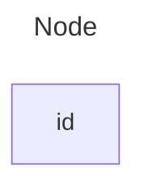
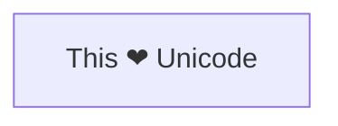
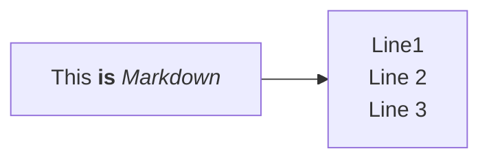
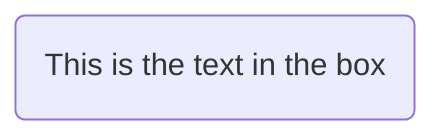
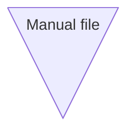
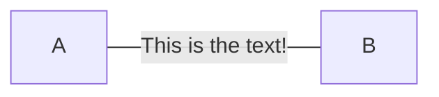
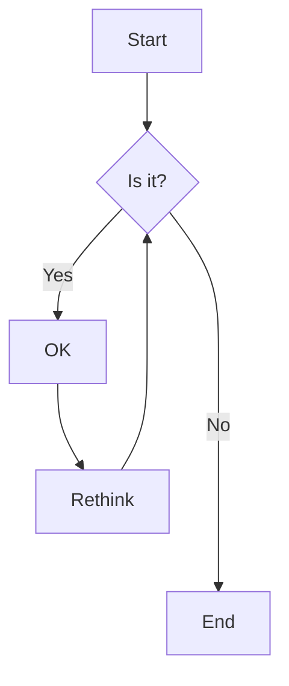

# Flowchart

流程图 Flowcharts are composed of nodes (geometric shapes) and edges (arrows or lines).

TODO: 这里补充一个尽可能多的用到下面这些内容的 flowchart 图

## Direction

Possible FlowChart orientations are:

- TB - Top to bottom
- TD - Top-down/ same as top to bottom
- BT - Bottom to top
- RL - Right to left
- LR - Left to right

## Node

默认的节点像下面这个样子：



实际上完整的 Node 几个部分是这样的：

```plaintext
<node_id>["<node_label>"]:::<class_name>
```

### text

会显示 node_label，如果没有的话就会显示 node_id

node_label 除了下面几种情况以外可以不用双引号：

1. Unicode 字符



2. markdown 格式文本



### Shape

下面是最常见的几种 Node Shape：

```plaintext
flowchart LR
    id1(This is the text in the box)
```



---

v11.3.0 引入了下面这种语法来更好的声明 node shape



---

v11.3.0 还引入了下面两种特殊的 Node：

1. Icon Shape

https://mermaid.js.org/syntax/flowchart.html#icon-shape


2. Image Shape

https://mermaid.js.org/syntax/flowchart.html#image-shape

```mermaid
flowchart TD
    A@{ img: "https://picsum.photos/200", label: "Image Label", pos: "t", w: 60, h: 60, constraint: "off" }
```

## Link

Nodes can be connected with links/edges. It is possible to have different types of links or attach a text string to a link.

```plaintext
flowchart LR
    A-- This is the text! ---B
```



### Length

Each node in the flowchart is ultimately assigned to a rank in the rendered graph, i.e. to a vertical or horizontal level (depending on the flowchart orientation), based on the nodes to which it is linked. By default, links can span any number of ranks, but you can ask for any link to be longer than the others by adding extra dashes in the link definition.

```plaintext
flowchart TD
    A[Start] --> B{Is it?}
    B -->|Yes| C[OK]
    C --> D[Rethink]
    D --> B
    B ---->|No| E[End]
```



如果想要延长连接线的长度，可以在连接线中添加额外的连字符。下面是一些常见的连接线长度：

| Length            | 1    | 2     | 3      |
| ----------------- | ---- | ----- | ------ |
| Normal            | ---  | ----  | -----  |
| Normal with arrow | -->  | --->  | ---->  |
| Thick             | ===  | ====  | =====  |
| Thick with arrow  | ==>  | ===>  | ====>  |
| Dotted            | -.-  | -..-  | -...-  |
| Dotted with arrow | -.-> | -..-> | -...-> |

## Subgraph

```plaintext
subgraph title
    graph definition
end
```

## 其他

> [!WARNING]
> 如果您在流程图节点中使用单词 "end"，请将整个单词或任意字母大写（例如，"End" 或 "END"），或应用此解决方法。在全小写字母中输入 "end" 将破坏流程图。

> [!WARNING]
> 如果您在连接流程图节点时使用字母 "o" 或 "x" 作为第一个字母，请在字母前添加空格或将字母大写（例如，"dev--- ops"，"dev---Ops"）。
>
> 输入 "A---oB" 将创建一个圆形边缘。
>
> 输入 "A---xB" 将创建一个交叉边缘。
