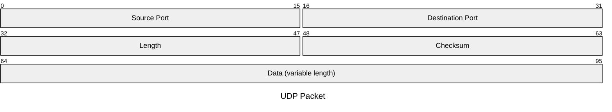

本章位于网络协议栈的核心位置，架起了应用层与网络层之间的桥梁。在第二章，我们学习了应用层协议，它们定义了应用程序如何交换报文。然而，这些应用程序需要一种服务，来将它们的报文从一个端系统传递到另一个端系统。运输层就提供了这项关键服务。

与上一章我们关注应用程序不同，本章我们将深入探讨两种主要的运输层协议：**UDP** 和 **TCP**。我们将学习它们如何为运行在不同主机上的应用进程提供**逻辑通信**（logical communication）。我们会先从运输层的基本原理开始，例如**多路复用/分解**（multiplexing/demultiplexing），然后深入研究计算机网络中两个最基本的问题：如何实现**可靠数据传输**（reliable data transfer）和**拥塞控制**（congestion control）。

理解运输层对于掌握网络如何运作至关重要，因为它直接关系到我们日常使用的应用程序（如Web浏览器、视频会议）的性能和可靠性。

---

# 3.1 概述和运输层服务

在前两章中，我们已经初步了解了运输层的作用及其提供的服务。 让我们快速回顾一下已经学过的内容。

运输层协议为运行在不同主机上的应用程序进程之间提供了**逻辑通信**（logical communication）的功能。 所谓逻辑通信，是指从应用程序的角度来看，就好像运行这些进程的主机是直接相连的一样。 而实际上，这些主机可能位于地球的两端，通过许多路由器和各种类型的链路连接起来。 应用程序进程使用运输层提供的逻辑通信来相互发送报文，而无需关心用于承载这些报文的物理基础设施的细节。 下图（图3.1）形象地说明了逻辑通信的概念。

运输层协议在端系统中实现，而不是在网络路由器中实现。

网络应用程序可以使用多种运输层协议。 例如，因特网提供了两种协议——TCP和UDP。每种协议都向调用它的应用程序提供一组不同的运输层服务。

在发送端，运输层将其从发送应用程序进程接收到的应用层报文转换为运输层分组，在因特网术语中称为运输层**报文段**（segment）。 这通常需要将应用报文分割成较小的块，并为每个块添加一个运输层首部，从而创建运输层报文段。

然后，运输层将报文段传递给发送端系统的网络层，在网络层，报文段被封装到网络层分组（即**数据报**，datagram）中，然后发送到目的地。

需要注意的是，网络路由器只对数据报的网络层字段进行操作； 也就是说，它们不检查封装在数据报内的运输层报文段的字段。 在接收端，网络层从数据报中提取出运输层报文段，并将该报文段向上传递给运输层。 运输层随后处理接收到的报文段，使其数据可供接收应用程序使用。

在接收端：

1. 网络层从数据报中提取运输层报文段，并将该报文段向上交给运输层
2. 运输层则处理接收到的报文段，使该报文段中的数据供接收应用进程使用

网络应用程序可以使用多种的运输层协议。例如，因特网有两种协议，即 TCP 和 UDP。每种协议都能为调用的应用程序提供一组不同的运输层服务。

> 除了 TCP/UDP，还有其他重要的运输层协议：
>
> - **SCTP** (Stream Control Transmission Protocol): 提供可靠的、面向消息的数据传输，支持多宿主和多流
> - **QUIC** (Quick UDP Internet Connections): 基于 UDP 构建的现代传输协议，是 HTTP/3 的基础
> - **DCCP** (Datagram Congestion Control Protocol): 提供不可靠但有拥塞控制的数据传输
> - **RTP** (Real-time Transport Protocol): 专门用于实时数据如音视频流的传输

## 期末复习：传输层的通信主体（进程）

#了解

| 层次       | 通信主体 | 标识符   |
| ---------- | -------- | -------- |
| 应用层     | 应用程序 | 应用协议 |
| 传输层     | 进程     | 端口号   |
| 网络层     | 主机     | IP地址   |
| 数据链路层 | 网络接口 | MAC地址  |

## 3.1.1 运输层和网络层的关系

运输层刚好位于网络层之上。网络层提供了主机之间的逻辑通信，而运输层为运行在不同主机上的进程之间提供了逻辑通信。这种差别虽然细微但很重要。

我们可以用一个比喻来理解运输层和网络层的关系：

- **网络层 (Network Layer)**：提供的是**主机到主机** (host-to-host) 的通信。这就像一个邮政服务，负责将信件从一个家庭（主机）投递到另一个家庭（主机）。邮政服务关心的是如何把信件送到正确的地址（IP地址），但它不关心具体是家庭中的哪位成员收信。
- **运输层 (Transport Layer)**：提供的是**进程到进程** (process-to-process) 的通信。这就像是邮政服务中一个额外的环节。假设有两个大家庭，Ann 家和 Bill 家，两家的孩子们是笔友，经常互相写信。运输层就像是两家的家长，当 Ann 家收到一封来自 Bill 家的信时，家长会根据信封上写的收信人名字（例如，是给 Ann 家大儿子还是小女儿的），把信交给正确的孩子（进程）。同样，Ann 家的孩子想寄信时，也会告诉家长这封信是写给 Bill 家的谁。这个“谁”，在网络中就是通过**端口号** (port number) 来标识的。

总结来说：

- 网络层协议（如 IP 协议）实现了主机之间的逻辑通信。
- 运输层协议将主机之间的通信扩展到了进程之间的通信，实现了进程之间的逻辑通信。

运输层协议是实现在**端系统** (end system) 中的。也就是说，与网络核心中的路由器不同，发送端的运输层将应用报文转换成运输层分组（称为**报文段** - segment），并将其传递给网络层。接收端的运输层则从网络层接收报文段，并将其中的数据交付给正确的应用进程。

## 3.1.2 因特网运输层概述

 报文段与数据段 

为了方便理解，本书统一将运输层的数据包称为“报文段”（segment）。但在一些网络资料（比如 RFC 文档）中，TCP 的数据包也被称为“报文段”，而 UDP 的数据包则常被称为“数据报”（datagram）。更让人困惑的是，这些资料也把网络层的数据包叫做“数据报”！

为了避免混淆，本书约定：

- **运输层（TCP 和 UDP）的数据包统一称为“报文段”**
- **网络层的数据包称为“数据报”**

因特网为应用层提供了两种截然不同的运输层协议：

1. **UDP (User Datagram Protocol, 用户数据报协议)**:
   - 它为应用程序提供了一种**不可靠、无连接** (unreliable, connectionless) 的服务。
   - **不可靠**意味着它不保证报文段能成功到达目的地，也不保证它们的顺序。
   - **无连接**意味着通信双方在发送数据前不需要预先建立连接。
   - 可以把它想象成普通的平信邮寄，投递出去后就不管了，可能会丢失，也可能先寄的信后到。

2. **TCP (Transmission Control Protocol, 传输控制协议)**:
   - 它为应用程序提供了一种**可靠、面向连接** (reliable, connection-oriented) 的服务。
   - **可靠**意味着它通过流量控制、序号、确认和定时器等机制，确保数据无差错、按序到达。
   - **面向连接**意味着在数据交换之前，必须在通信双方之间建立连接（即著名的“三次握手”）。
   - 可以把它想象成挂号信或快递服务，有追踪、有签收确认，确保信件安全、准确地送达。
   - TCP 还提供**拥塞控制** (congestion control) 功能，当网络拥堵时会主动减慢发送速率，这对整个因特网的稳定运行至关重要。

在本书中，当谈到运输层分组时，我们通常称之为**报文段** (segment)。但是，很多网络从业者也会把 UDP 的分组称为**数据报** (datagram)。这两种称呼都可以。

最后，值得注意的是，运输层的 TCP 和 UDP 协议是对网络层的 **IP 协议** 的补充。IP 协议提供的是“尽力而为” (best-effort) 的交付服务，它只负责将数据报从一台主机送到另一台主机，但不做任何可靠性保证。UDP 基本上就是将 IP 的主机到主机服务扩展为进程到进程服务，而 TCP 则在 IP 服务之上构建了可靠数据传输和拥塞控制等复杂功能。

## 复习题

TODO: 下面的复习题是 3.1-3.3 节，需要根据实际内容拆分。

### R1

假定网络层提供了下列服务。在源主机中的网络层接受最大长度 1200 字节和来自运输层的目的主机地址的报文段。网络层则保证将该报文段交付给位于目的主机的运输层。假定在日的主机上能够运行许多网络应用进程。
a. 设计可能最简单的运输层协议，该协议将使应用程序数据到达位于目的主机的所希望的进程。假设在目的主机中的操作系统已经为每个运行的应用进程分配了一个 4 字节的端口号。
b. 修改这个协议，使它向目的进程提供一个的"返回地址"。
c. 在你的协议中，该运输层在计算机网络的核心中"必须做任何事"吗？

#### A2

### R2

考虑有一个星球，每个人都属于某个六口之家，每个家庭都住在自己的房子里，每个房子都一个唯一的地址，并且某给定家庭中的每个人有一个独特的名字。假定该星球有一个从源家庭到目的家庭交付信件的邮政服务。该邮件服务要求：① 在一个信封中有一封信；② 在信封上清楚地写上目的家庭的地址（并且没有别的东西）。假设每个家庭有一名家庭成员代表为家庭中的其他成员收集和分发信件。这些信没有必要提供任何有关信的接收者的指示。
a. 使用对上面复习题 R1 的解决方案作为启发，描述家庭成员代表能够使用的协议，以从发送家庭成员向接收家庭成员交付信件。
b. 在你的协议中，该邮政服务必须打开信封并检查信件内容才能提供它的服务吗？

#### A3

### R3

考虑在主机 A 和主机 B 之间有一条 TCP 连接。假设从主机 A 传送到主机 B 的 TCP 报文段具有源端口号 x 和目的端口号 y。对于从主机 B 传送到主机 A 的报文段，源端口号和目的端口号分别是多少？

#### A

### R4

描述应用程序开发者为什么可能选择在 UDP 上运行应用程序而不是在 TCP 上运行的原因。

#### A4

### R5

在今天的因特网中，为什么语音和图像流量常常是经过 TCP 而不是经 UDP 发送。（提示：我们寻找的答案与 TCP 的拥塞控制机制没有关系。）

#### A5

### R6

当某应用程序运行在 UDP 上时，该应用程序可能得到可靠数据传输吗？如果能，如何实现？

#### A6

### R7

假定在主机 C 上的一个进程有一个具有端口号 6789 的 UDP 套接字。假定主机 A 和主机 B 都用目的端口号 6789 向主机 C 发送一个 UDP 报文段。这两台主机的这些报文段在主机 C 都被描述为相同的套接字吗？如果是这样的话，在主机 C 的该进程将怎样知道源于两台不同主机的这两个报文段？

#### A7

### R8

假定在主机 C 端口 80 上运行的一个 Web 服务器。假定这个 Web 服务器使用持续连接，并且正在接收来自两台不同主机 A 和 B 的请求。被发送的所有请求都通过位于主机 C 的相同套接字吗？如果它们通过不同的套接字传递，这两个套接字都具有端口 80 吗？讨论和解释之。

#### A8

# 3.2 多路复用与多路分解

上一节我们讲到，运输层实现了**进程到进程**的通信。但一台主机上可能同时运行着多个网络应用进程（比如浏览器、邮件客户端、视频会议软件）。当主机收到数据时，它怎么知道要把数据交给哪个进程呢？这就是**多路分解** (Demultiplexing) 要解决的问题。反过来，主机需要从不同的应用进程收集数据，并为它们封装上头部信息然后交给网络层，这个过程就是**多路复用** (Multiplexing)。

我们再用一下 3.1 节那个家庭通信的比喻：

- **多路分解 (Demultiplexing)**：当 Ann 家收到一大堆信件时，家长（运输层）会查看每封信上的收信人名字（端口号），然后把信分发给对应的孩子（应用进程）。这个**将运输层报文段中的数据交付给正确套接字的过程**就是多路分解。
- **多路复用 (Multiplexing)**：Ann 家的孩子们（应用进程）把要寄出去的信都交给家长（运输层）。家长收集这些信，贴上邮票、写好地址（添加头部信息），然后统一投递到邮箱（交给网络层）。这个**从源主机的不同套接字收集数据块，并为每个数据块封装上头部信息从而生成报文段，然后将报文段传递到网络层的过程**就是多路复用。

要实现这个功能，关键在于**套接字 (Sockets)** 和**端口号 (Port Numbers)**。

一个进程可以通过一个或多个**套接字**向网络发送或从网络接收报文。运输层实际上并不是直接将数据交付给进程，而是交付给中间的套接字。因为一台主机上可以有大量的套接字，所以每个套接字都需要一个唯一的标识符。这个标识符就是**端口号 (Port Number)**。

- 端口号是一个 16 位的数字，范围从 0 到 65535。
- 0 到 1023 的端口号是**周知端口号 (well-known ports)**，它们是为一些标准服务保留的，例如：
  - HTTP 服务器：端口 80
  - FTP 服务器：端口 21
  - DNS 服务器：端口 53
- 当你开发自己的网络应用时，通常会使用 1024 以上的临时端口号。

周知端口的列表在[[1700|RFC 1700]]中给出，同时在 http://www.iana.org 上有更新文档[[3232|RFC 3232]]

## 怎么进行分解 (How Demultiplexing Works)

当一个运输层报文段到达主机时，主机会检查报文段中的特定字段，来决定将它导向哪个套接字。这些字段包括：

- **源端口号 (Source port number)**
- **目的端口号 (Destination port number)**

接下来，我们来看两种不同协议下的分解方式

### 期末复习：TCP 和 UDP 通过什么字段寻址（目的端口号）、常见应用层协议的默认端口号

#熟悉

TCP和UDP协议通过**端口号**进行寻址，具体是在其协议头部的**源端口号**和**目的端口号**字段中实现的。这些字段都是16位的，允许使用0-65535范围内的端口号。其中，0-1023叫做**周知端口号**，是为一些标准服务保留的。

| 协议        | 端口号 | 传输层协议 | 用途                       |
| ----------- | ------ | ---------- | -------------------------- |
| FTP数据传输 | 20     | TCP        | 文件传输协议数据通道       |
| FTP控制连接 | 21     | TCP        | 文件传输协议控制通道       |
| SSH         | 22     | TCP        | 安全Shell远程登录          |
| Telnet      | 23     | TCP        | 远程终端协议               |
| SMTP        | 25     | TCP        | 简单邮件传输协议(发送邮件) |
| DNS         | 53     | TCP/UDP    | 域名系统(域名解析)         |
| DHCP        | 67/68  | UDP        | 动态主机配置协议           |
| HTTP        | 80     | TCP        | 超文本传输协议             |
| POP3        | 110    | TCP        | 邮局协议第3版(接收邮件)    |
| IMAP        | 143    | TCP        | 互联网消息访问协议         |
| HTTPS       | 443    | TCP        | 安全HTTP(加密)             |
| RDP         | 3389   | TCP        | 远程桌面协议               |
| MySQL       | 3306   | TCP        | MySQL数据库服务            |

> 注意：虽然说TCP和UDP协议都是通过**端口号**进行寻址，**但** UDP 和 TCP 在实现分解时使用了不同的标识符（UDP 用二元组，TCP 用四元组），这导致了它们在处理多个并发通信时的行为差异。

## 1. 无连接的多路复用与多路分解

假设主机 A (IP地址为 `IPA`) 上的一个进程通过源端口 19157 向主机 B (IP地址为 `IPB`) 的一个 UDP 进程（端口号 46428）发送数据。

- 主机 A 创建一个 UDP 报文段，其中：
  - 源端口 = 19157
  - 目的端口 = 46428
- 主机 B 收到这个 UDP 报文段后，运输层会检查**目的端口号** (46428)，然后将该报文段的数据部分交给绑定到端口 46428 的那个套接字。

一个关键点是：对于 UDP，如果两个来自不同源主机（不同源IP、不同源端口）的 UDP 报文段，只要它们的**目的IP和目的端口号相同**，它们就会被定向到**同一个**目的套接字。

## 2. 面向连接的多路复用与多路分解

TCP 的套接字与 UDP 不同，它是由一个**四元组 (4-tuple)** 来标识的：

- **源 IP 地址**
- **源端口号**
- **目的 IP 地址**
- **目的端口号**

当一个 TCP 报文段到达主机时，主机的运输层会使用**所有这四个值**来确定将报文段导向哪个套接字。

这带来的一个重要区别是：

- 两个具有不同源 IP 地址或不同源端口号的 TCP 报文段，即使它们的目的 IP 和目的端口号相同，也会被定向到**两个不同**的套接字。

这个机制使得一台 Web 服务器（例如，固定监听在 80 端口）能够同时与成千上万个不同的客户端进行通信。每个客户端与服务器之间的连接都会被映射到一个独立的连接套接字，服务器通过这个连接套接字与特定客户端交互。而服务器上那个监听 80 端口的“欢迎套接字” (welcoming socket) 则一直等待新的连接请求。

## 3. Web 服务器与 TCP

### Web 服务器与端口号

- Web 服务器（如 Apache）通常在 80 端口监听 HTTP 请求。
- 客户端（浏览器）发送到 Web 服务器的报文段，目的端口都是 80。
- 服务器通过**源 IP 地址**和**源端口号**来区分来自不同客户端的报文段。

### 连接套接字与进程/线程

- 传统 Web 服务器：为每个连接创建一个新进程，每个进程有自己的连接套接字。
- 现代高性能 Web 服务器：通常只使用一个进程，但为每个新连接创建一个新线程，每个线程有新的连接套接字。
- 一个进程可以对应多个连接套接字。

### 持久 HTTP 与非持久 HTTP

- **持久 HTTP**：在整个连接期间，客户端和服务器通过同一个服务器套接字交换 HTTP 报文。
- **非持久 HTTP**：每对请求/响应都创建一个新的 TCP 连接，并创建和关闭新的套接字。
- 频繁创建和关闭套接字会影响 Web 服务器性能。

# 3.3 无连接运输：UDP

UDP 是一个非常简单的运输层协议。正如《TCP/IP 详解》所说，UDP “基本上就是 IP 的一个薄包装”。除了提供 3.2 节讲的多路复用/分解功能以及一些简单的差错检测外，它几乎没有增加任何其他功能。

如果一个应用选择了 UDP，那么当它把数据传递给 UDP 套接字后，UDP 会为数据加上源端口、目的端口等头部字段，然后就直接把它交给网络层的 IP 协议了。它不会像 TCP 那样先“握手”建立连接，发送后也不管对方是否收到。

### 为什么需要 UDP？

既然 TCP 提供了可靠的数据传输，为什么还有应用会选择 UDP 呢？主要有以下几个原因：

- **关于发送什么数据以及何时发送的应用层控制更为精细。** UDP 收到应用层的数据后，会立即将其打包成一个报文段并发送出去。而 TCP 因为有拥塞控制和流量控制机制，可能会因为网络拥塞而延迟发送。对于一些实时应用（如网络电话、在线游戏），宁愿丢失一些数据包，也不希望有太大的延迟，所以它们更青睐 UDP。
- **无须连接建立。** TCP 在传输数据前需要进行“三次握手”，这会引入额外的时延。UDP 则没有这个过程，可以立即发送数据。这就是为什么 DNS（域名系统）通常运行在 UDP 之上，因为查询请求和响应都很小，快速得到结果更重要。
- **无连接状态。** TCP 需要在通信双方的端系统中维护连接状态（如接收/发送缓存、序号、拥塞控制参数等）。而 UDP 不维护任何连接状态，这使得服务器可以支持更多的并发客户端，因为不需要为每个客户端维护一个复杂的状态机。
- **分组首部开销小。** 每个 TCP 报文段有 20 字节的首部开销，而 UDP 只有 8 字节。对于开销敏感的应用，这个差距还是比较可观的。

很多我们熟悉的应用都运行在 UDP 之上，比如 DNS、SNMP（简单网络管理协议）以及许多流媒体应用。当然，如果应用开发者选择了 UDP，又想获得可靠性，那么必须在**应用层**自己去实现可靠数据传输的逻辑。

## 3.3.1 UDP 报文段结构

UDP 报文段的结构非常简单，其首部只有四个字段，每个字段占 2 字节（16位），总共 8 字节。

- **源端口号 (Source Port No.)** 和 **目的端口号 (Destination Port No.)**：用于实现多路复用和分解。
- **长度 (Length)**：表示该 UDP 报文段的总长度（字节），包括首部和数据部分。
- **检验和 (Checksum)**：用于检查报文段在传输过程中是否出现了差错（例如比特翻转）。

## 3.3.2 UDP 检验和

UDP 检验和提供了一种差错检测机制。它的计算方法是：

1. 发送方将 UDP 报文段的内容（包括首部和数据）在逻辑上看作是一系列 16 位的整数。
2. 将所有这些 16 位整数相加。如果最高位有进位，则将该进位加到结果的最低位（这称为**反码求和**或 1s' complement sum）。
3. 将最终得到的和按位取反，得到的结果就是检验和。
4. 在接收方，会将收到的报文段（包括检验和字段）的所有 16 位字再次进行反码求和。
5. 如果计算结果所有位都是 1（即 `-0` 的反码表示 `1111111111111111`），则说明报文没有检测到差错。如果结果中包含 0，则说明传输中出现了差错。

**举个例子：** 假设我们有三个 16 位的字： `0110011001100110` `0101010101010101` `1000111100001111`

1. 前两个相加： `0110011001100110` `+ 0101010101010101` `------------------` `1011101110111011`
2. 将上面的和与第三个字相加： `1011101110111011` `+ 1000111100001111` `------------------` `1 0100101011001010` -> 最高位产生了进位 `1`
3. 将进位加到结果上（反码求和）： `0100101011001010` `+ 1` `------------------` `0100101011001011` (这就是最终的和)
4. 按位取反，得到检验和： `1011010100110100` (这就是要填入检验和字段的值)

值得注意的是，虽然 UDP 提供了检验和功能，但它是可选的。如果发送方没有计算检验和，会将该字段全置为 0。然而，在实际应用中，为了防止数据损坏，检验和功能通常是开启的。

## 期末复习：UDP 协议的特点、使用 UDP 的应用层协议、UDP 报文段结构

#熟悉

### UDP 协议的特点

- 无连接，无拥塞控制：不需要建立连接即可立即传输数据，发送速率不受网络拥塞影响
- 不可靠传输：不保证数据包的可靠到达
- 无状态跟踪：不维护连接状态信息
- 低开销：头部仅8字节，远小于TCP的20字节

### 使用 UDP 的应用层协议

- DNS（域名系统）：域名解析
- DHCP（动态主机配置协议）：动态分配IP地址
- SNMP（简单网络管理协议）：网络设备管理
- 流媒体应用：视频直播、音频广播

### UDP 报文段结构

# 3.4 可靠数据传输原理

我们面临的问题是：如何在一个**不可靠**的底层信道上，构建一个**可靠**的数据传输服务？这里的不可靠信道，指的是它可能会**损坏** (corrupt) 比特或**丢失** (lose) 整个分组。而我们期望实现的可靠服务，要能确保数据无差错、不丢失、按顺序地交付给上层。下图是可靠数据传输的学习框架，左侧是**服务模型**也就是运输层在上一层应用层看起来是可靠的信道，右侧是**服务实现**也就是运输层的下一层（网络层）本身是不可靠的，所以需要实现`rdt_sned`, `udt_send`, `rdt_rcv`以及`deliver_data`等方法。

这项任务的复杂性体现在计算机网络中排名前十的难题之中。

在本节中，我们将逐步设计一个可靠数据传输协议（我们称之为 **rdt**）的发送方和接收方。我们会使用**有限状态机 (Finite-State Machine, FSM)** 来精确地描述发送方和接收方的行为。

我们先从最简单、最理想化的情况开始，然后一步步地为底层信道增加不完美的特性，并相应地完善我们的协议。

## 3.4.1 构造可靠数据传输协议

### rdt1.0: 经完全可靠信道的可靠数据传输

这是我们的第一个版本，也是最理想化的情况。我们假设底层信道是完全可靠的。

- **发送方 (Sender)**：等待上层（应用层）调用。当被调用时，它从上层接收数据，用这些数据制作一个分组，然后将分组发送到信道中。
- **接收方 (Receiver)**：等待下层（信道）的数据到达。当分组到达时，它从分组中取出数据，并将数据向上传递给应用层。

在这种完美情况下，接收方不需要向发送方提供任何反馈，发送方也不需要担心任何差错。这套协议虽然简单，但为我们后续的探讨提供了一个基础框架。

### rdt2.0: 经具有比特差错信道的可靠数据传输

现在情况变得复杂了一些：底层信道可能会翻转分组中的比特，即产生**比特差错**。但我们假设所有发送的分组（即使有错）都能被接收方收到，不会丢失。

为了处理这种比特差错导致接收方无法理解发送方意图，最好的办法就是让接收方可以通过**肯定确认`positive acknowledgment`**("OK") 与 **否定确认`negative acknowledgment`**("请重复一遍")让发送方知道哪些内容被正确接受，哪些内容接收有误需要重复。

在计算机网络环境中，人们设计了一套通用的方法论，即 **ARQ (Automatic Repeat reQuest, 自动重传请求)** 协议。

实际上，ARQ 并不是一个单一的协议，而是对一类协议的统称。所有 ARQ 协议都建立在三个核心机制之上，以实现可靠的数据传输：

1. **差错检测 (Error Detection)**：发送方需要有办法让接收方判断数据在传输中是否被损坏。最常用的技术就是**检验和 (Checksum)**。
2. **接收方反馈 (Receiver Feedback)**：接收方需要告知发送方数据的接收状态。通常使用**肯定确认 (ACK)** 来表示“已正确接收”和**否定确认 (NAK)** 来表示“接收错误”。
3. **重传 (Retransmission)**：如果发送方收到了一个否定确认 (NAK)，或者在一段时间内没有收到任何确认，它就会**重新发送**该分组。

我们接下来要讨论的 `rdt2.0`, `rdt2.1`, 和 `rdt2.2` 这种发送方发送一个分组，然后等待接收方响应的协议，都是停等 (stop-and-wait) 形式的 ARQ 协议。

#### rdt2.0: 实现了基础 ARQ 的停等协议

**信道假设**：信道可能会**损坏**比特（产生比特差错），但**不会丢失**分组。

**工作方式 (如何实现 ARQ)**：

- **差错检测**：使用检验和字段。
- **反馈**：接收方在收到分组后，若检验和正确，则回复 ACK；若检验和错误，则回复 NAK。
- **重传**：发送方发送一个分组后，就停下来等待。如果收到 ACK，就进入下一个状态准备发送新数据。如果收到 NAK，就**重传当前的分组**。

然而，rdt2.0 有一个致命的缺陷：如果 ACK 或 NAK 报文本身在传输过程中损坏了怎么办？发送方无法判断接收方的真实意图。

#### rdt2.1: 处理损坏的 ACK/NAK

这个版本是对 `rdt2.0` 的关键增强，使其变得更加健壮。

**核心改进**：引入**序号 (Sequence Number)**。

**工作方式**：

- 发送方为每个数据分组依次编号（对于停等协议，用 0 和 1 交替就足够了）。
- 接收方现在不仅检查分组是否损坏，还检查其序号。
  - 如果收到一个期待的、完好的分组（如期待 0，收到了 0），就交付数据并回复 `ACK(0)`。
  - 如果收到一个**重复的**、完好的分组（如期待 1，却又收到了 0），说明发送方没收到上一个 `ACK(0)` 而进行了重传。此时接收方会**丢弃**这个重复的分组，但会**重新发送一个 `ACK(0)`**，告诉发送方：“我已收到 0，请发送 1”。
- 发送方在收到损坏的 ACK/NAK 时，只需**重传当前分组**即可。因为接收方有序号可以识别并处理重复分组，所以这个操作是安全的。

#### rdt2.2: 一个无 NAK 的协议

这个版本是对 `rdt2.1` 的简化和优化，其思想在 TCP 中得到了广泛应用。

**核心改进**：完全取消 NAK 报文。

**工作方式**：

- 接收方不再发送 NAK。当收到损坏的分组时，它什么也不做（或者，如下所述，发送一个对上一个正确分组的 ACK）。
- 接收方只发送 ACK，并且 ACK 报文中会包含**被确认分组的序号**。例如，`ACK(0)` 表示“我已经正确收到了序号为 0 的分组”。
- 发送方逻辑变为：发送分组 `n` 后等待确认。
  - 如果收到 `ACK(n)`，一切正常，准备发送分组 `n+1`。
  - 如果收到一个**重复的 `ACK(n-1)`**，这实际上起到了 NAK 的作用。发送方明白，接收方仍在等待分组 `n`，而没有收到它。因此，发送方会**重传分组 `n`**。

### rdt3.0: 经具有差错和丢包信道的可靠数据传输

这是我们演进的最终版本，考虑了最真实、最复杂的信道情况。

**信道假设**：信道既可能**损坏**比特，也可能**丢失**整个分组（包括数据分组和 ACK 分组）。

**核心改进**：引入**倒计数定时器 (Countdown Timer)** 以应对丢包。

**工作方式**：

1. 发送方在发送一个分组（比如序号为 `n` 的分组）时，启动一个定时器。
2. 如果定时器超时，而发送方仍未收到 `ACK(n)`，它就断定该分组或其 ACK 已经丢失。
3. 发生**超时 (timeout)** 事件后，发送方会**重传**分组 `n`，并**重启定时器**。

**综合**：`rdt3.0` 是一个功能完备的可靠数据传输协议。它综合运用了**检验和（处理比特差错）、序号（处理重复）、ACK（确认接收）和定时器（处理丢包）** 这四大法宝。虽然它的停等机制导致性能不佳，但它所包含的原理是所有现代可靠传输协议（如 TCP）的基石。

下图展示了 rdt3.0 的运行流程，这也是为什么它有时被称为**比特交替协议(alternating-bit protocol)**

## 期末复习：可靠数据传输协议的不同版本（ARQ 协议、停等协议）

#熟悉

| 协议版本   | 信道假设           | 核心机制                                            | 主要特点                                     | 缺陷                    |
| ---------- | ------------------ | --------------------------------------------------- | -------------------------------------------- | ----------------------- |
| **rdt1.0** | 完全可靠信道       | 无特殊机制                                          | 简单直接传输，无需反馈                       | 不适用于实际网络环境    |
| **rdt2.0** | 有比特错误，无丢包 | ARQ协议基础：  - 检验和  - ACK/NAK  - 重传 | 通过ACK/NAK反馈处理比特错误                  | 无法处理ACK/NAK本身损坏 |
| **rdt2.1** | 有比特错误，无丢包 | 引入序号(0,1交替)                                   | 能处理ACK/NAK损坏  能识别重复分组         | 仍无法处理分组丢失      |
| **rdt2.2** | 有比特错误，无丢包 | 取消NAK，只用ACK，重复ACK作为NAK                    | 协议简化  重复ACK表示"仍在等待下一个分组" | 仍无法处理分组丢失      |
| **rdt3.0** | 有比特错误，有丢包 | 引入倒计数定时器，超时重传                          | 完备的可靠传输协议  能处理所有类型的错误  | 性能低下(停等方式)      |

## 3.4.2 流水线可靠数据传输协议

上一节我们设计的 `rdt3.0` 协议虽然功能正确，但它是一个**停等 (stop-and-wait)** 协议，性能极差。原因在于，发送方在发送一个分组后，必须停下来等待 ACK，而不能做任何其他事情。

我们来做一个简单的计算，感受一下停等的效率有多低。假设有两台主机，分别位于美国西海岸和东海岸，它们之间的往返时延 (Round-Trip Time, RTT) 大约为 30 毫秒。假设它们之间的信道速率 (R) 为 1 Gbps (109 bps)，我们要发送一个长度 (L) 为 8000 比特（1000 字节）的分组。如下图：

- **发送时间** (t_trans) = L/R = 8000 bits / 109 bps = 8 微秒。
- **总时间** = t_trans+RTT = 0.008 毫秒 + 30 毫秒 = 30.008 毫秒。
- **发送方利用率** (U_sender) = (发送时间) / (总时间) = 0.008 / 30.008 ≈ 0.00027。

这意味着，发送方在整个工作周期中，只有 **0.027%** 的时间在真正地发送数据，其余超过 99.9% 的时间都在空闲等待。这显然是巨大的浪费。

解决这个问题的办法就是**流水线 (Pipelining)**。就像工厂里的流水线一样，我们不需等待第一件产品完成所有工序，就可以让第二件产品开始加工。在网络中，流水线技术允许发送方在收到对第一个分组的确认之前，就连续发送第二个、第三个甚至更多的分组。

停等和流水线发送的对比：

采用流水线技术会带来几个直接后果：

1. **需要更多的序号**：因为有多个在“飞行中” (in-flight) 的未确认分组，所以 1 比特的序号（0和1）肯定不够用了。
2. **发送方和接收方需要缓存**：发送方需要缓存那些已发送但尚未被确认的分组。接收方也可能需要缓存那些正确到达但失序的分组。
3. **差错恢复策略更复杂**：当出现丢包或差错时，如何处理变得更复杂。处理流水线差错恢复主要有两种基本方法：**回退 N 步 (Go-Back-N)** 和 **选择重传 (Selective Repeat)**。

## 3.4.3 回退 N 步

在 GBN 协议中，发送方被允许发送多个分组而无需等待确认，但它最多只能有 N 个未被确认的分组在流水线中。这个 N 被称为**窗口长度 (window size)**。

### 发送方 (GBN Sender)

- 发送方维护一个发送窗口，窗口的范围是 `[base, base+N-1]`。`base` 是最早的未被确认的分组的序号，`nextseqnum` 是下一个待发送分组的序号。
- **收到上层数据**：如果窗口未满（`nextseqnum < base + N`），则发送新分组，并更新 `nextseqnum`。如果窗口已满，则拒绝数据或将其缓存。
- **收到 ACK**：GBN 使用**累积确认 (cumulative acknowledgment)**。收到一个 `ACK(n)` 意味着接收方已正确按序收到了包括 `n` 在内的所有分组。发送方会将 `base` 更新为 `n+1`。
- **超时事件**：GBN 只对最老的、未被确认的分组（即序号为 `base` 的分组）设置一个**总定时器**。如果定时器超时，发送方会**重传所有**已发送但未被确认的分组，即从 `base` 到 `nextseqnum-1` 的所有分组。这就是“回退N步”这个名字的由来。

### 接收方 (GBN Receiver)

- GBN 的接收方逻辑非常简单。它只维护一个变量 `expectedseqnum`，表示它期望收到的下一个按序分组的序号。
- 如果收到的分组序号**等于** `expectedseqnum` 并且没有损坏，接收方就为该分组发送一个 ACK，将数据交给上层，并将 `expectedseqnum` 加一。
- 在所有其他情况下（分组损坏，或序号不是 `expectedseqnum`），接收方会**丢弃该分组**，并为最近一个按序收到的分组（序号为 `expectedseqnum-1`）**重新发送一个 ACK**。

### GBN 的评价

GBN 的优点是接收方逻辑简单，不需要缓存失序的分组。但缺点也很明显：单个分组的差错就可能引起大量分组的重传，即使其中很多已经正确到达了接收方，这造成了性能上的浪费。

下图展示了一个运行中的 GBN：

## 3.4.4 选择重传

选择重传，Selective Repeat，SR 协议通过让发送方仅重传那些它怀疑在接收方出错（丢失或损坏）的分组来避免 GBN 的性能问题。

### 发送方 (SR Sender)

- **收到 ACK**：SR 的 ACK 是**逐个确认**的。收到 `ACK(n)` 只表示分组 `n` 已被确认。发送方会标记该分组为已接收。如果这个分组恰好是 `send_base`（发送窗口的起始），则窗口向前滑动到最小序号的未确认分组处。
- **超时事件**：与 GBN 不同，SR 为**每个**未被确认的分组都维护一个**独立的逻辑定时器**。如果某个分组的定时器超时，**只重传那一个分组**。

### 接收方 (SR Receiver)

- SR 的接收方会确认并**缓存**那些失序到达的、完好的分组。
- 当一个分组到达时，无论其是否按序，只要它在接收窗口内且无损坏，接收方就会回送一个对应该分组序号的 ACK。
- 一旦接收方收齐了从 `rcv_base` 开始的一个连续序列的分组，它就会将这一批分组按序交付给上层，然后滑动接收窗口。

### 发送方和接收方的窗口一致性

SR 协议有一个微妙的问题：序号是循环使用的。如果窗口长度 N 和序号空间的大小不匹配，可能会导致新分组与旧的重传分组无法区分。下图展示了这个问题。一个关键的结论是：为了避免这种混淆，**窗口长度必须小于或等于序号空间大小的一半**

$$N \le \text{SequenceSpaceSize/2}$$

### SR 的评价

SR 的效率很高，因为它避免了不必要的重传。但代价是发送方和接收方的逻辑都比 GBN 复杂得多，特别是接收方需要维护缓存和处理失序分组。

## 期末复习：流水线可靠数据传输协议的运行过程，GBN 和 SR 协议对应的信道利用率计算

#理解

### 期末复习：流水线可靠数据传输协议 (GBN & SR)

停止-等待协议 (rdt3.0) 效率极低，因为在任何时刻信道中最多只有一个未确认的分组。为了提高信道利用率，引入**流水线 (Pipelining)** 技术，允许发送方在收到ACK前连续发送多个分组。这引出了两种主要的实现协议：**回退N步 (GBN)** 和 **选择重传 (SR)**。

### 1. Go-Back-N (GBN) 回退N步协议

GBN 的设计哲学是“接收方逻辑简单，发送方来承担更多工作”。

- **工作过程**:
  - **发送方**:
    - 维护一个大小为 N 的发送窗口，所有已发送但未被确认的分组都在此窗口内。
    - 使用**单个计时器**，它与最早发送但未被确认的分组绑定 1。
    - 收到ACK `n` 时，采用**累积确认**。这意味着序号直到 `n`（包括`n`）的所有分组都已被正确接收。窗口基站（`base`）滑动到 `n+1`。
    - 如果发生**超时**，发送方认为从 `base` 开始的所有分组（即整个窗口内的分组）都已丢失，因此它会**重传所有已发送但未被确认的分组**。
  - **接收方**:
    - 逻辑非常简单：**只按序接收**。
    - 维护一个 `expectedseqnum` 变量，表示下一个期望收到的分组序号。
    - 如果收到的分组序号等于 `expectedseqnum`，则接收并交付给上层，然后 `expectedseqnum` 加一。
    - 如果收到任何**失序的分组**，**一律丢弃**，并重新发送上一个按序收到的ACK。
- **核心特点**: GBN的接收方无需缓存失序分组，实现简单。但当信道丢包率高时，其重传效率较低，会浪费带宽。

### 2. Selective Repeat (SR) 选择重传协议

SR 的设计哲学是“只重传真正丢失的分组”，这要求收发双方都更加智能。

- **工作过程**:
  - **发送方**:
    - 为**每个已发送但未被确认的分组**维护一个独立的**逻辑计时器** 2。
    - 收到ACK `n` 时，采用**单个确认**。只标记分组 `n` 已被正确接收。如果 `n` 是窗口的第一个分组，则窗口向前滑动。
    - 如果某个分组的计时器**超时**，发送方**只重传那一个分组**。
  - **接收方**:
    - 逻辑复杂：**确认并缓存**窗口内所有正确接收的分组，即使它们是失序的。
    - 对于每个正确收到的分组（无论顺序如何），都发送一个对应的ACK。
    - 一旦某个分组（例如，序号为`n`的分组）被接收，如果它是接收窗口的第一个未收到的分组，那么接收方会将从`n`开始的一批连续已缓存的分组交付给上层，然后接收窗口向前滑动。
- **核心特点**: SR通过避免不必要的重传来实现了高效率，但代价是发送方和接收方的逻辑都更加复杂。此外，为避免序号混淆，SR协议的窗口大小 N 必须小于或等于序号空间大小的一半。

### 3. 信道利用率计算 (Pipelined Protocols)

信道利用率 Usender​ 指的是发送方在一段时间内，真正用于发送数据的时间所占的比例。对于流水线协议，在无差错的情况下，其利用率主要取决于窗口大小是否能“填满”信道。

- 核心公式:
  $$U_{sender}=\frac{N\times(L/R)}{RTT+L/R}$$
- **变量解释**:
  - **N**: 发送窗口大小 (单位: 分组数)。
  - **L**: 分组大小 (单位: bits)。
  - **R**: 链路带宽 (单位: bps)。
  - **RTT**: 往返时延 (Round-Trip Time)，单位为秒。
  - **L/R**: 发送一个分组所需的传输时延。
- **理解与应用**:
  - 这个公式的分母 (RTT+L/R) 表示从发送第一个分组的第一位到接收到该分组的确认之间的时间。
  - 分子 N×(L/R) 表示在这段时间内，发送方因窗口足够大而能够持续发送数据的时间。
  - **关键点**: 为了达到高利用率，窗口大小 N 必须足够大，以确保在等待第一个ACK返回的`RTT`时间内，发送方始终有数据可发。这个能让信道“充满”的最小窗口大小约等于**带宽时延积 (Bandwidth-Delay Product)**。 BDP (bits)=R×RTT 理想窗口大小 N≈LR×RTT​ (packets)

# 3.5 面向连接的运输：TCP

TCP 是因特网上占主导地位的运输层协议，为各种主流应用（如 Web、FTP、安全 Shell）提供了可靠的、面向连接的运输服务。

## 3.5.1 TCP 连接

TCP 被称为**面向连接的 (connection-oriented)**，这是因为它在应用进程可以开始发送数据之前，必须先在两台主机之间“握手”，互相交换控制信息，以建立连接。

- **连接的性质**：
  - 这是一条**逻辑连接**，而不是一条实际的物理电路。网络核心（路由器）对 TCP 连接一无所知，它们看到的只是独立的数据报。
  - 连接是**点对点 (point-to-point)** 的，即在单个发送方和单个接收方之间。
  - 连接是**全双工 (full-duplex)** 的，即连接双方的进程可以在此连接上同时进行收发。
- **建立连接**：应用层通过 `socket()`、`bind()`、`listen()`、`connect()` 等系统调用来建立和管理 TCP 连接。一旦连接建立，应用进程就可以像读写文件一样，向套接字中写入数据或从中读取数据。
- **最大报文段长度 (Maximum Segment Size, MSS)**：
  - TCP 连接的每一端，通常会在建立连接时，首先确定自己能够接收的 TCP 报文段中的**应用数据**的最大长度。这个值就是 **MSS**。
  - MSS 的值通常根据**最大传输单元 (Maximum Transmission Unit, MTU)** 来设置。MTU 是底层链路层帧所能承载的最大数据量（例如，以太网的 MTU 通常是 1500 字节）。设置 `MSS = MTU - (TCP首部长度 + IP首部长度)` 可以避免 IP 分片，提高效率。

## 3.5.2 TCP 报文段结构

TCP 报文段由**首部字段**和**数据字段**组成。数据字段包含一块应用数据。TCP 首部通常是 **20 字节**（如果无选项字段`Options`）。

- **源端口号 (Source Port No.)** 和 **目的端口号 (Dest Port No.)** (各16位): 用于实现多路复用/分解。
- **序号 (Sequence Number)** (32位): 这是 TCP 可靠数据传输服务的基石。TCP 并不把数据看作一连串的分组，而是看作一个有序的、不间断的**字节流 (stream of bytes)**。**序号是该报文段数据字段的第一个字节在整个字节流中的编号**。例如，一个 50 万字节的文件被分成 500 个报文段，每个 1000 字节。第一个报文段的序号是 0，第二个是 1000，第三个是 2000，以此类推。
- **确认号 (Acknowledgment Number)** (32位): 这也是 TCP 可靠性的关键。确认号是**期望从对方接收的下一个字节的序号**。例如，主机 A 收到了来自主机 B 的从字节 0到 535 的所有数据，那么 A 发往 B 的下一个报文段中，确认号就会是 536。TCP 的确认是**累积式的 (cumulative)**，表示在该确认号之前的所有字节都已正确收到。
- **首部长度 (Header Length)** (4位): 指示了 TCP 首部的长度，以 32 位字（4字节）为单位。由于有可变长的选项字段，所以需要这个字段来确定数据部分的起始位置。例如，值为 5 表示首部长度为 $5 \times 4=20$ 字节。
- **标志字段 (Flag bits)** (6位):
  - **`ACK`**: 表示“确认号”字段有效。连接建立后，几乎所有报文段的 ACK 标志位都为 1。
  - **`SYN`**: 用于发起一个连接（“同步”）。
  - **`FIN`**: 用于释放一个连接（“结束”）。
  - `RST`: 用于重置连接。
  - `PSH`: 指示接收方应立即将数据推送给上层，不要为了效率而等待填满缓冲区。
  - `URG`: 表示报文段中有“紧急”数据。
- **接收窗口 (Receive Window)** (16位): 用于**流量控制**。该字段指示了愿意接收的字节数量，即接收方缓冲区的剩余空间大小。
- **因特网检验和 (Internet Checksum)** (16位): 用于差错检测，计算范围包括 TCP 首部和数据。
- **选项 (Options)** (可变长): 用于协商 MSS、时间戳、窗口扩大因子等高级功能。

### 1. 序号和确认号

在 TCP 报文段结构中，最重要的两个字段就是**序号 (Sequence Number)** 和**确认号 (Acknowledgment Number)**。它们是 TCP 实现可靠数据传输的基石。

**序号 (Sequence Number)**:

- TCP 将连接上双向传输的数据看作是两个独立的**字节流 (byte stream)**。
- 序号字段的值，代表的是该报文段中**数据部分第一个字节**在相应方向字节流中的**位置编号**。
- 举个例子：如果一个主机要发送一个 500,000 字节的文件，它可能会在第一个报文段中放入字节 0-999，那么这个报文段的序号就是 `0`。第二个报文段可能包含字节 1000-1999，其序号就是 `1000`。
- 一个重要的细节是，双方的初始序号 (Initial Sequence Number, ISN) 并非从 0 开始，而是由操作系统在建立连接时随机选择一个初始值。这主要是为了增加网络连接的安全性。

**确认号 (Acknowledgment Number)**:

- 确认号是**累积式**的。如果 A 主机收到了来自 B 主机的一个报文，其中确认号字段的值为 `y`，这表示 A 已经成功、按序地接收了 B 发来的字节流中**编号为 `y-1` 及之前的所有字节**。
- 因此，确认号实际上是**期望收到的下一个字节的序号**。
- 这种累积确认的模式非常高效，一个确认号就可以确认之前所有的数据，即使中间某些确认报文丢失了也不影响。
- 当一方有数据要发送给另一方时，确认号会搭载（“捎带”）在同一个数据报文段中。如果一方没有数据要发送，但需要发送确认，它就会发送一个不包含任何数据的 TCP 报文段，其中只包含有效的确认号。

#### 我的思考：这里描述的TCP重传机制和GBN/SR的关联是什么？

经过一番探索，我认为可以这样理解：

TCP的发展历程可以看作是从类GBN向类SR的演进。或者说现代TCP的ACK机制近似于GBN的累计确认，而TCP的性能优化近似于SR的核心思想。

1. **早期TCP**：
   - 更接近GBN
   - 使用累积确认
   - 超时后可能重传多个分组

2. **现代TCP**：
   - 更接近SR
   - 通过SACK支持选择性确认
   - 通过快速重传和快速恢复优化重传策略
   - 只重传必要的数据段

3. **关键改进**：
   - **SACK选项**（RFC 2018）：允许选择性确认，类似SR
   - **快速重传/快速恢复**：减少不必要的重传，提高效率
   - **有限重传**：只重传丢失的分组，而非所有未确认分组

> 后续在 3.5.4 节的[[#4. 是回退N步还是选择重传]]这里，书本上也就这个问题展开分析了。

### 2. Telnet：序号和确认号的一个学习案例

Telnet 是一个交互式应用，非常适合用来观察序号和确认号的动态变化。我们来看一个简单场景：用户在客户端键入一个字符 `'C'`，该字符被发送到服务器，服务器再将该字符回显（echo）给客户端。

假设客户端的初始序号是 `42`，服务器的初始序号是 `79`。

1. **客户端 -> 服务器 (发送字符 'C')**
   - 客户端发送一个 TCP 报文段。
   - `Seq = 42` (这是客户端字节流的起始)
   - `Ack = 79` (确认服务器在连接建立阶段发送的 SYN 报文段)
   - 数据: `'C'` (长度为 1 字节)

2. **服务器 -> 客户端 (确认收到 'C')**
   - 服务器收到了包含 `'C'` 的报文段。它必须先确认收到了这个字节。
   - 服务器发送一个不含数据的确认报文段。
   - `Seq = 79` (服务器自己的序号，因为它还没发送任何数据)
   - `Ack = 43` (这是关键！`42 + 1 = 43`。这表示“我已收到你发的第 42 号字节，现在期望收到第 43 号字节”)

3. **服务器 -> 客户端 (回显字符 'C')**
   - 现在，服务器将 `'C'` 回显给客户端。
   - 服务器发送一个包含数据的报文段。
   - `Seq = 79` (这是服务器字节流的起始)
   - `Ack = 43` (确认号不变，因为还没收到客户端的新数据)
   - 数据: `'C'` (长度为 1 字节)

4. **客户端 -> 服务器 (确认收到回显)**
   - 客户端收到了服务器回显的 `'C'`。
   - 客户端发送一个不含数据的确认报文段。
   - `Seq = 43` (客户端自己的序号，在发送 'C' 之后，下一个就是 43)
   - `Ack = 80` (这是关键！`79 + 1 = 80`。这表示“我已收到你发的第 79 号字节，现在期望收到第 80 号字节”)

通过这个简单的三步交互（发送、确认+回显、确认），我们可以清晰地看到双方的序号和确认号是如何根据对方发送的数据字节数来递增的。

## 3.5.3 往返时间的估计与超时

TCP 的超时重传机制非常依赖于一个合理的**超时时间 (Timeout Interval)**。

- 如果设置得**太短**，会导致不必要的重传，浪费网络带宽。
- 如果设置得**太长**，又会使得协议在丢包后反应迟钝，增加延迟。

由于网络状况是动态变化的，往返时间 (RTT) 也不是一个固定值。因此，TCP 必须能够**动态地估计 RTT**，并据此设置一个合适的超时时间。

### 1. 估计往返时间 (EstimatedRTT)

TCP 维护一个 RTT 的**加权移动平均值 (Exponential Weighted Moving Average, EWMA)**，称为 `EstimatedRTT`。它不会简单地记录最新的 RTT 样本值 (`SampleRTT`)，而是通过以下公式平滑地更新：

$$EstimatedRTT=(1−α)⋅EstimatedRTT+α⋅SampleRTT$$

- `SampleRTT` 是一个报文段从发送到收到其确认之间的时间测量值。
- $α$ 是一个平滑因子，RFC 建议值为 $α=0.125$ (即 $1/8$)。
- 这个公式的意义是，新的估计值是旧估计值的 $(1−α)$ 加上新样本的 $α$。这使得 `EstimatedRTT` 对 RTT 的短期波动不那么敏感，表现更平稳，但又能逐渐适应网络时延的长期变化。

RTT 样本和 RTT 估计：

### 2. RTT 的偏差和超时时间的计算

仅有平均 RTT 是不够的，因为 RTT 的**抖动（变化范围）**也很大。如果 RTT 变化剧烈，超时时间就应该留有更大的"安全余量"。为此，TCP 还估计 RTT 的偏差 `DevRTT`。

$$DevRTT=(1−β)⋅DevRTT+β⋅|SampleRTT−EstimatedRTT|$$

- `DevRTT` 也是一个 EWMA，用于估算 `SampleRTT` 值与 `EstimatedRTT` 之间的平均偏差。
- $β$ 是另一个平滑因子，RFC 建议值为 $β=0.25$ (即 $1/4$)。

有了平均值和偏差，最终的超时时间 `TimeoutInterval` 就按以下方式计算：

$$TimeoutInterval=EstimatedRTT+4⋅DevRTT$$

这个公式提供了一个既能适应 RTT 均值变化，又能考虑其抖动范围的、健壮的超时机制。当 RTT 稳定时，安全余量（$4⋅DevRTT$）较小；当 RTT 剧烈抖动时，安全余量会相应增大。

## 3.5.4 可靠数据传输

TCP 在 IP 提供的不可靠的“尽力而为”服务之上，创建了一个**可靠数据传输服务**。这意味着应用程序通过 TCP 发送的数据，能确保无差错、按顺序地送达接收方。

TCP 的可靠数据传输机制涉及到我们之前讨论的许多核心思想，特别是**流水线**、**累积确认**、**单个重传定时器**以及**快速重传**。

为了简化讨论，教材在这里将 TCP 发送方的复杂行为概括为响应三个主要事件：

1. 从上层应用程序接收数据。
2. 定时器超时。
3. 收到 ACK。

下面是一个高度简化的 TCP 发送方行为描述：

### 1. 从上层应用程序接收数据 (Data received from application)

- 当 TCP 从应用程序收到一块数据时，它会把数据封装在一个报文段中。
- 为该报文段分配一个**序号**，该序号是其数据字段第一个字节的字节流编号。
- 然后将该报文段传递给 IP 层。
- **关键**：如果当前没有其他未被确认的报文段，TCP 就会为这个新发送的报文段**启动一个定时器**。如果定时器已经在为某个更早的未确认报文段运行，TCP 则不会再为这个新报文段启动额外的定时器。它只使用一个定时器，来监视最早的那个未确认报文段。

### 2. 超时 (Timeout)

- 定时器是由我们在 3.5.3 节中学习的 `TimeoutInterval` 决定的。
- 如果发生超时事件，TCP 会执行以下操作：
  - **重传**那个导致超时的报文段（也就是当前最早的、未被确认的那个报文段）。
  - **重启定时器**。

### 3. 收到 ACK (ACK received)

- 当从接收方收到一个确认报文段（假设其确认号为 `y`）时，TCP 会将其与自己的发送基准 `SendBase`（最早未确认的字节序号）进行比较。
- **情况 A：正常的累积确认**
  - 如果 `y > SendBase`，这意味着对方已经收到了 `SendBase` 和它之前的一个或多个报文段。
  - TCP 将 `SendBase` 更新为 `y`。
  - 如果此时还有未被确认的报文段在“飞行中”，TCP 会**重启定时器**。
- **情况 B：重复的 ACK 与快速重传**
  - 如果收到的 ACK 是一个**重复的 ACK**（即 `y = SendBase`，对方在重复确认同一个数据），这说明接收方可能收到了一个失序的报文段。
  - TCP 会为收到的重复 ACK 计数。
  - 一旦收到了 **3 个**对相同数据的重复 ACK（即总共 1 个初始 ACK + 3 个重复 ACK），TCP 就会执行**快速重传 (Fast Retransmit)**。
  - 它会立即**重传那个被认为丢失的报文段**（即序号为 `y` 的报文段），而**不必等待定时器超时**。

TCP 有两种关键的机制来触发报文段的重传：

1. **基于超时的重传**：这是一个“安全网”，确保即使在极端丢包情况下数据也能被重传。但它的反应较慢。
2. **基于重复 ACK 的快速重传**：这是一个高效的优化，能够在不等待漫长超时的情况下，快速修复单个报文段的丢失，极大地提升了流水线传输的效率。

### 4. 具体情况分析

#### 1. 一些有趣的情况

We have just described a highly simplified version of how TCP provides reliable data transfer. But even this highly simplified version has many subtleties. To get a good feeling for how this protocol works, let’s now walk through a few simple scenarios. Figure 3.34 depicts the first scenario, in which Host A sends one segment to Host B. Suppose that this segment has sequence number 92 and contains 8 bytes of data. After sending this segment, Host A waits for a segment from B with acknowledgment number 100. Although the segment from A is received at B, the acknowledgment from B to A gets lost. In this case, the timeout event occurs, and Host A retransmits the same segment. Of course, when Host B receives the retransmission, it observes from the sequence number that the segment contains data that has already been received. Thus, TCP in Host B will discard the bytes in the retransmitted segment.

In a second scenario, shown in Figure 3.35, Host A sends two segments back to back. The first segment has sequence number 92 and 8 bytes of data, and the second segment has sequence number 100 and 20 bytes of data. Suppose that both segments arrive intact at B, and B sends two separate acknowledgments for each of these segments. The first of these acknowledgments has acknowledgment number 100; the second has acknowledgment number 120. Suppose now that neither of the acknowledgments arrives at Host A before the timeout. When the timeout event occurs, Host

A resends the first segment with sequence number 92 and restarts the timer. As long as the ACK for the second segment arrives before the new timeout, the second segment will not be retransmitted.

In a third and final scenario, suppose Host A sends the two segments, exactly as in the second example. The acknowledgment of the first segment is lost in the network, but just before the timeout event, Host A receives an acknowledgment with acknowledgment number 120. Host A therefore knows that Host B has received everything up through byte 119; so Host A does not resend either of the two segments. This scenario is illustrated in Figure 3.36.

#### 2. 超时间隔加倍

We now discuss a few modifications that most TCP implementations employ. The first concerns the length of the timeout interval after a timer expiration. In this modification, whenever the timeout event occurs, TCP retransmits the not-yet-acknowledged segment with the smallest sequence number, as described above. But each time TCP retransmits, it sets the next timeout interval to twice the previous value, rather than deriving it from the last EstimatedRTT and DevRTT (as described in Section 3.5.3). For example, suppose TimeoutInterval associated with the oldest not yet acknowledged segment is .75 sec when the timer first expires. TCP will then retransmit this segment and set the new expiration time to 1.5 sec. If the timer expires again 1.5 sec later, TCP will again retransmit this segment, now setting the expiration time to 3.0 sec. Thus, the intervals grow exponentially after each retransmission. However, whenever the timer is started after either of the two other events (that is, data received from application above, and ACK received), the TimeoutInterval is derived from the most recent values of EstimatedRTT and DevRTT.

This modification provides a limited form of congestion control. (More comprehensive forms of TCP congestion control will be studied in Section 3.7.) The timer expiration is most likely caused by congestion in the network, that is, too many packets arriving at one (or more) router queues in the path between the source and destination, causing packets to be dropped and/or long queuing delays. In times of congestion, if the sources continue to retransmit packets persistently, the congestion may get worse. Instead, TCP acts more politely, with each sender retransmitting after longer and longer intervals. We will see that a similar idea is used by Ethernet when we study CSMA/CD in Chapter 6.

#### 3. 快速重传

One of the problems with timeout-triggered retransmissions is that the timeout period can be relatively long. When a segment is lost, this long timeout period forces the sender to delay resending the lost packet, thereby increasing the end-to-end delay. Fortunately, the sender can often detect packet loss well before the timeout event occurs by noting so-called duplicate ACKs. A duplicate ACK is an ACK that reacknowledges a segment for which the sender has already received an earlier acknowledgment. To understand the sender’s response to a duplicate ACK, we must look at why the receiver sends a duplicate ACK in the first place. Table 3.2 summarizes the TCP receiver’s ACK generation policy [RFC 5681]. When a TCP receiver receives a segment with a sequence number that is larger than the next, expected, in-order sequence number, it detects a gap in the data stream—that is, a missing segment. This gap could be the result of lost or reordered segments within the network. Since TCP does not use negative acknowledgments, the receiver cannot send an explicit negative acknowledgment back to the sender. Instead, it simply reacknowledges (that is, generates a duplicate ACK for) the last in-order byte of data it has received. (Note that Table 3.2 allows for the case that the receiver does not discard out-oforder segments.)

TODO：缺少伪代码和部分文本

We noted earlier that many subtle issues arise when a timeout/retransmit mechanism is implemented in an actual protocol such as TCP. The procedures above, which have evolved as a result of more than 30 years of experience with TCP timers, should convince you that this is indeed the case!

#### 4. 是回退N步还是选择重传

Let us close our study of TCP’s error-recovery mechanism by considering the following question: Is TCP a GBN or an SR protocol? Recall that TCP acknowledgments are cumulative and correctly received but out-of-order segments are not individually ACKed by the receiver. Consequently, as shown in Figure 3.33 (see also Figure 3.19), the TCP sender need only maintain the smallest sequence number of a transmitted but unacknowledged byte (SendBase) and the sequence number of the next byte to be sent (NextSeqNum). In this sense, TCP looks a lot like a GBN-style protocol. But there are some striking differences between TCP and GoBack-N. Many TCP implementations will buffer correctly received but out-of-order segments [Stevens 1994]. Consider also what happens when the sender sends a sequence of segments 1,2,…,N and all of the segments arrive in order without error at the receiver. Further suppose that the acknowledgment for packet n<N gets lost, but the remaining N−1 acknowledgments arrive at the sender before their respective timeouts. In this example, GBN would retransmit not only packet n , but also all of the subsequent packets n+1,n+2,…,N. TCP, on the other hand, would retransmit at most one segment, namely, segment n . Moreover, TCP would not even retransmit segment n if the acknowledgment for segment n+1 arrived before the timeout for segment n .

A proposed modification to TCP, the so-called selective acknowledgment [RFC 2018], allows a TCP receiver to acknowledge out-of-order segments selectively rather than just cumulatively acknowledging the last correctly received, in-order segment. When combined with selective retransmission—skipping the retransmission of segments that have already been selectively acknowledged by the receiver— TCP looks a lot like our generic SR protocol. Thus, TCP’s error-recovery mechanism is probably best categorized as a hybrid of GBN and SR protocols.

## 3.5.5 流量控制

我们之前讨论的可靠数据传输，确保了数据最终能正确到达接收方，但它没有考虑一个问题：如果发送方发送数据太快，超出了接收方应用程序的处理能力，会发生什么？

接收方有一个**接收缓存 (receive buffer)**，用于暂存收到的数据。如果发送方发送数据的速率，持续高于接收应用程序从缓存中读取数据的速率，缓存最终会被填满。此时，任何新到达的报文段都将被丢弃，这不仅会造成网络资源的浪费（因为需要重传），还会导致效率下降。

为了解决这个问题，TCP 提供了**流量控制 (flow-control)** 服务。这是一项速度匹配服务，确保发送方的发送速率与接收方的读取速率相匹配，从而消除缓存溢出的可能性。

**需要特别强调的是**：流量控制和我们将在后面学习的**拥塞控制 (congestion control)** 是两回事。

- **流量控制**：是发送方和接收方之间的点对点控制，目的是为了不淹没**接收方**的缓存。
- **拥塞控制**：是发送方对整个**网络**状况的感知，目的是为了不淹没网络中的路由器，避免造成网络拥塞。

### TCP 如何实现流量控制

TCP 通过让发送方维护一个称为**接收窗口 (receive window)** 的变量来实现流量控制。

1. **接收方如何通告窗口大小**：
   - TCP 连接的每一方都会为连接分配一个接收缓存，其大小设为 `RcvBuffer`。
   - 接收方会持续跟踪其缓存的使用情况，并计算出剩余的可用空间。这个可用空间的大小就是**接收窗口**，我们记为 `rwnd`。
   - 计算公式为：`rwnd = RcvBuffer - (LastByteRcvd - LastByteRead)`，其中 `LastByteRcvd` 是已收到并放入缓存的最后一个字节的编号，`LastByteRead` 是应用程序已读取的最后一个字节的编号。
   - 接收方通过 TCP 首部中的**“接收窗口”字段**，将计算出的 `rwnd` 值告知发送方。

2. **发送方如何遵守窗口限制**：
   - 发送方在整个连接过程中，会持续地从接收方发来的报文段中获取最新的 `rwnd` 值。
   - 发送方必须确保，其已发送但尚未被确认的数据量，不能超过接收方通告的 `rwnd` 值。
   - 也就是说，发送方需要遵守规则： `LastByteSent - LastByteAcked <= rwnd`。通过控制在途的未确认数据量，TCP 就实现了对发送速率的控制，从而保证不会使接收方的缓存溢出。

### 接收窗口为零的特殊情况

如果接收方的缓存完全满了，它会通告一个 `rwnd = 0` 的窗口。发送方在收到后，会停止发送数据（除了少量探测报文）。

但这里有一个潜在的死锁问题：当接收方的应用程序清空了部分缓存后，TCP 会向发送方发送一个带有新的、非零 `rwnd` 值的报文段。如果这个报文段在网络中**丢失**了，发送方将永远认为接收窗口是 0，而接收方则在等待数据，双方就会陷入无限等待的僵局。

为了解决这个问题，TCP 规范要求：当一个发送方收到一个零窗口通告时，它会启动一个**持续定时器 (persistence timer)**。当该定时器超时后，发送方会发送一个小的**探测报文段**（通常只包含 1 字节的数据）。这个探测报文会促使接收方重新发送一个包含其当前 `rwnd` 值的确认报文。这样，即使之前的窗口更新报文丢失了，发送方也能最终了解到窗口已经重新开放，从而打破死锁。

## 3.5.6 TCP 连接管理

这一节我们探讨 TCP 连接是如何建立和拆除的。这个过程非常重要，因为它确保了双方在开始交换数据前都已做好准备，并在数据交换结束后能够优雅地关闭。

### 连接建立：三次握手 (Three-Way Handshake)

TCP 连接的建立过程被称为**三次握手**，涉及三个报文段的交换：

1. **第一步 (客户端 -> 服务器): SYN 报文段**
   - 客户端的应用程序希望与服务器建立连接。客户端 TCP 首先会创建一个特殊的 TCP 报文段。
   - 在这个报文段中，**`SYN` 标志位被置为 1**。
   - 同时，客户端会选择一个随机的**初始序号 (client_isn)**，并将其放入报文段的“序号”字段中。
   - 这个报文段（常被称为 SYN 报文）不携带应用层数据，然后被发送给服务器。

2. **第二步 (服务器 -> 客户端): SYNACK 报文段**
   - 服务器收到客户端的 SYN 报文段后，会从其中提取出 `client_isn`。
   - 服务器为该 TCP 连接分配缓存和变量，然后向客户端发送一个确认报文段。
   - 在这个报文段中：
     - **`SYN` 标志位置为 1**。
     - **`ACK` 标志位也置为 1**。
     - 服务器选择自己的随机**初始序号 (server_isn)**，并放入“序号”字段。
     - “确认号”字段的值被置为 **`client_isn + 1`**，以此来确认收到了客户端的第一个 SYN 报文。
   - 这个报文段（常被称为 SYNACK 报文）同样不携带应用层数据。

3. **第三步 (客户端 -> 服务器): ACK 报文段**
   - 客户端收到服务器的 SYNACK 报文段后，也会为该连接分配缓存和变量。
   - 客户端再向服务器发送最后一个确认报文段。
   - 在这个报文段中：
     - **`ACK` 标志位置为 1** (此时 `SYN` 位为 0，因为连接已经建立)。
     - “确认号”字段的值被置为 **`server_isn + 1`**，以此来确认收到了服务器的 SYN 报文。
   - 这个报文段发送完毕后，三次握手就完成了，连接正式建立。此时，双方就可以开始互相发送包含应用层数据的报文段了。值得注意的是，这第三个报文段可以携带数据。

### 连接关闭

当通信结束后，连接需要被关闭。这个过程通常需要交换四个报文段，也常被称为**四次挥手**。

1. **发起方 -> 对方: FIN 报文段**
   - 假设客户端决定关闭连接。客户端 TCP 会发送一个特殊的报文段，其中 **`FIN` 标志位被置为 1**。

2. **对方 -> 发起方: ACK 报文段**
   - 服务器收到 FIN 报文段后，会发送一个 ACK 报文段作为确认。

3. **对方 -> 发起方: FIN 报文段**
   - 此时，从客户端到服务器方向的连接已经关闭。服务器在确认自己也没有数据要发送给客户端后，会发送自己的 **`FIN` 标志位置为 1** 的报文段。

4. **发起方 -> 对方: ACK 报文段**
   - 客户端收到服务器的 FIN 报文段后，会发送最后一个 ACK 报文段作为确认。

在发送完最后一个 ACK 后，客户端会进入一个 `TIME_WAIT` 状态，等待一段时间以确保服务器收到了这个最终的 ACK。之后，连接才被完全关闭。

### TCP 状态图

TCP 连接的整个生命周期，包括建立和关闭的每个步骤，都可以由一个精确的**有限状态机 (FSM)** 来描述。这个状态图定义了诸如 `CLOSED`, `LISTEN`, `SYN_SENT`, `SYN_RCVD`, `ESTABLISHED`, `FIN_WAIT` 等多种状态以及它们之间的转换条件。

### 我的思考：为什么握手要3次，挥手要4次？

我自己尝试解释的内容在这里：[[为什么握手要3次，挥手要4次？]]

## 期末复习：TCP 协议的特点、使用 TCP 的应用层协议、报文段结构、首部各字段含义、确认机制、连接建立过程、连接断开过程

#理解

### 1. TCP 协议的特点

- **面向连接 (Connection-oriented)**：通信前必须通过**三次握手**建立连接，结束后通过**四次挥手**断开连接。
- **可靠的数据传输 (Reliable)**：通过**序号、确认、超时重传、检验和**等机制保证数据无差错、不丢失、不重复且按序到达。
- **全双工通信 (Full-duplex)**：连接双方可以在同一时间进行数据的收发。
- **流量控制 (Flow Control)**：使用**接收窗口 (rwnd)** 控制发送方速率，防止淹没接收方。
- **拥塞控制 (Congestion Control)**：感知网络拥塞状况，动态调整发送速率，防止淹没网络。

### 2. 使用 TCP 的应用层协议

需要高可靠性的应用，例如：

- **HTTP/HTTPS** (Web 网页浏览)
- **FTP** (文件传输)
- **SMTP** (电子邮件发送)
- **Telnet/SSH** (安全远程登录)

### 3. 报文段结构与首部各字段含义

TCP 首部通常为 **20 字节**（无选项字段时）。

- **源/目的端口号 (Source/Dest Port)**：各 16 位，用于标识发送和接收方的应用进程（实现多路复用）。
- **序号 (Sequence Number)**：32 位，数据部分**第一个字节**在字节流中的编号，是实现可靠传输的基础。
- **确认号 (Acknowledgment Number)**：32 位，**期望收到的下一个字节的序号**。这是**累积确认**的核心。
- **首部长度 (Header Length)**：4 位，标识 TCP 首部的长度（以 4 字节为单位）。
- **标志位 (Flags)**：6 位，用于控制连接状态。
  - `SYN`: (Synchronize) **请求建立连接**。
  - `ACK`: (Acknowledge) **确认号字段有效**。
  - `FIN`: (Finish) **请求断开连接**。
  - `RST`: (Reset) **复位连接**，用于异常中断。
  - `PSH`: (Push) 提示接收方尽快将数据交付应用层。
  - `URG`: (Urgent) 紧急指针有效。
- **接收窗口 (Receive Window, rwnd)**：16 位，用于**流量控制**，告知对方自己还有多少接收缓存空间。
- **检验和 (Checksum)**：16 位，用于**差错检测**，覆盖首部和数据部分。

### 4. 确认机制 (可靠传输的核心)

- **累积确认 (Cumulative ACK)**：确认号 $y$ 表示 $y-1$ 及之前的所有字节都已正确收到。
- **超时重传 (Timeout Retransmission)**：为最早未确认的报文段设置定时器。若超时，则重传该报文段。
  - 超时时间动态计算：$TimeoutInterval = EstimatedRTT + 4 \cdot DevRTT$
- **快速重传 (Fast Retransmit)**：当收到 **3 个**对同一数据的**重复 ACK** 时，不等定时器超时，立即重传被认为丢失的报文段。这是对超时重传的重要优化。

### 5. 连接建立过程 (三次握手)

1. **C -> S**: `SYN=1`, `Seq=x` - _客户端请求连接，并发送自己的初始序号 `x`。_
2. **S -> C**: `SYN=1`, `ACK=1`, `Seq=y`, `Ack=x+1` - _服务器同意连接，发送自己的初始序号 `y`，同时确认收到了客户端的序号 `x`。_
3. **C -> S**: `ACK=1`, `Seq=x+1`, `Ack=y+1` - _客户端确认收到了服务器的序号 `y`，连接建立。_

### 6. 连接断开过程 (四次挥手)

（假设客户端 C 主动断开）

1. **C -> S**: `FIN=1`, `Seq=x` - _客户端请求关闭连接。_
2. **S -> C**: `ACK=1`, `Ack=x+1` - _服务器确认收到关闭请求。此时连接处于半关闭状态，服务器仍可向客户端发送数据。_
3. **S -> C**: `FIN=1`, `Seq=y` - _服务器确认数据已发送完毕，发送自己的关闭请求。_
4. **C -> S**: `ACK=1`, `Ack=y+1` - _客户端确认收到服务器的关闭请求。等待 `TIME_WAIT` 计时结束后，连接彻底关闭。_

# 3.6 拥塞控制原理

上一届我们学习了流量控制，它是一个端到端的机制，旨在防止发送方淹没接收方。现在，我们要探讨一个更宏大、更复杂的问题——**拥塞控制 (congestion control)**。

网络是一个共享资源，当太多的主机向网络中发送了过多的数据，超出了网络中任何一台路由器或链路的处理能力时，网络就会出现**拥塞 (congestion)**。拥塞控制的目标就是防止或消除这种情况。

## 3.6.1 拥塞原因与代价

为了理解拥塞控制的必要性，我们来看三个场景，它们揭示了网络拥塞会带来什么样的代价。

### 场景 1：两个发送方，一台具有无限缓存的路由器

- **设置**：两台主机 A 和 B 通过一台路由器向主机 C 和 D 发送数据。路由器连接到 C、D 的出链路容量为 R。假设路由器有无限大的缓存空间。
- **现象**：当 A 和 B 的发送速率之和（我们称为 λin​）远小于 R 时，分组几乎没有排队时延。但随着发送速率接近 R，排队长度开始急剧增加，导致时延急剧增大。当发送速率超过 R 时，排队时延会趋近于无穷大。
- **代价一：大排队时延 (Large queuing delays)**。即使分组没有丢失，过长的时延也会让许多网络应用无法正常工作。

### 场景 2：两个发送方，一台具有有限缓存的路由器

- **设置**：与场景 1 相同，但路由器的缓存空间是有限的。
- **现象**：
  1. 当发送速率较低时，情况与场景 1 类似。
  2. 当发送速率增大，缓存开始被占满。如果一个分组到达时缓存已满，路由器会**丢弃 (drop)** 这个分组。
  3. 发送方（如 TCP）在超时后发现分组丢失，会进行**重传**。
- **代价二：分组丢失与重传 (Packet loss and retransmission)**。发送方不得不重传数据，这意味着为了让一份数据成功到达，网络和发送方都付出了双倍甚至更多的劳动，这降低了网络的有效吞吐量（我们称之为“**有效带宽 goodput**”）。

### 场景 3：四台发送方和多台路由器

- **设置**：考虑一个更复杂的网络，一个分组需要经过多个路由器才能到达目的地。
- **现象**：假设一个分组成功通过了第一跳路由器（消耗了第一条链路的带宽），但在第二跳路由器因为拥塞而被丢弃。
- **代价三：上游资源的浪费 (Wasted upstream resources)**。第一跳链路的带宽被一个“注定要死”的分组占用了。如果网络非常拥塞，大部分分组都在中途被丢弃，那么大量的上游链路带宽都被浪费掉了，网络的整体效率极低。

### 总结一下

不受控制的网络拥塞会带来三个严重的后果：**巨大的时延**、**吞吐量的降低（因为重传）**、以及**网络资源的巨大浪费**。因此，设计有效的拥塞控制机制是网络协议栈，尤其是运输层，至关重要的任务。

## 3.6.2 拥塞控制方法

我们会在后续的3.7节详细学习TCP协议的拥塞控制，本节我们先从宏观上看待拥塞控制方法。

拥塞控制的方法可以分为两大类，其关键区别在于**网络层是否为运输层提供了明确的帮助**。

### 1. 端到端拥塞控制 (End-to-End Congestion Control)

在这种方法中，网络层不向运输层提供任何关于网络拥塞的明确反馈。即使网络中的路由器正在经历拥塞，它们也不会通知端系统。

那么，发送方是如何感知到网络拥塞的呢？它只能通过**间接的观察**来推断，主要观察两个现象：

- **分组丢失 (Packet Loss)**：当网络拥塞时，路由器的缓存会溢出，导致丢包。发送方可以通过**超时**或者收到**三个重复的 ACK** 来推断发生了丢包，进而认为网络出现了拥塞。
- **时延增加 (Increased Delay)**：发送方可以持续测量分组的往返时间 (RTT)。如果观察到 RTT 持续增大，这也可以作为一个网络即将进入拥塞状态的信号。

**TCP 拥塞控制**就是端到端方法的典型代表。它将分组丢失作为网络拥塞的主要信号，并据此来调整发送速率。

### 2. 网络辅助的拥塞控制 (Network-Assisted Congestion Control)

在这种方法中，网络层设备（如路由器）会主动参与拥塞控制，并向发送方提供关于网络状况的**明确反馈**。这种反馈有多种形式：

- **直接反馈**：路由器可以向发送方直接发送一个“拥塞”通知报文（有时被称为“choke packet”）。
- **标记分组**：一种更常见的方法是，当路由器发现拥塞时，它会在流经它的分组首部中设置一个特定的标记位。接收方收到带有此标记的分组后，会在回复给发送方的确认 (ACK) 报文段中也设置一个相应的标记，从而将网络拥塞的信号传递给发送方。

**明确拥塞通告 (Explicit Congestion Notification, ECN)** 就是因特网中网络辅助拥塞控制的一个例子。它在 IP 首部和 TCP 首部中都定义了专门的比特位，允许路由器在缓存还没满、但即将拥塞时就主动标记分组，从而让发送方提前减速，而不是等到发生丢包后才被动响应。

网络辅助的拥塞控制有两种反馈路径，如下图所示：

### 总结

- **端到端控制**：网络本身是“哑巴”，端系统自己负责观察和推断。
- **网络辅助控制**：网络中的路由器是“侦察兵”，会主动报告情况。

尽管网络辅助的方法看起来更直接，但因特网的 TCP 拥塞控制主要是基于端到端的方法。

# 3.7 TCP 拥塞控制

TCP 必须以端到端的方式，通过推断来感知网络拥塞。它的策略是：当感知到网络路径上没什么拥塞时，就主动提高发送速率；当感知到拥塞时，就降低发送速率。

这个策略的实现，围绕着一个至关重要的变量：**拥塞窗口 (Congestion Window)**，记为 **`cwnd`**。

- `cwnd` 是一个由发送方维护的变量，它限制了发送方在任意时刻可以拥有的、未被确认的数据量。
- 发送方实际的在途数据量必须遵守：`LastByteSent - LastByteAcked <= min(cwnd, rwnd)`。也就是说，它必须同时受到**拥塞窗口**和**流量控制窗口**的限制。
- 通过动态调整 `cwnd` 的大小，TCP 就可以控制其向网络注入数据的速率。发送速率约等于 `cwnd/RTT`。

TCP 拥塞控制算法主要包含三个部分：**慢启动 (Slow Start)**、**拥塞避免 (Congestion Avoidance)** 和 **快速恢复 (Fast Recovery)**。这个算法的核心思想也被称为 **AIMD (加性增，乘性减)**, additive-increase multiplicative-decrease。

### 1. 慢启动 (Slow Start)

- **目的**：在连接刚建立时，快速地将发送速率提升到一个合理的水平，以探测网络的可用带宽。
- **机制**：
  - 连接开始时，`cwnd` 通常被初始化为一个很小的值，比如 `1 MSS` (最大报文段长度)。
  - 每当收到一个对新数据的 ACK 时，`cwnd` 就增加 `1 MSS`。
  - **效果**：这使得 `cwnd` **大约每经过一个 RTT 就会翻倍**（例如，发送 1 个段，收到 1 个 ACK，`cwnd` 变 2；再发送 2 个段，收到 2 个 ACK，`cwnd` 变 4）。这是一种**指数增长**。
- **退出时机**：慢启动阶段在以下任一情况发生时结束：
  - 发生了一次由**超时**指示的丢包事件。
  - `cwnd` 的值达到了一个预设的阈值——**慢启动阈值 (`ssthresh`)**。一旦 `cwnd` 达到 `ssthresh`，TCP 就会从指数增长切换到更平缓的线性增长，即进入**拥塞避免**阶段。

### 2. 拥塞避免 (Congestion Avoidance)

- **目的**：当 `cwnd` 已经增长到一个比较大的值（达到了 `ssthresh`），说明网络可能接近拥塞点。此时需要用一种更保守的方式来继续探测可用带宽。
- **机制**：
  - 在拥塞避免阶段，TCP 不再让 `cwnd` 指数增长，而是**每个 RTT 只增加 1 MSS**。
  - 实现上，可以是在每收到一个 ACK 时，将 `cwnd` 增加 `MSS * (MSS/cwnd)`。
  - **效果**：这是一种**线性增长**，比慢启动温和得多。
- **退出时机**：当检测到丢包事件时（无论是超时还是收到 3 个重复 ACK）。

### 3. 快速恢复 (Fast Recovery)

- **目的**：当发生由 **3 个重复 ACK** 指示的丢包时，TCP 认为这可能只是一个轻微的网络拥塞（单个包丢失），而不是像超时那样严重的网络故障。因此，它采用一种更“乐观”的恢复策略，而不是像超时那样直接将 `cwnd` 降回 1 MSS。
- **机制**：
  - 当收到 3 个重复 ACK 时，TCP 执行**快速重传**（立即重传丢失的报文段）。
  - 将 `ssthresh` 的值设为当前 `cwnd` 的一半。
  - 将 `cwnd` 的值也设为当前 `cwnd` 的一半（再加上 3 MSS 以反映那三个已经离开网络的分组）。
  - 然后，TCP 直接进入**拥塞避免**阶段，而不是慢启动。

### 总结：TCP 对丢包事件的反应

- **对于超时事件（严重拥塞信号）**：
  - `ssthresh` 设为 `cwnd/2`。
  - `cwnd` 被**重置为 1 MSS**。
  - 重新进入**慢启动**阶段。
- **对于 3 个重复 ACK 事件（轻微拥塞信号）**：
  - `ssthresh` 设为 `cwnd/2`。
  - `cwnd` 也减半（即设为新的 `ssthresh`）。
  - 进入**拥塞避免**阶段（通过快速恢复机制）。

这种“丢包时窗口减半”的行为，就是 **AIMD** 中的“**乘性减 (Multiplicative Decrease)**”；而在拥塞避免阶段线性增加窗口，就是“**加性增 (Additive Increase)**”。这使得 TCP 能够高效地利用网络带宽，同时在发生拥塞时迅速做出反应，保证了整个因特网的稳定运行。

## 3.7.1 经典TCP拥塞控制

TCP 的拥塞控制机制不仅要高效，还需要保证**公平性 (Fairness)**。在一个共享的网络环境中，多条 TCP 连接会争用同一个瓶颈链路的带宽。一个“公平”的拥塞控制机制，应该能让这些连接大致均等地分享该链路的带宽。

举个例子，如果 K 条 TCP 连接共享一个容量为 R 的瓶颈链路，那么一个理想的公平分配方案是，每条连接都能获得平均为 R/K 的速率。

### 1. 慢启动

### 2. 拥塞避免

### 3. 快速恢复

### 4. TCP 拥塞控制：回顾

### 期末复习：TCP 协议的拥塞控制机制，慢启动、拥塞避免、快速恢复的过程

#理解

**核心思想：加性增、乘性减 (Additive-Increase, Multiplicative-Decrease)** TCP的目标是在不知道网络实际容量的情况下，高效且公平地使用带宽。其策略是：谨慎地增加发送速率来探测可用带宽（加性增），一旦检测到拥塞（丢包），就迅速降低速率（乘性减），为其他连接让出空间。

- **`cwnd` (Congestion Window / 拥塞窗口)**: 发送方动态调整的窗口大小，直接控制其发送速率。发送数据量上限为 `min(cwnd, rwnd)`。
- **`ssthresh` (Slow Start Threshold / 慢启动阈值)**: 一个动态阈值，用于决定何时从激进的“慢启动”阶段切换到保守的“拥塞避免”阶段。

#### 1. 慢启动 (Slow Start)

- **目的**: 连接建立初期，快速将发送速率提升到一个合理的水平。
- **行为**: `cwnd` 以 **1 MSS** (Maximum Segment Size) 起始，**每个 RTT 翻倍** (指数增长)。
- **退出条件**: 当 `cwnd` 增长到 `ssthresh` 的值时，增长方式必须放缓，随即进入“拥塞避免”阶段。

#### 2. 拥塞避免 (Congestion Avoidance)

- **目的**: 已经接近网络容量，需谨慎地探测更多可用带宽。
- **行为**: `cwnd` **每个 RTT 增加 1 MSS** (线性增长)。这是**加性增**的体现。
- **退出条件**: 检测到丢包事件（超时或3个重复ACK）。

#### 3. 快速恢复 (Fast Recovery) - 响应拥塞

当检测到丢包时，TCP执行**乘性减**，并根据丢包类型采取不同恢复策略：

- **情况 A: 超时 (Timeout) → 判断为严重拥塞**
  1. `ssthresh` 设为 `cwnd / 2`。
  2. `cwnd` **重置为 1 MSS**。
  3. **重新进入慢启动阶段**。这是最严厉的惩罚，速率降至最低。
- **情况 B: 收到3个重复ACK (3 Duplicate ACKs) → 判断为轻微拥塞**
  - **触发快速重传**: 不用等待超时，立即重传被认为丢失的报文段。
  - **执行快速恢复**:
    1. `ssthresh` 设为 `cwnd / 2`。
    2. `cwnd` **直接降为新的 `ssthresh` 值** (而不是1 MSS)。
    3. **跳过慢启动，直接进入拥塞避免阶段**。因为收到重复ACK说明网络并未完全瘫痪，仍有数据包在传输，因此惩罚较轻。

**总结**: 整个过程使 `cwnd` 的变化呈现出经典的“**锯齿形**”：指数增长（慢启动）→ 线性增长（拥塞避免）→ 减半（丢包）→ 再次线性增长... 循环往复。

### 5. TCP CUBIC

### 6. 对 TCP 吞吐量的宏观描述

### 期末复习：TCP 协议吞吐量计算

#熟悉

一条连接的平均吞吐量：$$\frac{0.75\times \text{W}}{\text{RTT}}$$

## 3.7.2 网络辅助明确拥塞通告和基于时延的拥塞控制

### 1. 明确拥塞通告

### 2. 基于时延的拥塞控制

## 3.7.3 公平性

### 1. 公平性和UDP

### 2. 公平性和并行TCP连接

# 3.8 运输层功能的演化

# 3.9 小结
