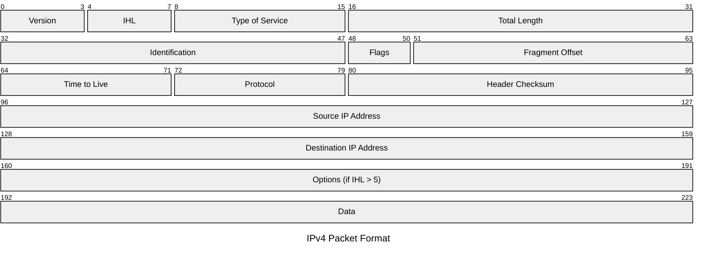

本章内容简介

---

# 4.1 网络层概述

## 4.1.1 转发和路由选择：数据平面和控制平面

### 1. 控制平面：传统的方法

### 2. 控制平面：SDN 方法

## 4.1.2 网络服务模型

## 复习题

### R1

我们回顾在本书中使用的某些术语。前面讲过运输层的分组名字是*报文段*，数据链路层的分组名字是*帧*。网络层的分组名字是什么？前面讲过路由器和链路层交换机都被称为*分组交换机*。路由器与链路层交换机间的根本区别是什么？

#### A1

### R2

我们注意到网络层功能可被大体分成数据平面功能和控制平面功能。数据平面的主要功能是什么？控制平面的主要功能呢？

#### A2

### R3

我们对网络层执行的转发功能和路由选择功能进行区别。路由选择和转发的主要区别是什么？

#### A3

### R4

路由器中转发表的主要作用是什么？

#### A4

### R5

我们说过网络层的服务模型“定义发送主机和接收主机之间端到端分组的传送特性”。因特网的网络层的服务模型是什么？就主机到主机数据报的传递而论，因特网的服务模型能够保证什么？

#### A5

---

# 4.2 路由器工作原理

## 4.2.1 输入端口处理和基于目的地转发

## 4.2.2 交换

## 4.2.3 输出端口处理

## 4.2.4 何处出现排队

### 1. 输入排队

### 2. 输出排队

### 3. 多少缓存才“够用”？

## 4.2.5 分组调度

### 1. 先进先出

### 2. 优先权排队

### 3. 循环和加权公平排队

## 复习题

## 复习题

### R6

在 4.2 节中，我们看到路由器通常由输入端口、输出端口、交换结构和路由选择处理器组成。其中哪些是用硬件实现的，哪些是用软件实现的？为什么？转到网络层的数据平面和控制平面的概念，哪些是用硬件实现的，哪些是用软件实现的？为什么？

#### A6

### R7

讨论为什么在高速路由器的每个输入端口都存储转发表的影子副本。

#### A7

### R8

基于目的地转发意味着什么？这与通用转发有什么不同（假定你已经阅读 4.4 节，两种方法中哪种是软件定义网络所采用的）？

#### A8

### R9

假设一个到达分组匹配了路由器转发表中的两个或更多表项。采用传统的基于目的地转发，路由器用什么原则来确定这条规则可以用于确定输出端口，使得到达的分组能交换到输出端口？

#### A9

### R10

在 4.2 节中讨论了三种交换结构。列出并简要讨论每一种交换结构。哪一种（如果有的话）能够跨越交换结构并行发送多个分组？

#### A10

### R11

描述在输入端口会出现分组丢失的原因。描述在输入端口如何消除分组丢失（不使用无限大缓存区）。

#### A11

### R12

描述在输出端口会出现分组丢失的原因。通过提高交换结构速率，能够防止这种丢失吗？

#### A12

### R13

什么是 HOL 阻塞？它出现在输入端口还是输出端口？

#### A13

### R14

在 4.2 节我们学习了 PIFO、优先权、循环（RR）和加权公平排队（WFQ）分组调度规则。这些排队规则中，哪个规则确保所有分组是以到达的次序离开的？

#### A14

### R15

举例说明为什么网络操作员要让一类分组的优先权超过另一类分组的。

#### A15

### R16

RR 和 WFQ 分组调度之间的基本差异是什么？存在 RR 和 WFQ 将表现得完全相同的场合吗？（提示：考虑 WFQ 权重。）

#### A16

---

# 4.3 网际协议：IPv4、寻址、IPv6 及其他

## 4.3.1 IPv4 数据包格式

## 4.3.2 IPv4 编址

**实践原则**

### 1. 获取一个地址

### 2. 获取主机地址：动态主机配置协议

## 4.3.3 网络地址转换

## 4.3.4 IPv6

### 1. IPv6 数据报格式

### 2. 从 IPv4 到 IPv6 的迁移

## 复习题

### R17

假定主机 A 向主机 B 发送封装在一个 IP 数据报中的 TCP 报文段。当主机 B 接收到该数据报时，主机 B 中的网络层怎样知道它应当将该报文段（即数据报的有效载荷）交给 TCP 而不是 UDP 或某个其他东西呢？

#### A17

### R18

在 IP 首部中，哪个字段能用来确保一个分组的转发不超过 N 台路由器？

#### A18

### R19

前面讲过因特网检验和被用于运输层报文段（分别在图 3-7 和图 3-29 的 UDP 和 TCP 首部中）以及网络层数据报（图 4-17 的 IP 首部中）。现在考虑一个运输层报文段封装在一个 IP 数据报中。在报文段首部和数据报首部中的检验和要遍及 IP 数据报中的任何共同字节进行计算吗？

#### A19

### R20

什么时候一个大数据报分割成多个较小的数据报？较小的数据报在什么地方装配成一个较大的数据报？

#### A20

### R21

路由器有 IP 地址吗？如果有，有多少个？

#### A21

### R22

IP 地址 223.1.3.27 的 32 比特二进制等价形式是什么？

#### A22

### R23

考察使用 DHCP 的主机，获取它的 IP 地址、网络掩码、默认路由器及其本地 DNS 服务器的 IP 地址。列出这些值。

#### A23

### R24

假设在一个源主机和一个目的主机之间有 3 台路由器。不考虑分片，一个从源主机发送给目的主机的 IP 数据报将通过多少个接口？为了将数据报从源移动到目的地需要检索多少个转发表？

#### A24

### R25

假设某应用每 20ms 生成一个 40 字节的数据块，每块封装在一个 TCP 报文段中，TCP 报文段再封装在一个 IP 数据报中。每个数据报的开销有多大？应用数据所占百分比是多少？

#### A25

### R26

假定你购买了一个无线路由器并将其与电缆调制解调器相连。同时假定 ISP 动态地为你连接的设备（即你的无线路由器）分配一个 IP 地址。还假定你家有 5 台 PC，均使用 802.11 以无线方式与该无线路由器相连。怎样为这 5 台 PC 分配 IP 地址？该无线路由器使用 NAT 吗？为什么？

#### A26

### R27

"路由聚合"一词意味着什么？路由器执行路由聚合为什么是有用的？

#### A27

### R28

"即插即用"或"零配置"协议意味着什么？

#### A28

### R29

什么是专用网络地址？具有专用网络地址的数据报会出现在大型公共因特网中吗？解释理由。

#### A29

### R30

比较并对照 IPv4 和 IPv6 首部字段。它们有相同的字段吗？

#### A30

### R31

有人说当 IPv6 以隧道形式通过 IPv4 路由器时，IPv6 将 IPv4 隧道作为链路层协议。你同意这种说法吗？为什么？

#### A31

---

# 4.4 泛化转发和 SDN

## 4.4.1 匹配

## 4.4.2 操作

## 4.4.3 运行中的匹配加操作 OpenFlow 例子

### 第一个例子：简单转发

### 第二个例子：负载均衡

### 第三个例子：充当防火墙

## 复习题

### R32

通用转发与基于目的地转发有何不同？

#### A32

### R33

我们在 4.1 节遇到的基于目的地转发的转发表与在 4.4 节遇到的 OpenFlow 流表之间有什么差异？

#### A33

### R34

路由器或交换机的"匹配加操作"意味着什么？在基于目的地转发的分组交换机场合中，要匹配什么并采取什么操作？在 SDN 的场合中，举出 3 个能够被匹配的字段和 3 个能被采取的操作。

#### A34

### R35

在 IP 数据报中举出能够在 OpenFlow 1.0 泛化转发中"匹配"的 3 个首部字段。不能在 OpenFlow 中"匹配"的 3 个 IP 数据报首部字段是什么？

#### A35

---

# 4.5 中间盒

# 4.6 小结
