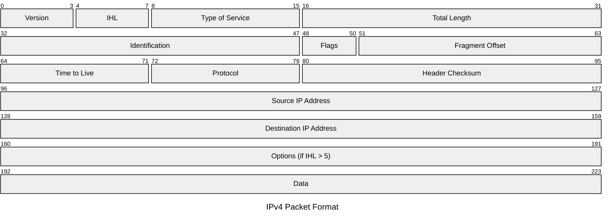
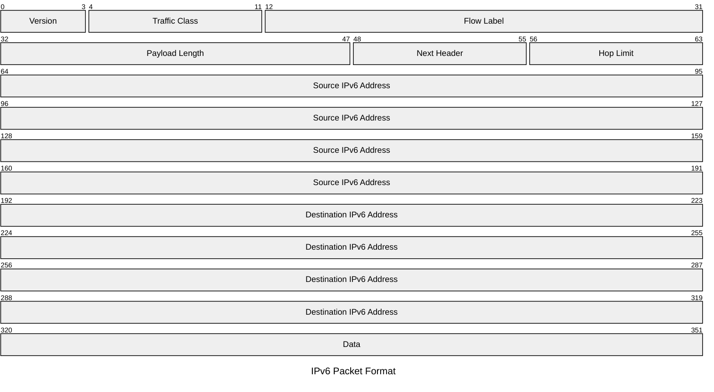

在上一章[[111-读书笔记/计算机网络-自顶向下方法/第3章 运输层|第3章 运输层]]中，我们学习了运输层如何为运行在不同主机上的应用进程提供逻辑通信。运输层协议（如 TCP 和 UDP）依赖于网络层提供的主机到主机之间的通信服务，将报文段从发送主机传送到接收主机，但运输层本身并不关心这些报文段是如何在网络核心中路由的。

本章将深入探讨网络层的**数据平面**（data plane）功能。数据平面主要关注的是每台路由器的本地功能，即当一个数据报到达路由器的输入链路时，路由器如何决定将其转发到哪一个输出链路。我们将学习：

1.  **网络层概述**：包括转发（forwarding）和路由选择（routing）的基本概念，数据平面和控制平面的区别，以及网络服务模型。
2.  **路由器的工作原理**：深入剖析路由器的内部结构，包括输入端口、交换结构、输出端口以及可能发生的排队和调度问题。
3.  **网际协议（IP）**：重点学习 IPv4 协议的数据报格式、IPv4 编址（包括子网划分、CIDR、DHCP 和 NAT），并初步了解 IPv6 及其过渡机制。
4.  **泛化转发和 SDN**：介绍一种更通用的转发范式，即基于匹配加动作（match plus action）的转发，这是软件定义网络（SDN）的核心概念之一。
5.  **中间盒 (Middleboxes)**：简要了解在数据路径上执行转发以外功能的网络设备。

与下一章[[第5章 网络层：控制平面]]的关联性在于，本章关注的是数据报在单个路由器中“如何”被转发（数据平面），而第五章将关注网络范围内的“如何”计算出这些转发决策所依据的路径信息（控制平面），即路由选择算法和协议。

TODO：https://gemini.google.com/gem/f2e60f1154d4/ede1f46df233c77f

---

# 4.1 网络层概述

- **核心功能**：将分组从发送主机移动到接收主机。
- **涉及位置**：网络层存在于每一台主机和路由器中。
  - 发送主机：从运输层接收报文段，封装成数据报，发送给相邻路由器。
  - 路由器：转发数据报。
  - 接收主机：从相邻路由器接收数据报，提取运输层报文段，上交运输层。

## 4.1.1 转发和路由选择：数据平面和控制平面

- **转发 (Forwarding)**：
  - 定义：当一个分组到达路由器的输入链路时，路由器将其移动到合适的输出链路的过程。
  - 特点：是路由器的本地行为，发生在数据平面，通常由硬件实现，速度快（纳秒级）。
- **路由选择 (Routing)**：
  - 定义：网络层决定分组从源到目的地所经过的路径或路由的过程。
  - 特点：是网络范围的行为，发生在控制平面，通常由软件实现，时间尺度较长（秒级）。
  - **路由选择算法**：用于计算路径。
- **转发表 (Forwarding Table)**：
  - 作用：路由器依据分组首部字段值查询转发表，以决定分组的输出链路接口。
  - 生成：由控制平面的路由选择算法计算并设置。
- **数据平面 (Data Plane)**：
  - 功能：处理数据报的转发，包括查找转发表、修改字段（如TTL）、分割/重组数据报等。在路由器本地执行。
- **控制平面 (Control Plane)**：
  - 功能：负责网络范围的逻辑，如执行路由选择协议（OSPF, BGP）、维护路由信息、计算并安装转发表。

### 1. 控制平面：传统的方法

- 实现方式：路由选择算法运行在**每个**路由器中。
- 通信：路由器之间通过路由选择协议交换路由信息，以计算各自的转发表。

### 2. 控制平面：SDN 方法

- 实现方式：路由逻辑**物理上分离**，由一个（或多个逻辑上集中的）**远程控制器**负责计算和分发转发表给网络中的路由器。
- 路由器职责：主要执行数据平面的转发功能。
- 优势：提供更灵活的网络管理和编程能力。

### 期末复习：路由器功能，做分组转发时匹配原则

#了解

**路由器功能：**

- 转发：当一个分组到达路由器的输入链路时，路由器将其移动到合适的输出链路的过程。
- 路由：网络层决定分组从源到目的地所经过的路径或路由的过程。

**分组转发时匹配原则**：最长前缀匹配原则（Longest Prefix Match, LPM）

- **定义**：在路由表中找到与目的地址**匹配的前缀最长**的那一项。
- **原因**：这样可以保证分组被转发到最精确、最合适的下一跳。
- **应用**：IPv4、IPv6路由器的标准查表原则。

## 4.1.2 网络服务模型

- **定义**：网络服务模型定义了发送主机和接收主机之间端到端分组传送的特性。
- **可能提供的服务示例**：
  - 确保交付
  - 具有时延上界的确保交付
  - 有序分组交付
  - 确保最小带宽
  - 安全性（如加密）
- **因特网的网络层服务模型**：
  - **尽力而为服务 (Best-Effort Service)**：这是因特网IP网络提供的**唯一**服务。
  - **不保证**：
    - 分组的成功交付。
    - 按序交付。
    - 交付时延。
    - 最小带宽。
  - 尽管服务模型简单，但通过在运输层或应用层增加功能，因特网依然能够支持各种应用。

## 复习题

### R1

我们回顾在本书中使用的某些术语。前面讲过运输层的分组名字是*报文段*，数据链路层的分组名字是*帧*。网络层的分组名字是什么？前面讲过路由器和链路层交换机都被称为*分组交换机*。路由器与链路层交换机间的根本区别是什么？

#### A1

- 网络层的分组名字是**数据报 (datagram)**。
- 路由器与链路层交换机的根本区别在于它们做转发决策所依据的信息不同：
  - **路由器 (Router)**：是**网络层（第三层）** 设备。它基于分组的**网络层地址（如IP地址）** 进行转发决策，通常用于连接不同的网络。路由器维护路由表，并通过路由选择协议（如OSPF, BGP）来确定路径。
  - **链路层交换机 (Link-layer Switch)**：是**链路层（第二层）** 设备。它基于分组的**链路层地址（如MAC地址）** 进行转发决策，通常用于在同一个局域网（LAN）内连接设备。交换机维护MAC地址表（也称交换表），并通过自学习算法构建此表。

### R2

我们注意到网络层功能可被大体分成数据平面功能和控制平面功能。数据平面的主要功能是什么？控制平面的主要功能呢？

#### A2

- **数据平面 (Data Plane)** 的主要功能是：在每台路由器上，根据转发表将到达输入端口的数据报**转发**到正确的输出端口。这包括检查分组首部、查找转发表、将分组从输入端口交换到输出端口等操作。它处理的是“如何处理单个分组”的问题，并且通常在硬件中实现以保证高速处理。
- **控制平面 (Control Plane)** 的主要功能是：负责网络范围的逻辑，决定数据报从源主机到目的主机所采用的**路由路径**。这包括运行路由选择协议（如OSPF、BGP），与其他路由器交换路由信息，计算并生成转发表（这些转发表随后被数据平面使用）。它处理的是“如何确定分组应该走哪条路”的问题，传统上在路由器的CPU中通过软件实现，而在SDN架构中则由集中的控制器实现。

### R3

我们对网络层执行的转发功能和路由选择功能进行区别。路由选择和转发的主要区别是什么？

#### A3

- **转发 (Forwarding)**：
  - **范围**：路由器的本地行为。
  - **功能**：当一个分组到达路由器的输入接口时，路由器查找其转发表，决定将该分组从哪个输出接口发送出去。
  - **层面**：属于数据平面。
  - **时间尺度**：非常快，通常在纳秒级别，由硬件执行。
- **路由选择 (Routing)**：
  - **范围**：网络范围的全局行为。
  - **功能**：通过路由选择算法确定分组从源到目的地的端到端路径。这些算法计算出的结果被用来填充路由器的转发表。
  - **层面**：属于控制平面。
  - **时间尺度**：相对较慢，可能需要秒级甚至更长时间来收敛和更新，通常由软件执行。

简而言之，**路由选择决定路径，转发则是在每个路由器上根据已确定的路径（即转发表）来实际移动分组。**

### R4

路由器中转发表的主要作用是什么？

#### A4

路由器中转发表的主要作用是：**指导路由器如何将到达的分组从其输入链路接口转发到其输出链路接口**。

当一个IP数据报到达路由器时，路由器会检查该数据报的目的IP地址。然后，路由器使用这个目的IP地址在其转发表中进行查找（通常使用最长前缀匹配原则）。转发表中的匹配条目会指示该数据报应该被转发到哪个输出链路接口，以便数据报能够沿着通往最终目的地的路径继续前进。

### R5

我们说过网络层的服务模型“定义发送主机和接收主机之间端到端分组的传送特性”。因特网的网络层的服务模型是什么？就主机到主机数据报的传递而论，因特网的服务模型能够保证什么？

#### A5

- 因特网的网络层的服务模型是**尽力而为服务 (best-effort service)**。
- 就主机到主机数据报的传递而言，因特网的尽力而为服务模型**不提供任何保证**。具体来说：
  - **不保证交付**：发送的分组可能在网络中丢失。
  - **不保证按序交付**：分组可能以不同于发送顺序的次序到达目的主机。
  - **不保证交付时延**：分组从源到目的地的时延没有上界保证。
  - **不保证最小带宽**：网络层不保证端到端路径具有某个最小的传输速率。
  - **不保证分组的完整性**：虽然IP首部有检验和，但这只针对首部错误，数据载荷的完整性由更高层（如运输层）负责。

尽管听起来这种服务很不可靠，但正是这种简单的服务模型使得因特网能够灵活地支持各种上层协议和应用，这些上层协议（如TCP）可以在尽力而为服务的基础上构建更可靠的服务。

---

# 4.2 路由器工作原理

- **组成部分**：
  - **输入端口 (Input Ports)**：执行物理层、链路层功能，核心是网络层的**查找 (lookup)** 功能，通过查询转发表决定分组的输出端口。控制分组（如路由协议报文）会被送往路由选择处理器。
  - **交换结构 (Switching Fabric)**：将分组从输入端口连接到输出端口。
  - **输出端口 (Output Ports)**：存储从交换结构接收的分组，执行链路层和物理层功能，将分组发送到出链路。
  - **路由选择处理器 (Routing Processor)**：执行控制平面功能（如运行路由协议、维护路由表、计算转发表，或与SDN控制器通信）。
- **实现层面**：
  - 数据平面功能（输入端口、输出端口、交换结构）通常用**硬件**实现，以达到高速处理（纳秒级）。
  - 控制平面功能（路由选择处理器的工作）通常用**软件**实现，运行在通用CPU上，时间尺度较慢（毫秒或秒级）。

> **我的思考**：软路由/OpenWRT这些是什么？
>
> **答**：软路由（Software Router）和 OpenWRT 与本节内容是相关的。
>
> - **软路由**：指的是用通用计算机硬件（如普通的x86 PC）和专门的路由软件来实现路由器功能。这与本节提到的路由器的“路由选择处理器”主要由软件实现，而数据平面（转发）功能力求硬件化的趋势有所不同，但其核心思想是一致的。软路由的**控制平面**（路由决策、管理界面等）完全由运行在通用CPU上的软件（如OpenWRT、RouterOS等操作系统或专门的路由软件）承担。其**数据平面**（实际的分组转发）虽然也由CPU处理，但可以利用现代CPU的多核性能和一些优化技术（如DPDK）来提升转发性能，尽管可能仍不及专用硬件路由器。
> - **OpenWRT**：是一个开源的嵌入式Linux发行版，常用于家用路由器和其他嵌入式设备。刷了OpenWRT的路由器，其路由选择处理器上运行的就是OpenWRT系统。用户可以通过OpenWRT高度自定义路由器的功能，包括复杂的路由策略、防火墙规则、VPN服务等，这些都属于控制平面的范畴。OpenWRT仍然依赖底层的硬件（如CPU、网络接口芯片）来执行实际的分组转发（数据平面）。

## 4.2.1 输入端口处理和基于目的地转发

- **主要功能**：物理层和链路层处理，之后是网络层的查找、转发和排队。
- **转发表查找**：
  - 输入端口通常有转发表的**影子副本**，以加速查找过程，避免每次都访问中央路由选择处理器。
  - **基于目的地转发**：根据分组的目的IP地址在转发表中查找。
  - **最长前缀匹配规则 (Longest Prefix Matching Rule)**：当一个目的地址匹配转发表中的多个条目时，选择匹配前缀最长的条目。
  - TCAMs (Ternary Content Addressable Memories) 用于高速查找。
- **其他处理**：检查版本号、校验和、TTL；更新TTL和校验和；更新网络管理计数器。
- **“匹配加动作”抽象**：查找是“匹配”，将分组送往交换结构到特定输出端口是“动作”。

## 4.2.2 交换

- **经内存交换 (Switching via memory)**：
  - CPU直接控制，分组从输入端口复制到内存，再从内存复制到输出端口。
  - 吞吐量受限于内存带宽（小于B/2），一次只能转发一个分组。
- **经总线交换 (Switching via a bus)**：
  - 输入端口通过共享总线直接将分组传到输出端口，无需CPU干预。
  - 通过内部标签指定输出端口。
  - 吞吐量受限于总线速率，总线共享导致一次只能传输一个分组。
- **经互联网络交换 (Switching via an interconnection network)**：
  - 如**纵横式交换机 (Crossbar Switch)**，允许多个分组并行转发（只要目的端口不同）。
  - 如果多个输入端口的分组去往同一个输出端口，仍会发生阻塞。
  - 可通过多级交换或并行交换结构扩展能力。

### 期末复习：路由器的三种交换结构（内存、总线、互联网络）

#了解

路由器的三种交换结构：

1. **内存交换**：由CPU控制，一次一分组，受内存带宽限制: $B/2$。
2. **总线交换**：通过共享总线传输，一次一分组，受总线速率限制。
3. **互联网络交换**：支持并行转发，但可能发生阻塞。

## 4.2.3 输出端口处理

- **功能**：存储从交换结构接收的分组，执行链路层和物理层功能，然后发送分组。
- **包含**：排队和缓存管理、链路层处理（封装）、物理层处理（传输）。

## 4.2.4 何处出现排队

- 排队可能发生在**输入端口**和**输出端口**。
- 取决于流量负载、交换结构速率和线路速率。

### 1. 输入排队

- **原因**：交换结构速率低于输入端口分组到达速率总和。
- **线路头阻塞 (Head-of-the-Line, HOL blocking)**：

对于上面这个插图：浅蓝色的分组对应的输出端口并不堵塞，但是因为它前面的那个深蓝色分组被堵塞导致它也被堵塞。浅蓝色的堵塞就叫做线路头堵塞(HOL blocking)。

### 2. 输出排队

- **原因**：即使交换结构速率很快（如N倍线路速率），如果多个输入端口（例如N个）的分组同时到达并都去往同一个输出端口，则在该输出端口的传输能力成为瓶颈，导致排队。

- **丢包策略**：
  - **尾丢弃 (Drop-tail)**：缓存满时，新到达的分组被丢弃。
  - **主动队列管理 (Active Queue Management, AQM)**：如RED (Random Early Detection)，在缓存完全满之前主动丢弃或标记分组，以向发送方发送拥塞信号。

### 3. 多少缓存才“够用”？

- **传统经验法则**：$B = RTT \cdot C$ ($B$: 缓存大小, $RTT$: 平均往返时延, $C$: 链路容量)。
- **针对大量TCP流的修正**：$B = RTT \cdot C / \sqrt{N}$ (N: TCP流数量)。
- **缓存膨胀 (Bufferbloat)**：
  过大的缓存虽然能减少丢包，但也可能导致持续的高排队时延，影响应用性能，特别是对时延敏感的应用。见下图：

> **我的思考：** 为什么“过大的缓存也可能导致更长的排队时延”？
>
> **答**：这个问题的核心在于TCP等拥塞控制协议的行为以及排队的基本原理。
>
> - **TCP的拥塞控制机制**：TCP通过感知网络拥塞（通常是丢包或者像ECN这样的显式信号，有时也通过RTT增加）来调整其发送速率。当网络中存在大缓存时，分组在到达拥塞点后不会立即被丢弃，而是会进入这些大缓存中排队。TCP发送方在没有收到丢包信号之前，会继续以当前速率发送数据，或者缓慢增加发送速率（例如，在拥塞避免阶段）。
> - **队列的形成**：当分组到达速率持续超过链路的发送能力时，这些多余的分组就会在缓存中累积起来。如果缓存非常大，那么在TCP发送方最终因为丢包（缓存溢出）或收到其他拥塞信号而降低发送速率之前，队列可以变得非常长。
> - **排队时延的累积**：每个在队列中等待的分组都会经历排队时延。队列越长，后到达的分组等待的时间就越长。即使链路最终以其容量速率发送分组，那些已经在长队列中等待的分组仍然需要逐个被发送出去。因此，一个分组从进入队列到实际被发送出去所经历的排队时延，与它前面排队的总数据量成正比。
> - **缓存膨胀 (Bufferbloat)**：正是因为有了这些大缓存，TCP发送方可能需要更长的时间才能感知到拥塞（因为缓存吸收了突发流量，延迟了丢包的发生）。在这段时间内，队列持续增长，导致即使没有发生丢包，数据包也会经历非常显著的排队时延。这使得RTT被人为地拉长，影响了交互式应用的响应速度（例如网页加载、在线游戏、视频通话）。用户可能会感觉到网络“卡顿”，即使网络吞吐量可能并不低。
>
> 简单来说，过大的缓存掩盖了网络拥塞的早期迹象，使得发送方继续以较高速度发送数据，从而填满了这些大缓存，导致分组在被发送前需要经历更长的等待时间。

## 4.2.5 分组调度

- **目的**：当输出端口队列中有多个分组等待传输时，决定下一个发送哪个分组。

### 1. 先进先出

- **原则**：按分组到达队列的顺序进行服务。
- **优点**：简单。
- **缺点**：没有考虑分组的重要性或服务需求，可能导致重要或短小的分组被长时间排在大型分组之后。

### 2. 优先权排队

- **原则**：将分组划分为多个优先级类别，每个类别有自己的队列。总是从非空队列中优先级最高的类别选择分组进行发送。
- **同优先级处理**：通常采用FIFO。
- **抢占式 vs 非抢占式**：
  - **非抢占式**：一旦一个分组开始传输，即使有更高优先级的到分组达，当前分组的传输也不会被中断（如图4-14所示）。
  - **抢占式**：更高优先级的分组可以中断正在传输的低优先级分组。
- **缺点**：可能导致低优先级队列饥饿。

### 3. 循环和加权公平排队

- **循环排队 (Round Robin, RR)**：
  - **原则**：同样按类别划分队列，但轮流为每个类别提供服务。
  - **工作量保持 (Work-conserving)**：如果某个类别的队列为空，则跳过，服务下一个非空队列。

- **加权公平排队 (Weighted Fair Queuing, WFQ)**：
  - **原则**：为不同类别的分组分配不同的**权重 (weight)**，确保每个类别在任何有分组排队的时间段内获得与其权重成比例的服务份额。
  - **带宽保证**：类别 $i$ 将获得至少 $R \cdot w_i / (\sum w_j)$ 的带宽（R是链路总速率，$\sum w_j$ 是所有有分组排队的类别的权重之和）。
  - **公平性**：比简单RR更能实现公平的带宽分配，特别是当分组大小不同时。

**我的思考**

> 3. 优先权排队 (Priority Queuing)中的“优先级”或者WFQ中所谓的“不同类别的服务”是谁来决定的？

**答**：优先权排队中的“优先级”或WFQ中的“类别”及其对应的服务策略（如权重）通常是由**网络管理员（Network Administrator）** 或 **网络运营商（Network Operator）** 来决定的和配置的。

他们做出这些决定的依据可能包括：

- **服务等级协议 (Service Level Agreements, SLAs)**：ISP可能会与其客户签订SLA，承诺为某些类型的流量提供特定的服务质量（QoS），例如保证低延迟或特定带宽。这就需要将这些客户的流量划分到高优先级类别或分配更高的权重。
- **应用类型和需求**：
  - **实时应用**：如IP语音（VoIP）、视频会议等对延迟非常敏感，通常会被赋予较高优先级，以减少它们的排队延迟。
  - **关键业务应用**：企业可能会将其关键业务流量（如数据库事务、远程桌面）设置为高优先级，以保证其性能。
  - **尽力而为流量**：如普通的网页浏览、电子邮件、文件下载等，可能被划分为较低优先级或分配较低的权重。
- **网络管理流量**：路由器之间交换的路由协议报文（如OSPF、BGP）、网络监控和管理流量（如SNMP）通常被赋予最高优先级，以确保网络的稳定运行和可管理性。
- **安全策略**：例如，识别出的恶意流量可能会被放入最低优先级队列甚至被丢弃。
- **付费等级**：在某些网络中，用户可以支付更高的费用来获得更高优先级的服务。

**如何实现分类？**
路由器需要一种机制来识别不同类型的流量并将其分配到相应的优先级队列或服务类别中。这通常通过检查分组的**首部字段**来实现，例如：

- **IP首部**：
  - 源/目的IP地址：可以为特定主机或网络的流量设置优先级。
  - 区分服务代码点 (Differentiated Services Code Point, DSCP)：IP首部中的一个6位字段，专门用于标记分组的服务类别，路由器可以根据此字段进行QoS处理。
  - 协议字段：例如，区分TCP和UDP流量。
- **运输层首部**：
  - 源/目的端口号：可以识别特定的应用程序（如HTTP的80端口，VoIP可能使用特定的UDP端口范围）。
- **链路层首部**：
  - VLAN标签中的优先级位（IEEE 802.1p）。
- **深度包检测 (Deep Packet Inspection, DPI)**：更高级的路由器或防火墙甚至可以检查分组的应用层数据内容来识别流量类型。

一旦分组被分类，路由器就会根据配置好的调度策略（FIFO、优先权、RR、WFQ等）来处理这些队列。网络管理员需要根据网络的具体需求和目标来精心设计和调整这些分类规则和调度参数。

### 期末复习：输出端口排队的处理

#熟悉

1. **FIFO**：简单但无法区分分组重要性。
2. **优先权排队**：支持优先级分类，但可能导致低优先级饥饿。
3. **循环排队与加权公平排队**：
   - 循环排队：轮流服务，简单高效。
   - 加权公平排队：支持带宽保证与公平性分配。

## 复习题

### R6

在 4.2 节中，我们看到路由器通常由输入端口、输出端口、交换结构和路由选择处理器组成。其中哪些是用硬件实现的，哪些是用软件实现的？为什么？转到网络层的数据平面和控制平面的概念，哪些是用硬件实现的，哪些是用软件实现的？为什么？

#### A6

- **硬件实现**：
  - **输入端口**（大部分功能，特别是查找、链路层处理、物理层处理）
  - **输出端口**（大部分功能，特别是排队、链路层处理、物理层处理）
  - **交换结构**
  - **原因**：这些组件直接参与每个分组的快速处理和转发，需要达到线速性能（即处理速度与链路传输速度匹配）。硬件实现可以提供纳秒级的处理速度，这是软件难以企及的。
- **软件实现**：

  - **路由选择处理器**（及其运行的路由协议、网络管理软件）
  - **原因**：路由选择、网络管理等功能不需要对每个分组都执行，它们的操作时间尺度相对较慢（秒级或更慢），涉及复杂的算法和状态维护，更适合用软件在通用CPU上实现灵活性和复杂性。

- **数据平面与实现**：
  - 数据平面的主要功能是**转发**，这涉及到对每个分组进行快速处理（如查找转发表、修改首部、通过交换结构）。因此，数据平面功能**主要由硬件实现**，以满足高速链路的性能需求。
- **控制平面与实现**：
  - 控制平面的主要功能是**路由选择**和**网络管理**，这涉及到运行路由协议、计算路由、维护路由表、与SDN控制器交互等。这些功能逻辑复杂，更新频率相对较低。因此，控制平面功能**主要由软件实现**，运行在路由选择处理器上（对于传统路由器）或集中的SDN控制器上。

### R7

讨论为什么在高速路由器的每个输入端口都存储转发表的影子副本。

#### A7

在高速路由器的每个输入端口都存储转发表的影子副本（shadow copy）主要是为了**提高查找速度和转发性能，避免中央处理瓶颈**。

具体原因如下：

1.  **并行处理**：现代高速路由器有多个输入端口，并且可能同时有多个分组到达不同的输入端口。如果每个输入端口都必须访问一个中央存储的转发表来进行查找，那么这个中央转发表就会成为一个瓶颈，限制了路由器的整体吞吐量。通过在每个输入端口存储一份转发表的副本，每个输入端口可以独立、并行地执行查找操作。
2.  **减少延迟**：访问线路卡本地的存储器（通常是高速SRAM或TCAM）比访问位于路由选择处理器上的主内存要快得多。将转发表复制到输入端口，可以显著减少查找延迟，这对于实现线速转发至关重要。
3.  **可扩展性**：随着端口数量和链路速率的增加，对查找性能的要求也越来越高。分布式查找（每个输入端口有副本）比集中式查找更容易扩展。
4.  **路由选择处理器减负**：路由选择处理器的主要任务是运行路由协议、计算路由、维护路由表等控制平面功能。如果它还需要处理每个分组的查找请求，将会不堪重负。将查找任务下放到输入端口的硬件中，可以使路由选择处理器专注于其核心的控制平面任务。

当路由选择处理器更新转发表时，它会将更新后的转发表（或其变化部分）分发到各个输入端口的线路卡上，以保持这些影子副本的同步。

### R8

基于目的地转发意味着什么？这与通用转发有什么不同（假定你已经阅读 4.4 节，两种方法中哪种是软件定义网络所采用的）？

#### A8

- **基于目的地转发 (Destination-Based Forwarding)**：

  - **含义**：这是一种传统的转发方式，路由器仅仅根据分组的**目的IP地址**来决定如何转发该分组。
  - **机制**：路由器的转发表中的每个条目通常包含一个目的网络前缀和对应的输出端口。当分组到达时，路由器提取其目的IP地址，并使用最长前缀匹配算法在转发表中查找匹配项，以确定分组的下一跳输出端口。
  - **关注点**：主要关注分组将要去往何处。

- **通用转发 (Generalized Forwarding)**（或称泛化转发）：

  - **含义**：这是一种更灵活的转发方式，路由器（或更通用的分组交换机）的转发决策可以基于分组首部中的**多个字段**的值，而不仅仅是目的IP地址。
  - **机制**：分组交换机维护一个**流表 (flow table)**。流表中的每个条目定义了一组匹配规则（可以匹配链路层、网络层、运输层的多个首部字段，如源/目的MAC地址、源/目的IP地址、协议类型、源/目的端口号、VLAN ID等）和一组相应的动作（如转发到特定端口、丢弃、修改字段、复制、发送给控制器等）。
  - **关注点**：不仅关注分组去往何处，还可能关注分组来自何处、属于什么类型的流量、以及对该流量应执行何种特定处理。

- **软件定义网络 (Software-Defined Networking, SDN) 采用的方法**：
  - SDN 更倾向于采用**通用转发**（泛化转发）的方法。
  - 在SDN架构中，远程控制器负责计算和下发流表到SDN交换机。这些流表使得交换机能够基于对数据包头部多个字段的复杂匹配规则来执行灵活的“匹配加动作”操作，从而实现更精细化的流量控制和网络功能。

### R9

假设一个到达分组匹配了路由器转发表中的两个或更多表项。采用传统的基于目的地转发，路由器用什么原则来确定这条规则可以用于确定输出端口，使得到达的分组能交换到输出端口？

#### A9

采用传统的基于目的地转发，当一个到达分组的目的IP地址匹配了路由器转发表中的两个或更多表项时，路由器使用**最长前缀匹配规则 (Longest Prefix Matching Rule)** 来确定使用哪个表项（以及对应的输出端口）。

这意味着路由器会选择转发表中与分组目的IP地址匹配的、具有最长网络前缀的那个表项。例如，如果一个分组的目的IP地址是 `130.207.10.8`，转发表中有两个匹配项：

1.  `130.207.0.0/16` -> 输出端口 A
2.  `130.207.10.0/24` -> 输出端口 B

路由器会选择第二条规则，因为 `/24` (匹配了24位) 比 `/16` (匹配了16位) 是更长、更具体的前缀匹配。因此，该分组将被转发到输出端口 B。这个原则确保了路由决策会基于最精确可用的路由信息。

### R10

在 4.2 节中讨论了三种交换结构。列出并简要讨论每一种交换结构。哪一种（如果有的话）能够跨越交换结构并行发送多个分组？

#### A10

4.2节讨论了三种交换结构：

1.  **经内存交换 (Switching via memory)**：

    - **讨论**：这是最早期的路由器交换方式，类似于传统计算机的I/O操作。输入端口接收到分组后，通过CPU将分组复制到主内存，CPU查找转发表确定输出端口后，再将分组从主内存复制到该输出端口的缓存。
    - **并行性**：这种方式**不能**跨越交换结构并行发送多个分组。因为所有分组都必须经过共享的CPU和内存总线，内存的读写通常是串行的，成为性能瓶颈。

2.  **经总线交换 (Switching via a bus)**：

    - **讨论**：输入端口通过一条共享的总线将分组直接传送到输出端口。输入端口为分组添加一个内部首部（标签）指明目标输出端口，所有输出端口都能看到总线上的分组，但只有标签匹配的输出端口会接收并处理该分组。
    - **并行性**：这种方式也**不能**跨越交换结构并行发送多个分组。因为总线是共享资源，在任何给定时刻，总线上只能传输一个分组。

3.  **经互联网络交换 (Switching via an interconnection network)**：
    - **讨论**：这种方式采用更复杂的互联网络，如**纵横式交换机 (crossbar switch)** 或多级交换网络，来连接输入端口和输出端口。纵横式交换机通过在输入总线和输出总线的交叉点设置可控的开关，允许来自不同输入端口的分组同时被转发到不同的输出端口。
    - **并行性**：这种方式**能够**跨越交换结构并行发送多个分组，只要这些分组的目的输出端口不同。例如，在一个纵横式交换机中，如果输入端口A的分组要去输出端口X，同时输入端口B的分组要去输出端口Y (X != Y)，这两个分组可以同时通过交换结构。这是其相对于前两种方式的主要性能优势。

因此，**经互联网络交换**（如纵横式交换机）是能够跨越交换结构并行发送多个分组的交换结构。

### R11

描述在输入端口会出现分组丢失的原因。描述在输入端口如何消除分组丢失（不使用无限大缓存区）。

#### A11

在输入端口出现分组丢失的主要原因有两个：

1.  **输入端口缓存溢出**：

    - 当交换结构的速率低于输入端口接收分组的总速率时，到达输入端口的分组如果不能立即被交换到输出端口，就需要在输入端口的缓存中排队。
    - 如果分组持续高速到达，超出了输入端口缓存的处理能力和交换结构的转发能力，输入端口的缓存最终会被填满。此时，新到达的分组将无处存放，只能被丢弃，从而导致分组丢失。
    - **线路头阻塞 (HOL blocking)** 也会加剧输入端口的排队，因为队头分组的阻塞会导致其后分组（即使它们的目的输出端口空闲）也无法被处理，进一步增加了输入缓存被填满的风险。

2.  **物理层或链路层错误**：虽然不完全是“排队”导致的丢失，但在输入端口的物理层或链路层处理过程中，如果检测到帧中存在不可纠正的比特错误（例如CRC校验失败），该帧（及其封装的IP数据报）也可能会被丢弃。

描述在输入端口如何消除分组丢失（不使用无限大缓存区）：

理论上完全消除分组丢失是非常困难的，尤其是在不使用无限大缓存区且网络负载不可预测的情况下。但是可以通过以下方法**显著减少或在某些条件下消除**输入端口的分组丢失：

1.  **提高交换结构速率 (Speedup the Switching Fabric)**：

    - 使交换结构的速率远大于所有输入端口线路速率的总和。例如，如果交换结构的速率至少是输入线路速率的N倍（N是输入端口数量），那么即使所有输入端口同时以线速接收分组，并且这些分组的目的地各不相同，交换结构也能及时将它们转移到相应的输出端口，从而避免在输入端口形成积压队列。这可以显著减少由交换结构瓶颈引起的输入排队和丢包。

2.  **有效的输出端口调度和拥塞管理**：

    - 虽然这是输出端口的功能，但如果输出端口能够高效地清空其队列，就能间接减轻输入端口的压力，因为交换结构能够更快地将分组从输入端口转移到输出端口。

3.  **缓解线路头阻塞 (HOL Blocking Mitigation)**：

    - 采用更智能的输入队列管理和调度算法，而不是严格的FIFO。例如，允许输入端口为每个输出端口维护一个虚拟输出队列（Virtual Output Queuing, VOQ）。这样，即使某个虚拟输出队列的队头分组因目标输出端口忙而被阻塞，其他虚拟输出队列中去往空闲输出端口的分组仍然可以被交换。这需要交换结构和调度算法的支持。

4.  **流量控制机制 (Flow Control)**：

    - 在某些网络技术中（虽然IP网络本身不直接提供这种逐跳的流量控制），可以实现链路级别的流量控制机制，例如，当输入端口缓存接近饱和时，向其上游设备发送“暂停发送”的信号，以减缓分组的到达速率。

5.  **合理设计缓存大小和丢弃策略**：
    - 虽然不能用无限大缓存，但合理配置有限的缓存大小，并结合智能的丢弃策略（如AQM，尽管AQM主要用于输出队列，但其思想可以借鉴），可以在缓存即将溢出时选择性地丢弃分组，而不是简单地尾丢弃，有时能更好地管理拥塞。但这本身不能完全消除丢包，而是优化丢包行为。

在实际的高性能路由器设计中，通常会采用非常高速的交换结构（远超输入线路速率总和）来最大限度地减少输入端口的排队和由HOL阻塞引起的问题。

### R12

描述在输出端口会出现分组丢失的原因。通过提高交换结构速率，能够防止这种丢失吗？

#### A12

在输出端口出现分组丢失的主要原因是**输出端口缓存溢出**。

具体来说：

- 当多个输入端口的分组同时通过交换结构被转发到**同一个输出端口**时，如果这些分组到达该输出端口的速率（由交换结构的速率和并发转发决定）**超过了该输出端口链路的传输速率**，那么这些分组就必须在输出端口的缓存中排队等待发送。
- 如果这种高速到达的情况持续发生，输出端口的缓存最终会被填满。
- 一旦输出端口缓存已满，后续到达该输出端口的分组将没有空间存放，只能被丢弃，从而导致分组丢失。

**通过提高交换结构速率，能够防止这种（输出端口的）丢失吗？**

**不能完全防止。**

- 提高交换结构的速率可以更快地将分组从输入端口转移到输出端口，这确实可以减少输入端口的排队和由HOL阻塞引起的丢包。
- 然而，输出端口丢包的根本原因是**输出链路的带宽瓶颈**。即使交换结构非常快（例如，能够瞬时将所有输入端口的分组都送到它们各自的输出端口），但如果多个输入流汇聚到同一个输出端口，并且这些流的总速率超过了该输出链路的容量，那么在输出端口依然会形成队列。如果这个队列持续增长超出了输出缓存的容量，分组丢失仍然会发生。
- **例子**：假设一个路由器有3个输入端口，每个输入端口的速率都是1 Gbps。它有一个输出端口，链路速率也是1 Gbps。交换结构的速率非常高，比如10 Gbps。如果这3个输入端口同时分别接收到一个发往该输出端口的分组，交换结构可以很快将这3个分组都送到输出端口。但是输出端口在传输第一个分组的期间（假设传输一个分组需要时间T），另外两个分组就必须在输出缓存中等待。如果在下一个时间T内，又有3个分组到达并都去往这个输出端口，输出队列就会继续增长。如果输出缓存有限，最终就会发生丢包。

因此，提高交换结构速率可以确保分组快速到达输出端口，但如果输出链路本身是瓶颈，无法及时将缓存中的分组发送出去，那么输出端口的缓存仍然可能溢出导致丢包。解决输出端口丢包还需要结合有效的队列管理、分组调度策略以及可能的拥塞控制机制（由发送端执行）。

### R13

什么是 HOL 阻塞？它出现在输入端口还是输出端口？

#### A13

- **HOL 阻塞 (Head-of-the-Line Blocking)**：指的是在线路头阻塞。当一个队列中的某个分组（通常是队头的分组）因为某种原因（例如，它要去的资源正忙）而无法立即被处理或转发时，它会阻塞其后方所有排队的分组，即使队列中某些后方分组要去的资源是空闲的。
- **出现位置**：HOL 阻塞主要出现在路由器的**输入端口 (input ports)**。

具体来说，在输入排队的交换机中，如果多个输入端口的队头分组都试图通过交换结构被转发到同一个（忙碌的）输出端口，那么只有一个分组能够成功通过，其他输入端口的队头分组就必须等待。这种等待会使得这些被阻塞的队头分组之后的分组（即使它们的目的输出端口是空闲的）也必须在输入队列中等待，无法被交换结构处理。这就是输入端口的HOL阻塞。

### R14

在 4.2 节我们学习了 PIFO、优先权、循环（RR）和加权公平排队（WFQ）分组调度规则。这些排队规则中，哪个规则确保所有分组是以到达的次序离开的？

#### A14

在4.2节讨论的分组调度规则中，**只有严格的、单一队列的先进先出 (First-In-First-Out, FIFO) 调度规则能确保所有分组是以它们到达该队列的次序离开的。**

让我们分析一下其他提到的规则：

- **PIFO (Programmable Packet Scheduling with Input First-Out)**：PIFO本身不是一个具体的调度算法，而是一种可以编程以实现多种调度策略的队列结构。如果PIFO被编程为严格的FIFO，那么它能保证按到达顺序离开。但如果它被编程为其他策略（如优先权），则不能保证。
- **优先权排队 (Priority Queuing)**：这种规则会优先发送高优先级队列中的分组。如果一个低优先级的的分组先到达，但随后一个高优先级的的分组到达，那么高优先级的的分组会被先发送。因此，优先权排队**不能**确保所有分组按到达次序离开。
- **循环排队 (Round Robin, RR)**：RR轮流为不同类别的队列服务。如果分组属于不同的类别，并且它们几乎同时到达，那么它们离开的顺序将取决于RR的轮询顺序以及它们各自类别队列的排队情况，而不一定是严格的整体到达顺序。因此，RR**不能**确保所有分组按到达次序离开（除非所有分组都属于同一个类别并且在该类别内部是FIFO）。
- **加权公平排队 (Weighted Fair Queuing, WFQ)**：WFQ根据权重为不同类别的队列分配服务。与RR类似，它也不能保证所有分组严格按照它们到达路由器的整体顺序离开，因为它要确保的是带宽的按权分配，而不是严格的到达顺序。

因此，只有在最简单、不区分优先级或类别的FIFO排队模型下，才能确保所有分组按到达顺序离开。

### R15

举例说明为什么网络操作员要让一类分组的优先权超过另一类分组的。

#### A15

网络操作员让一类分组的优先权超过另一类分组的原因有很多，主要是为了**保证关键应用的服务质量（QoS）**，或者**实施特定的网络策略**。以下是一些具体例子：

1.  **实时应用的低延迟需求**：

    - **IP语音 (VoIP) 和视频会议**：这些应用对延迟非常敏感。如果语音或视频分组经历过大延迟，通话质量会急剧下降（例如，声音断断续续、画面卡顿、通话双方无法正常交流）。网络操作员会将这些实时流量赋予较高优先级，以确保它们在路由器中排队时间最短，尽快被转发。
    - **在线游戏**：在线游戏同样对延迟敏感，高延迟会导致玩家操作响应滞后，影响游戏体验。游戏流量也可能被赋予较高优先级。

2.  **关键业务应用的可靠性和及时性**：

    - **企业内部的关键应用**：例如，金融交易系统、订单处理系统、数据库访问等。这些应用的性能直接关系到企业的运营效率和盈利能力。网络操作员会确保这些关键业务流量获得优先处理，以保证其稳定运行和快速响应。
    - **控制系统流量**：在工业控制网络或关键基础设施网络中，控制命令和状态更新的分组可能需要极高的可靠性和低延迟，这些流量会被赋予最高优先级。

3.  **网络管理和控制流量的优先保障**：

    - **路由协议报文 (如OSPF, BGP)**：这些报文对于维持网络的连通性和路由表的正确性至关重要。如果这些报文因为拥塞而被延迟或丢失，可能导致网络不稳定甚至中断。因此，网络管理流量通常被赋予非常高的优先级。
    - **网络监控流量 (如SNMP)**：为了及时发现和诊断网络问题，监控流量也需要得到一定的优先保障。

4.  **区分付费服务等级**：

    - ISP可能会提供不同等级的互联网接入服务。支付更高费用的用户或企业客户的流量可能会被赋予更高的优先级，以获得更好的网络性能（如更低的延迟、更少的丢包）。

5.  **抑制非期望流量**：
    - 对于一些被认为优先级较低或者可能消耗过多带宽的流量（例如，某些类型的P2P文件共享流量，或者已知的恶意软件流量），网络操作员可能会将其划分为低优先级，甚至限制其带宽或直接丢弃。

通过设置优先级，网络操作员可以更有效地管理网络资源，确保关键和对时延敏感的应用获得所需的服务质量，同时也能根据网络策略对不同类型的流量进行差异化处理。

### R16

RR 和 WFQ 分组调度之间的基本差异是什么？存在 RR 和 WFQ 将表现得完全相同的场合吗？（提示：考虑 WFQ 权重。）

#### A16

RR (Round Robin, 循环排队) 和 WFQ (Weighted Fair Queuing, 加权公平排队) 之间的基本差异主要体现在**它们如何为不同类别的流量分配服务机会和带宽**：

- **基本差异**：

  - **循环排队 (RR)**：RR 调度器**平均地**轮流为每个非空的类别队列提供服务。在最简单的形式中，它会从每个有分组等待的队列中取出一个分组进行发送，然后移至下一个队列。它不考虑不同类别的流量可能需要不同份额的带宽。所有活动的类别队列在获得服务机会方面是平等的（假设一次服务一个分组）。
  - **加权公平排队 (WFQ)**：WFQ 允许为每个流量类别分配一个**权重 (weight)**。调度器会根据这些权重**按比例地**为不同类别的队列分配带宽。一个类别获得的带宽份额与其权重相对于所有活动类别权重总和的比例成正比。这意味着高权重的类别可以获得比低权重类别更多的带宽。WFQ 旨在实现更公平（根据权重定义）的带宽共享，尤其是在不同类别的分组大小不同或服务需求不同时。

- **存在 RR 和 WFQ 将表现得完全相同的场合吗？**

  是的，存在这样的场合。

  - **提示的线索**：考虑 WFQ 权重。
  - **场合**：如果**所有流量类别的 WFQ 权重都设置为相同的值**（例如，所有类别的权重都为1），并且**所有类别的分组大小也基本相同**，那么 WFQ 的行为将非常接近甚至完全等同于简单循环排队 (RR) 的行为。

    - **权重相同**：当所有权重相同时，每个活动类别在WFQ下按比例分配到的带宽份额是相同的，这与RR平均分配服务机会的目标一致。
    - **分组大小相同**：如果分组大小也相同，那么RR每次轮询服务一个分组，与WFQ按相同权重分配相同带宽（从而在相同时间内传输相同数量的比特，即相同数量的等大小分组）的效果就趋于一致了。如果分组大小不同，即使权重相同，WFQ（旨在公平分配带宽）和RR（旨在公平分配服务轮次）的行为在短期内可能会有所差异，但长期平均带宽分配仍然是均等的。

  - **更严格的相同情况**：如果只有一个流量类别处于活动状态（即只有一个队列有分组），那么无论是RR还是WFQ（无论其权重如何），都会将所有链路带宽分配给这个唯一的活动类别，此时它们的行为也是相同的（因为它们都是工作量保持的调度策略）。

总结来说，RR是简单地轮流服务，而WFQ是按权重比例服务。当WFQ的所有权重相等且分组大小一致时，其行为就退化为RR。

---

# 4.3 网际协议：IPv4、寻址、IPv6 及其他

## 4.3.1 IPv4 数据包格式

**IPv4 数据报结构**：

由首部字段和数据（有效载荷）字段组成。数据字段通常承载运输层报文段 (TCP/UDP) 或其他网络层协议报文 (如 ICMP)。

**关键首部字段**：

- **版本 (Version)** (4比特)：指明IP协议版本，IPv4为4。
- **首部长度 (Header Length, IHL)** (4比特)：表示首部有多少个32位字（4字节块）。最小值为5（表示20字节固定首部），最大值为15（表示60字节首部，包含选项）。
- **服务类型 (Type of Service, TOS)** (8比特)：用于指示期望的服务质量（如低延迟、高吞吐量）或用于显式拥塞通告 (ECN)。
- **数据报长度 (Total Length)** (16比特)：整个IP数据报的长度（首部+数据），以字节为单位。最大长度为65535字节。
- **标识 (Identification)** (16比特)：唯一标识一个原始IP数据报。当数据报被分片时，所有分片都具有相同的标识号。
- **标志 (Flags)** (3比特)：
  - 第1位：保留，必须为0。
  - 第2位 (DF - Don't Fragment)：DF=1表示禁止分片；DF=0表示允许分片。
  - 第3位 (MF - More Fragments)：MF=1表示后面还有分片；MF=0表示这是最后一个分片（或未分片）。
- **片偏移 (Fragment Offset)** (13比特)：指示该分片的数据部分在原始数据报中的相对位置（以8字节为单位）。
- **生存时间 (Time-to-Live, TTL)** (8比特)：数据报在网络中可以通过的路由器跳数的最大值。每经过一个路由器，TTL减1。当TTL=0时，数据报被丢弃，并通常向源主机发送ICMP超时报文。防止数据报在网络中无限循环。
- **上层协议 (Protocol)** (8比特)：指示数据报的数据部分应交付给哪个运输层协议（如TCP=6, UDP=17, ICMP=1）。
- **首部检验和 (Header Checksum)** (16比特)：仅对IP首部进行差错检测。每经过一个路由器都需要重新计算，因为TTL会改变。
- **源IP地址 (Source IP Address)** (32比特)：发送主机的IP地址。
- **目的IP地址 (Destination IP Address)** (32比特)：接收主机的IP地址。
- **选项 (Options)** (可变长)：允许IP首部包含额外信息，如记录路由、时间戳等。不常用，会增加路由器处理开销。IPv6中已移除，通过扩展首部实现。
- **数据 (Data / Payload)** (可变长)：承载上层协议的数据。

**IPv4分片与重组 (Fragmentation and Reassembly)**：

- **原因**：当IP数据报的长度超过某一链路的**最大传输单元 (Maximum Transmission Unit, MTU)** 时，需要分片。
- **分片执行者 (IPv4)**：源主机或中间路由器。
- **过程**：将大的IP数据报分割成多个较小的IP数据报（片）。每个片都有自己的IP首部（大部分字段与原始数据报相同，但总长度、标志、片偏移和检验和会修改）。所有片共享原始数据报的**标识**字段值。
- **重组执行者**：仅在**目的主机**进行。路由器不进行重组。
- **字段用途**：
  - **标识**：将属于同一原始数据报的各个分片关联起来。
  - **标志 (MF位)**：标识是否为最后一个分片。
  - **片偏移**：指明该分片在原始数据报数据部分中的位置。
- **丢失处理**：如果一个或多个分片丢失，目的主机无法重组原始数据报，通常在定时器超时后丢弃已收到的分片。可靠传输由上层协议（如TCP）保证。
- **IPv6与分片**：IPv6不允许中间路由器对数据报进行分片。如果数据报过大，路由器会丢弃它并向源主机发送ICMPv6“分组太大”的差错报文。分片只能由源主机执行。

### 期末复习：IPv4 数据报格式、分片方式

#理解

IPv4 数据报格式见图：

其中关键内容：

1. **版本 (Version)**：4比特，IPv4版本为4。
2. **首部长度 (IHL)**：4比特，表示首部长度（最小5，最大15，以4字节为单位）。
3. **数据报长度 (Total Length)**：16比特，表示整个数据报（首部+数据）的长度，最大65535字节。
4. **标识 (Identification)**：16比特，唯一标识一个IP数据报，分片时所有分片共享相同标识。
5. **标志 (Flags)**：3比特，分片相关：
   - **DF (Don't Fragment)**：1表示禁止分片。
   - **MF (More Fragments)**：1表示后续还有分片，0表示最后一个分片。
6. **片偏移 (Fragment Offset)**：13比特，指示分片在原始数据报中的位置（以8字节为单位）。
7. **生存时间 (TTL)**：8比特，数据报可通过的最大跳数，每经过一个路由器减1，TTL=0时数据报被丢弃。
8. **上层协议 (Protocol)**：8比特，指明数据部分交付的协议（如TCP=6, UDP=17, ICMP=1）。
9. **首部检验和 (Header Checksum)**：16比特，仅对IP首部进行差错检测。
10. **源IP地址**：32比特，发送主机的IP地址。
11. **目的IP地址**：32比特，接收主机的IP地址。

## 4.3.2 IPv4 编址

- **接口 (Interface)**：主机或路由器与物理链路的连接点。每个接口拥有一个IP地址。
- **IP地址**：32比特长，通常用点分十进制表示（如 `193.32.216.9`）。每个主机和路由器的接口都必须有全局唯一的IP地址（NAT后的私有地址除外）。
- **子网 (Subnet)**：
  - IP网络中的一部分，其中所有设备的IP地址具有相同的网络前缀。
  - **定义**：如图4-18（上图）和4-19（下图）所示，连接到同一个广播域（如一个以太网交换机所连接的所有设备）或者同一条点对点链路两端的接口，通常属于同一个子网。
  - **子网地址**：例如 `223.1.1.0/24`，`/24` 表示前24位是网络前缀，用于标识子网。
  - **确定子网的方法**：逻辑上断开所有接口，形成的各个孤立网络即为子网。如图4-20所示，连接路由器的点对点链路也构成子网。

**实践原则**

- **无类别域间路由 (Classless Interdomain Routing, CIDR)**：
  - **表示法**：`a.b.c.d/x`，`x` 是前缀长度。
  - **网络前缀**：地址的前 `x` 位，用于路由。
  - **主机部分**：地址的后 `32-x` 位，用于在组织内部区分设备。
  - **地址聚合 (Address Aggregation)**：如图4-21所示，ISP可以向外界通告一个大的地址前缀（如 `/20`），而将其内部分配给不同组织的更小地址块（如多个 `/23`）的细节隐藏起来，简化了外部路由器的转发表。
  - **最长前缀匹配**：当路由发生非层次化分配时（如图4-22），路由器使用最长前缀匹配规则来选择更具体的路由。例如，ISPs-R-Us通告了组织1的 `/23` 前缀，即使Fly-By-Night-ISP也通告了包含组织1的 `/20` 前缀，去往组织1的流量也会被导向ISPs-R-Us。

- **分类地址 (Classful Addressing)**（历史概念）：
  - A类 (`/8`)，B类 (`/16`)，C类 (`/24`)。
  - 缺点：缺乏灵活性，易造成地址浪费。已被上面的CIDR取代。
- **IP广播地址**：`255.255.255.255`，用于向同一子网内的所有主机发送数据。

### 期末复习：编址方式、CIDR 如何编址

#理解

IPv4 为每个**接口**（主机或路由器与物理链路的连接点）分配一个唯一的32位地址，以点分十进制表示（如 `192.168.1.1`）。

IPv4 编址主要有两种方式：**分类编址**和**无分类编址（CIDR）**。

#### 分类编址

将 IPv4 地址划分为 A、B、C、D、E 类，网络部分和主机部分长度固定：

- **A 类**：`0.0.0.0 - 127.255.255.255`（网络8位，主机24位）
- **B 类**：`128.0.0.0 - 191.255.255.255`（网络16位，主机16位）
- **C 类**：`192.0.0.0 - 223.255.255.255`（网络24位，主机8位）

但分类编址的问题在于：

- **地址浪费**：固定划分无法灵活分配
- **路由表膨胀**：无法进行地址聚合

#### CIDR（无分类编址）

使用 **"IP地址/网络前缀长度"** 表示法，网络前缀长度可为任意值（0-32）。

#### **(1) CIDR 表示法**

- `10.0.0.0/8`：前8位为网络部分
- `192.168.1.0/28`：前28位为网络部分

#### **(2) 主机数量计算**

- 主机部分位数 = `32 - n`
- 可分配主机数 = `2^(32-n) - 2`

**示例**：

- `192.168.1.0/24`：主机数 = `2^8 - 2 = 254`
- `192.168.1.0/30`：主机数 = `2^2 - 2 = 2`

#### **(3) 子网划分**

将 `192.168.0.0/24` 划分为4个子网：

- 子网1：`192.168.0.0/26`（主机：`192.168.0.1 - 192.168.0.62`）
- 子网2：`192.168.0.64/26`（主机：`192.168.0.65 - 192.168.0.126`）
- 子网3：`192.168.0.128/26`（主机：`192.168.0.129 - 192.168.0.190`）
- 子网4：`192.168.0.192/26`（主机：`192.168.0.193 - 192.168.0.254`）

#### **(4) 路由聚合**

将多个连续网络聚合减少路由表规模：

- `192.168.0.0/24`、`192.168.1.0/24`、`192.168.2.0/24`、`192.168.3.0/24`
- 聚合为：`192.168.0.0/22`

### 1. 获取一个地址

- **分配机构**：
  - **ICANN (Internet Corporation for Assigned Names and Numbers)**：全球IP地址和DNS根服务器的最高管理机构。
  - **RIRs (Regional Internet Registries)**：如ARIN, RIPE NCC, APNIC等，从ICANN获取大块地址，并负责各自区域内的地址分配。
  - **ISPs (Internet Service Providers)**：从RIRs获取地址块，再分配给其客户组织。

### 2. 获取主机地址：动态主机配置协议(DHCP)

- **目的**：允许主机自动获取IP地址及其他网络配置信息（子网掩码、默认网关、DNS服务器地址）。
- **特性**：即插即用 (plug-and-play) / 零配置 (zeroconf)。
- **工作模式**：客户-服务器模式。
  - DHCP服务器通常位于每个子网，或通过DHCP中继代理访问。
- **DHCP交互过程 (DORA)**：如图4-23和图4-24所示。
  1.  **DHCP发现 (Discover)**：客户端广播寻找DHCP服务器。 (源IP: `0.0.0.0`, 目的IP: `255.255.255.255`, 目的UDP端口: 67, 源UDP端口: 68)
  2.  **DHCP提供 (Offer)**：DHCP服务器广播提供IP地址等配置信息。
  3.  **DHCP请求 (Request)**：客户端选择一个提议，并向该服务器发送请求。
  4.  **DHCP确认 (ACK)**：服务器确认分配，客户端配置网络参数。
- **租用期 (Lease Time)**：分配的IP地址有使用期限，客户端可以续约。
- **移动性限制**：当设备移动到新子网时，需要获取新IP地址，可能中断TCP连接。移动蜂窝网络（我们将在[[第7章 无线网络和移动网络]]中学习）则允许主机在基站间移动时保留其IP地址和TCP连接。

### 期末复习：DHCP 协议的作用

#熟悉

自动为网络中的设备分配IP地址和其他网络配置参数。

## 4.3.3 网络地址转换 (NAT)

- **背景**：IPv4地址空间有限，需要一种方法让多个设备共享单个全局IP地址，特别是在SOHO（小型办公室/家庭办公室）网络中。
- **核心思想**：NAT使能路由器对外界隐藏内部网络的细节。

  - **对外部**：NAT路由器表现为一个具有**单一公网IP地址**的设备。所有出站流量的源IP被改为该公网IP，所有入站流量的目的IP必须是该公网IP。
  - **对内部**：内部设备使用**私有IP地址**（如 `10.0.0.0/24`, `172.16.0.0/12`, `192.168.0.0/16`）。这些地址仅在本地网络有效，可在不同私有网络中重复使用。内部设备通常通过DHCP从NAT路由器获取私有IP。

- **工作原理**：

  - **出站流量** (例如，内部主机 `10.0.0.1:3345` 访问外部服务器 `128.119.40.186:80`)：
    1.  NAT路由器接收到来自分组。
    2.  路由器将分组的**源IP地址**从私有地址（`10.0.0.1`）修改为其**WAN接口的公网IP地址**（`138.76.29.7`）。
    3.  路由器将分组的**源端口号**从原始端口（3345）修改为一个**新的、在其WAN侧唯一的端口号**（例如5001）。
    4.  路由器在**NAT转换表 (NAT translation table)** 中记录这个映射关系：`(源IP, 源端口)` -> `(NAT路由器公网IP, 新端口)`，即 (`10.0.0.1, 3345`) -> (`138.76.29.7, 5001`)。
    5.  修改后的分组被发送到互联网。
  - **入站流量** (例如，外部服务器 `128.119.40.186:80` 响应到 `138.76.29.7:5001`)：
    1.  NAT路由器接收到响应分组。
    2.  路由器使用分组的**目的IP地址** (`138.76.29.7`) 和**目的端口号** (5001) 查找NAT转换表。
    3.  根据查找到的表项，将分组的**目的IP地址**修改回原始的私有IP地址 (`10.0.0.1`)。
    4.  将分组的**目的端口号**修改回原始的源端口号 (3345)。
    5.  修改后的分组被转发到内部主机 `10.0.0.1`。

- **优点**：

  - **地址复用**：大量设备可以共享一个或少量公网IP地址，极大地缓解了IPv4地址耗尽问题。
  - **安全性（某种程度上）**：隐藏了内部网络结构和IP地址，使得外部攻击者难以直接定位和攻击内部主机。
  - **灵活性**：内部网络地址可以独立规划，更换ISP时通常不需要重新配置内部所有设备的IP地址。

- **缺点与争议**：

  - **破坏端到端原则**：路由器修改了运输层端口号，这违背了网络层设备不应干预更高层协议的原则。
  - **对某些应用不友好**：
    - **P2P应用**：外部对等方难以主动连接到NAT后的对等方。
    - **服务器应用**：在NAT后运行服务器需要特殊配置（如端口转发）。
  - **NAT穿透 (NAT Traversal)**：为了解决上述问题，发展出STUN, TURN, ICE等技术。
  - **对某些协议的影响**：如IPsec，可能因地址和端口被修改而无法正常工作。

- **防火墙和入侵检测系统 (IDS) 简介** (详见[[#4.5 中间盒|4.5 节]]和[[第8章 计算机网络中的安全]])：
  - NAT本身提供了一定程度的隐蔽性，但更专业的安全设备是防火墙和IDS。
  - **防火墙 (Firewall)**：检查数据报和报文段首部字段，根据策略允许或阻止流量。
  - **入侵检测系统 (IDS)**：进行“深度包检测”，检查首部和载荷，匹配攻击特征库，发现可疑活动则告警。
  - **入侵防御系统 (IPS)**：类似IDS，但除了告警外还会主动阻止可疑流量。

### 期末复习：NAT 地址转换协议的作用，NAT 转换表的内容

#熟悉

#### NAT 的作用

- **解决 IPv4 地址短缺问题**：允许多台设备共享单个公网 IP 地址
- **隐藏内部网络结构**：对外只暴露 NAT 路由器的公网 IP，增强安全性
- **实现 SOHO 网络连接互联网**：小型办公室/家庭办公室网络共享上网

#### NAT 转换表的内容

NAT 转换表记录了内外网通信的映射关系，主要包含：

- **内部主机信息**：私有 IP 地址 + 源端口号
- **外部映射信息**：NAT 路由器公网 IP + 分配的新端口号
- **示例映射**：(10.0.0.1, 3345) → (138.76.29.7, 5001)

#### NAT 工作原理

1. **出站流量处理**：

   - 修改源 IP：私有 IP → 公网 IP
   - 修改源端口：原始端口 → 新分配的唯一端口
   - 记录映射关系到 NAT 转换表

2. **入站流量处理**：
   - 根据目的 IP 和端口查询 NAT 转换表
   - 将目的地址还原为内部私有 IP 和原始端口
   - 转发数据包到内部主机

## 4.3.4 IPv6

### 1. IPv6 数据报格式

- **主要变化**：
  - **扩展的编址能力**：IP地址从32位增加到**128位**，提供了海量的地址空间。引入了**任播地址 (anycast address)**，允许数据报交付给一组主机中最近的一个。
  - **精简的40字节定长首部**：一些IPv4字段被移除或设为可选（通过扩展首部实现），使得路由器处理更高效。
  - **流标签 (Flow label)** (20比特)：用于标识一个数据报“流”，允许对特定流进行特殊处理（如QoS或实时服务）。
- **关键首部字段**：
  - **版本 (Version)** (4比特)：值为6。
  - **流量类型 (Traffic Class)** (8比特)：类似于IPv4的TOS字段，用于区分服务和拥塞通告。
  - **流标签 (Flow Label)** (20比特)：标识一个数据流。
  - **有效载荷长度 (Payload Length)** (16比特)：指明IPv6首部之后的数据部分的长度（以字节为单位）。
  - **下一个首部 (Next Header)** (8比特)：标识紧跟在IPv6首部之后的首部类型（如TCP=6, UDP=17，或者一个IPv6扩展首部）。
  - **跳数限制 (Hop Limit)** (8比特)：每经过一个路由器减1，减到0则丢弃数据报。功能同IPv4的TTL。
  - **源地址 (Source Address)** (128比特)：发送方接口的IPv6地址。
  - **目的地址 (Destination Address)** (128比特)：接收方接口的IPv6地址。
- **从IPv4中移除的字段**：
  - **分片/重组 (Fragmentation/Reassembly)**：IPv6不允许中间路由器进行分片。如果数据报过大，路由器会丢弃并发送ICMPv6“分组太大”报文。分片只能由源主机执行。
  - **首部检验和 (Header Checksum)**：移除。因为运输层和链路层通常已提供差错校验，且TTL的改变不再需要路由器重新计算校验和，简化了路由器处理。
  - **选项 (Options)**：不再是标准首部的一部分，而是通过“下一个首部”字段指向一个或多个可选的**扩展首部 (extension headers)** 来实现。这保持了主首部的固定长度。

### 2. 从 IPv4 到 IPv6 的迁移

虽然 IPv6 的设备可以兼容 IPv4，但是主要的**挑战**在于：已部署的IPv4设备不能直接处理IPv6数据报。

所谓的**标志日 (Flag Day)**：一次性全球切换不现实。

现在最主流的过渡机制是：

**隧道技术 (Tunneling)**：

- **概念**：当两个IPv6节点（如B和E）需要通过一段IPv4网络（隧道）通信时。
- **过程**：
  1.  发送端IPv6节点B将整个**IPv6数据报**作为**载荷**封装在一个**IPv4数据报**中。
  2.  这个IPv4数据报的源地址是B的IPv4地址，目的地址是E的IPv4地址（或一个特殊的IPv4/IPv6网关地址）。
  3.  封装后的IPv4数据报在IPv4网络中被正常路由。中间的IPv4路由器不知道其载荷是IPv6数据报。
  4.  当IPv4数据报到达隧道接收端IPv6节点E时，E检查IPv4首部的协议字段（值为41表示载荷是IPv6数据报）。
  5.  E从IPv4数据报中提取出原始的IPv6数据报，并按IPv6规则处理该数据报。

**协议层改变的难度**：网络层协议的改变非常困难，远不如应用层协议灵活和快速。

### 期末复习：IPv6 协议的改进，v4 和 v6 如何混合使用

#熟悉

#### 地址空间扩展

- **128位地址**：从IPv4的32位扩展到128位，解决地址耗尽问题
- **新增任播地址**：允许数据报交付给一组主机中最近的一个

#### 首部优化

- **精简40字节定长首部**：提高路由处理效率
- **移除分片/重组功能**：中间路由器不再进行分片，简化处理
- **移除首部检验和**：减少每跳处理开销
- **扩展首部机制**：将可选功能移至主首部之外

#### 新增功能字段

- **流标签(20比特)**：标识数据流，支持QoS和实时服务
- **流量类型(8比特)**：类似IPv4的TOS，用于服务区分
- **下一个首部(8比特)**：指示后续首部类型(TCP/UDP或扩展首部)
- **跳数限制(8比特)**：替代TTL，功能相同

#### 隧道技术(Tunneling)

- **核心原理**：将IPv6数据报封装在IPv4数据报中穿越IPv4网络
- **工作流程**：
  1. 发送端将整个IPv6数据报作为IPv4数据报的载荷
  2. 设置IPv4首部的协议字段为41(表示IPv6)
  3. IPv4网络中正常路由传输
  4. 接收端提取IPv6数据报并继续处理
- **优势**：允许IPv6孤岛通过现有IPv4基础设施互连
- **缺点**：增加额外开销，可能引入MTU问题

## 复习题

### R17

假定主机 A 向主机 B 发送封装在一个 IP 数据报中的 TCP 报文段。当主机 B 接收到该数据报时，主机 B 中的网络层怎样知道它应当将该报文段（即数据报的有效载荷）交给 TCP 而不是 UDP 或某个其他东西呢？

#### A17

主机 B 中的网络层通过检查IP数据报首部中的**上层协议 (Protocol)** 字段来确定应将报文段交给哪个运输层协议。例如，如果该字段的值为6，则有效载荷交给TCP；如果值为17，则交给UDP。

### R18

在 IP 首部中，哪个字段能用来确保一个分组的转发不超过 N 台路由器？

#### A18

**生存时间 (Time-to-Live, TTL)** 字段。每经过一台路由器，该字段的值通常会减1。当TTL值减到0时，路由器会丢弃该分组，从而防止分组在网络中无限循环。

### R19

前面讲过因特网检验和被用于运输层报文段（分别在图 3-7 和图 3-29 的 UDP 和 TCP 首部中）以及网络层数据报（图 4-17 的 IP 首部中）。现在考虑一个运输层报文段封装在一个 IP 数据报中。在报文段首部和数据报首部中的检验和要遍及 IP 数据报中的任何共同字节进行计算吗？

#### A19

**不完全是。**

- **IP首部检验和**：仅对IP首部进行计算。它不包括IP数据报的数据（即有效载荷）部分，因此也不包括封装在其中的运输层报文段。
- **运输层报文段检验和 (TCP/UDP)**：对运输层报文段的首部、运输层报文段的数据（即应用层数据）以及一个由IP首部中的源IP地址、目的IP地址和协议字段等组成的伪首部进行计算。

所以，虽然运输层检验和的计算涉及了IP首部中的一些字段（通过伪首部），但两个检验和的计算范围是不同的，并非完全遍及IP数据报中的任何共同字节。IP首部检验和只管IP首部，运输层检验和管运输层报文段及其伪首部。

### R20

什么时候一个大数据报分割成多个较小的数据报？较小的数据报在什么地方装配成一个较大的数据报？

#### A20

- 一个大数据报在需要通过一个**链路层网络**（该网络的**最大传输单元 (MTU)** 小于该数据报的长度）时，会被分割成多个较小的数据报（称为**分片**）。在IPv4中，这个分割操作可以由源主机或路径中的任何路由器执行。
- 较小的数据报（分片）只在**最终的目的主机**的网络层被重新装配（reassembled）成一个较大的原始数据报。中间路由器不进行重组。

### R21

路由器有 IP 地址吗？如果有，有多少个？

#### A21

路由器有IP地址。路由器为其连接的**每一个网络接口 (interface)** 分配一个IP地址。因此，一个路由器拥有的IP地址数量等于它所连接的网络接口的数量。例如，如果一个路由器连接了3个不同的子网，那么它将有3个IP地址，每个接口对应一个。

### R22

IP 地址 223.1.3.27 的 32 比特二进制等价形式是什么？

#### A22

223.1.3.27 的32比特二进制等价形式是：

- 223: `11011111`
- 1: `00000001`
- 3: `00000011`
- 27: `00011011`

### R23

考察使用 DHCP 的主机，获取它的 IP 地址、网络掩码、默认路由器及其本地 DNS 服务器的 IP 地址。列出这些值。

#### A23

略

### R24

假设在一个源主机和一个目的主机之间有 3 台路由器。不考虑分片，一个从源主机发送给目的主机的 IP 数据报将通过多少个接口？为了将数据报从源移动到目的地需要检索多少个转发表？

#### A24

- **通过的接口数量**：

  - 源主机有1个出接口。
  - 3台路由器，每台路由器有1个入接口和1个出接口被该数据报使用，共 $3 \times 2 = 6$ 个接口。
  - 目的主机有1个入接口。
  - 所以，总共通过的接口数量是 $1 + 6 + 1 = 8$ 个接口。
  - （如果问题指的是**链路的数量**，那么是4条链路：源到R1, R1到R2, R2到R3, R3到目的主机）

- **检索的转发表数量**：
  - 数据报每经过一台路由器，该路由器就需要检索其转发表来决定下一跳。
  - 源主机也需要确定第一跳路由器（通常通过其路由表，可以看作一种转发表）。
  - 因此，需要检索转发表的次数是：源主机1次 + 3台路由器各1次 = $1 + 3 = 4$ 次。

### R25

假设某应用每 20ms 生成一个 40 字节的数据块，每块封装在一个 TCP 报文段中，TCP 报文段再封装在一个 IP 数据报中。每个数据报的开销有多大？应用数据所占百分比是多少？

#### A25

- 应用数据大小 = 40 字节
- TCP首部大小（无选项）= 20 字节
- IP首部大小（无选项）= 20 字节

1.  **每个数据报的开销有多大？**

    - 开销 = TCP首部 + IP首部 = 20字节 + 20字节 = **40 字节**。

2.  **应用数据所占百分比是多少？**
    - 每个IP数据报的总大小 = 应用数据 + TCP首部 + IP首部 = 40 + 20 + 20 = 80 字节。
    - 应用数据所占百分比 = (应用数据大小 / IP数据报总大小) \* 100%
    - = (40 字节 / 80 字节) \* 100% = **50%**。

### R26

假定你购买了一个无线路由器并将其与电缆调制解调器相连。同时假定 ISP 动态地为你连接的设备（即你的无线路由器）分配一个 IP 地址。还假定你家有 5 台 PC，均使用 802.11 以无线方式与该无线路由器相连。怎样为这 5 台 PC 分配 IP 地址？该无线路由器使用 NAT 吗？为什么？

#### A26

- **为5台PC分配IP地址**：

  - 这5台PC通常会通过**DHCP (动态主机配置协议)** 从无线路由器获取IP地址。无线路由器内部会运行一个DHCP服务器，为连接到其局域网（包括无线局域网）的设备动态分配私有IP地址（例如 `192.168.1.x` 网段的地址）。

- **无线路由器使用NAT吗？为什么？**
  - **是的，该无线路由器通常会使用NAT (网络地址转换)**。
  - **原因**：
    1.  **IP地址共享**：ISP通常只为家庭用户动态分配一个公网IP地址（分配给无线路由器的WAN口）。家庭内部有多台设备（5台PC）都需要访问互联网，但只有一个公网IP地址。NAT允许这多台使用私有IP地址的PC共享这一个公网IP地址来访问互联网。
    2.  **私有地址空间**：无线路由器为其管理的家庭网络（LAN/WLAN）分配的是私有IP地址。这些私有IP地址在公共互联网上是不可路由的。NAT负责在内部私有地址和外部公网地址之间进行转换，使得内部PC可以与外部互联网通信。

### R27

"路由聚合"一词意味着什么？路由器执行路由聚合为什么是有用的？

#### A27

- **"路由聚合" (Route Aggregation)**（也称路由汇总或超网化）意味着：将多个连续的、较小的IP地址块（前缀）合并成一个更大的、具有更短前缀的地址块，并在路由通告中只通告这个更大的地址块。

  - 例如，一个ISP可能拥有 `200.23.16.0/23` 和 `200.23.18.0/23` 这两个连续的地址块。通过路由聚合，它可以向外界通告一个单一的路由 `200.23.16.0/22`，这个 `/22` 的前缀同时覆盖了上述两个 `/23` 的地址范围。

- **路由器执行路由聚合为什么是有用的？**
  1.  **减小路由表规模**：这是最主要的好处。通过聚合，可以将多条具体的路由条目合并为一条更概括的路由条目。这大大减少了互联网核心路由器的路由表大小，从而降低了路由器的存储需求和查找复杂度，提高了路由查找效率。
  2.  **提高路由系统稳定性**：当网络内部的某个具体子网发生变化（例如，链路断开或恢复）时，如果这个变化不影响聚合后的整个地址块的连通性（例如，该地址块仍能通过该ISP到达），则不需要向外界传播这个具体的路由变化。这减少了路由更新的数量，提高了整个互联网路由系统的稳定性，减少了路由振荡。
  3.  **简化路由管理**：网络管理员管理较少的聚合路由比管理大量具体路由要容易。

### R28

"即插即用"或"零配置"协议意味着什么？

#### A28

"即插即用" (Plug-and-Play) 或 "零配置" (Zeroconf) 协议意味着：**网络设备或主机在连接到网络后，能够自动完成必要的网络配置，而不需要用户或网络管理员进行手动干预或复杂的设置过程。**

这些协议的目标是简化网络接入，使得用户可以轻松地将设备连接到网络并立即开始使用网络服务。

DHCP (动态主机配置协议) 就是一个典型的例子，它可以为新接入的主机自动分配IP地址、子网掩码、默认网关和DNS服务器地址。

### R29

什么是专用网络地址？具有专用网络地址的数据报会出现在大型公共因特网中吗？解释理由。

#### A29

- **专用网络地址 (Private Network Address)**：是指在RFC 1918中指定保留的IP地址块，供组织内部网络使用，而不能在公共互联网上直接路由。这些地址块包括：

  - `10.0.0.0` 至 `10.255.255.255` (即 `10.0.0.0/8`)
  - `172.16.0.0` 至 `172.31.255.255` (即 `172.16.0.0/12`)
  - `192.168.0.0` 至 `192.168.255.255` (即 `192.168.0.0/16`)
    组织可以在其内部网络自由使用这些地址，而无需向互联网注册机构申请。

- **具有专用网络地址的数据报会出现在大型公共因特网中吗？解释理由。**

  - **通常情况下，不会。**
  - **理由**：

    1.  **不可全局路由**：互联网核心路由器被配置为不转发源地址或目的地址是专用网络地址的数据报。如果这些数据报进入公共互联网，它们将无法被正确路由到目的地，因为这些地址在全球范围内不是唯一的（许多不同的组织可能同时使用相同的专用地址块）。
    2.  **NAT的使用**：当使用专用网络地址的主机需要与公共互联网通信时，它们通常会通过一个**网络地址转换 (NAT)** 设备（如家庭路由器）。NAT设备会将出站数据报的源专用IP地址和端口号转换为其自身的公共IP地址和新的端口号，并将入站数据报的公共目的IP地址和端口号转换回内部的专用IP地址和原始端口号。因此，在公共互联网上传输的数据报其源和目的IP地址都是全局唯一的公网IP地址，而不是专用地址。

  - **例外情况（或误配置）**：尽管不应该，但有时由于网络误配置或某些特定情况（如VPN隧道内部），带有专用地址的数据报片段可能会短暂泄漏到公共互联网的边缘，但它们通常很快会被ISP的边界路由器丢弃。

### R30

比较并对照 IPv4 和 IPv6 首部字段。它们有相同的字段吗？

#### A30

IPv4和IPv6首部字段有很多不同，但也有一些相似的概念或直接对应的字段。

- **相同的或概念相似的字段**：

  - **版本 (Version)**：两个协议都有此字段，用于指明IP协议版本（IPv4为4，IPv6为6）。
  - **源IP地址 (Source IP Address)** 和 **目的IP地址 (Destination IP Address)**：两者都有，但IPv4是32位，IPv6是128位。
  - **有效载荷长度/数据报长度 (Payload Length / Total Length)**：IPv6有“有效载荷长度”字段，指明IPv6首部之后的数据部分的长度。IPv4有“总长度”字段，指明整个IP数据报（首部+数据）的长度。概念相似，但计算范围不同。
  - **下一个首部/上层协议 (Next Header / Protocol)**：IPv6有“下一个首部”字段，指明紧跟IPv6首部之后的首部类型（如TCP、UDP或扩展首部）。IPv4有“协议”字段，功能类似，指明IP数据报数据部分应交付给哪个上层协议。
  - **跳数限制/生存时间 (Hop Limit / Time-to-Live)**：IPv6有“跳数限制”，IPv4有“生存时间”。两者功能相同，都是每经过一个路由器减1，减到0则丢弃分组，防止无限循环。

- **IPv4中有而IPv6中没有的字段（或功能已改变）**：

  - **首部长度 (Header Length, IHL)**：IPv6首部是定长的40字节，所以不需要此字段。
  - **标识 (Identification)**, **标志 (Flags)**, **片偏移 (Fragment Offset)**：这些与分片相关的字段在IPv6主首部中被移除。IPv6不允许中间路由器分片，分片功能（如果需要）由源主机通过扩展首部处理。
  - **首部检验和 (Header Checksum)**：IPv6首部中没有检验和字段，以减少路由器的处理开销。依赖于链路层和运输层的差错校验。
  - **选项 (Options)**：IPv4中的选项字段在IPv6中被移除，其功能通过更灵活的扩展首部实现。

- **IPv6中有而IPv4中没有的字段**：
  - **流量类型 (Traffic Class)** (8比特)：功能类似于IPv4的TOS字段，用于区分服务。
  - **流标签 (Flow Label)** (20比特)：用于标识属于特定“流”的分组，以便进行特殊处理（如QoS）。这是IPv6的新增特性。

### R31

有人说当 IPv6 以隧道形式通过 IPv4 路由器时，IPv6 将 IPv4 隧道作为链路层协议。你同意这种说法吗？为什么？

#### A31

同意。

从IPv6的角度来看，当一个IPv6数据报被封装进一个IPv4数据报并通过IPv4网络（即隧道）传输时，这个IPv4网络（隧道）确实扮演了类似于链路层协议的角色。

1.  **封装与解封装**：

    - **链路层功能**：链路层协议（如以太网）将网络层数据报（如IP数据报）封装成帧进行传输，并在接收端解封装，将数据报上交给网络层。
    - **隧道中的行为**：在IPv6-in-IPv4隧道中，发送端的IPv6节点（或隧道入口路由器）将整个IPv6数据报作为数据载荷封装进一个IPv4数据报中。这个IPv4数据报在IPv4网络中传输。当它到达隧道出口路由器（或接收端IPv6节点）时，IPv4首部被移除，原始的IPv6数据报被提取出来并进一步处理。这个封装和解封装的过程与链路层对网络层数据报的操作非常相似。

2.  **逻辑上的点对点连接**：

    - **链路层视角**：链路层提供的是相邻节点间的通信服务。
    - **隧道视角**：对于发送IPv6数据报的隧道入口和接收IPv6数据报的隧道出口而言，它们之间的IPv4网络（隧道）就像一个单一的、逻辑上的“链路”。IPv6数据报从隧道的一端“进入”，从另一端“出来”，中间的IPv4路由细节对IPv6是透明的。

3.  **MTU的概念**：
    - **链路层MTU**：链路层有其最大传输单元。
    - **隧道MTU**：IPv4隧道也有其有效的MTU（受限于IPv4网络的MTU减去IPv4首部大小）。如果IPv6数据报超过这个隧道MTU，发送端IPv6节点可能需要对IPv6数据报进行分片（或者依靠路径MTU发现）。这与网络层数据报适应链路层MTU的行为类似。

因此，从IPv6协议栈的视角来看，它将IPv6数据报交给“下一层”进行传输。在这个特定的隧道场景下，“下一层”实际上就是封装它的IPv4协议以及承载IPv4的整个IPv4网络基础设施。这个IPv4隧道提供了一种将IPv6数据报从隧道一端传送到另一端的方式，其功能角色与传统的链路层协议为网络层提供的服务是相似的。

---

# 4.4 泛化转发和 SDN

- **核心概念**：从传统的基于目的IP地址的转发扩展到一种更通用的“**匹配加动作 (match plus action)**”范式。
- **匹配 (Match)**：可以基于分组首部中的多个字段值进行，这些字段可以来自不同的协议层（链路层、网络层、运输层）。
- **动作 (Action)**：匹配成功后执行的操作，例如转发、丢弃、修改字段、复制、发送给控制器等。
- **分组交换机 (Packet Switch)**：在本节中，指执行泛化转发的设备，可以是路由器或交换机。
- **流表 (Flow Table)**：在OpenFlow中，用于存储“匹配加动作”规则的表。每个条目（流规则）包含匹配字段、计数器和动作。
- **远程控制器 (Remote Controller)**：在SDN（软件定义网络）架构中，远程控制器负责计算、安装和更新分组交换机中的流表。

## 4.4.1 匹配

- **OpenFlow 1.0 匹配字段示例**：
  - **链路层**：入端口、源/目的MAC地址、以太类型、VLAN ID、VLAN优先级。
  - **网络层**：IP源/目的地址、IP协议号、IP服务类型(ToS)。
  - **运输层**：TCP/UDP源/目的端口号。
- **通配符 (Wildcards)**：流表条目中的匹配字段可以使用通配符，例如 `128.119.*.*` 匹配所有前16位为 `128.119` 的IP地址。
- **优先级 (Priority)**：如果一个分组匹配多个流表条目，则选择优先级最高的匹配项执行其动作。
- **限制**：并非所有首部字段都能用于匹配（例如OpenFlow 1.0不能匹配TTL或数据报长度）。这是功能性和复杂性之间的权衡。

## 4.4.2 操作

- **定义**：当分组匹配流表条目时，需要执行的一系列操作。
- **重要操作示例**：
  - **转发 (Forwarding)**：将分组转发到特定物理输出端口、广播到所有端口（除入端口外）、多播到选定端口，或封装后发送给远程控制器。
  - **丢弃 (Dropping)**：如果流表条目没有指定动作或明确指定丢弃，则匹配的分组被丢弃。
  - **修改字段 (Modify-field)**：在转发前重写分组的某些首部字段值（例如，OpenFlow 1.0允许修改除IP协议字段外的10个二、三、四层字段）。

## 4.4.3 运行中的匹配加操作 OpenFlow 例子

如下图所示，我们的网络包含3台分组交换机 (s1, s2, s3)，6台主机 (h1-h6) 和1个OpenFlow控制器。

### 第一个例子：简单转发

- **目标**：h5或h6到h3或h4的流量路径为 s3 -> s1 -> s2。
- **s1流表**：`Match(入端口=1, IP源=10.3.*.*, IP目的=10.2.*.*) -> Action(转发到端口4)`
- **s3流表**：`Match(IP源=10.3.*.*, IP目的=10.2.*.*) -> Action(转发到端口3)`
- **s2流表**：
  - `Match(入端口=2, IP目的=10.2.0.3) -> Action(转发到端口3)`
  - `Match(入端口=2, IP目的=10.2.0.4) -> Action(转发到端口4)`

### 第二个例子：负载均衡

- **目标**：h3到10.1.\*.\*的流量走 s2->s1；h4到10.1.\*.\*的流量走 s2->s3->s1。
- **s2流表**：
  - `Match(入端口=3, IP目的=10.1.*.*) -> Action(转发到端口2)`
  - `Match(入端口=4, IP目的=10.1.*.*) -> Action(转发到端口1)`
- 同时需要在s1和s3配置相应流表完成后续转发。

### 第三个例子：充当防火墙

- **目标**：s2只允许来自s3所连主机 (h5, h6) 的流量进入并转发给本地主机 (h3, h4)。
- **s2流表**：
  - `Match(IP源=10.3.*.*, IP目的=10.2.0.3) -> Action(转发到端口3)`
  - `Match(IP源=10.3.*.*, IP目的=10.2.0.4) -> Action(转发到端口4)`
- 如果没有其他规则，不匹配上述规则的流量将被丢弃。

- **P4语言**：一种更高级的数据平面编程语言，提供比OpenFlow流表更丰富的编程能力。

## 复习题

### R32

通用转发与基于目的地转发有何不同？

#### A32

- **基于目的地转发**：仅根据分组的**目的IP地址**，通过查询转发表（通常使用最长前缀匹配）来决定输出端口。
- **通用转发（泛化转发）**：转发决策可以基于分组首部的**多个字段**（如源/目的MAC地址、源/目的IP地址、协议类型、端口号、VLAN ID等），通过匹配流表中的规则，并执行相应的动作（转发、丢弃、修改等）。通用转发比基于目的地转发更灵活和强大。

### R33

我们在 4.1 节遇到的基于目的地转发的转发表与在 4.4 节遇到的 OpenFlow 流表之间有什么差异？

#### A33

- **基于目的地转发的转发表 (4.1节)**：
  - **匹配依据**：主要基于分组的**目的IP地址前缀**。
  - **动作**：主要是将分组转发到指定的**输出端口**。
  - **结构**：通常是 (目的地址前缀, 输出端口) 的映射。
- **OpenFlow 流表 (4.4节)**：
  - **匹配依据**：可以基于分组首部的**多个字段**（横跨链路层、网络层、运输层，如源/目的MAC、源/目的IP、协议、端口号、入端口等），并且可以使用通配符和优先级。
  - **动作**：更丰富，除了**转发**到特定端口（或多个端口，或控制器），还可以**丢弃**分组、**修改**分组首部字段等。
  - **结构**：每个条目包含 (匹配规则集, 计数器, 动作集)。

简单来说，OpenFlow流表提供了更广泛的匹配能力和更多样化的动作，使得网络控制更加灵活和可编程，而传统的转发表则专注于基于目的地址的简单转发。

### R34

路由器或交换机的"匹配加操作"意味着什么？在基于目的地转发的分组交换机场合中，要匹配什么并采取什么操作？在 SDN 的场合中，举出 3 个能够被匹配的字段和 3 个能被采取的操作。

#### A34

- **"匹配加操作" (Match plus Action)**：意味着网络设备（路由器或交换机）检查到达分组的某些首部字段值（**匹配**过程），如果这些值满足预定义的规则，则设备对该分组执行一个或多个预定义的操作（**操作/动作**过程）。

- **基于目的地转发的分组交换机场合**：

  - **匹配什么**：主要匹配分组的**目的IP地址**（通常是其网络前缀）。
  - **采取什么操作**：将该分组**转发**到与匹配的目的前缀相关联的输出链路接口。

- **SDN 的场合中（例如使用OpenFlow）**：
  - **3个能够被匹配的字段示例**：
    1.  源MAC地址 (链路层)
    2.  IP源地址 (网络层)
    3.  TCP目的端口号 (运输层)
  - **3个能被采取的操作示例**：
    1.  **转发**到特定输出端口。
    2.  **丢弃**该分组。
    3.  **修改**分组的VLAN ID字段。

### R35

在 IP 数据报中举出能够在 OpenFlow 1.0 泛化转发中"匹配"的 3 个首部字段。不能在 OpenFlow 中"匹配"的 3 个 IP 数据报首部字段是什么？

#### A35

- **能够在OpenFlow 1.0泛化转发中"匹配"的3个IP数据报首部字段示例**：

  1.  **IP源地址 (IP Src)**
  2.  **IP目的地址 (IP Dst)**
  3.  **IP协议号 (IP Proto)** (例如，TCP, UDP, ICMP)
      _(也可以是 IP服务类型 (IP ToS))_

- **不能在OpenFlow 1.0中"匹配"的3个IP数据报首部字段示例**：
  1.  **生存时间 (Time-to-Live, TTL)**
  2.  **数据报总长度 (Total Length)**
  3.  **首部检验和 (Header Checksum)**
      _(还包括：标识 (Identification), 标志 (Flags), 片偏移 (Fragment Offset), IP首部长度 (IHL) 以及选项 (Options) 字段)_

---

# 4.5 中间盒

# 4.6 小结
