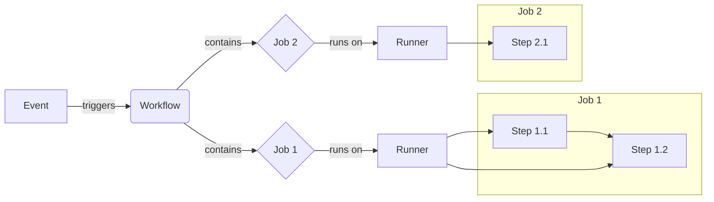

# Github Actions 学习笔记本

## 1. 简介 (Introduction)

GitHub Actions 是一个深度集成在 GitHub 平台中的持续集成 (CI) 和持续交付 (CD) 服务，其核心目标是自动化软件开发生命周期中的各种流程，包括但不限于构建、测试和部署代码。

它不仅仅是一个传统的 CI/CD 工具，更是一个通用的自动化引擎，能够响应 GitHub 仓库内的各种事件（如代码推送 `push`、拉取请求 `pull_request`、问题创建 `issues` 等），从而自动化更广泛的任务，例如在创建 issue 时自动添加标签，或执行项目管理相关的自动化操作。

这种自动化是通过在仓库的 `.github/workflows/` 目录下放置 YAML 格式的配置文件来实现的。这种基于 YAML 的声明式定义方式，使得工作流本身可以像代码一样进行版本控制、共享和审查，与 GitOps 理念天然契合。然而，这也意味着复杂的逻辑判断或需要与外部系统进行深度交互的任务，通常需要借助自定义 Action（使用 JavaScript、Docker 镜像或组合方式创建）或直接执行脚本 (`run`) 来完成，因为 YAML 本身并不提供复杂的编程能力。

GitHub Actions 的主要优势在于其强大的自动化能力、事件驱动的灵活性、与 GitHub 生态的无缝集成，以及活跃的社区（GitHub Marketplace 提供了大量可复用的 Actions）。它旨在解决开发流程中重复、耗时且易出错的手动环节，从而提高开发效率、标准化操作流程，并最终保障代码质量和部署的可靠性。

---

## 2. 核心概念 (Core Concepts)

理解构成 GitHub Actions 工作流的基本组件及其相互关系，是掌握其工作原理和编写有效工作流的基础。这些概念形成了一个清晰的层次结构，驱动着自动化流程的执行。

### Workflow (工作流)

- **定义:** 一个完整的、可配置的自动化过程，由一个或多个 Job 组成。它定义了整个自动化任务的蓝图。
- **载体:** 通过存储在代码仓库 `.github/workflows/` 目录下的 YAML 文件来定义。一个仓库可以包含多个 Workflow 文件，用于处理不同的自动化任务（例如，一个用于 CI，一个用于发布）。
- **触发:** Workflow 的执行由特定的 Event 触发，也可以按预定时间 (`schedule`) 或手动 (`workflow_dispatch`) 启动。
- **复用:** Workflow 可以设计成可复用的单元，被其他 Workflow 调用，这称为 Reusable Workflows。

### Event (事件)

- **定义:** 触发 Workflow 运行的特定活动或条件。
- **来源:** 事件可以源自 GitHub 内部，如代码推送 (`push`)、创建拉取请求 (`pull_request`)、发布 Release (`release`)、创建 Issue (`issues`) 等。也可以是外部事件，通过 Webhook (`repository_dispatch`) 或手动操作 (`workflow_dispatch`) 触发，或是基于时间的计划任务 (`schedule`)。

### Job (任务)

- **定义:** Workflow 中的一个执行单元，包含一系列按顺序执行的 Step。同一个 Job 内的所有 Step 都在同一个 Runner 上执行。
- **执行:** 默认情况下，一个 Workflow 内的多个 Job 会并行运行。可以使用 `needs` 关键字来定义 Job 之间的依赖关系，使得 Job 可以按特定顺序串行执行。

### Runner (运行器)

- **定义:** 执行 Job 的计算环境，本质上是一个安装了 GitHub Actions Runner 应用程序的服务器（虚拟机或容器）。
- **类型:**
  - **GitHub-hosted runners:** 由 GitHub 提供和维护的虚拟机，包含多种操作系统（Ubuntu Linux, Microsoft Windows, macOS）和预装软件。还提供配置更高的 Larger Runners。
  - **Self-hosted runners:** 用户在自己的基础设施（物理机、虚拟机、云实例、容器）上部署和管理的 Runner，提供对硬件、操作系统和软件环境的完全控制。
- **生命周期:** 每个 GitHub-hosted Runner 实例通常只执行一个 Job，并在 Job 完成后被销毁，确保每次运行都在一个干净、隔离的环境中进行。

### Step (步骤)

- **定义:** Job 内的最小执行单元，代表一个独立的任务。
- **类型:** 一个 Step 可以是：
  - 执行一段 Shell 脚本 (`run`)。
  - 调用一个预定义或自定义的 Action (`uses`)。
- **执行:** 在一个 Job 中，Steps 按其在 YAML 文件中定义的顺序依次执行。
- **数据共享:** 由于同一个 Job 内的所有 Step 在同一个 Runner 上执行，它们可以共享文件系统和环境变量，例如一个 Step 构建出的文件可以被后续 Step 使用。

### Action (操作)

- **定义:** 一个可复用的代码包，封装了特定的自动化任务，旨在减少 Workflow 文件中的重复代码。
- **功能:** Action 可以执行各种任务，如检出代码、设置特定语言的工具链、与云服务商进行身份验证、构建和发布软件包等。
- **来源:** 可以使用 GitHub 官方提供的 Action (`actions/*`)、社区在 GitHub Marketplace 上发布的 Action，或者根据需要创建自己的自定义 Action。
- **类型:** 自定义 Action 可以是 JavaScript Action、Docker 容器 Action 或 Composite Action (组合多个步骤)。

### 核心概念关系图示:



### 核心概念总结表:

| 概念 (Concept) | 定义 (Definition)        | 关键特征 (Key Features)                                                           |
| :------------- | :----------------------- | :-------------------------------------------------------------------------------- |
| **Workflow**   | 完整的自动化过程         | YAML 定义, 事件触发/计划/手动, 包含 Jobs, 可复用                                  |
| **Event**      | 触发 Workflow 运行的活动 | GitHub 事件, 外部事件, 定时                                                       |
| **Job**        | Workflow 中的执行单元    | 包含 Steps, 在 Runner 上执行, 默认并行, 可定义依赖 (`needs`)                      |
| **Runner**     | 执行 Job 的服务器/环境   | GitHub 托管 (Linux/Win/macOS/Larger) 或自托管, 每次运行环境独立                   |
| **Step**       | Job 中的最小任务单元     | 执行脚本 (`run`) 或调用 Action (`uses`), Job 内顺序执行, 共享 Runner 环境         |
| **Action**     | 可复用的代码单元         | 封装任务, 简化 Workflow, 官方/社区/自定义 (JS/Docker/Composite), Marketplace 提供 |

---

## 3. Workflow 结构与语法 (Workflow Structure & Syntax)

Workflow 文件使用 YAML 语法编写，并存储在仓库的 `.github/workflows/` 目录下，文件扩展名必须是 `.yml` 或 `.yaml`。理解其核心结构和常用关键字是编写工作流的基础。

### Workflow 关键语法元素表:

| 关键字 (Keyword)    | 级别 (Level) | 作用 (Purpose)                      | 示例/说明 (Example/Notes)                                                             |
| :------------------ | :----------- | :---------------------------------- | :------------------------------------------------------------------------------------ |
| `name`              | Workflow     | (可选) Workflow 在 UI 中的显示名称  | `name: CI Pipeline`                                                                   |
| `run-name`          | Workflow     | (可选) 单次运行的动态显示名称       | `run-name: Build by @${{ github.actor }}`                                             |
| `on`                | Workflow     | (必需) 定义触发事件及过滤条件       | `on: push` 或 `on: { push: { branches: [main] }, pull_request: { types: [opened] } }` |
| `env`               | Workflow     | (可选) 定义 Workflow 范围的环境变量 | `env: { NODE_VERSION: '18' }`                                                         |
| `permissions`       | Workflow/Job | (可选) 配置 GITHUB_TOKEN 的权限     | `permissions: read-all` 或 `permissions: { contents: write }`                         |
| `concurrency`       | Workflow/Job | (可选) 控制并发行为                 | `concurrency: { group: 'deploy-${{ github.ref }}', cancel-in-progress: true }`        |
| `jobs`              | Workflow     | (必需) 定义一个或多个 Job           | `jobs: build:... test:...`                                                            |
| `<job_id>`          | Job          | (必需) Job 的唯一标识符             | `build:` (ID 规则: 字母或`_`开头, 字母/数字/`_`/`-`组成)                              |
| `name`              | Job          | (可选) Job 在 UI 中的显示名称       | `name: Build Project`                                                                 |
| `needs`             | Job          | (可选) 定义 Job 依赖关系            | `needs: build` 或 `needs: [build, lint]`                                              |
| `if`                | Job/Step     | (可选) 条件执行                     | `if: github.ref == 'refs/heads/main'`                                                 |
| `runs-on`           | Job          | (必需) 指定 Runner 环境             | `runs-on: ubuntu-latest` 或 `runs-on: [self-hosted, linux]`                           |
| `outputs`           | Job          | (可选) 定义 Job 输出供下游 Job 使用 | `outputs: { build_result: '${{ steps.build.outputs.result }}' }`                      |
| `steps`             | Job          | (必需) Job 内的步骤列表             | `steps: - name:...`                                                                   |
| `name`              | Step         | (可选) Step 在 UI 中的显示名称      | `name: Install Dependencies`                                                          |
| `id`                | Step         | (可选) Step 的唯一 ID，用于引用输出 | `id: install_step`                                                                    |
| `run`               | Step         | 执行命令行脚本                      | `run: npm install` 或 `run: \|` (多行脚本)                                            |
| `uses`              | Step         | 调用一个 Action                     | `uses: actions/checkout@v4`                                                           |
| `with`              | Step         | 为 Action 提供输入参数              | `with: { node-version: '18' }`                                                        |
| `env`               | Step         | (可选) 为单个 Step 设置环境变量     | `env: { DEBUG: 'true' }`                                                              |
| `working-directory` | Step         | (可选) 指定 run 脚本的工作目录      | `working-directory: ./backend`                                                        |
| `continue-on-error` | Step         | (可选) 允许 Step 失败后继续执行     | `continue-on-error: true`                                                             |

这种层次化的 YAML 结构 (Workflow -> jobs -> job_id -> steps -> step) 直接映射了 GitHub Actions 的执行模型，使得配置相对直观和易于理解。

顶层关键字定义了工作流的整体行为和触发方式，`jobs` 定义了并行的或串行的任务单元，而 `steps` 则详细描述了每个任务内部的具体操作。

在 Step 层面，`uses` 和 `run` 是实现具体功能的两种主要方式。

- `uses` 通过调用预置或自定义的 Action 来实现功能的复用和标准化，是 GitHub Actions 生态的核心。
- `run` 则提供了直接执行 Shell 命令的灵活性，适用于简单或高度定制化的任务。

控制流是构建复杂工作流的关键。

- `needs` 关键字允许定义 Job 之间的依赖关系，从而构建出任务的有向无环图 (DAG)，实现并行与串行的灵活组合。
- `if` 条件则允许在 Job 或 Step 级别根据运行时上下文信息（如分支名、事件类型、前置步骤结果等）动态决定是否执行，从而创建出能够适应不同场景的智能化工作流。

---

## 4. 上下文与表达式 (Contexts and Expressions)

为了让静态的 YAML 工作流能够响应动态的运行时信息，GitHub Actions 提供了上下文 (Contexts) 和表达式 (Expressions) 机制。

### Contexts 概述

- Contexts 是一组包含 Workflow 运行时信息的对象。它们是连接静态 Workflow 定义与动态执行环境的关键桥梁，使得 Workflow 能够访问关于触发事件、Runner 环境、环境变量、Secrets、Job 和 Step 状态等信息。
- 每个 Context 是一个对象，包含多个属性，这些属性的值可能是字符串、数字、布尔值或其他对象。
- **注意:** 并非所有 Context 在 Workflow 的所有位置都可用。需要查阅文档了解特定 Context 的可用范围 (Context availability)。例如，`steps` Context 只能在同一 Job 内引用已完成的步骤，`matrix` Context 只在 Matrix Job 中可用。

### 常用 Contexts:

| Context 名称 | 主要内容                                      | 常用属性示例                                                                                                           | 可用性说明                                                         |
| :----------- | :-------------------------------------------- | :--------------------------------------------------------------------------------------------------------------------- | :----------------------------------------------------------------- |
| `github`     | Workflow 运行和事件信息                       | `github.event_name`, `github.ref`, `github.sha`, `github.actor`, `github.repository`, `github.token`, `github.event.*` | 大部分位置可用                                                     |
| `env`        | Workflow/Job/Step 定义的环境变量              | `env.NODE_VERSION`, `env.CI`                                                                                           | 大部分位置可用 (不含 `id`, `uses`)                                 |
| `secrets`    | 可用的 Secrets                                | `secrets.GITHUB_TOKEN`, `secrets.MY_API_KEY`                                                                           | 大部分位置可用 (Composite Actions 中不可用)                        |
| `steps`      | 同一 Job 内已执行 Step 的输出和状态           | `steps.<step_id>.outputs.*`, `steps.<step_id>.conclusion`                                                              | 只能在同一 Job 内引用已执行的、有 `id` 的 Step                     |
| `runner`     | Runner 环境信息                               | `runner.os`, `runner.arch`, `runner.temp`                                                                              | Job 内可用                                                         |
| `inputs`     | `workflow_call` 或 `workflow_dispatch` 的输入 | `inputs.environment`, `inputs.version`                                                                                 | 仅在 `workflow_call` 或 `workflow_dispatch` 触发的 Workflow 中可用 |
| `matrix`     | Matrix 配置的变量                             | `matrix.os`, `matrix.node_version`                                                                                     | 仅在 Matrix Job 中可用                                             |

### 表达式 (`${{ }}`) 语法:

- **用途:** 用于在 Workflow 文件中嵌入需要 GitHub Actions 评估和计算的逻辑，而不是作为纯文本字符串处理。
- **语法:** 使用 `${{ <expression> }}` 包裹表达式。
- **内容:** 表达式内部可以：
  - 访问 Contexts：例如 `${{ github.ref }}`。
  - 使用字面量：字符串 (`'hello'`)、数字 (`123`)、布尔值 (`true`, `false`)、`null`、数组 (`[ 'a', 'b' ]`)、对象 (`{ key: 'value' }`)。
  - 使用操作符：逻辑 (`!`, `&&`, `||`)、比较 (`==`, `!=`, `<`, `>`, `<=`, `>=`)。比较时会进行类型转换，字符串比较忽略大小写。
  - 调用内置函数：例如 `${{ contains(github.ref, 'main') }}`。

表达式和内置函数提供了在 YAML 中执行基本逻辑和数据操作的能力，是实现动态和智能化 Workflow 的核心。例如，可以根据分支名称决定部署目标，或根据前一步骤的输出构建下一步骤的参数。

### 内置函数:

| 函数 (Function)           | 描述 (Description)                                       | 示例 (Example)                                                    |
| :------------------------ | :------------------------------------------------------- | :---------------------------------------------------------------- |
| `contains(search, item)`  | 检查 `search`(字符串/数组)是否包含 `item` (不区分大小写) | `${{ contains(github.event.pull_request.labels.*.name, 'bug') }}` |
| `startsWith(str, search)` | 检查 `str` 是否以 `search` 开头 (不区分大小写)           | `${{ startsWith(github.ref, 'refs/heads/') }}`                    |
| `endsWith(str, search)`   | 检查 `str` 是否以 `search` 结尾 (不区分大小写)           | `${{ endsWith(runner.os, 'latest') }}`                            |
| `format(str, val0,...)`   | 格式化字符串，替换 `{N}` 占位符                          | `${{ format('Hello {0}!', github.actor) }}`                       |
| `join(array, sep?)`       | 将数组元素连接成字符串，可用分隔符 (默认 `,`)            | `${{ join(matrix.node, ', ') }}`                                  |
| `toJSON(value)`           | 将 `value` 转换为格式化的 JSON 字符串 (用于调试)         | `${{ toJSON(github.event) }}`                                     |
| `fromJSON(value)`         | 将 JSON 字符串解析为对象或数据类型                       | `${{ fromJSON(steps.parse_matrix.outputs.result).include }}`      |
| `success()`               | (状态检查) 前序步骤/Job 均成功                           | `if: success()`                                                   |
| `failure()`               | (状态检查) 前序步骤/Job 有失败                           | `if: failure()`                                                   |
| `always()`                | (状态检查) 总是执行 (即使取消)                           | `if: always()`                                                    |
| `cancelled()`             | (状态检查) Workflow 被取消                               | `if: cancelled()`                                                 |

- `toJSON` 和 `fromJSON` 对于处理复杂数据结构（如动态生成 Matrix 或处理 API 响应）特别有用。

---

## 5. 关键特性与技术 (Key Features & Techniques)

掌握以下 GitHub Actions 的关键特性和技术，有助于构建更复杂、高效、安全且易于维护的自动化工作流。这些特性共同构成了一个强大的工具箱，用于应对 CI/CD 和自动化中的各种挑战。

### 使用 Actions (`uses` vs `run`)

- `uses`: **调用预定义或自定义的 Action。** 这是实现代码复用、利用社区或官方功能、封装复杂逻辑和标准化任务的主要方式。通过 `with` 关键字向 Action 传递参数，增加了灵活性。
- `run`: **直接在 Runner 的 Shell 环境中执行命令或脚本。** 适用于简单命令、特定的一次性脚本逻辑，或在没有合适 Action 可用时的场景。提供了最大的灵活性，但不利于复用。
- **选择与版本化:** 优先考虑使用经过验证的官方 (`actions/*`) 或社区 Action (`uses`)。为了保证工作流的稳定性和安全性，必须对使用的 Action 进行版本化。最安全的方式是固定到完整的 Commit SHA (`uses: actions/checkout@a12a23bc`)，这可以防止 Action 仓库被恶意篡改。使用标签（如 `@v4` 或 `@v4.1.1`）虽然更方便，但存在标签可能被移动的风险，因此仅在信任 Action 创建者时使用。

### 秘密管理 (Secrets Management)

- **存储:** 敏感信息（如 API 密钥、密码、证书）应作为 Secrets 存储在 GitHub 中，可在 Organization、Repository 或 Environment 级别进行配置。Secrets 在存储时会被加密。
- **使用:** 在 Workflow 中通过 `secrets` 上下文（例如 `${{ secrets.API_KEY }}`）引用。GitHub 会自动在日志中将 Secrets 的值替换为 `***` 进行遮蔽。
- **最佳实践:**
  - **最小权限原则:** 仅授予 Secrets 完成任务所需的最小权限。
  - **避免结构化数据:** 不要将 JSON、YAML 等结构化数据直接存为 Secret，这会严重影响日志的自动遮蔽效果。应为每个敏感值创建单独的 Secret。
  - **注册衍生值:** 如果使用一个 Secret 生成了另一个敏感值（如用私钥生成 JWT），应将该衍生值也注册为 Secret，以确保其在日志中也能被遮蔽。
  - **审计与轮换:** 定期审查 Secrets 的使用情况，移除不再需要的 Secrets，并定期轮换密钥以缩短潜在暴露窗口。
  - **环境审批:** 对访问敏感环境（如生产环境）的 Secrets 启用审批流程 (Required reviewers)。
  - **命名规范:** 使用清晰、描述性的名称，如包含服务、环境和用途（例如 `AWS_PROD_DEPLOY_KEY`）。
  - **避免日志输出:** 不要在 `run` 脚本中直接打印 Secrets。

### 环境变量 (Environment Variables)

- **作用域与优先级:** 可在 Workflow、Job、Step 三个级别使用 `env` 关键字定义。优先级为 Step > Job > Workflow，内层会覆盖外层同名变量。
- **使用场景:** 用于传递配置信息、设置工具路径、控制脚本行为等非敏感数据。
- **访问方式:** 在 `run` 脚本中通过 Shell 语法（`$VAR` 或 `$env:VAR`）访问；在 Workflow 其他部分通过 `env` 上下文（`${{ env.VAR }}`）访问。
- **配置变量 (vars):** 除了 `env`，还可以在 Organization、Repository、Environment 级别设置 Configuration Variables，用于跨 Workflow 共享非敏感配置。通过 `vars` 上下文（`${{ vars.MY_VAR }}`）访问。优先级：Environment > Repository > Organization。
- **命名规范:** 避免使用 `GITHUB_` 前缀；建议使用大写字母和下划线。

### 构建产物 (Artifacts)

- **用途:** 用于在同一 Workflow 的不同 Job 之间传递文件或目录（例如，构建 Job 生成二进制文件，部署 Job 使用它），或者在 Workflow 运行结束后持久化存储结果（如测试报告、日志文件、构建包）供后续下载和分析。
- **操作:**
  - **上传:** 使用 `actions/upload-artifact@v4` Action。需要指定 `name` 和 `path`。
  - **下载:** 使用 `actions/download-artifact@v4` Action。可以通过 `name` 下载指定 Artifact，或不指定 `name` 下载所有 Artifacts。
- **特点:** Artifacts 在 v4 版本后是不可变的；一旦上传，内容不能被修改。下载操作只能获取同一 Workflow run 中上传的 Artifacts。
- **存储与保留:** Artifacts 存储在 GitHub 的存储空间中，默认保留 90 天，此保留期可以在仓库或组织级别进行配置，也可以在上传时通过 `retention-days` 参数指定。

### 缓存依赖 (Caching Dependencies)

- **用途:** 通过缓存不经常变动的文件（主要是项目依赖项，如 `node_modules`, Maven 的 `.m2` 仓库, Python 的 `pip` 缓存等）来显著加速 Workflow 的执行时间，减少网络传输和重复构建/下载。
- **操作 (`actions/cache`):** 使用 `actions/cache@v4` Action。关键输入包括：
  - `path`: 需要缓存的文件或目录路径。
  - `key`: 缓存的唯一标识符。通常包含操作系统、包管理器以及依赖锁定文件（如 `package-lock.json`, `pom.xml`）的内容哈希值 (`hashFiles()`)，这样当依赖变化时 `key` 会改变，导致缓存失效并重新生成。
  - `restore-keys` (可选): 当 `key` 未命中时，按顺序尝试匹配这些前缀键，用于恢复一个可能部分匹配的旧缓存。
- **`setup-*` Actions 集成:** 许多官方的 `actions/setup-<language>` Action（如 `setup-node`, `setup-java`, `setup-python`）内置了对相应包管理器的缓存支持。只需在 `with` 中添加 `cache: 'npm'` 或 `cache: 'maven'` 等参数，即可自动处理缓存的创建和恢复，极大简化了配置。
- **与 Artifacts 的区别:** Cache 主要用于加速后续运行，内容可能会根据策略（如大小限制、访问时间）被自动清理；Artifacts 用于保存 Job 的产出物，供 Job 间共享或运行后查看。

### 构建矩阵 (Matrix Strategy)

- **用途:** 使用 `strategy: matrix:` 关键字，可以基于变量的不同组合自动生成并并行运行多个 Job 实例。常用于在多种操作系统、不同软件版本（如 Node.js, Python）或其他配置下进行构建和测试，以确保兼容性。
- **配置:** 在 Job 的 `strategy` 下定义 `matrix`，其中包含一个或多个变量（键）及其对应的值（数组）。GitHub Actions 会为所有变量值的笛卡尔积创建一个 Job 运行实例。
- **示例:**
  ```yaml
  jobs:
    test:
      runs-on: ${{ matrix.os }}
      strategy:
        matrix:
          os: [ubuntu-latest, windows-latest]
          node-version: ["18", "20"] # Use strings for versions if preferred
      steps:
        - uses: actions/checkout@v4
        - uses: actions/setup-node@v4
          with:
            node-version: ${{ matrix.node-version }}
        #... test steps
  ```
  这个例子会生成 4 个 Job 实例 (2 OS \* 2 Node versions)。
- **访问变量:** 在 Job 的步骤中，可以通过 `matrix` 上下文访问当前实例对应的变量值，如 `${{ matrix.os }}` 或 `${{ matrix.node-version }}`。
- **控制:**
  - `include`: 添加额外的特定组合到 Matrix 中。
  - `exclude`: 从生成的组合中排除特定的组合。
  - `fail-fast`: 设置为 `false` 时，即使 Matrix 中的某个 Job 失败，其他 Job 也会继续运行（默认为 `true`，即一败俱败）。
- **限制:** 一个 Workflow run 最多可以生成 256 个 Matrix Job。

### 可复用工作流 (Reusable Workflows)

- **目的:** 避免在多个 Workflow 文件中重复相同的 Job 或 Steps，实现代码复用、标准化和集中维护。
- **创建 (Called Workflow):** 在要被复用的 Workflow 文件中，使用 `on: workflow_call:` 触发器。可以定义 `inputs` 来接收调用者传递的参数，以及 `secrets` 来声明需要调用者传递的敏感凭证。
- **调用 (Caller Workflow):** 在需要调用可复用 Workflow 的 Job 中，使用 `uses:` 关键字，后跟可复用 Workflow 的路径 (`owner/repo/.github/workflows/workflow.yml@ref`)。使用 `with:` 传递 `inputs` 参数，使用 `secrets:` 传递 secrets（对于同一组织或企业内的调用，可以使用 `secrets: inherit` 来隐式传递所有兼容的 Secrets）。
- **与 Composite Actions 的区别:** Reusable Workflows 复用的是整个 Workflow（可以包含多个 Jobs），而 Composite Actions 复用的是一系列 Steps（在单个 Job 中作为一个 Step 使用）。Reusable Workflows 可以在不同的 Runner 上运行其内部的 Jobs，而 Composite Actions 运行在调用者 Job 的 Runner 上。

### Job 输出 (Job Outputs)

- **目的:** 在按顺序执行（通过 `needs` 关联）的 Jobs 之间传递少量结构化数据。
- **定义:** 在产生输出的 Job (`job1`) 中，使用 `outputs` 关键字定义一个映射。键是输出的名称，值通常是该 Job 内部某个 Step 的输出，通过 `steps` 上下文引用，例如 `outputs: { result: ${{ steps.calculate.outputs.sum }} }`。
- **使用:** 在依赖 `job1` 的下游 Job (`job2`) 中，通过 `needs` 上下文访问 `job1` 的输出，例如 `run: echo "Result from job1: ${{ needs.job1.outputs.result }}"`。
- **限制:** 单个 Job 的所有输出总大小限制为 1MB，整个 Workflow run 的所有输出总大小限制为 50MB。包含 Secrets 的输出会被自动阻止传递。对于需要传递大量数据或文件的场景，应使用 Artifacts。

---

## 6. 常用 Actions 列表 (Common Actions)

以下是一些在 GitHub Actions 工作流中非常常用且基础的官方或社区 Action，它们极大地简化了常见的自动化任务。

| Action 名称 (Name)               | 主要用途 (Purpose)                                                                           |
| :------------------------------- | :------------------------------------------------------------------------------------------- |
| `actions/checkout@v4`            | 检出（克隆）代码库到 Runner 工作区，以便后续步骤访问代码。                                   |
| `actions/setup-node@v4`          | 设置指定版本的 Node.js 运行环境，并可选地缓存 npm/yarn/pnpm 依赖。                           |
| `actions/setup-python@v5`        | 设置指定版本的 Python 或 PyPy 运行环境，并可选地缓存 pip/pipenv/poetry 依赖。                |
| `actions/setup-java@v4`          | 设置指定版本的 Java (JDK/JRE) 运行环境，支持多种发行版，并可选地缓存 Maven/Gradle/sbt 依赖。 |
| `actions/upload-artifact@v4`     | 将指定的文件或目录作为构建产物上传，用于 Job 间共享或 Workflow 结束后保存。                  |
| `actions/download-artifact@v4`   | 下载在当前 Workflow run 中先前上传的构建产物。                                               |
| `actions/cache@v4`               | 缓存依赖项或其他文件，以加速后续的 Workflow run。                                            |
| `softprops/action-gh-release@v2` | 创建 GitHub Release，并可将指定文件作为 Release Assets 上传。                                |
| `ncipollo/release-action@v1`     | 另一个流行的用于创建 GitHub Release 和上传 Release Assets 的 Action。                        |

GitHub 官方维护的核心 `actions/*` Action 覆盖了 CI/CD 和工作流自动化的基础构建块，如代码检出、环境设置、缓存和产物管理。使用这些官方 Action 通常是推荐的做法，因为它们与平台功能紧密集成且由 GitHub 维护，提供了稳定性和可靠性。

GitHub Marketplace 则极大地扩展了 Actions 的能力，提供了大量由社区贡献的 Action，用于集成各种第三方工具和服务（如部署到云平台、与项目管理工具交互等）。这避免了用户重复开发通用功能。

然而，使用第三方 Action 也引入了对外部代码的依赖和潜在的安全风险。因此，在选择社区 Action 时，应优先考虑经过验证的创建者（带有 "Verified creator" 徽章），仔细审查 Action 的源代码，并始终使用 Commit SHA 或明确的 Tag 来锁定版本，以降低风险。

---

## 7. 示例 (Examples)

以下提供一些典型的 Workflow YAML 文件示例，展示 GitHub Actions 在不同场景下的应用。更多示例可以在官方文档中找到。

### 最简单的 "Hello World":

这个示例展示了一个最基础的 Workflow，它在每次推送到仓库时触发，并在 Ubuntu Runner 上执行一个简单的 `echo` 命令。

```yaml
# .github/workflows/hello-world.yml
name: Hello World Workflow

on: [push]

jobs:
  say_hello:
    runs-on: ubuntu-latest
    steps:
      - name: Greet
        run: echo "Hello, GitHub Actions!"
```

### 典型的 CI 流程 (Node.js 构建与测试):

这个示例展示了一个常见的 Node.js 项目的 CI 流程：检出代码、设置 Node.js 环境、安装依赖、执行构建（如果存在 `build` 脚本）和运行测试。

```yaml
# .github/workflows/node-ci.yml
name: Node.js CI

on:
  push:
    branches: [main]
  pull_request:
    branches: [main]

jobs:
  build:
    runs-on: ubuntu-latest
    steps:
      - name: Checkout repository code
        uses: actions/checkout@v4

      - name: Use Node.js 20.x
        uses: actions/setup-node@v4
        with:
          node-version: "20.x"
          cache: "npm" # Enable npm dependency caching

      - name: Install dependencies
        run: npm ci

      - name: Build project (if applicable)
        run: npm run build --if-present

      - name: Run tests
        run: npm test
```

### 使用 Artifacts 在 Job 间传递数据:

这个示例演示了 `job_1` 生成一个文件，通过 `upload-artifact` 上传；`job_2` 依赖 `job_1`，通过 `download-artifact` 获取该文件并使用。

```yaml
# .github/workflows/pass-artifact.yml
name: Pass Data with Artifacts

on: [workflow_dispatch] # Manual trigger for example

jobs:
  job_1:
    name: Create data
    runs-on: ubuntu-latest
    steps:
      - name: Create a file
        run: echo "Data from Job 1" > data.txt
      - name: Upload data artifact
        uses: actions/upload-artifact@v4
        with:
          name: job1-data
          path: data.txt

  job_2:
    name: Use data
    needs: job_1
    runs-on: ubuntu-latest
    steps:
      - name: Download data artifact
        uses: actions/download-artifact@v4
        with:
          name: job1-data
      - name: Display data
        run: cat data.txt
```

### 使用 Matrix 进行多平台测试:

这个示例使用 Matrix Strategy 在 Ubuntu 和 Windows 两个平台上，分别使用 Node.js 18 和 20 版本进行测试。

```yaml
# .github/workflows/matrix-testing.yml
name: Matrix Testing Example

on: [push]

jobs:
  test:
    runs-on: ${{ matrix.os }}
    strategy:
      fail-fast: false # Optional: allow other jobs to continue if one fails
      matrix:
        os: [ubuntu-latest, windows-latest]
        node-version: ["18", "20"] # Use strings for clarity
    steps:
      - uses: actions/checkout@v4

      - name: Use Node.js ${{ matrix.node-version }} on ${{ matrix.os }}
        uses: actions/setup-node@v4
        with:
          node-version: ${{ matrix.node-version }}

      - run: npm ci
      - run: npm test
```

### 自动发布 Release:

这个示例演示了当一个 Git tag 被推送时（例如 `v1.0.0`），自动创建一个 GitHub Release，并将构建产物（假设在 `dist/` 目录下）上传为 Release Assets。

```yaml
# .github/workflows/release.yml
name: Create Release

on:
  push:
    tags:
      - "v*" # Trigger on tags starting with 'v'

jobs:
  build:
    runs-on: ubuntu-latest
    steps:
      - uses: actions/checkout@v4
      - name: Set up Node.js
        uses: actions/setup-node@v4
        with:
          node-version: "20"
      - run: npm ci
      - run: npm run build # Assume build outputs to dist/
      - name: Upload build artifact
        uses: actions/upload-artifact@v4
        with:
          name: build-output
          path: dist/

  release:
    needs: build
    runs-on: ubuntu-latest
    permissions:
      contents: write # Needed to create releases
    steps:
      - name: Download build artifact
        uses: actions/download-artifact@v4
        with:
          name: build-output
          path: dist/ # Download to dist/ directory
      - name: Create GitHub Release
        uses: softprops/action-gh-release@v2
        with:
          files: dist/* # Upload all files from dist/
        env:
          GITHUB_TOKEN: ${{ secrets.GITHUB_TOKEN }}
```

---

## 8. 调试与最佳实践 (Debugging & Best Practices)

编写和维护高质量、可靠的 GitHub Actions Workflow 需要掌握一些调试技巧和遵循最佳实践。

### 调试技巧:

- **查看 Workflow 日志:** 这是最基本的调试方法。GitHub UI 提供了详细的运行日志，包括每个 Job 和 Step 的输出、状态和耗时。失败的 Step 会自动展开显示错误信息。可以搜索日志内容，并获取特定日志行的永久链接。
- **启用 Step 调试日志 (`ACTIONS_STEP_DEBUG`):** 在仓库的 Secrets 或 Variables 中设置 `ACTIONS_STEP_DEBUG` 为 `true`，可以增加 Job 日志的详细程度，输出额外的调试信息，有助于诊断 Action 或脚本内部的问题。
- **启用 Runner 诊断日志 (`ACTIONS_RUNNER_DEBUG`):** 类似地，设置 `ACTIONS_RUNNER_DEBUG` 为 `true` 可以获取关于 Runner 如何执行 Job 的更详细日志文件，通常用于排查 Runner 本身或环境相关的问题。这些日志需要下载完整的日志存档才能查看。
- **使用 tmate 进行 Runner 调试:** 对于复杂或难以复现的问题，可以使用社区提供的 Action（如 `mxschmitt/action-tmate`）在 Workflow 中启动一个 tmate 会话。这允许你通过 SSH 或 Web Shell 直接连接到正在运行的 Runner 虚拟机，实时检查环境、文件系统和运行状态，进行交互式调试。

### 最佳实践:

- **版本化 Actions (`@vX` or `@commit-sha`):** 强烈建议在 `uses` 语句中指定明确的 Action 版本（Tag 或 Commit SHA），而不是使用 `@main` 或省略版本。这能保证 Workflow 的稳定性和可重复性，防止 Action 的更新意外破坏你的流程。使用 Commit SHA 是最安全的方式。
- **使用最小权限原则 (`permissions`):** 默认情况下，`GITHUB_TOKEN` 拥有较多权限。应在 Workflow 或 Job 级别使用 `permissions` 关键字，明确指定 `GITHUB_TOKEN` 所需的最小权限集，以降低潜在风险。例如，如果 Job 只需要读取代码，设置 `permissions: contents: read`。
- **代码复用 (Reusable Workflows, Composite Actions):** 对于重复的逻辑或步骤序列，使用 Reusable Workflows（复用整个 Workflow）或 Composite Actions（复用一系列 Steps）来避免代码冗余，提高可维护性和一致性。根据复用的粒度和需求选择合适的方式。
- **命名规范 (Workflow, Job, Step):** 使用清晰、描述性的名称和 ID。
  - **Workflow 文件名:** 推荐使用小写字母和连字符（如 `ci-pipeline.yml`）。
  - **Workflow `name`:** 描述 Workflow 的主要目的（如 `Continuous Integration`, `Deploy to Production`）。
  - **Job `job_id` 和 `name`:** ID 使用下划线或连字符（如 `build_app`），`name` 使用易于理解的描述（如 `Build Application`）。
  - **Step `name` 和 `id`:** `name` 描述步骤操作（如 `Install Dependencies`），`id` 用于需要引用的步骤（如 `id: setup_node`）。
  - **变量/Secrets:** 使用大写字母和下划线，避免 `GITHUB_` 前缀。
  - 一致的命名有助于提高 Workflow 的可读性和可维护性。
- **Secrets 管理最佳实践:** 遵循前面章节提到的 Secrets 管理最佳实践，如最小权限、定期轮换、避免硬编码等。
- **依赖缓存:** 合理使用 `actions/cache` 或 `setup-*` Actions 的缓存功能来加速构建。
- **错误处理:** 使用 `continue-on-error: true` 处理非关键步骤的失败，使用 `if: failure()` 或 `if: always()` 来执行清理或报告步骤。
