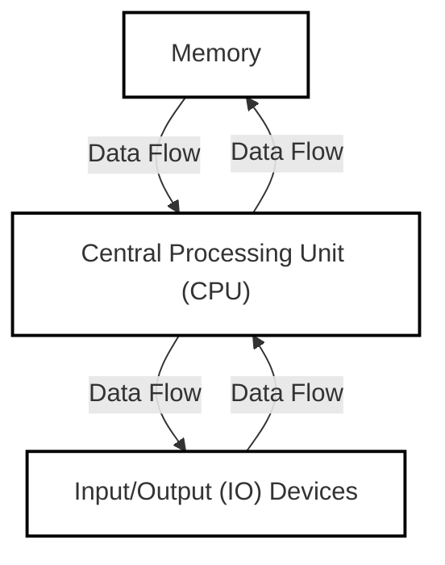

Banner Image Description: _A simple illustration of Java programming essentials: a variable represented by a labeled box, different data types symbolized by basic icons (e.g., a number, a character, a boolean), and mathematical operators (+, -, _, /) in a balanced composition.\_

---

Welcome to MIT's Introduction to Java Programming! This course aims to teach you enough Java to create useful programs. Let's dive into our first lesson!

### Course Information

- Assignments are due at 3 PM the next day
- Collaboration is encouraged, but write your own code
- To pass: Submit first assignment and make reasonable attempts on 6 out of 7 assignments

### 1. Understanding Java and Computers

#### What Makes Java Special?

- Most popular programming language worldwide
- Platform-independent (runs on JVM)
- More structured than Python, simpler than C++
- Perfect for beginners who want a solid foundation

#### How Programs Work

Think of your computer as having three key parts:

- **Memory**: Like a giant shelf of labeled boxes where data is stored
- **CPU**: The "brain" that processes instructions
- **I/O Devices**: Ways to communicate with the computer (keyboard, screen, etc.)



When you write `z = x + y`, the computer:

1. Finds x in memory
2. Finds y in memory
3. Adds them together
4. Stores the result as z

### 1. Goal of this course

This course is focused on teaching you how to write Java programs. The ultimate goal of this course is to make sure that you would have learned enough by the end of this course to do something useful. Examples include:

- Simulating a natural/engineering process
- Manipulating documents (like PDFs)
- Draw pretty graphics

TODO: 这个是DeepClaude自己补充的，原pdf没有这个内容。While Java is more complex than Python, it's more straightforward than C++. One of Java's biggest advantages is that it runs on a "Virtual Machine" (JVM), meaning your code can run on any device that has Java installed!

### 2. How Computers Work (The Simple Version)

Think of a computer as having three main parts:

- **Memory**: Like a giant shelf of labeled boxes where data is stored
- **CPU**: The "brain" that processes instructions
- **I/O Devices**: Ways to communicate with the computer (keyboard, screen, etc.)

When you write code like `z = x + y`, the computer:

1. Finds the value in box 'x'
2. Finds the value in box 'y'
3. Adds them together
4. Puts the result in box 'z'

programming languages:

- easier to understand than CPU instructions
- needs translation before CPU to understand it

JAVA:

- Most popular
- Runs on. a virtual machine called JVM
- More complex than some others: python
- Simpler than others: C++

Compiling Java:
source code(.java) --javac--> Byte Code(.class) ----> java

First program:

```java
class Hello {
  public static void main(String[] args) {
    // System execution begins here
    System.out.println("Hello world.");
  }
}
```

The above should be saved to which file? How to run and see the result?

Program structure:

```java
class CLASSNAME {
    public static void main(String[] arguments) {
	    STATEMENTS
    }
}

```

Output:

System.out.println(some String) outputs to the console Example: System.out.println(“output”);

Second Program

```java
class Hello2 {
  public static void main(String[] arguments) {
    System.out.println("Hello world.");  // Print once
    System.out.println("Line number 2"); // Again!
  }
}
```

types
kinds of values that can be stored and manipulated.

boolean: Truth value true of false
int Integer: 0,1 -47
double Real number: 3.14, 1.0, -2.1
String text "hello" "example"

variables:
named location that stores a value of one particular type.

Form: TYPE NAME;
String foo;

Assignment:
Use = to give variables a value.

Example:
String foo;
foo="IAP 6.092";

can combine: `double badPi=3.14;` or `boolean isJanuary=true;`

operators: symbols that perform simple computations
assignment: `=`
addition: `+`
subtraction: `-`
multiplication: `*`
division: `/`

Operators have orders which follows standard math rules:

1. parentheses
2. multiplication and division
3. addition and subtraction

```java
class DoMath {
    public static void main(String[] arguments) {
        double score=1.0+2.0*3.0;
        System.out.println(score);
        score=score/2.0;
        System.out.println(score);
    }
}
```

```java
public class DoMath2 {
    public static void main(String[] arguments) {
        double score=1.0+2.0*3.0;
        System.out.println(score);
        double copy=score;
        copy=copy/2.0;
        System.out.println(copy);
        System.out.println(score);
    }
}
```

String concatenation(`+`)

```java
String text = "hello" + " world";
text = text + " number " + 5;
// text = "hello world number 5"
```

Assignment: GravityCalculator
Compute the position of a falling object:
$$ x(t)=0.5\times at^2+v*{i}t+x*{i}$$

NOTE: code and explanation for assignments should be found at another dedicated git repo. This line should also be removed upon publication.

In this assignment, you will create a program that computes the distance an object will fall in Earth's gravity.

1. Create a new class called GravityCalculator.

2. Copy and paste the following initial version:

**class** GravityCalculator **{**

**public** **static** **void** main**(**String**[]** arguments**) {**

**double** gravity **= -**9.81**;** // Earth's gravity in m/s^2

**double** initialVelocity **=** 0.0**;**

**double** fallingTime **=** 10.0**;**

**double** initialPosition **=** 0.0**;**

**double** finalPosition **=** 0.0**;**

System**.**out**.**println**(**"The object's position after " **+** fallingTime **+**

" seconds is " **+** finalPosition **+** " m.

"**);**

**}**

**}**

3. Run it in Eclipse (Run → Run As → Java Application).

What is the output of the unmodified program? Include this as a comment in the source code of your submission.

Modify the example program to compute the position of an object after falling for 10 seconds, outputting the position in

meters. The formula in Math notation is:

x(t) = 0.5 × at2 + vit + xi

**Variable** **Meaning** **Value**

a Acceleration (m/s2) -9.81

t Time (s) 10

vi Initial velocity (m/s) 0

xi Initial position 0

_Note_: The correct value is -490.5 m. Java will output more digits after the decimal place, but that is unimportant.
