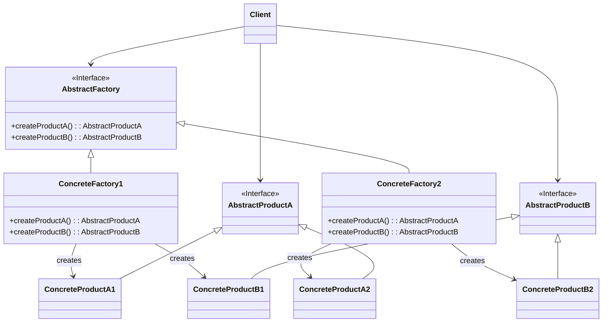

抽象工厂的工作是将“抽象零件”组装为“抽象产品”。

> [!abstract] 一句话核心
> Abstract Factory（抽象工厂）是一种创建型设计模式，它允许你创建一系列相关的对象（一个“产品家族”），而无需指定这些对象的具体类。

---

## 1. 意图 / 要解决的问题 (The "Why")

> [!question] 这个模式解决了什么痛点？
> 在这里详细描述一个未使用该模式前的“糟糕”场景。描绘代码的“坏味道”，例如充满了 `if-else`、模块紧密耦合、难以扩展等。解释为什么这种写法不好。

想象一下你正在创建一个家具店的模拟程序。你的代码里有一系列**相互关联的产品**，例如一个产品家族包含：`椅子` + `沙发` + `咖啡桌`。同时，这个产品家族还有多种**变体**（或“风格”），比如：`现代风`、`维多利亚风`、`艺术装饰风`。

核心痛点在于：你需要确保创建出来的单个家具物品，能够和**同一个家族（风格）** 的其他物品相互匹配。 比如，一个现代风的沙发如果配上维多利亚风格的椅子，客户会非常不满意的。此外，当未来需要增加新的产品（比如 `台灯`）或新的产品家族（比如 `日式风`）时，你不希望去修改已有的、稳定的核心代码。

假设我们的 `FurnitureShop` 应用需要根据用户选择的风格（比如 "Modern" 或 "Victorian"）来创建一整套匹配的家具。

```java
// 1. 定义产品的接口
interface Chair {
    void sitOn();
}
interface Sofa {
    void lieOn();
}

// 2. 定义各种风格的具体产品
class ModernChair implements Chair {
    public void sitOn() { System.out.println("Sitting on a modern chair."); }
}
class VictorianChair implements Chair {
    public void sitOn() { System.out.println("Sitting on a Victorian chair."); }
}
class ModernSofa implements Sofa {
    public void lieOn() { System.out.println("Lying on a modern sofa."); }
}
class VictorianSofa implements Sofa {
    public void lieOn() { System.out.println("Lying on a Victorian sofa."); }
}

// 3. 客户端代码 (问题所在)
// 这个类是我们的主应用，它直接负责创建家具
public class FurnitureShop {

    // 巨大的、丑陋的创建方法
    public void createFurniture(String style) {
        Chair chair;
        Sofa sofa;

        // 核心痛点：创建逻辑和业务逻辑混杂，充满了条件判断
        if ("Modern".equalsIgnoreCase(style)) {
            chair = new ModernChair(); // 耦合了具体类 ModernChair
            sofa = new ModernSofa();   // 耦合了具体类 ModernSofa
        } else if ("Victorian".equalsIgnoreCase(style)) {
            chair = new VictorianChair(); // 耦合了具体类 VictorianChair
            sofa = new VictorianSofa();   // 耦合了具体类 VictorianSofa
        } else {
            throw new IllegalArgumentException("Unknown style: " + style);
        }

        // 假如未来要增加 "ArtDeco" 风格, 就必须回来修改这里的 if-else 链条！

        System.out.println("Created a set of furniture:");
        chair.sitOn();
        sofa.lieOn();
    }
}
```

这段代码直观地暴露了几个严重问题：

1. **违反开闭原则**：这是最核心的问题。每当你想增加一种新的家具风格（比如 `ArtDeco`），你**必须**回到 `FurnitureShop` 类中，修改 `createFurniture` 方法，添加一个新的 `else if` 分支。这使得代码对扩展是关闭的，对修改却是开放的，非常脆弱。
2. **紧密耦合**：`FurnitureShop` (客户端) 直接依赖于所有具体的家具类（`ModernChair`, `VictorianSofa` 等）。它知道每一个具体类的名字，并使用 `new` 关键字直接创建它们。这导致客户端和具体产品之间形成了非常强的耦合关系。
3. **产品家族一致性难以保证**：在这个简单的例子里，`if` 语句块保证了创建的椅子和沙发风格是一致的。但在更复杂的应用中，如果创建逻辑分散在各处，程序员很容易错误地将一个 `ModernChair` 和一个 `VictorianSofa` 组合在一起，而系统本身没有任何机制来阻止这种不匹配。

---

## 2. 解决方案 / 核心思想 (The "What")

> [!tip] 它是如何解决上述问题的？
> **引入一个“工厂的工厂”（即抽象工厂）**，它负责创建整个产品家族，从而将“具体产品的创建逻辑”从客户端代码中完全分离出去。

1. **为每个产品声明抽象接口**：首先，为产品家族中的每一个产品（如 `Chair`, `Sofa`, `CoffeeTable`）都定义一个统一的接口。 (这一点和我们问题代码中的做法一致)。
2. **声明一个抽象工厂接口**：这是关键。我们创建一个抽象的工厂接口（例如 `FurnitureFactory`），里面声明了一系列用于创建**抽象产品**的方法，比如 `createChair()`、`createSofa()` 等。这些方法返回的是产品的**接口**（`Chair`, `Sofa`），而不是具体的产品类。
3. **为每种产品风格创建一个具体工厂**：为每一个产品变体（`Modern`, `Victorian` 等）创建一个具体的工厂类，并让它实现上面的抽象工厂接口。
   - `ModernFurnitureFactory` 类会实现 `createChair()` 方法，让它返回一个 `new ModernChair()`。
   - `VictorianFurnitureFactory` 类会实现 `createChair()` 方法，让它返回一个 `new VictorianChair()`。
   - 这样一来，原来那个巨大的 `if-else` 逻辑就被分解到各个具体的工厂类中了。
4. **客户端通过抽象接口与工厂和产品交互**：客户端代码（`FurnitureShop`）不再直接 `new` 任何具体的产品。取而代之的是，它在运行时会接收一个具体的工厂对象（比如一个 `ModernFurnitureFactory` 实例）。之后，客户端的所有操作都只通过抽象工厂接口 (`FurnitureFactory`) 和抽象产品接口 (`Chair`, `Sofa`) 来进行。

这样做的好处是，客户端完全不知道它正在使用的是哪个风格的具体工厂，也不知道它收到的椅子或沙发是哪个具体类。它只知道这个工厂能生产出椅子和沙发，并且**可以百分之百地保证**，从同一个工厂实例中生产出来的所有产品，都属于同一个风格家族，绝对不会出现混搭的情况。

---

## 3. 结构与角色 (The "Structure")

> [!note] 模式的蓝图

### UML 类图

在这里嵌入UML图。你可以使用 PlantUML 插件、Mermaid 插件，或者直接粘贴图片。



### 参与角色

- **`抽象工厂 (Abstract Factory)`**
  - **职责**: 声明一组用于创建**抽象产品**的方法。每个方法对应一个产品。
  - _对应到我们的例子中，就是 `FurnitureFactory` 接口。_
- **`具体工厂 (Concrete Factory)`**
  - **职责**: 实现抽象工厂的接口，负责创建**具体的产品家族**。每个具体工厂都对应一种产品风格（或变体），并且只创建属于这种风格的具体产品。
  - _例如 `ModernFurnitureFactory` 和 `VictorianFurnitureFactory` 类。_
- **`抽象产品 (Abstract Product)`**
  - **职责**: 为构成产品家族的一类产品声明接口。
  - _例如 `Chair` 接口和 `Sofa` 接口。_
- **`具体产品 (Concrete Product)`**
  - **职责**: 实现了抽象产品的接口，是由具体工厂创建的、真实的对象。每个抽象产品都会有对应不同风格的具体产品。
  - _例如 `ModernChair`, `VictorianChair`, `ModernSofa` 等类。_
- **`客户端 (Client)`**
  - **职责**: 只通过抽象工厂和抽象产品的接口来与对象打交道，从而与具体实现解耦。
  - _在我们的例子中，`FurnitureShop` 就是客户端。_

---

## 4. 代码示例 (The "How")

> [!example] Talk is cheap. Show me the code.

### Before: 重构前的代码

我们先回顾一下之前那段充满了 `if-else` 的代码，所有创建逻辑都耦合在 `FurnitureShop` 一个类中。

```java
// 问题代码回顾...
public class FurnitureShop {
    public void createFurniture(String style) {
        Chair chair;
        Sofa sofa;

        if ("Modern".equalsIgnoreCase(style)) {
            chair = new ModernChair();
            sofa = new ModernSofa();
        } else if ("Victorian".equalsIgnoreCase(style)) {
            chair = new VictorianChair();
            sofa = new VictorianSofa();
        } else {
            // ...
        }
        // ...
    }
}
```

### After: 应用模式后的代码

现在，我们应用抽象工厂模式进行重构。请注意看每个部分是如何扮演我们刚刚学习的角色的。

```java
// === 第一步: 定义抽象产品接口 (Abstract Product) ===
// (这部分与之前相同)
interface Chair {
    void sitOn();
}
interface Sofa {
    void lieOn();
}

// === 第二步: 定义具体产品 (Concrete Product) ===
// (这部分也与之前相同, 只是为了完整性再次列出)
class ModernChair implements Chair {
    public void sitOn() { System.out.println("Sitting on a modern chair."); }
}
class VictorianChair implements Chair {
    public void sitOn() { System.out.println("Sitting on a Victorian chair."); }
}
class ModernSofa implements Sofa {
    public void lieOn() { System.out.println("Lying on a modern sofa."); }
}
class VictorianSofa implements Sofa {
    public void lieOn() { System.out.println("Lying on a Victorian sofa."); }
}


// === 第三步: 定义抽象工厂接口 (Abstract Factory) ===
interface FurnitureFactory {
    Chair createChair();
    Sofa createSofa();
}


// === 第四步: 定义具体工厂 (Concrete Factory) ===
// 现代风格家具工厂
class ModernFurnitureFactory implements FurnitureFactory {
    @Override
    public Chair createChair() {
        return new ModernChair();
    }
    @Override
    public Sofa createSofa() {
        return new ModernSofa();
    }
}

// 维多利亚风格家具工厂
class VictorianFurnitureFactory implements FurnitureFactory {
    @Override
    public Chair createChair() {
        return new VictorianChair();
    }
    @Override
    public Sofa createSofa() {
        return new VictorianSofa();
    }
}


// === 第五步: 改造客户端 (Client) ===
// 客户端只依赖于抽象接口，不再关心具体实现
class Application {
    private final Chair chair;
    private final Sofa sofa;

    // 构造函数接收一个工厂，而不是一个字符串风格
    public Application(FurnitureFactory factory) {
        // 使用工厂来创建产品，不再需要 if-else
        chair = factory.createChair();
        sofa = factory.createSofa();
    }

    public void useFurniture() {
        System.out.println("Using the furniture set:");
        chair.sitOn();
        sofa.lieOn();
    }
}

// === 配置和运行 ===
// 这是整个应用的入口，是唯一需要知道具体工厂类名的地方
public class ApplicationConfigurator {
    public static void main(String[] args) {
        // 假设这是根据配置文件或环境变量读取的
        String style = "Victorian";

        FurnitureFactory factory;

        // 在程序初始化时，根据配置决定使用哪个工厂
        if ("Modern".equalsIgnoreCase(style)) {
            factory = new ModernFurnitureFactory();
        } else if ("Victorian".equalsIgnoreCase(style)) {
            factory = new VictorianFurnitureFactory();
        } else {
            throw new IllegalArgumentException("Unknown style: " + style);
        }

        // 将选好的工厂注入到客户端中
        Application app = new Application(factory);
        app.useFurniture();
    }
}
```

重构之后，`Application` (客户端) 彻底与 `ModernChair`、`VictorianSofa` 这些具体类解耦了。如果未来要增加 `ArtDeco` 风格，我们只需要新增 `ArtDecoChair`、`ArtDecoSofa` 和 `ArtDecoFurnitureFactory` 三个类，然后在 `ApplicationConfigurator` 中增加一个 `else if` 分支即可，**`Application` 类本身完全不需要任何修改**，完美符合开闭原则。

---

## 5. 优缺点 (Pros & Cons)

> [!todo] 权衡利弊

### 优点 (Pros)

- **保证产品兼容性**：你可以确保从同一个工厂创建出来的产品是相互匹配和兼容的。客户端无需担心收到一个维多利亚风格的椅子却配了一个现代风格的沙发。
- **避免了客户端与具体产品的紧密耦合**：客户端代码只依赖于抽象接口，它不关心具体产品的实现细节，这使得系统更加灵活。
- **符合单一职责原则**：你可以将产品创建的逻辑从业务逻辑中抽离出来，集中到一个地方（各个具体工厂类）进行管理，使代码更容易维护。
- **符合开闭原则**：当需要引入一个**新的产品变体**（例如，一个新的家具风格`ArtDeco`）时，你不需要修改现有的客户端代码，只需添加新的具体工厂和具体产品即可。

### 缺点 (Cons)

- **代码复杂度增加**：该模式会引入大量的接口和类，如果你的产品家族和变体不多，可能会导致代码结构变得比实际需要的更复杂。
- **难以增加新的产品种类**：这是该模式一个非常重要的权衡点。虽然增加**新的产品变体**（新风格）很容易，但如果要增加一个**新的产品种类**（比如在 `FurnitureFactory` 中增加一个 `createLamp()` 方法），你就必须修改抽象工厂接口，并且**所有**已经存在的具体工厂子类都需要进行相应的修改。这违反了开闭原则。

---

## 6. 适用场景 (Applicability)

> [!check] 我应该在什么时候使用它？
>
> 当你遇到以下情况时，就应该考虑使用此模式：
>
> - 当你的代码需要处理不同系列（“家族”）的关联产品，但你希望避免代码与具体产品类的耦合时。例如，你需要支持多种外观主题（如Windows、Mac、Linux），每个主题都有一套自己的UI元素（按钮、复选框、窗口），这些UI元素就是关联的产品家族。
> - 当你确定一个产品家族中的各个对象必须一起使用时，这个模式可以非常容易地帮你强制执行这一点。因为一个具体的工厂只会创建属于同一个变体的产品。
> - 当你发现一个类中有一系列相关的工厂方法（Factory Method），导致这个类的主要职责变得模糊时，可以考虑将其重构为抽象工厂模式。

---

## 7. 现实世界中的应用 (Real-World Examples)

> [!bug] 这个模式在哪些知名项目中被使用过？
>
> - **JDK**: 例如 `java.util.Comparator` 就是策略模式的绝佳例子。
> - **Spring Framework**: 例如...
> - **其他框架/库**: ...

---

## 8. 相关模式 (Related Patterns)

> [!link] 与其他模式的联系和区别
>
> - **[[FactoryMethod]]**:
>   - **关系**：抽象工厂模式通常是基于一组工厂方法来实现的。你可以将抽象工厂看作是一个“超级工厂”，它内部的每一个创建方法（如 `createChair()`）都可以看作是一个工厂方法。
>   - **区别**：工厂方法模式的目标是**延迟一个产品的实例化**到子类，它通常只处理**一个产品**的创建。而抽象工厂模式的目标是创建**一系列相关的产品（一个产品家族）**，而无需指定具体的类。
> - **[[Singleton]]**:

    - **关系**：具体工厂类（`ConcreteFactory`）在实践中通常被实现为**单例**。因为在整个应用程序中，我们通常只需要一个特定风格的工厂实例（例如，一个 `ModernFurnitureFactory` 实例就足够了），这既能保证访问点统一，又能节省资源。


- **Builder (建造者模式)**: `TODO`
  - **区别**：抽象工厂模式专注于创建**一系列相关的对象**，并且通常会**立即返回**这些产品。而建造者模式则专注于**分步骤构建一个复杂的对象**，允许你在最后一步才获取最终的产品。
- **Prototype (原型模式)**: `TODO`
  - **关系**：抽象工厂中的具体工厂可以通过**克隆**预先注册的原型对象来创建新产品，而不是通过 `new` 关键字。这是一种常见的实现方式。
- **Facade (外观模式)**: `TODO`
  - **关系**：当抽象工厂仅用于向客户端隐藏子系统的对象创建方式时，它可以被看作是外观模式的一种替代方案。
- **Bridge (桥接模式)**: `TODO`
  - **关系**：当桥接模式中的某些抽象只能与特定的实现一起工作时，抽象工厂可以用来封装这些复杂的对应关系，并向客户端隐藏这种复杂性。

## 9. 练习题

### 习题 1

背景代码：表示“托盘”的 `Tray` 类的代码，它可以容纳 `Item`（零件）。

```java
package factory;
import java.util.ArrayList;

public abstract class Tray extends Item {
    // 注意这里的 tray 字段
    protected ArrayList tray = new ArrayList();

    public Tray(String caption) {
        super(caption);
    }
    public void add(Item item) {
        tray.add(item);
    }
}
```

**问题：**

在上面的 `Tray` 类中，`tray` 字段的访问修饰符是 `protected`，这意味着子类可以直接访问它。

请思考一下，如果我们将 `tray` 字段的修饰符修改为 `private`，会有哪些**优点**和**缺点**？

**答案：**

**优点**

- **增强了封装性，提高了父类的健壮性。**
  - 当字段为 `private` 时，只有父类 `Tray` 自身能够修改它。子类无法再直接访问 `tray` 字段，也就无法执行像 `tray = null;` 或 `tray.clear();` 这样可能破坏父类内部状态的危险操作。
  - 所有对 `tray` 的修改都必须通过父类提供的公共方法（如 `add(Item item)`）来进行。这使得父类可以完全控制其内部数据的完整性和一致性，代码更安全、更易于维护。

**缺点**

- **降低了子类的灵活性和扩展性。**
  - 当字段为 `private` 时，子类如果想实现一些父类没有预料到的、需要直接操作 `tray` 集合的新功能（例如，对 `tray` 里的元素进行排序、反转顺序、或者获取第一个/最后一个元素），就会变得非常困难甚至不可能。
  - 子类要想实现这些新功能，就必须请求修改父类 `Tray`，让父类提供新的 `protected` 或 `public` 方法来支持这些操作。这使得父类成为了子类扩展功能的“瓶颈”。

### 习题 2

抽象工厂 `Factory` 类的定义。它包含了一系列用于创建“零件”（`Link`, `Tray`）和“产品”（`Page`）的抽象方法。

```java
// 代码清单 8-5: Factory.java
package factory;

public abstract class Factory {
    // ... (getFactory method omitted for brevity) ...

    public abstract Link createLink(String caption, String url);
    public abstract Tray createTray(String caption);
    public abstract Page createPage(String title, String author);
}
```

**问题：**

现在，我们需要在上面的抽象类 `Factory` 中，**增加一个新的、具体的**方法 `createYahooPage()`，它的实现如下：

```java
public Page createYahooPage() {
    // 使用工厂自身已有的抽象方法来创建零件和产品
    Link link = createLink("Yahoo!", "http://www.yahoo.com/");
    Page page = createPage("Yahoo!", "Yahoo!");
    page.add(link);
    return page;
}
```

**问题是：**

为了让这个新增的 `createYahooPage` 方法能够正常工作，**具体工厂类**（如 `ListFactory`）和**具体零件类**（如 `ListLink`）需要做哪些修改？

答案：**具体工厂类（如 `ListFactory`）和具体零件类（如 `ListLink`）都**不需要做任何修改\*\*。

#### 习题 8-3

**背景代码：**

首先，这是具体零件 `ListLink` 类的代码。注意它的构造函数。

Java

```
// 代码清单 8-8: ListLink.java
package listfactory;
import factory.Link;

public class ListLink extends Link {
    // 构造函数
    public ListLink(String caption, String url) {
        super(caption, url); // 只是调用了父类的构造函数
    }

    public String makeHTML() {
        // ... (implementation omitted)
    }
}
```

其次，这是它的父类 `Link` 的代码。

Java

```
// 代码清单 8-2: Link.java
package factory;

public abstract class Link extends Item {
    protected String url;

    // 父类的构造函数
    public Link(String caption, String url) {
        super(caption);
        this.url = url;
    }

    public abstract String makeHTML();
}
```

**问题：**

正如您所见，`ListLink` 的构造函数只是简单地调用了父类 `Link` 的构造函数 `super(caption, url);`，没有做任何其他额外的事情。

那么，**为什么我们还必须显式地定义这个构造函数呢？** 如果我们把 `ListLink` 的构造函数删掉，会发生什么？

答案：因为ListLink没有构造函数的话，Java会自动添加对父类的无参构造函数调用。当子类（`ListLink`）没有定义任何构造函数时，Java编译器会尝试为它生成一个默认的无参构造函数，这个构造函数会隐式地调用父类的无-参构造函数 `super()`。

而在本例中，父类 `Link` **并没有无参构造函数**，它只有一个需要两个参数 `(String caption, String url)` 的构造函数。因此，自动生成的 `super()` 调用会因为找不到匹配的构造函数而导致**编译失败**。

所以，结论就是：**当父类没有无参构造函数时，子类必须显式地定义一个构造函数，并在其中通过 `super(...)` 调用父类的一个存在的构造函数。**

### 习题 4

`Page` 类（代码清单 8-4）和 `Tray` 类（代码清单 8-3）的处理非常相似。它们内部都有一个 `ArrayList` 用于保存 `Item` 对象，并且都有一个 `add` 方法。

**问题：**

既然 `Page` 类和 `Tray` 类的功能如此相似，为什么不让 `Page` 类继承 `Tray` 类呢？请分析一下这样做的优缺点。

#### 最终答案

不应该让 `Page` 继承 `Tray`，主要原因是它们之间不构成 **"is-a" (是一个)** 的关系。`Page` (网页) **不是**一种 `Tray` (托盘)。

#### 详细分析

##### 优点 (如果 `Page` 继承 `Tray`)

- **代码复用**：这是最直接、最显而易见的“好处”。`Page` 类将不再需要自己定义 `ArrayList` 字段和 `add` 方法，可以直接从 `Tray` 类继承过来，减少了重复代码。

##### 缺点 (如果 `Page` 继承 `Tray`)

- **违反了 "is-a" 原则，导致概念混乱**：这是最根本的缺点。继承代表着一种“是一个”的关系。例如，“`ListLink` 是一个 `Link`”是成立的。但是，“`Page` 是一个 `Tray`”在逻辑上是不成立的。一个网页**不是**一个托盘，正确的描述是，一个网页可以**拥有（has-a）**托盘。滥用继承会导致类的层次结构混乱，难以理解和维护。
- **不必要的继承**：`Page` 类会继承 `Tray` 类所有 `public` 和 `protected` 的成员。如果未来 `Tray` 类增加了一个`Page` 类完全不需要、甚至不应该拥有的方法（比如 `setBorderType()` 设置托盘边框），`Page` 类也会被迫继承这个不相关的功能，造成接口污染。
- **未来扩展性差**：如果 `Page` 继承了 `Tray`，它的“容器”功能就被 `Tray` 的实现（使用 `ArrayList`）给锁死了。假如未来我们发现 `Page` 包含的 `Item` 数量巨大，需要换成 `LinkedList` 来优化性能，而 `Tray` 仍然需要使用 `ArrayList`，这时候继承关系就会成为修改的巨大阻碍。而使用**组合**（`Page` 类内部**拥有**一个 `ArrayList` 字段），则可以随时更换集合类型，灵活性高得多。
