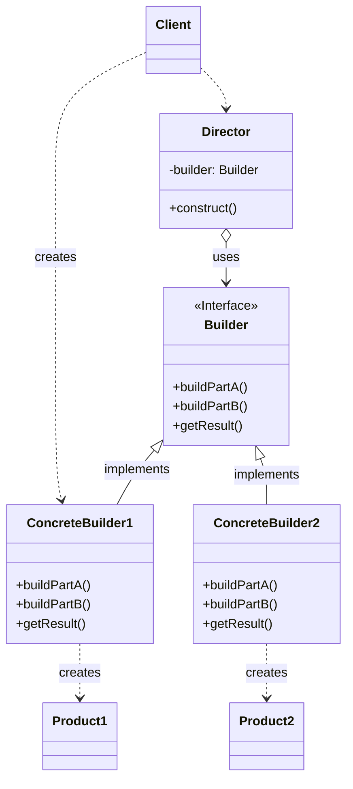

---
aliases:
  - 建造者
creation date: 2025-10-20
tags:
  - "#creational"
---

> [!abstract] 一句话核心
> Builder 模式允许你分步骤构建一个复杂对象，并使用相同的构建过程创建出该对象的不同表示（或配置）。

---

## 1. 意图 / 要解决的问题 (The "Why")

> [!question] 这个模式解决了什么痛点？
> 核心痛点是**如何优雅地创建和初始化一个复杂对象**，这个对象可能有很多配置选项和组成部分。直接创建这种对象通常会遇到两个问题：**子类爆炸** 或 **构造函数过于复杂**。

Builder 模式要解决的核心问题之一:**“伸缩构造函数”（Telescoping Constructor）**

想象一下，我们从一个简单的 `House` 类开始。

**第一步：只有必需的参数**

一开始，房子只有必需的组成部分：墙和窗户。构造函数很简单：

```java
public class House {
    private int walls;
    private int windows;

    // 构造函数 1: 基础版
    public House(int walls, int windows) {
        this.walls = walls;
        this.windows = windows;
    }
}
```

这看起来很清晰。`new House(4, 6);` 就能创建一个有4堵墙和6扇窗的房子。

**第二步：增加第一个可选参数**

现在，客户想要一个**可选的**游泳池 (`swimmingPool`)。为了不强迫所有房子都必须决定有没有游泳池，我们不能直接在上面的构造函数里加参数。通常的做法是**重载**（overload）构造函数：

```java
public class House {
    private int walls;
    private int windows;
    private boolean hasSwimmingPool; // 可选

    // 构造函数 1: 基础版
    public House(int walls, int windows) {
        this.walls = walls;
        this.windows = windows;
        this.hasSwimmingPool = false; // 默认为 false
    }

    // 构造函数 2: 带游泳池版
    public House(int walls, int windows, boolean hasSwimmingPool) {
        this(walls, windows); // 调用基础版构造函数
        this.hasSwimmingPool = hasSwimmingPool;
    }
}
```

现在我们有两种方式创建房子：`new House(4, 6);` (没泳池) 和 `new House(4, 6, true);` (有泳池)。

**第三步：增加更多可选参数（问题开始显现）**

接下来，客户又想要**可选的**车库 (`garage`) 和花园 (`garden`)。我们只能继续重载，构造函数的数量开始“伸缩”和膨胀：

```java
public class House {
    private int walls;
    private int windows;
    private boolean hasSwimmingPool; // 可选
    private boolean hasGarage;       // 可选
    private boolean hasGarden;       // 可选

    // ... 省略之前的构造函数 ...

    // 构造函数 3: 带泳池和车库版
    public House(int walls, int windows, boolean hasSwimmingPool, boolean hasGarage) {
        this(walls, windows, hasSwimmingPool);
        this.hasGarage = hasGarage;
    }

    // 构造函数 4: 带泳池、车库和花园版
    public House(int walls, int windows, boolean hasSwimmingPool, boolean hasGarage, boolean hasGarden) {
        this(walls, windows, hasSwimmingPool, hasGarage);
        this.hasGarden = hasGarden;
    }

    // ... 可能还有只带车库、只带花园、带车库和花园等各种组合...
}
```

**这里的痛点就非常明显了：**

1. **组合爆炸**：如果只有3个可选参数，就需要创建 `2*2*2 = 8` 种构造函数来覆盖所有组合，这非常繁琐。
2. **调用困难且易错**：假设你只想建一个**带车库但不带游泳池**的房子，你必须这样调用： `new House(4, 6, false, true);` 这里的 `false` 是一个毫无意义的“占位符”，只是为了满足参数列表的格式。如果你不小心把参数顺序搞错了，写成了 `new House(4, 6, true, false);`，编译器不会报错，但你房子的配置就完全错了（变成了有泳池没车库），这种错误很难被发现。
3. **可读性极差**：当别人读到 `new House(4, 6, false, true, true);` 这行代码时，完全无法直观地理解每个 `true` 或 `false` 到底代表什么，必须去查找构造函数的定义，维护性极差。

总结来说，“伸缩构造函数”这种方式，随着对象复杂度的增加，会迅速变得难以维护和使用。Builder 模式正是为了用一种更灵活、可读性更高的方式来解决这个问题。

> 在很多现代编程语言中，比如 **C++**, **C#**, **Python**, **PHP** 等，支持"参数默认值”（Default Parameters）。这个特性可以避免我们遇到“伸缩构造函数”的问题。但这并不意味着在Python这些语言中就不需要Builder模式了，下面是另一个Builder可以解决的痛点。

假设我们需要编写一个“报告生成器”。这个报告有固定的结构：一个标题、几个段落和一个项目列表。我们希望这个生成器既能生成**纯文本（Plain Text）格式**的报告，也能生成 **HTML 格式**的报告。

一个常见的“坏味道”代码是写一个巨大的函数或类，里面充满了 `if/else` 来处理不同的格式。

```python
# 糟糕的示例：一个函数耦合了所有格式的构建逻辑

def generate_report(format, title, paragraphs, items):
    """
    根据指定的格式生成报告。
    这个函数违反了开闭原则：每增加一种新格式，都必须修改它。
    """
    report = ""
    if format == 'text':
        report += "====================\n"
        report += f"|     {title}     |\n"
        report += "====================\n\n"
        for p in paragraphs:
            report += f"{p}\n\n"
        report += "--- Items ---\n"
        for i in items:
            report += f" - {i}\n"

    elif format == 'html':
        report += "<html>\n<head>\n"
        report += f"  <title>{title}</title>\n"
        report += "</head>\n<body>\n"
        report += f"  <h1>{title}</h1>\n"
        for p in paragraphs:
            report += f"  <p>{p}</p>\n"
        report += "  <ul>\n"
        for i in items:
            report += f"    <li>{i}</li>\n"
        report += "  </ul>\n</body>\n</html>"

    # 如果未来要增加 Markdown, PDF, XML... 这个 if/elif 链会无限膨胀！

    else:
        raise ValueError("Unsupported format")

    return report

# --- 客户端调用 ---
title = "Monthly Report"
paragraphs = ["This month was great.", "Sales are up by 20%."]
items = ["Item 1", "Item 2"]

# 生成两种格式的报告
text_report = generate_report('text', title, paragraphs, items)
html_report = generate_report('html', title, paragraphs, items)

# print(text_report)
# print(html_report)
```

**这段代码的痛点非常明显：**

1. **违反开闭原则**：这是最核心的问题。如果产品经理要求增加一种新的输出格式，比如 `Markdown`，你唯一的办法就是去修改 `generate_report` 函数，在那个巨大的 `if/elif` 结构中再加一个分支。这使得代码对扩展是关闭的，对修改却是开放的，非常脆弱。
2. **职责混淆**：`generate_report` 函数承担了太多的职责。它既定义了报告的**“内容和结构”**（先有标题，再有段落...），又包含了**“如何将每个部分格式化为特定样式”** 的所有细节。这违反了单一职责原则。
3. **难以维护**：随着支持的格式和报告内容的增加，这个函数会变得越来越庞大和复杂，代码的可读性和可维护性会急剧下降。

Builder 模式正是为了解决这种“构建过程”与“具体表示”之间的紧密耦合而设计的。它会把“构建步骤”（如 `add_title`, `add_paragraph`）抽象出来，然后让不同的“建造者”（如 `TextBuilder`, `HtmlBuilder`）去具体实现这些步骤。

---

## 2. 解决方案 / 核心思想 (The "What")

> [!tip] 它是如何解决上述问题的？
> Builder 模式建议将对象**构建代码**从产品类本身中分离出来，转移到一个个独立的、名为“生成器”（Builder）的对象中。

这个解决方案主要包含以下几个核心思想：

1. **将构建过程分解为“步骤”**
   - 模式不再要求一次性传入所有参数来创建对象，而是将构建过程组织成一系列独立的步骤（例如，`buildWalls`, `buildDoor` 或 `makeTitle`, `makeString`）。
   - 要创建一个对象，你只需要按需调用这些步骤。关键在于，你**不必调用所有的步骤**，只调用那些对于创建特定配置的对象所必需的步骤即可。

2. **为不同表示创建不同生成器（Builder）**
   - 当我们想创建产品的不同表示时（比如，纯文本文档 vs. HTML文档），我们可以创建多个不同的 Builder 类（`TextBuilder`, `HtmlBuilder`）。
   - 这些 Builder 类都遵循一个共同的接口，实现了相同的构建步骤，但**内部实现方式完全不同**。例如，`TextBuilder` 的 `makeTitle` 方法会添加 `=====` 分隔符，而 `HtmlBuilder` 的 `makeTitle` 方法则会生成 `<h1>` 标签。

3. **引入监工（Director）来指导构建（可选）**
   - 为了复用构建逻辑，我们可以将一系列对构建步骤的调用封装到一个名为“监工”（Director）的独立类中。
   - **Director 知道“构建”的顺序和配方**（比如，先调用 `makeTitle`，再调用 `makeString`），而 **Builder 知道“如何实现”每一步**。
   - 这样一来，客户端的代码就变得极其简单：只需将一个 Builder 对象交给 Director，然后命令 Director 开始构建，最后从 Builder 那里获取最终产品即可。客户端完全与复杂的构建过程解耦。

**这个方案如何解决我们之前的问题？**

- 对于 **“伸缩构造函数”** 问题（Java例子）：我们不再需要复杂的构造函数，而是通过 Builder 提供的一系列清晰的方法（如 `setWindows(6)`）来分步设置参数，可读性大大提高。
- 对于 **“不同表示”** 问题（Python例子）：我们不再需要巨大的 `if-else`。想增加 Markdown 格式？只需创建一个新的 `MarkdownBuilder` 类，Director 和现有代码完全无需改动。这完美遵循了**开闭原则**。

---

## 3. 结构与角色 (The "Structure")

> [!note] 模式的蓝图

### UML 类图



### 参与角色

Builder 模式主要由以下几个角色构成：

- **`Builder` (建造者 / 生成器接口)**
  - **职责**: 声明一个用于创建产品（Product）各个部分的通用接口。它定义了所有具体建造者都需要实现的“构建步骤”方法。
  - _在我们的示例中，对应 `Builder` 抽象类_。
- **`ConcreteBuilder` (具体建造者 / 生成器)**
  - **职责**: 实现 `Builder` 接口，提供构建步骤的具体实现。每个具体建造者都知道如何构建和组装产品的特定表示。它通常还提供一个获取最终构建结果的方法。
  - _在我们的示例中，对应 `TextBuilder` 和 `HTMLBuilder` 类_。
- **`Product` (产品)**
  - **职责**: 代表最终被构建出来的复杂对象。由不同建造者创建的产品可能属于不同的类或接口。
  - _在我们的示例中，`TextBuilder` 的产品是一个 `String`，而 `HTMLBuilder` 的产品是一个 HTML 文件_。
- **`Director` (监工)**
  - **职责**: 定义调用构建步骤的特定顺序，从而封装一个特定的构建流程。`Director` 与 `Builder` 接口协作，不与具体建造者耦合。
  - _在我们的示例中，对应 `Director` 类_。
- **`Client` (客户端)**
  - **职责**: 创建一个具体的 `ConcreteBuilder` 对象，然后将其与 `Director` 相关联。客户端触发 `Director` 的构建过程，并最终从 `Builder` 对象中获取产品。
  - _在我们的示例中，对应 `Main` 类_。

---

## 4. 代码示例 (The "How")

> [!example] Talk is cheap. Show me the code.

我们将沿用《图解设计模式》中编写不同格式文档的例子。

### Before: 重构前的代码

假设没有使用 Builder 模式，我们可能会写出这样一个巨大的类。这个类混合了文档的结构逻辑和所有格式的表示逻辑，充满了 `if-else` 判断。

```java
// "坏"代码：一个类负责所有事情，违反开闭原则
public class MonolithicDocumentGenerator {

    private String format;

    public MonolithicDocumentGenerator(String format) {
        this.format = format;
    }

    // 这个方法耦合了所有格式的实现细节
    // 如果要增加 "Markdown" 格式，就必须修改这个方法
    public String build() {
        StringBuilder sb = new StringBuilder();

        // --- 构建标题 ---
        if ("plain".equals(format)) {
            sb.append("====================\n");
            sb.append("|     Greeting     |\n");
            sb.append("====================\n\n");
        } else if ("html".equals(format)) {
            sb.append("<html><head><title>Greeting</title></head><body>\n");
            sb.append("<h1>Greeting</h1>\n");
        }

        // --- 构建段落 ---
        if ("plain".equals(format)) {
            sb.append("从早上至下午\n\n");
        } else if ("html".equals(format)) {
            sb.append("<p>从早上至下午</p>\n");
        }

        // ... 其他构建步骤 ...

        // --- 收尾 ---
        if ("html".equals(format)) {
            sb.append("</body></html>\n");
        }

        return sb.toString();
    }
}
```

### After: 应用模式后的代码

现在，我们应用 Builder 模式来重构它。代码结构清晰，职责分明，并且易于扩展。

```java
// 1. Builder: 建造者接口
// 定义了构建文档所需的各个步骤
public abstract class Builder {
    public abstract void makeTitle(String title);
    public abstract void makeString(String str);
    public abstract void makeItems(String[] items);
    public abstract void close();
}

// 2. Director: 监工
// 负责定义构建文档的流程，它不关心具体的格式
public class Director {
    private Builder builder;

    public Director(Builder builder) {
        this.builder = builder;
    }

    // construct 方法定义了文档的构建顺序
    public void construct() {
        builder.makeTitle("Greeting");
        builder.makeString("从早上至下午");
        builder.makeItems(new String[]{"早上好。", "下午好。"});
        builder.makeString("晚上");
        builder.makeItems(new String[]{"晚上好。", "晚安。", "再见。"});
        builder.close();
    }
}

// 3. ConcreteBuilder: 具体建造者 A (纯文本)
// 实现了构建步骤，用于生成纯文本文档
public class TextBuilder extends Builder {
    private StringBuffer buffer = new StringBuffer();

    @Override
    public void makeTitle(String title) {
        buffer.append("====================\n");
        buffer.append("|     " + title + "     |\n");
        buffer.append("====================\n\n");
    }

    @Override
    public void makeString(String str) {
        buffer.append("■ " + str + "\n\n");
    }

    @Override
    public void makeItems(String[] items) {
        for (String item : items) {
            buffer.append("  - " + item + "\n");
        }
        buffer.append("\n");
    }

    @Override
    public void close() {
        // 无特殊操作
    }

    // 获取最终结果
    public String getResult() {
        return buffer.toString();
    }
}

// 4. ConcreteBuilder: 具体建造者 B (HTML)
// 实现了构建步骤，用于生成 HTML 文档
import java.io.*;

public class HTMLBuilder extends Builder {
    private String filename;
    private PrintWriter writer;

    @Override
    public void makeTitle(String title) {
        filename = title + ".html";
        try {
            writer = new PrintWriter(new FileWriter(filename));
        } catch (IOException e) {
            e.printStackTrace();
        }
        writer.println("<html><head><title>" + title + "</title></head><body>");
        writer.println("<h1>" + title + "</h1>");
    }

    @Override
    public void makeString(String str) {
        writer.println("<p>" + str + "</p>");
    }

    @Override
    public void makeItems(String[] items) {
        writer.println("<ul>");
        for (String item : items) {
            writer.println("<li>" + item + "</li>");
        }
        writer.println("</ul>");
    }

    @Override
    public void close() {
        writer.println("</body></html>");
        writer.close();
    }

    // 获取最终结果
    public String getResult() {
        return filename;
    }
}


// 5. Client: 客户端
// 负责创建具体建造者，并指挥 Director 开始工作
public class Main {
    public static void main(String[] args) {
        // --- 使用 TextBuilder 构建纯文本文档 ---
        TextBuilder textBuilder = new TextBuilder();
        Director textDirector = new Director(textBuilder);
        textDirector.construct();
        String result = textBuilder.getResult();
        System.out.println("--- Plain Text Document ---");
        System.out.println(result);

        // --- 使用 HTMLBuilder 构建 HTML 文档 ---
        HTMLBuilder htmlBuilder = new HTMLBuilder();
        Director htmlDirector = new Director(htmlBuilder);
        htmlDirector.construct();
        String filename = htmlBuilder.getResult();
        System.out.println("\n--- HTML Document ---");
        System.out.println(filename + " 文件编写完成。");
    }
}
```

---

## 5. 优缺点 (Pros & Cons)

> [!todo] 权衡利弊

### 优点 (Pros)

- 优点一：**可以分步构建对象**：你可以一步步地创建对象，并且可以延迟某些步骤的执行，甚至递归地执行它们。这使得构建过程更加灵活可控。
- 优点二：**可以复用相同的构建代码**：当需要创建同一产品的不同表示时，你可以复用相同的构建流程（通常由 Director 控制）。例如，同一个 `construct()` 方法可以配合 `TextBuilder` 和 `HTMLBuilder` 生成两种完全不同的文档。
- 优点三：**符合单一职责原则 (Single Responsibility Principle)**：你可以将复杂的构建逻辑从产品本身或客户端代码中分离出来。产品只负责自己的业务功能，而 Builder 则专门负责如何构建它，使得代码职责更清晰。

### 缺点 (Cons)

- 缺点一：**增加了代码的整体复杂性**：为了实现这个模式，你需要引入多个新的接口和类（`Builder`, `ConcreteBuilder`, `Director` 等）。如果你的对象本身并不复杂，或者其构建过程很少变化，那么引入 Builder 模式可能会显得“过度设计”，让简单的代码变得更复杂。

---

## 6. 适用场景 (Applicability)

> [!check] 我应该在什么时候使用它？
>
> 列出一些明确的信号或场景，当你遇到这些情况时，就应该考虑使用此模式。
>
> - **你想摆脱“伸缩构造函数”时**：如果你的一个类的构造函数有大量的可选参数，导致你需要创建多个重载的构造函数，或者在调用时传递许多 `null` 或 `false` 作为占位符，那么 Builder 模式是完美的解决方案。它能让你通过一系列清晰的 `set` 方法来配置对象。
> - **当你希望代码能够创建同一产品的不同表示时**：如果构建一个产品的过程（步骤）是相似的，但产品的最终形态（具体实现）却有多种（例如，用相同的步骤构建出木头房子和石头房子），Builder 模式可以帮你把构建流程和具体实现分离开来。
> - **当你需要构建一个复杂的组合对象（如 Composite 树）时**：Builder 模式允许你分步骤构建产品。在构建完成前，它不会将不完整的产品暴露给客户端。这对于构建那些需要遵循特定顺序或内部结构复杂（如一个树状结构）的对象非常有用，可以确保客户端总能获得一个完整、有效的最终产品。

---

## 7. 现实世界中的应用 (Real-World Examples)

> [!bug] 这个模式在哪些知名项目中被使用过？
>
> - **JDK**: 例如 `java.lang.StringBuilder`和`java.lang.StringBuffer`。在 Java 中，`String` 对象是不可变的，每次拼接字符串都会创建一个新的 `String` 对象，效率很低。`StringBuilder` 就扮演了一个 `String` 对象的“建造者”角色。

---

## 8. 相关模式 (Related Patterns)

> [!link] 与其他模式的联系和区别
>
> - **[[另一个设计模式]]**: 与该模式的关系是...（例如，经常一起使用，或者结构相似但意图不同）。
> - **[[又一个设计模式]]**: 与该模式的区别在于...（帮助你辨析易混淆的模式）。

- **[[FactoryMethod]] (工厂方法模式)**
  - **关系**：许多设计初期可能会使用工厂方法，因为它相对简单。当对象的创建过程变得越来越复杂，需要多个步骤和配置时，工厂方法可能会演化为建造者模式。
  - **区别**：工厂方法通常一步到位直接返回一个产品实例，其主要目的是将对象的创建延迟到子类。而建造者模式则专注于分步骤构建一个复杂的对象，允许更精细的控制和配置。
- **[[AbstractFactory]] (抽象工厂模式)**
  - **关系**：抽象工厂模式和建造者模式都用于创建复杂的对象。
  - **区别**：它们的核心意图不同。
    - **抽象工厂** 专注于创建**一族相互关联的对象**（一个“产品家族”），并且会立即返回这些产品。
    - **建造者模式** 专注于**分步骤构建一个单一的复杂对象**，并且允许你在执行完所有构建步骤后，才获取最终的产品。
- **[[Singleton]] (单例模式)**
  - **关系**：具体的建造者（ConcreteBuilder）或抽象工厂（AbstractFactory）本身都可以被实现为单例模式。因为在很多应用场景中，我们只需要一个 `HTMLBuilder` 或一个 `ModernFurnitureFactory` 的实例就足够了。
- **[[Composite]] (组合模式)**: `TODO`
  - 建造者模式在构建复杂的、具有递归结构的对象树时非常有用，而组合模式正是用来表示这种树形结构的。由于我们还没有学习组合模式，此处暂不展开。
- **[[Bridge]] (桥接模式)**: `TODO`
  - 建造者模式可以和桥接模式结合使用，其中 Director 扮演“抽象”的角色，而不同的 Builder 则扮演“实现”的角色。由于我们还没有学习桥接模式，此处暂不展开。

## 9. 练习题

### 练习题 1

在我们的示例程序中，`Builder` 类（代码清单 7-1）是一个抽象类。请思考一下，如果我们将它修改为一个接口（`interface`），需要对哪些相关的类进行修改，以及如何修改？

这是原始的 `Builder` 抽象类代码

```java
// 原始的 Builder.java
public abstract class Builder {
    public abstract void makeTitle(String title);
    public abstract void makeString(String str);
    public abstract void makeItems(String[] items);
    public abstract void close();
}
```

请思考一下应该如何修改，可以只描述思路，也可以写出修改后的代码。

答案

**修改 `Builder.java` 文件**

- 将 `public abstract class Builder` 修改为 `public interface Builder`。
- 接口中的方法默认就是 `public abstract` 的，所以可以省略这些关键字。

```java
// 修改后的 Builder.java
public interface Builder {
    void makeTitle(String title);
    void makeString(String str);
    void makeItems(String[] items);
    void close();
}
```

### 练习题 2

在我们的示例程序中：

- `HTMLBuilder` 类有一个隐含的要求：必须先调用 `makeTitle` 方法来创建文件，然后才能调用 `makeString` 或 `makeItems` 向文件中写入内容。
- 而 `TextBuilder` 类则没有这个调用顺序的要求。

**问题**：请修改 `Builder`、`TextBuilder` 和 `HTMLBuilder` 类，来**强制确保** `makeTitle` 方法在 `makeString` 和 `makeItems` 方法之前**必须被调用，且只能被调用一次**。

```java
public abstract class Builder {
    public abstract void makeTitle(String title);
    public abstract void makeString(String str);
    public abstract void makeItems(String[] items);
    public abstract void close();
}
```

```java
public class TextBuilder extends Builder {
    private StringBuffer buffer = new StringBuffer();

    @Override
    public void makeTitle(String title) {
        buffer.append("====================\n");
        buffer.append("|     " + title + "     |\n");
        buffer.append("====================\n\n");
    }

    @Override
    public void makeString(String str) {
        buffer.append("■ " + str + "\n\n");
    }

    @Override
    public void makeItems(String[] items) {
        for (int i = 0; i < items.length; i++) {
            buffer.append("  - " + items[i] + "\n");
        }
        buffer.append("\n");
    }

    @Override
    public void close() {
        buffer.append("====================\n");
    }

    public String getResult() {
        return buffer.toString();
    }
}
```

```java
import java.io.*;

public class HTMLBuilder extends Builder {
    private String filename;
    private PrintWriter writer;

    @Override
    public void makeTitle(String title) {
        filename = title + ".html";
        try {
            writer = new PrintWriter(new FileWriter(filename));
        } catch (IOException e) {
            e.printStackTrace();
        }
        writer.println("<html><head><title>" + title + "</title></head><body>");
        writer.println("<h1>" + title + "</h1>");
    }

    @Override
    public void makeString(String str) {
        writer.println("<p>" + str + "</p>");
    }

    @Override
    public void makeItems(String[] items) {
        writer.println("<ul>");
        for (int i = 0; i < items.length; i++) {
            writer.println("<li>" + items[i] + "</li>");
        }
        writer.println("</ul>");
    }

    @Override
    public void close() {
        writer.println("</body></html>");
        writer.close();
    }

    public String getResult() {
        return filename;
    }
}
```

我的答案，我认为可以修改`HTMLBuilder`如下，因为题目提到`TextBuilder`不需要此逻辑

```java
import java.io.*;

public class HTMLBuilder extends Builder {
    private String filename;
    private PrintWriter writer;
    private boolean hasTitleBeenMade;

    @Override
    public void makeTitle(String title) {
	    if (hasTitleBeenMade) {
		    return;
	    }

        filename = title + ".html";
        try {
            writer = new PrintWriter(new FileWriter(filename));
        } catch (IOException e) {
            e.printStackTrace();
        }
        writer.println("<html><head><title>" + title + "</title></head><body>");
        writer.println("<h1>" + title + "</h1>");
        hasTitleBeenMade = true;
    }

    @Override
    public void makeString(String str) {
	    if (!hasTitleBeenMade) {
		    return;
	    }
        writer.println("<p>" + str + "</p>");
    }

    @Override
    public void makeItems(String[] items) {
	    if (!hasTitleBeenMade) {
		    return;
	    }
        writer.println("<ul>");
        for (int i = 0; i < items.length; i++) {
            writer.println("<li>" + items[i] + "</li>");
        }
        writer.println("</ul>");
    }

    @Override
    public void close() {
        writer.println("</body></html>");
        writer.close();
    }

    public String getResult() {
        return filename;
    }
}
```

但是答案认为：

1. 在 `Builder.java` 中，加入 `boolean` 状态字段。
2. 把原来 `Builder` 类中的 `makeTitle`, `makeString`, `makeItems` 这些 `abstract` 方法，**直接改成带有检查逻辑的普通方法**。
3. 在这些普通方法内部，检查完状态后，再去调用**新的、真正需要子类去实现的抽象方法**。

然后修改`Builder.java`:

```java
public abstract class Builder {
    private boolean initialized = false;

    // makeTitle 不再是 abstract
    public void makeTitle(String title) {
        if (!initialized) {
            buildTitle(title);
            initialized = true;
        }
    }

    // makeString 不再是 abstract
    public void makeString(String str) {
        if (initialized) { // 检查是否已初始化
            buildString(str);
        }
    }

    // makeItems 不再是 abstract
    public void makeItems(String[] items) {
        if (initialized) { // 检查是否已初始化
            buildItems(items);
        }
    }

    // close 不再是 abstract
    public void close() {
        if (initialized) { // 检查是否已初始化
            buildClose();
        }
    }

    // 新增的抽象方法，供子类去实现真正的构建逻辑
    protected abstract void buildTitle(String title);
    protected abstract void buildString(String str);
    protected abstract void buildItems(String[] items);
    protected abstract void buildClose();
}
```

子类不再实现 `make` 系列方法，而是实现新的 `build` 系列方法。

```java
public class TextBuilder extends Builder {
    private StringBuffer buffer = new StringBuffer();

    @Override
    protected void buildTitle(String title) {
        buffer.append("====================\n");
        buffer.append("|     " + title + "     |\n");
        buffer.append("====================\n\n");
    }

    @Override
    protected void buildString(String str) {
        buffer.append("■ " + str + "\n\n");
    }

    @Override
    protected void buildItems(String[] items) {
        for (String item : items) {
            buffer.append("  - " + item + "\n");
        }
        buffer.append("\n");
    }

    @Override
    protected void buildClose() {
        buffer.append("====================\n");
    }

    public String getResult() {
        return buffer.toString();
    }
}
```

(`HTMLBuilder` 的修改与 `TextBuilder` 类似，只需将 `make...` 方法重命名为 `build...` 即可。)

### 练习题 3

请为示例程序中的 `Builder` 类编写一个新的子类，让它扮演 `ConcreteBuilder` 的角色，实现可以编写纯文本文档、HTML 文件以外的**任意一种**文档的功能。

例如，您可以尝试编写一个 `MarkdownBuilder`，用于生成 Markdown 格式的文档（标题用 `#`，列表用 `*` 等）。您有什么思路吗？

答案：

```java
// MarkdownBuilder.java
public class MarkdownBuilder extends Builder {
    private StringBuilder buffer = new StringBuilder();

    @Override
    protected void buildTitle(String title) {
        buffer.append("# " + title + "\n\n"); // Markdown 一级标题
    }

    @Override
    protected void buildString(String str) {
        buffer.append(str + "\n\n"); // Markdown 段落
    }

    @Override
    protected void buildItems(String[] items) {
        for (String item : items) {
            buffer.append("* " + item + "\n"); // Markdown 无序列表
        }
        buffer.append("\n");
    }

    @Override
    protected void buildClose() {
        // Markdown 格式通常不需要特殊的结束标记
    }

    public String getResult() {
        return buffer.toString();
    }
}
```

### 练习题 4

在 `TextBuilder` 类中，用于拼接文档内容的 `buffer` 字段，其类型是 `StringBuffer` 而不是我们更常用的 `String`。

**问题**：请问**为什么这里要用 `StringBuffer`**？如果用 `String` 类型来拼接，会有什么问题？

深入解释一下**为什么**：

1. **`String` 对象的不可变性 (Immutability)**
   - 在 Java 中，`String` 类型的对象是**不可变的**。这意味着一旦一个 `String` 对象被创建，它的内容就永远无法被更改。
   - 当您执行像 `myString = myString + " more content";` 这样的操作时，Java 并不会在原来的 `myString` 对象上追加内容。相反，它会创建一个**全新的 `String` 对象**，这个新对象包含了旧字符串和新字符串拼接后的内容，然后 `myString` 引用会指向这个新对象。原来的那个旧对象就成了垃圾，等待被回收。

2. **在循环中拼接 `String` 的问题**
   - 在 `TextBuilder` 的 `makeItems` 方法中，我们需要在一个循环里反复拼接字符串。
   - 如果我们使用 `String`，那么每一次循环（即每添加一个 `item`），都会生成至少一个**新的、临时的 `String` 对象**。
   - 假设有100个 `item`，这个过程就会创建大约100个临时的、很快就会被丢弃的字符串对象。这会给Java的垃圾回收器（Garbage Collector）带来巨大的压力，造成不必要的内存分配和CPU资源消耗，从而严重影响性能。

3. **`StringBuffer` / `StringBuilder` 的优势**
   - 与 `String` 不同，`StringBuffer`（以及它的非线程安全版本 `StringBuilder`）是**可变的**。
   - 它们内部维护一个字符数组 `buffer`。当你调用 `append()` 方法时，它会直接在这个内部数组上修改内容，而**不会**为每次追加都创建一个新对象（只有在内部数组容量不足时才会进行扩容，但这个开销远小于每次都创建新对象）。
   - 因此，在需要频繁修改和拼接字符串的场景下（比如构建器模式中），使用 `StringBuffer` 或 `StringBuilder` 的性能要远远优于使用 `String`。
