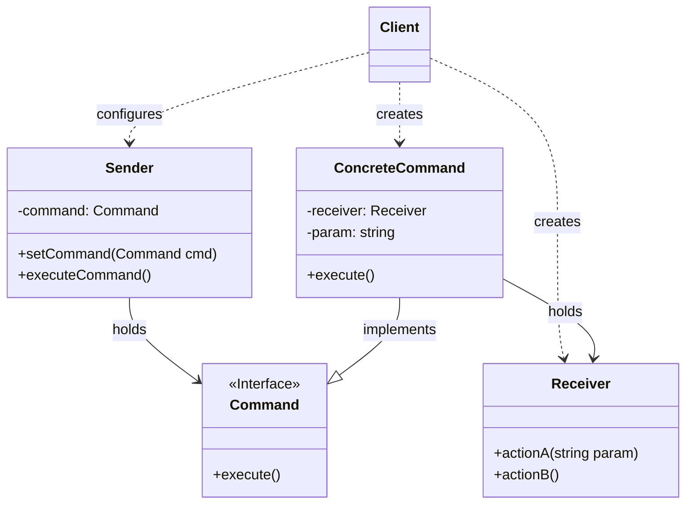

> [!abstract] 一句话核心
> 将一个请求封装为一个独立的对象（命令对象），该对象包含有关该请求的所有信息。这种转换允许你将请求作为方法参数传递、延迟或排队执行请求，并支持可撤销的操作。

---

## 1. 意图 / 要解决的问题 (The "Why")

> [!question] 这个模式解决了什么痛点？
>
> 核心痛点是：请求的发起者 (Invoker) 和请求的执行者 (Receiver) 紧密地耦合在了一起，导致代码难以维护、扩展和复用。

假设你正在开发一个新的**文本编辑器**应用。你的任务是创建一个工具栏，上面有各种操作按钮（比如复制、粘贴、剪切等）。

你创建了一个通用的 `Button` 基类。最简单的做法是为每个按钮创建大量的子类，在子类中实现具体的点击逻辑。

```java
// 糟糕的示例：GUI 类（按钮）直接耦合了业务逻辑

// 业务逻辑类
class Editor {
    public String getSelection() { /*...*/ return "text"; }
    public void copyToClipboard(String text) { /*...*/ }
    public void cutSelection() { /*...*/ }
}

// GUI 基类
class Button {
    public void onClick() {}
}

// 痛点1：为每个操作创建子类，导致类爆炸
class CopyButton extends Button {
    private Editor editor; // 按钮紧密依赖(耦合)了业务逻辑对象

    public CopyButton(Editor editor) {
        this.editor = editor;
    }

    // 按钮的点击事件直接调用业务逻辑
    @Override
    public void onClick() {
        String selectedText = editor.getSelection();
        editor.copyToClipboard(selectedText);
    }
}

class CutButton extends Button {
    private Editor editor;
    // ...
    @Override
    public void onClick() {
        editor.cutSelection();
    }
}
```

这种写法很快就会暴露出严重的问题：

1. **紧密耦合**：你的 GUI 类（如 `CopyButton`）现在和业务逻辑类（`Editor`）尴尬地强绑定在一起。如果你修改 `Editor` 类的方法，可能导致所有相关的按钮子类都要修改。
2. 代码重复：很快，产品经理要求添加上下文菜单（右键菜单）和键盘快捷键（如 Ctrl+C）。

   Ctrl+C 也需要执行“复制”操作。你怎么办？你不得不在处理快捷键的地方，或者在 CopyMenuItem（上下文菜单项）类里，重复 CopyButton 中的那段复制逻辑。

3. **难以扩展**：如果未来你想实现“撤销/重做”功能，或者想把一系列操作（请求）排队延迟执行，几乎是不可能的。因为“请求”本身（比如“请执行复制操作”）并不是一个独立的对象，它只是 `CopyButton` 类中的一个 `onClick` 方法调用。

Command 模式就是为了解决这种**请求与执行紧密耦合**的问题而生的。

---

## 2. 解决方案 / 核心思想 (The "What")

> [!tip] 它是如何解决上述问题的？
>
> 核心思想是：将请求本身变成一个对象。我们不再让 GUI 对象（如 Button）直接调用业务逻辑（如 Editor）的方法。

取而代之的是，我们按以下步骤操作：

1. **提取请求为对象**：我们将一个“请求”的所有细节（例如，要调用的业务对象是谁？要调用哪个方法？参数是什么？）提取到一个单独的 **命令（Command）类** 中。这个类通常只有一个方法，比如 `execute()`，用来触发这个请求。
2. **解耦发起者和执行者**：命令对象（Command）充当了 GUI 对象（发起者/Sender）和业务逻辑对象（接收者/Receiver）之间的链接。
   - `Button` 现在不需要知道 `Editor` 类的存在。它唯一的工作就是在被点击时，调用它所持有的那个 Command 对象的 `execute()` 方法。
   - `Editor` 根本不知道 `Button` 的存在，它只管执行自己的业务逻辑。

3. **定义统一接口**：为了让 `Button` 能够持有 _任意_ 的命令，我们为所有的命令定义一个统一的 **Command 接口**（比如包含一个 `execute()` 方法）。
   - 我们会创建 `CopyCommand`、`CutCommand`、`PasteCommand` 等具体的类，它们都实现这个 Command 接口。

4. **配置发起者**：`Button` 类内部不再有 `Editor` 字段，而是只有一个 `Command` 接口类型的字段。当 `Button` 被点击时，它就调用这个 `command.execute()`。

### 回到我们的文本编辑器例子：

应用这个模式后，`Button` 类不再需要那么多子类了。

```java
// 1. 业务逻辑 (Receiver) - 保持不变
class Editor {
    public void copy() { System.out.println("Editor: Copying..."); }
    public void cut() { System.out.println("Editor: Cutting..."); }
}

// 2. 命令接口 (Command Interface)
interface Command {
    void execute();
}

// 3. 具体命令 (Concrete Command)
class CopyCommand implements Command {
    private Editor editor; // 命令对象持有对业务逻辑的引用

    public CopyCommand(Editor editor) {
        this.editor = editor;
    }

    @Override
    public void execute() {
        editor.copy(); // 封装了如何执行"复制"的逻辑
    }
}

class CutCommand implements Command {
    private Editor editor;
    public CutCommand(Editor editor) { this.editor = editor; }
    @Override
    public void execute() {
        editor.cut();
    }
}

// 4. 发起者 (Sender/Invoker)
class Button {
    private Command command; // 只依赖于抽象接口

    // 客户端在运行时配置按钮的行为
    public void setCommand(Command command) {
        this.command = command;
    }

    // 按钮被点击时，只管执行命令，不关心具体逻辑
    public void onClick() {
        command.execute();
    }
}

// 5. 客户端 (Client)
class Application {
    public static void main(String[] args) {
        Editor editor = new Editor();

        // 创建命令对象，将执行者(editor)注入
        Command copyCmd = new CopyCommand(editor);

        // 创建发起者(button)并配置它
        Button copyButton = new Button();
        copyButton.setCommand(copyCmd);

        // 模拟点击
        copyButton.onClick(); // 输出: "Editor: Copying..."

        // --- 解决代码重复问题 ---
        // 快捷键Ctrl+C和菜单项也可以复用同一个命令对象
        // ShortcutManager.register("Ctrl+C", copyCmd);
        // MenuItem copyMenuItem = new MenuItem("Copy");
        // copyMenuItem.setCommand(copyCmd);
    }
}
```

通过这种方式，`Button` 和 `Editor` 彻底解耦了。当我们需要添加“粘贴”功能时，只需要创建 `PasteCommand`，然后将其设置给 `PasteButton` 即可，`Button` 类和 `Editor` 类都不需要修改。

---

## 3. 结构与角色 (The "Structure")

> [!note] 模式的蓝图

### UML 类图



### 参与角色

- **`Sender` (发送者 / Invoker)**
  - **职责**: 负责发起请求。在我们的例子中，`Button`、菜单项或快捷键管理器就是 Sender。
  - 它持有一个命令对象的引用（只依赖 Command 接口）。
  - 它不负责创建命令对象，通常是通过构造函数或 `setCommand` 方法从 Client 处接收一个配置好的命令。
  - 当某个事件（如 `onClick`）发生时，它会触发该命令的执行（`command.execute()`）。
- **`Command` (命令接口)**
  - **职责**: 定义所有具体命令类必须实现的统一接口。
  - 通常只声明一个方法，如 `execute()`。
- **`ConcreteCommand` (具体命令)**
  - **职责**: 实现 `Command` 接口，执行具体的请求。在我们的例子中，`CopyCommand` 和 `CutCommand` 就是具体命令。
  - 它通常会持有一个或多个 `Receiver`（接收者）对象的引用。
  - 当 `execute()` 被调用时，它会将请求传递给绑定的 `Receiver` 来完成实际工作。
  - 执行请求所需的所有参数（例如要粘贴的文本）都可以作为字段存储在命令对象中。
- **`Receiver` (接收者)**
  - **职责**: 包含实际的业务逻辑。在我们的例子中，`Editor` 类就是 Receiver。
  - 它知道如何执行与请求相关的具体操作。几乎任何类都可以作为接收者。
- **`Client` (客户端)**
  - **职责**: 负责创建和配置所有对象。在我们的例子中，`Application` 类就是 Client。
  - 它负责创建 `Receiver`（如 `Editor`）。
  - 它负责创建 `ConcreteCommand`（如 `CopyCommand`），并将 `Receiver` 作为参数传入其构造函数。
  - 它负责创建 `Sender`（如 `Button`），并将配置好的命令对象关联给它。

---

## 4. 代码示例 (The "How")

> [!example] Talk is cheap. Show me the code.

### Before: 重构前的代码

这是我们之前讨论过的“糟糕”场景。GUI 类（`CopyButton`）直接了解并调用业务逻辑类（`Editor`），导致了紧密耦合和代码重复。

```java
// 业务逻辑类
class Editor {
    public String getSelection() { /*...*/ return "text"; }
    public void copyToClipboard(String text) { /*...*/ }
}

// GUI 基类
class Button {
    public void onClick() {}
}

// 痛点：GUI 子类直接耦合业务逻辑
class CopyButton extends Button {
    private Editor editor;

    public CopyButton(Editor editor) {
        this.editor = editor;
    }

    @Override
    public void onClick() {
        // 请求的发起者(Button)和执行者(Editor)紧密耦合
        String selectedText = editor.getSelection();
        editor.copyToClipboard(selectedText);
    }
}
```

### After: 应用模式后的代码

现在，我们应用 Command 模式重构它。这个例子还引入了命令历史记录（`CommandHistory`）和撤销（`undo`）功能。

```java
// --- 角色: Receiver (接收者) ---
// 它包含实际的业务逻辑
class Editor {
    public String text = "";

    public String getSelection() { /* ... */ return "selected text"; }
    public void deleteSelection() { /* ... */ }
    public void replaceSelection(String clipboard) { this.text += clipboard; }
}

// --- 角色: Command (命令接口) ---
// 定义了所有命令的统一接口
abstract class Command {
    protected Editor editor;
    private String backup; // 用于撤销的状态备份

    Command(Editor editor) {
        this.editor = editor;
    }

    // 在执行前保存状态，用于撤销
    protected void saveBackup() {
        backup = editor.text;
    }

    // 恢复到之前的状态
    public void undo() {
        editor.text = backup;
    }

    // 抽象的执行方法
    public abstract boolean execute();
}

// --- 角色: ConcreteCommand (具体命令) ---
// 实现了各种具体的请求
class CutCommand extends Command {
    public CutCommand(Editor editor) { super(editor); }

    @Override
    public boolean execute() {
        saveBackup(); // 保存状态
        String selection = editor.getSelection();
        // app.clipboard = selection; // (假设 app 是 Client)
        editor.deleteSelection();
        return true; // 返回 true 表示这个命令改变了状态，应存入历史
    }
}

class PasteCommand extends Command {
    public PasteCommand(Editor editor) { super(editor); }

    @Override
    public boolean execute() {
        saveBackup();
        // editor.replaceSelection(app.clipboard); // (假设 app 是 Client)
        editor.replaceSelection("pasted text");
        return true;
    }
}

// 另一个命令：撤销命令
class UndoCommand extends Command {
    private CommandHistory history;
    public UndoCommand(Editor editor, CommandHistory history) {
        super(editor);
        this.history = history;
    }

    @Override
    public boolean execute() {
        Command lastCommand = history.pop();
        if (lastCommand != null) {
            lastCommand.undo(); // 调用上一个命令的 undo 方法
        }
        return false; // 撤销命令本身不应被存入历史
    }
}

// --- 角色: Sender (发送者 / Invoker) ---
// 负责发起请求
class Button {
    private Command command;
    public void setCommand(Command command) { this.command = command; }

    // 按钮被点击时，只管执行命令
    public void onClick() {
        // Button 不知道 command 是 Cut 还是 Paste，
        // 也不需要知道 Editor 的存在。
        if (command != null) {
            command.execute();
        }
    }
}

// --- 辅助类：命令历史记录 ---
//
class CommandHistory {
    private java.util.Stack<Command> history = new java.util.Stack<>();
    public void push(Command c) { history.push(c); }
    public Command pop() { return history.pop(); }
}


// --- 角色: Client (客户端) ---
// 负责创建和组装所有对象
class Application {
    public static void main(String[] args) {
        Editor editor = new Editor();
        CommandHistory history = new CommandHistory();

        // 创建命令
        Command cut = new CutCommand(editor);
        Command paste = new PasteCommand(editor);
        Command undo = new UndoCommand(editor, history);

        // 创建并配置发送者 (按钮)
        Button cutButton = new Button();
        cutButton.setCommand(cut);

        Button pasteButton = new Button();
        pasteButton.setCommand(paste);

        Button undoButton = new Button();
        undoButton.setCommand(undo);

        // 模拟用户操作
        System.out.println("Editor text: " + editor.text);

        // 1. 执行粘贴
        pasteButton.onClick();
        history.push(paste); // 假设 executeCommand 逻辑会把命令推入历史
        System.out.println("Editor text after paste: " + editor.text);

        // 2. 执行撤销
        undoButton.onClick();
        System.out.println("Editor text after undo: " + editor.text);
    }
}
```

这个例子展示了命令模式如何将操作（`Cut`, `Paste`）封装为对象，使得 `Button`（Sender）可以完全与 `Editor`（Receiver）解耦。更重要的是，它展示了如何通过命令历史和 `undo()` 方法轻松实现撤销功能。

---

## 5. 优缺点 (Pros & Cons)

> [!todo] 权衡利弊

### 优点 (Pros)

- **符合单一职责原则 (Single Responsibility Principle)**：你可以将调用操作的类（Sender）与执行这些操作的类（Receiver）解耦。
- **符合开闭原则 (Open/Closed Principle)**：你可以很容易地在应用程序中引入新的命令，而无需修改现有的客户端代码。
- **可以实现撤销/重做 (Undo/Redo)**：命令对象可以存储恢复操作所需的状态，从而实现撤销功能。
- **可以实现延迟执行 (Deferred Execution)**：命令对象可以在创建后不立即执行，而是等待合适的时机再执行，例如排队或定时执行。
- **可以将简单的命令组合成复杂的命令**：你可以将一系列简单的命令对象组合起来，形成一个宏命令（Macro Command），一次性执行多个操作。

### 缺点 (Cons)

- **代码可能变得更复杂**：因为在发送者（Sender）和接收者（Receiver）之间引入了一个全新的抽象层（Command），这可能会增加代码的整体复杂度。你需要创建更多的类来实现这个模式。

---

## 6. 适用场景 (Applicability)

> [!check] 我应该在什么时候使用它？
>
> 根据 refactoring.guru 的资料，当你遇到以下情况时，可以考虑使用 Command 模式：
>
> - **当你想用操作来参数化对象时**：Command 模式可以将一个具体的方法调用转换成一个独立的对象。这使得你可以将命令作为方法参数传递，将它们存储在其他对象中，或者在运行时切换命令，等等。例如，在开发 GUI 组件（如上下文菜单）时，你希望用户可以配置菜单项，使得点击菜单项时能触发不同的操作。
> - **当你想对操作进行排队、安排执行时间，或者在远程执行它们时**：命令对象可以被序列化（转换成字符串），从而可以方便地写入文件或数据库，或者通过网络发送。这样，你就可以延迟、安排、排队、记录命令的执行，甚至在不同的机器上执行它们。
> - **当你想实现可逆操作（撤销/重做）时**：Command 模式是实现撤销/重做功能最流行的方式之一。你可以维护一个已执行命令的历史记录（通常是一个栈），每个命令对象都包含了撤销其自身操作所需的信息（例如，操作前的状态备份，或者执行反向操作的方法）。

---

## 7. 现实世界中的应用 (Real-World Examples)

> [!bug] 这个模式在哪些知名项目中被使用过？

- **GUI 应用程序**：几乎所有的 GUI 框架（如 Java Swing/AWT, JavaFX, .NET WinForms/WPF, Qt 等）都广泛使用 Command 模式来处理用户操作（按钮点击、菜单选择、快捷键）与后台逻辑的分离。这使得实现诸如撤销/重做、宏录制等功能变得更加容易。
- **任务队列/工作流系统**：将需要执行的任务（如发送邮件、处理订单、生成报告）封装成 Command 对象，然后放入队列中，由后台工作线程按顺序执行。
- **事务处理**：将数据库操作（如插入、更新、删除）封装成 Command 对象，可以方便地将多个操作组合成一个事务，并支持回滚（通过 `undo` 方法）。
- **向导 (Wizards)**：多步骤的操作界面（向导）可以使用 Command 模式来表示每一步的操作，方便前进、后退（撤销）和最终的提交。

总的来说，只要你需要将“请求”本身作为一个对象来处理，以便于传递、排队、记录、撤销等，Command 模式就是一个非常有用的工具。

---

## 8. 相关模式 (Related Patterns)

> [!link] 与其他模式的联系和区别

根据 refactoring.guru 的资料，Command 模式与其他几个模式有以下关联：

- **[[Chain of Responsibility]]**: `TODO` (暂未学习 Chain of Responsibility 模式)
  - 责任链、命令、中介者和观察者模式都解决了连接请求发送者和接收者的不同方式。
  - 责任链中的处理器（Handlers）可以用命令模式来实现。
- **[[Mediator]]**: `TODO` (暂未学习 Mediator 模式)
  - 中介者模式消除了发送者和接收者之间的直接连接，强制它们通过中介对象间接通信。
- **[[Observer]]**: `TODO` (暂未学习 Observer 模式)
  - 观察者模式允许接收者动态地订阅和取消订阅请求。
- **[[Memento]]**: `TODO` (暂未学习 Memento 模式)
  - 在实现“撤销”功能时，命令模式和备忘录模式可以一起使用。命令负责执行操作，而备忘录则在命令执行前保存目标对象的状态。
- **[[Strategy]]**:
  - **区别**：命令模式和策略模式看起来可能相似，因为都可以用来参数化一个对象并赋予其某种行为。但它们的**意图**非常不同。
    - **Command**：用于将**任何操作**封装成一个对象。操作的参数成为该对象的字段。这使得你可以延迟执行、排队、记录历史、发送到远程服务等。
    - **Strategy**：通常描述了**做同一件事的不同方式**（不同的算法），允许你在同一个上下文类中切换这些算法。
- **[[Prototype]]**: `TODO` (暂未学习 Prototype 模式)
  - 当你需要将命令对象的副本保存到历史记录中时，原型模式可以提供帮助。
- **[[Visitor]]**: `TODO` (暂未学习 Visitor 模式)
  - 访问者模式可以被看作是命令模式的一个更强大的版本。它的对象可以对不同类的各种对象执行操作。

## 9. 练习题

### 练习题 22-1

`Command` 模式中的登场角色有 `Command`、`ConcreteCommand`、`Receiver`、`Invoker` 和 `Client`。请用一句话分别说明它们的作用。

- ✅ **Command**: 正确，它定义了所有具体命令必须遵循的统一接口。
- ✅ **ConcreteCommand**: 正确，它实现了命令接口，并持有接收者（Receiver）的引用，在 `execute` 方法中调用接收者的方法来完成具体工作。
- ✅ **Receiver**: 正确，它包含了执行请求所需的实际业务逻辑。
- ✅ **Invoker (Sender)**: 正确，它负责触发命令的执行，持有一个命令对象（只依赖接口），并且不需要知道命令的具体实现细节。
- ✅ **Client**: 正确，它负责创建接收者、具体命令，并将它们组装起来，最后将命令设置给调用者。

### 习题 22-2

在示例程序（指《图解设计模式》中的示例）中，命令的历史记录是保存在 `MacroCommand` 类（扮演 `ConcreteCommand` 角色）中的。请问将命令的历史记录保存在 `Invoker` 角色中是否更好？请说明理由。

_提示：_ 考虑一下 `Invoker` 和 `Command` 的职责以及它们之间的关系。思考一下如果历史记录放在 `Invoker` 中，会对系统的灵活性或扩展性产生什么影响？
