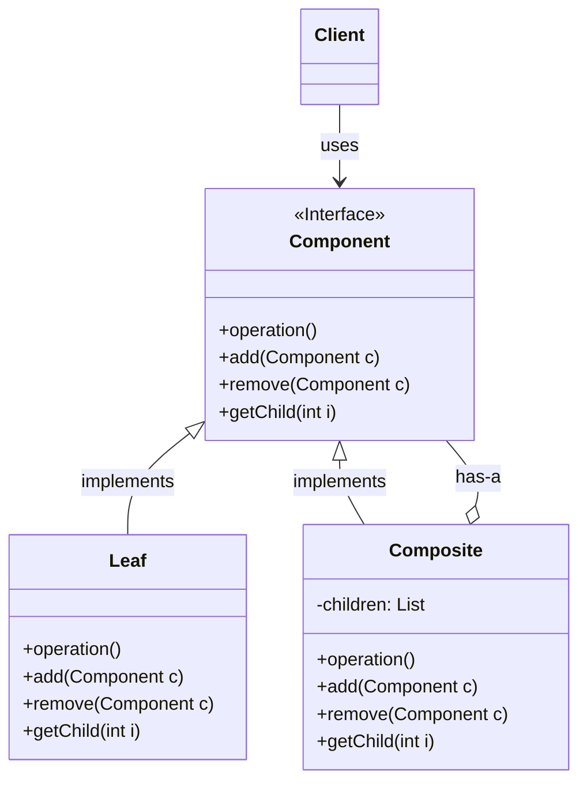

> [!abstract] 一句话核心
>
> Composite 是一种结构型设计模式，它允许你将对象组合成树形结构，然后能像对待单个对象一样，同等（统一）地对待这个组合结构。

---

## 1. 意图 / 要解决的问题 (The "Why")

> [!question] 这个模式解决了什么痛点？
>
> 痛点在于：客户端代码被迫需要区分“简单对象”和“复杂对象”，导致其逻辑变得复杂且难以维护。

只有当你的应用核心模型能表示为一棵树（或层次结构）时，使用组合模式才有意义。

我们来看一个未使用该模式前的“糟糕”场景：

假设你正在开发一个订单系统，系统中有两种对象：

1. **`Product`** (商品)：这是一个“简单”对象，它有自己的价格。
2. **`Box`** (盒子)：这是一个“复杂”对象，它可以包含多个`Product`，甚至可以包含其他更小的`Box`。

现在，客户下了一个订单，这个订单里可能有几个单独的`Product`，还可能有几个`Box`（盒子里又套着盒子和商品）。整个订单结构实际上就是一棵树。

**痛点来了：** 你需要计算这个订单的总价。

如果用最直接（糟糕）的方式，你的代码可能长这样：

```java
// “坏味道”：客户端代码需要知道所有类的细节
public class Order {
    private ArrayList<Product> products;
    private ArrayList<Box> boxes;

    public double getTotalPrice() {
        double total = 0;

        // 1. 遍历所有简单商品
        for (Product p : products) {
            total += p.getPrice();
        }

        // 2. 遍历所有盒子
        for (Box b : boxes) {
            // 客户端必须知道如何“拆开”盒子
            // 并且这个逻辑是递归的，非常丑陋
            total += b.calculatePriceRecursive(); // 假设盒子有这样一个方法
        }

        return total;
    }
}

// Box 类可能长这样
public class Box {
    private ArrayList<Product> innerProducts;
    private ArrayList<Box> innerBoxes;

    public double calculatePriceRecursive() {
        double total = 0;
        // 遍历内部商品...
        for (Product p : innerProducts) {
            total += p.getPrice();
        }
        // 遍历内部盒子，再次递归...
        for (Box b : innerBoxes) {
            total += b.calculatePriceRecursive(); // 递归调用
        }
        return total;
    }
}
```

这种写法的“坏味道”在于：

- **客户端（`Order`类）逻辑复杂：** 它被迫要区分`Product`和`Box`，并用两种不同的方式来处理它们。
- **紧密耦合：** `Order`类严重依赖于`Product`和`Box`的具体实现。如果未来我们想添加一种新的包装类型，比如`Bag`（袋子），我们就必须回来修改`Order`类的代码。
- **难以遍历：** 你必须事先了解所有`Product`和`Box`的类、盒子的嵌套级别以及其他讨厌的细节，这使得直接遍历计算总价的方法要么非常笨拙，要么根本不可能实现。

---

## 2. 解决方案 / 核心思想 (The "What")

> [!tip] 它是如何解决上述问题的？
>
> 核心思想是：定义一个统一的接口，让“简单对象”和“复杂对象”都实现这个接口。 这样，客户端就可以无差别地（统一地）对待它们。

组合模式建议你通过一个**公共接口**来使用 `Product` 和 `Box`，这个接口声明了一个用于计算总价的方法（比如叫 `getPrice()`）。

这个 `getPrice()` 方法是如何工作的呢？

1. **对于 `Product`（商品）对象：** 当你调用它的 `getPrice()` 方法时，它非常简单，只返回这个商品自身的价格。
2. **对于 `Box`（盒子）对象：** 当你调用它的 `getPrice()` 方法时，它会遍历它内部包含的**所有**项目（无论是 `Product` 还是更小的 `Box`），挨个去调用这些项目自己的 `getPrice()` 方法，最后将所有结果加起来，返回这个盒子的总价。

这种方式最大的好处是：

客户端代码（比如 Order 类）不再需要关心它所处理的对象到底是“简单商品”还是“复杂盒子”。

客户端只管通过那个**公共接口**来操作，它只需要调用 `item.getPrice()`。

- 如果 `item` 是一个 `Product`，它会自己返回价格。
- 如果 `item` 是一个 `Box`，它会**自动地**递归遍历其所有内部组件，计算出总价再返回。

这样，客户端的逻辑就变得极其简单，它摆脱了对复杂树形结构进行遍历的责任。

---

## 3. 结构与角色 (The "Structure")

> [!note] 模式的蓝图

### UML 类图



> _(注意：`add`/`remove` 等管理子节点的方法定义在 `Component` 接口中还是 `Composite` 类中，是这个模式的一个常见变种。将其定义在 `Component` 中可以给客户端带来更高的透明性，但 `Leaf` 节点必须提供一个空实现。) _

### 参与角色

- **`组件 (Component)`**
  - **职责**: 这是一个接口，它描述了树中**简单元素（Leaf）**和**复杂元素（Container/Composite）**所共有的操作。
- **`叶子 (Leaf)`**
  - **职责**: 是树的**基本元素**，它**没有子元素**。通常，叶子节点最终会完成大部分的实际工作，因为它没有地方可以再委托下去了。
- **`容器 (Container / Composite)`**
  - **职责**: 是一个**拥有子元素**的元素，子元素可以是叶子节点或其他容器节点。
  - 容器并不知道其子代的具体类别，它只通过 `Component` 接口与所有子元素进行交互。
  - 当收到一个请求时，容器会将工作**委托**给它的子元素，处理完中间结果，然后将最终结果返回给客户端。
- **`客户端 (Client)`**
  - **职责**: 客户端通过 `Component` 接口与树中的所有元素（无论是简单的叶子还是复杂的容器）进行交互。这使得客户端能以相同的方式处理简单和复杂的元素。

---

## 4. 代码示例 (The "How")

> [!example] Talk is cheap. Show me the code.

我们看一个图形编辑器的例子。我们有 `Dot`（点）和 `Circle`（圆）作为“叶子”对象，还有 `CompoundGraphic`（复合图形）作为“容器”对象，它可以包含其他图形。

### Before: 重构前的代码

在“糟糕”的设计中，`ImageEditor` (客户端) 必须区分它是在处理一个简单图形还是一个复合图形。

```java
// "坏味道"：客户端必须知道所有具体的类
public class ImageEditor {

    // 客户端被迫维护不同类型的对象列表
    private List<Dot> dots;
    private List<Circle> circles;
    private List<CompoundGraphic> compounds; // 复合图形

    // 绘制所有图形的方法变得非常复杂
    public void drawAll() {

        // 必须为每种类型单独循环
        for (Dot d : dots) {
            d.draw(); // 假设 Dot 有 draw()
        }
        for (Circle c : circles) {
            c.draw(); // 假设 Circle 有 draw()
        }
        for (CompoundGraphic cg : compounds) {
            // 客户端甚至可能需要知道如何递归地绘制复合图形
            cg.drawRecursive(); // 假设 CompoundGraphic 有一个不同的方法
        }
    }

    // 问题：如果明天我们添加一个新的 Shape 叫 'Triangle' (三角形)
    // 我们就必须回来修改 ImageEditor 类，添加一个新的 List<Triangle>
    // 并且还要修改 drawAll() 方法来遍历这个新列表。
    // 这违反了开闭原则。
}
```

### After: 应用模式后的代码

应用组合模式后，我们引入一个统一的 `Graphic` 接口。以下代码是根据你提供的伪代码 整理的 Java 示例：

```java
// 1. 角色: Component (组件接口)
// 声明了简单和复杂对象的共同操作
interface Graphic {
    void move(int x, int y);
    void draw();
}

// 2. 角色: Leaf (叶子)
// 代表组合的终结对象
class Dot implements Graphic {
    protected int x, y;
    public Dot(int x, int y) { this.x = x; this.y = y; }

    @Override
    public void move(int x, int y) {
        this.x += x; this.y += y;
        System.out.println("Moved Dot to: " + this.x + ", " + this.y);
    }
    @Override
    public void draw() {
        System.out.println("Drawing a Dot at: " + x + ", " + y);
    }
}

// 另一个 Leaf (叶子)
class Circle extends Dot { // 假设 Circle 扩展了 Dot 的功能
    private int radius;
    public Circle(int x, int y, int radius) {
        super(x, y);
        this.radius = radius;
    }
    @Override
    public void draw() {
        System.out.println("Drawing a Circle at: " + x + ", " + y + " with radius " + radius);
    }
}

// 3. 角色: Composite (容器)
// 代表可能包含子元素的复杂组件
class CompoundGraphic implements Graphic {
    // 容器不知道子代的具体类别，只通过组件接口工作
    private List<Graphic> children = new ArrayList<>();

    // 容器可以添加或删除其他组件
    public void add(Graphic child) {
        children.add(child);
    }
    public void remove(Graphic child) {
        children.remove(child);
    }

    @Override
    public void move(int x, int y) {
        // 容器将请求委托给它的子元素
        for (Graphic child : children) {
            child.move(x, y);
        }
    }

    @Override
    public void draw() {
        // 容器递归地遍历其所有子项
        System.out.println("--- Drawing Compound Graphic ---");
        for (Graphic child : children) {
            child.draw();
        }
        System.out.println("--- End Compound Graphic ---");
    }
}

// 4. 角色: Client (客户端)
// 客户端通过基础接口与所有组件一起工作
public class ImageEditor {
    // 客户端现在只需要一个列表，统一处理所有 Graphic 对象
    private CompoundGraphic all = new CompoundGraphic();

    public void load() {
        all.add(new Dot(1, 2));
        all.add(new Circle(5, 3, 10));

        // 创建一个复合图形
        CompoundGraphic group = new CompoundGraphic();
        group.add(new Dot(10, 20));
        group.add(new Circle(50, 30, 10));

        // 把复合图形也添加到 'all' 中
        all.add(group);
    }

    // 客户端代码现在变得非常简单和统一
    public void drawAll() {
        // 客户端不需要知道 'all' 内部的复杂结构
        all.draw();
    }
}
```

---

## 5. 优缺点 (Pros & Cons)

> [!todo] 权衡利弊

### 优点 (Pros)

- 你可以更方便地使用复杂的树形结构：可以利用多态和递归来发挥优势。
- **符合开闭原则 (Open/Closed Principle)**：你可以在不破坏现有客户端代码（现在使用对象树的代码）的情况下，向应用中引入**新的元素类型**（新的 `Leaf` 或 `Composite` 子类）。

### 缺点 (Cons)

- **共同接口难以定义**：对于功能差异过大的类，提供一个共同的接口可能会很困难。在某些情况下，你可能需要过度泛化（overgeneralize）组件接口，这会使其难以理解。

---

## 6. 适用场景 (Applicability)

> [!check] 我应该在什么时候使用它？
>
> 当你遇到以下情况时，就应该考虑使用此模式：
>
> - 当你需要实现一个**树状的对象结构**时。组合模式为你提供了共享一个公共接口的两种基本元素类型：简单的叶子节点和复杂的容器节点。容器可以由叶子节点和其他容器组成，这使你能够构建一个类似于树的嵌套递归对象结构。
> - 当你希望**客户端代码能统一处理**简单对象和复杂对象（容器）时。因为组合模式定义的所有元素都共享一个公共接口，客户端无需担心它正在使用的是哪种具体类。

---

## 7. 现实世界中的应用 (Real-World Examples)

> [!bug] 这个模式在哪些知名项目中被使用过？
>
> - TODO

---

## 8. 相关模式 (Related Patterns)

> [!link] 与其他模式的联系和区别

- **[[Builder]]**: `TODO` (你尚未添加 Builder 模式的笔记，暂不展开)。
- **[[Chain of Responsibility]]**: `TODO` (你尚未添加 Chain of Responsibility 模式的笔记，暂不展开)。
- **[[Iterator]]**: `TODO` (你尚未添加 Iterator 模式的笔记，暂不展开)。
- **[[Visitor]]**: `TODO` (你尚未添加 Visitor 模式的笔记，暂不展开)。
- **[[Flyweight]]**: `TODO` (你尚未添加 Flyweight 模式的笔记，暂不展开)。
- **[[Decorator]]**: `TODO` (你尚未添加 Decorator 模式的笔记，暂不展开)。
- **[[Prototype]]**: `TODO` (你尚未添加 Prototype 模式的笔记，暂不展开)。
- **[[FactoryMethod]]**:
  - **关系**：在 **Factory Method (工厂方法)** 模式中，`Product` (产品) 角色（或 `ConcreteProduct` 具体产品角色）有时会使用 **Composite** 模式来构建。
  - **展开**：想象一下，你的工厂方法 `createProduct()` 的职责是创建一个“产品”。这个“产品”本身可能是一个复杂的、具有层次结构的对象（比如一个 `UI-Window`），这个窗口（Composite）内部又包含了按钮（Leaf）和面板（Composite）。在这种情况下，工厂方法创建和返回的那个顶层对象，就是组合模式中的根节点。
- **[[AbstractFactory]]**:
  - **关系**：在 **Abstract Factory (抽象工厂)** 模式中，当工厂在“制作产品”时，有时会使用 **Composite** 模式。
  - **展开**：以你学过的抽象工厂（`FurnitureFactory`）为例。假设 `createSofa()` 方法创建的 `Sofa`（沙发）产品本身就是一个复杂的组合：它由一个 `Frame`（框架，Composite）和多个 `Cushion`（垫子，Leaf）组成。在这种情况下，抽象工厂创建的具体产品（`ModernSofa`）的内部结构就可以用组合模式来实现。

## 9. 练习题
