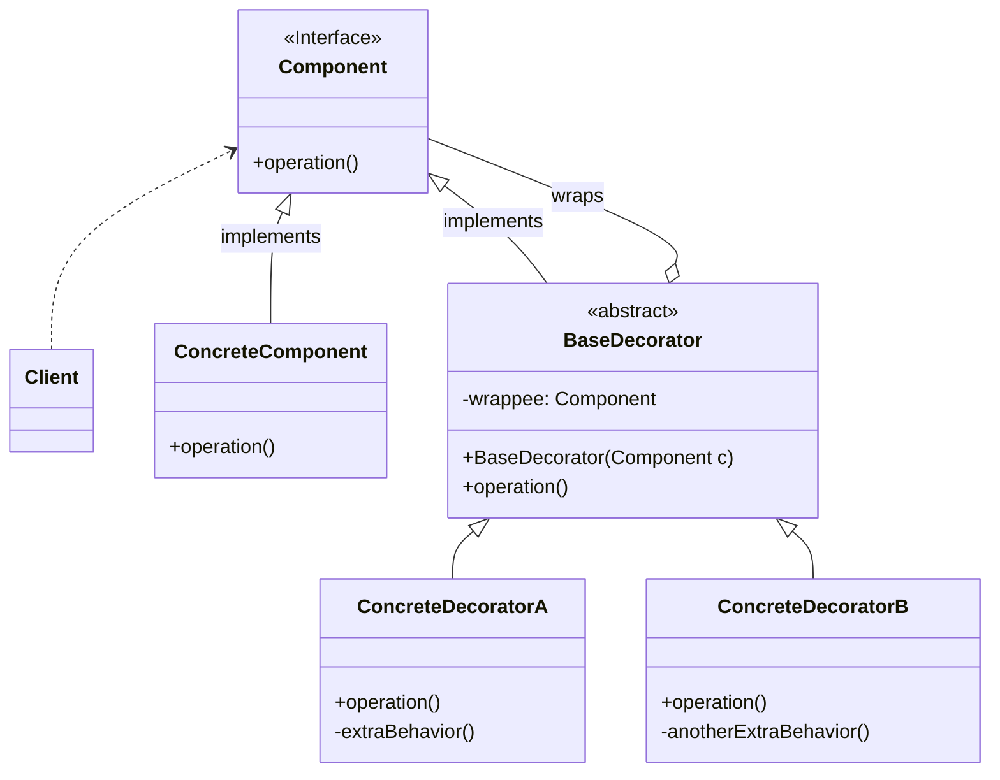

> [!abstract] 一句话核心
> Decorator 模式允许你通过将对象放入包含新行为的特殊“包装器”（wrapper）对象中，来动态地为（单个）对象附加新的行为（职责）。

---

## 1. 意图 / 要解决的问题 (The "Why")

> [!question] 这个模式解决了什么痛点？
>
> 核心痛点是：当你需要在一个对象的现有行为基础上动态地添加新功能，但又不想通过创建大量的子类来实现时，代码会变得臃肿且难以维护。

假设你正在开发一个通知库。最初的版本很简单，只有一个 `Notifier` 类，它通过电子邮件发送通知：

```java
// 基础组件
public class Notifier {
    private final String email;

    public Notifier(String email) {
        this.email = email;
    }

    public void send(String message) {
        System.out.println("Sending Email to " + email + ": " + message);
    }
}
```

很快，需求来了：

- 用户希望在收到邮件的同时，也能收到 **SMS** (短信) 通知。
- 企业用户还希望收到 **Slack** 通知。
- 有些用户可能只需要 SMS，不需要 Email。
- 有些用户可能需要 Email + SMS + Slack 全套通知。

如果你试图用**继承**来解决这个问题，代码会迅速变得一团糟：

```java
// "坏味道"：使用继承来扩展功能
// 1. 为每个新功能创建一个子类
class SMSNotifier extends Notifier {
    public SMSNotifier(String email) { super(email); }

    @Override
    public void send(String message) {
        super.send(message); // 发送邮件
        System.out.println("Sending SMS: " + message); // 新增：发送短信
    }
}

class SlackNotifier extends Notifier {
    public SlackNotifier(String email) { super(email); }

    @Override
    public void send(String message) {
        super.send(message); // 发送邮件
        System.out.println("Sending Slack: " + message); // 新增：发送Slack
    }
}

// 2. 核心痛点：组合爆炸！
// 如果用户需要 "Email + SMS + Slack" 怎么办？
// 你需要再创建一个子类：
class SMSAndSlackNotifier extends Notifier {
     public SMSAndSlackNotifier(String email) { super(email); }

     @Override
     public void send(String message) {
        super.send(message); // 发送邮件
        System.out.println("Sending SMS: " + message); // 发送短信
        System.out.println("Sending Slack: " + message); // 发送Slack
     }
}

// 如果用户只需要 "SMS 和 Slack" (不要Email) 呢？
// 你又需要创建一个新的类...
// class OnlySmsAndSlackNotifier extends ... ?
```

这种方法的痛点非常明显：

1. **类的组合爆炸**：你需要为每一种可能的功能组合（Email+SMS, Email+Slack, SMS+Slack, Email+SMS+Slack...）都创建一个子类，这会导致类的数量急剧膨胀，难以管理。
2. **违反开闭原则**：每当增加一种新的通知方式（比如 "Teams"），或者一种新的组合，你就可能需要创建一堆新的子类。
3. **静态限制**：继承是静态的。 你无法在运行时为一个已经创建好的 `Notifier` 对象动态地添加或删除 Slack 通知功能。你只能一开始就创建一个 `SMSAndSlackNotifier` 实例。

Decorator 模式就是为了解决这种 "在不修改原类的情况下，为其动态添加新功能" 的问题。

---

## 2. 解决方案 / 核心思想 (The "What")

> [!tip] 它是如何解决上述问题的？
>
> 核心思想是使用“组合”（Composition）替代“继承”。你不再创建子类，而是创建“包装器”（Wrapper）对象，将原始对象“包裹”起来。

Decorator 模式（也常被称为 Wrapper 模式）引入了一个“包装器”对象。这个包装器的工作方式如下：

1. **持有引用**：包装器对象内部会持有一个指向它所“包裹”的原始对象（我们称为“组件”）的引用。
2. **实现相同接口**：为了让包装器可以替代原始对象，它必须实现与原始对象**相同的接口**（即相同的方法集）。
3. **委托任务**：当客户端调用包装器的方法时，包装器会将这个调用**委托**给内部包裹的原始对象去执行。
4. **附加行为**：包装器的真正价值在于，它可以在委托任务的**之前**或**之后**，执行自己独有的附加行为。

**回到我们的通知库例子：**

1. 我们保留基础的 `Notifier` 类（负责Email通知）作为**具体组件**。
2. 我们将所有其他通知功能（如 SMS、Slack）都实现为**装饰器**（Decorator）类。

现在，如果一个用户需要 Email + SMS + Slack 三重通知，客户端代码会这样做：

```java
// 1. 创建基础的 Email 通知器
Notifier notifier = new Notifier("user@example.com");

// 2. 动态地用 SMS 装饰器包裹它
Notifier smsNotifier = new SMSDecorator(notifier);

// 3. 再用 Slack 装饰器包裹上一个装饰器
Notifier slackAndSmsNotifier = new SlackDecorator(smsNotifier);

// 4. 客户端调用最外层包装器的 send 方法
slackAndSmsNotifier.send("Your house is on fire!");
```

**执行流程会像一个“洋葱”：**

1. 客户端调用 `SlackDecorator` 的 `send()`。
2. `SlackDecorator` 在委托**之前**，先执行自己的逻辑（发送Slack通知）。
3. 然后它调用它包裹的 `SMSDecorator` 的 `send()`。
4. `SMSDecorator` 在委托**之前**，先执行自己的逻辑（发送SMS通知）。
5. 然后它调用它包裹的 `Notifier` 的 `send()`。
6. `Notifier` 执行自己的逻辑（发送Email通知）。

这样，我们就实现了一个**行为栈**。最重要的是，客户端代码（调用 `send` 的地方）根本不知道它面对的是一个基础的 `Notifier` 还是一个被层层包裹的装饰器对象，因为它只关心它们都实现了相同的接口。

---

## 3. 结构与角色 (The "Structure")

> [!note] 模式的蓝图

### UML 类图



### 参与角色

这个模式主要由以下角色构成：

- **`Component` (组件)**
  - **职责**: 这是一个接口，它定义了“被包装对象”（Wrapped objects）和“包装器”（Wrappers / Decorators）的共同操作。
  - _在我们的例子中，这将是一个 `INotifier` 接口，里面有 `send(message)` 方法。_
- **`ConcreteComponent` (具体组件)**
  - **职责**: 这是被包装的原始类。它定义了可以被装饰器动态添加行为的基础功能。
  - _在我们的例子中，这就是基础的 `Notifier` (Email通知) 类。_
- **`BaseDecorator` (基础装饰器)**
  - **职责**: 这是一个抽象类，它也实现了 `Component` 接口。它的核心职责是持有一个指向被包装 `Component` 对象的引用（`wrappee` 字段）。
  - 它的 `operation()` 方法默认只是简单地将调用委托给被包装的对象。
  - 这个类的存在是为了让所有具体的装饰器有一个共同的父类。
- **`ConcreteDecorator` (具体装饰器)**
  - **职责**: 这些是实现了具体附加行为的类（如 `ConcreteDecoratorA`, `ConcreteDecoratorB`）。
  - 它们重写 `BaseDecorator` 的 `operation()` 方法，在调用父类（即被包装对象）的方法**之前**或**之后**，添加自己的额外逻辑。
  - _在我们的例子中，`SMSDecorator` 和 `SlackDecorator` 就是具体装饰器。_
- **`Client` (客户端)**
  - **职责**: 客户端负责将一个具体组件用一个或多个装饰器进行包装（即组合它们）。
  - 重要的是，客户端通过统一的 `Component` 接口与所有对象（无论是原始组件还是被装饰后的对象）进行交互，它不需要关心对象的具体“洋葱”结构。

---

## 4. 代码示例 (The "How")

> [!example] Talk is cheap. Show me the code.

### Before: 重构前的代码

在应用模式之前，我们可能有一个简单的类，它只负责将数据写入文件。

```java
// 问题：这是一个"巨型类"，它试图自己处理所有事情。
// 如果我们想添加压缩，就必须修改这个类。
// 如果我们想组合加密和压缩，这个类会变得更加复杂。
public class FileDataSource {
    private String filename;

    public FileDataSource(String filename) {
        this.filename = filename;
    }

    public void writeData(String data) {
        // 假设这里有复杂的逻辑...
        System.out.println("Writing plain data to " + filename + ": " + data);

        // 如果要加密怎么办？在这里加 if/else？
        // String encryptedData = encrypt(data);
        // System.out.println("Writing encrypted data...");
    }

    public String readData() {
        // 假设这里有复杂的逻辑...
        String data = "Plain data from " + filename;
        System.out.println("Reading " + data);

        // 如果要解密怎么办？
        // if (isEncrypted) { data = decrypt(data); }

        return data;
    }
}

// Client code
public class Main {
    public static void main(String[] args) {
        FileDataSource source = new FileDataSource("file.dat");
        source.writeData("SalaryRecords");
        source.readData();
    }
}
```

这个设计的痛点是，`FileDataSource` 与数据操作（读/写）紧密耦合。添加新功能（如压缩、加密）或组合这些功能，都必须修改这个类，违反了开闭原则。

### After: 应用模式后的代码

我们现在应用 Decorator 模式，将加密和压缩功能分离到独立的装饰器中。

```java
// 1. Component: 统一的组件接口
interface DataSource {
    void writeData(String data);
    String readData();
}

// 2. ConcreteComponent: 基础的具体组件
class FileDataSource implements DataSource {
    private String filename;

    public FileDataSource(String filename) {
        this.filename = filename;
    }

    @Override
    public void writeData(String data) {
        System.out.println("Writing plain data to " + filename + ": " + data);
    }

    @Override
    public String readData() {
        String data = "Plain data from " + filename;
        System.out.println("Reading " + data);
        return data;
    }
}

// 3. BaseDecorator: 基础装饰器
// 它实现了 Component 接口，并持有一个 Component 引用
abstract class DataSourceDecorator implements DataSource {
    protected DataSource wrappee; // 持有被包装的对象

    public DataSourceDecorator(DataSource source) {
        this.wrappee = source;
    }

    // 默认实现：将工作委托给被包装的对象
    @Override
    public void writeData(String data) {
        wrappee.writeData(data);
    }

    @Override
    public String readData() {
        return wrappee.readData();
    }
}

// 4. ConcreteDecoratorA: 加密装饰器
class EncryptionDecorator extends DataSourceDecorator {
    public EncryptionDecorator(DataSource source) {
        super(source);
    }

    @Override
    public void writeData(String data) {
        // 附加行为：在委托之前加密数据
        String encryptedData = "[Encrypted: " + data + "]";
        System.out.println("Encrypting data.");
        wrappee.writeData(encryptedData); // 委托给被包装者
    }

    @Override
    public String readData() {
        String data = wrappee.readData(); // 从被包装者那里获取数据
        // 附加行为：在返回之前解密数据
        System.out.println("Decrypting data.");
        return data.replace("[Encrypted: ", "").replace("]", "");
    }
}

// 5. ConcreteDecoratorB: 压缩装饰器
class CompressionDecorator extends DataSourceDecorator {
    public CompressionDecorator(DataSource source) {
        super(source);
    }

    @Override
    public void writeData(String data) {
        // 附加行为：在委托之前压缩数据
        String compressedData = "[Compressed: " + data + "]";
        System.out.println("Compressing data.");
        wrappee.writeData(compressedData); // 委托
    }

    @Override
    public String readData() {
        String data = wrappee.readData(); // 获取
        // 附加行为：在返回之前解压缩数据
        System.out.println("Decompressing data.");
        return data.replace("[Compressed: ", "").replace("]", "");
    }
}

// 6. Client: 客户端动态组合装饰器
public class Main {
    public static void main(String[] args) {
        String salaryRecords = "SalaryRecords";

        // 1. 创建一个基础组件
        DataSource source = new FileDataSource("salary.dat");

        // 2. 客户端决定如何装饰它
        // 假设我们既要加密也要压缩
        boolean enableEncryption = true;
        boolean enableCompression = true;

        if (enableEncryption) {
            source = new EncryptionDecorator(source);
        }

        if (enableCompression) {
            source = new CompressionDecorator(source);
        }

        // 现在的 'source' 对象是:
        // CompressionDecorator -> EncryptionDecorator -> FileDataSource

        // 3. 客户端代码与之前完全一样，它不在乎 source 到底是什么
        System.out.println("--- Writing Data ---");
        source.writeData(salaryRecords);

        System.out.println("\n--- Reading Data ---");
        String result = source.readData();
        System.out.println("Result: " + result);
    }
}
```

**运行结果：**

```text
--- Writing Data ---
Compressing data.
Encrypting data.
Writing plain data to salary.dat: [Encrypted: [Compressed: SalaryRecords]]

--- Reading Data ---
Reading Plain data from salary.dat
Decrypting data.
Decompressing data.
Result: Plain data from salary.dat
```

> (注意：读/写操作的顺序是相反的，写入时是先压缩再加密，读取时是先解密再解压)

---

## 5. 优缺点 (Pros & Cons)

> [!todo] 权衡利弊

### 优点 (Pros)

- **无需创建子类即可扩展对象行为**：你可以为一个对象添加新的行为，而不需要创建一个新的子类来实现这些行为。
- **运行时动态添加/移除职责**：你可以在程序运行时为一个对象添加或移除功能。
- **组合多种行为**：可以通过将一个对象包裹在多个装饰器中来组合多个行为。
- **符合单一职责原则**：可以将一个实现了许多不同行为变种的庞大类，分解成多个较小的类，每个类只负责一种特定的附加行为。

### 缺点 (Cons)

- **难以移除特定的包装器**：从包装器栈中移除一个特定的装饰器通常很困难。
- **实现可能依赖装饰器顺序**：要实现一个其行为不依赖于装饰器栈中顺序的装饰器可能比较困难。
- **配置代码可能变得复杂**：初始化和配置层层嵌套的装饰器的代码可能会显得相当丑陋和复杂。

---

## 6. 适用场景 (Applicability)

> [!check] 我应该在什么时候使用它？
>
> 列出一些明确的信号或场景，当你遇到这些情况时，就应该考虑使用此模式。
>
> - 当你需要在**运行时**为一个对象**动态地添加额外的行为**，并且不想破坏使用该对象的现有代码时。
> - 当使用**继承**来扩展对象行为**不方便或不可能**时。例如，许多编程语言不允许一个类继承多个父类，或者目标类被标记为 `final` (不可继承)。

Decorator 模式提供了一种灵活的替代方案，通过将业务逻辑分层，为每一层创建装饰器，然后在运行时以各种组合方式来组装对象。由于所有对象都遵循共同的接口，客户端代码可以一致地对待它们。

---

## 7. 现实世界中的应用 (Real-World Examples)

> [!bug] 这个模式在哪些知名项目中被使用过？

- **Java I/O 类**: 这是 Decorator 模式最经典的例子之一。`java.io` 包中的 `InputStream`, `OutputStream`, `Reader`, `Writer` 类就是基于 Decorator 模式设计的。例如，你可以将一个基本的 `FileInputStream` 对象包装在 `BufferedInputStream` (增加缓冲功能) 中，然后再包装在 `DataInputStream` (增加读取基本数据类型的功能) 中。每一层都添加了新的职责，但都保持了相同的 `InputStream` 接口。
- **Java Swing GUI 组件**: Swing 中的某些组件（虽然不完全是纯粹的 Decorator）也体现了类似的思想，比如给组件添加滚动条 (`JScrollPane`) 或边框。
- **Web 框架中的中间件 (Middleware)**: 在很多 Web 框架（如 Express.js, ASP.NET Core）中，中间件的概念与 Decorator 类似。每个中间件处理 HTTP 请求/响应，并可以选择将其传递给下一个中间件，同时在传递前后执行自己的逻辑（如日志记录、身份验证、压缩）。
- **数据源包装**: 像我们代码示例中展示的，给数据源添加缓存、加密、压缩、日志记录等功能，都是 Decorator 的典型应用。

---

## 8. 相关模式 (Related Patterns)

> [!link] 与其他模式的联系和区别

- **Adapter (适配器模式)**:
  - **区别**：Adapter 为现有对象提供了一个**完全不同**的接口。而 Decorator 则保持接口**相同**或对其进行**扩展**。此外，Decorator 支持递归组合（一个装饰器可以包装另一个装饰器），而 Adapter 通常不支持。
- **Proxy (代理模式)**: `TODO` (您提供的资料中没有 Proxy 模式的笔记，因此暂不展开讲解。)
  - **区别**：Proxy 和 Decorator 的结构相似，都基于组合，一个对象将部分工作委托给另一个。主要区别在于**意图**：Proxy 通常自己管理其服务对象的生命周期，而 Decorator 的组合总是由客户端控制。Decorator 旨在增强对象功能，而 Proxy 通常用于控制访问、延迟加载或远程通信。
- **Composite (组合模式)**: `TODO` (您提供的资料中没有 Composite 模式的笔记，因此暂不展开讲解。)
  - **关系**：Composite 和 Decorator 的结构图相似，都依赖递归组合来组织不定数量的对象。
  - **区别**：Decorator 像是只有一个子组件的 Composite。Decorator 为被包装对象添加额外的职责，而 Composite 只是“汇总”其子节点的结果。它们可以协同工作：你可以使用 Decorator 来扩展 Composite 树中特定对象的行为。
- **[[Strategy]]**:
  - **区别**：Decorator 让你改变对象的“皮肤”（外观或附加职责），而 **Strategy** 让你改变对象的“内脏”（核心算法）。Decorator 通过包装来添加功能，Strategy 通过委托给不同的算法对象来改变行为。
- **Chain of Responsibility (责任链模式)**: `TODO` (您提供的资料中没有 Chain of Responsibility 模式的笔记，因此暂不展开讲解。)
  - **区别**：Chain of Responsibility 和 Decorator 的类结构非常相似，都依赖递归组合来传递执行。但 CoR 的处理者可以独立执行任意操作，并且可以在任何点停止传递请求。而 Decorator 则扩展对象的行为，同时保持与基础接口的一致性，并且不允许中断请求的流程。
- **Prototype (原型模式)**: `TODO` (您提供的资料中没有 Prototype 模式的笔记，因此暂不展开讲解。)
  - **关系**：大量使用 Composite 和 Decorator 的设计通常可以从 Prototype 模式中受益。应用 Prototype 可以让你克隆复杂的结构，而不是从头重新构建它们。

---

## 9. 练习题

### 习题 1

**背景代码：**

`StringDisplay` 类 (代码清单 12-2) 使用 `string.getBytes().length` 来获取显示内容的宽度，这在处理多字节字符（例如中文）时可能会不准确。

```java
// StringDisplay.java (部分代码)
public class StringDisplay extends Display {
    private String string;
    public StringDisplay(String string) {
        this.string = string;
    }
    public int getColumns() {
        // 问题所在：对于多字节字符，字节长度不等于字符个数
        return string.getBytes().length;
    }
    // ... 其他方法 ...
}
```

`Border` 类及其子类（如 `SideBorder`, `FullBorder`）依赖 `getColumns()` 方法来绘制边框。

**问题：**

请修改 `StringDisplay` 类，使其能够正确地显示包含多字节字符的字符串的宽度。提示：考虑使用 `string.length()` 代替 `string.getBytes().length`。

**请尝试给出你的修改方案。**
