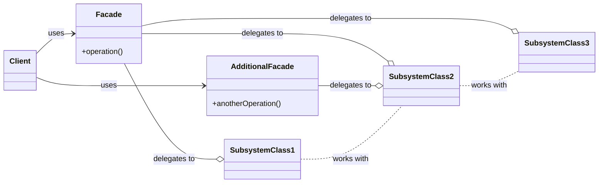

> [!abstract] 一句话核心
> Facade 是一种结构型设计模式，它为库、框架或其他复杂的一组类提供一个简化的接口。

---

## 1. 意图 / 要解决的问题 (The "Why")

> [!question] 这个模式解决了什么痛点？
>
> 痛点在于：我们的代码需要和一个复杂的大型库或框架进行交互，导致业务逻辑与这个复杂库的实现细节紧密耦合。

想象一下，你必须让你的代码与一个包含大量对象和类的复杂库（比如一个视频转换库）协同工作。

通常，你为了完成一个简单的任务（比如“转换一个视频文件”），可能需要：

1. 手动初始化该库中的多个对象。
2. 时刻跟踪对象之间的依赖关系。
3. 严格按照库所要求的正确顺序来执行它们的方法。

### "坏味道"示例代码

下面这段代码展示了未使用 Facade 模式时，客户端代码的“坏味道”：

```java
// 假设这些都是来自一个复杂的第三方视频转换库
import com.complexlibrary.VideoFile;
import com.complexlibrary.CodecFactory;
import com.complexlibrary.MPEG4CompressionCodec;
import com.complexlibrary.BitrateReader;
import com.complexlibrary.AudioMixer;
import com.complexlibrary.File; // 假设库中还有一个文件类

// 客户端的业务逻辑类
public class VideoConversionClient {

    // 这是一个业务方法，比如“转换用户上传的视频”
    public File convertVideo(String filename, String format) {

        System.out.println("开始转换视频...");

        // 痛点1：客户端必须了解所有复杂的子系统类
        VideoFile file = new VideoFile(filename);
        CodecFactory factory = new CodecFactory();
        MPEG4CompressionCodec destinationCodec = new MPEG4CompressionCodec();

        // 痛点2：客户端必须知道复杂的初始化和调用顺序
        var sourceCodec = factory.extract(file);

        // 痛点3：客户端需要了解所有底层的处理细节
        var buffer = BitrateReader.read(filename, sourceCodec);
        var intermediateResult = BitrateReader.convert(buffer, destinationCodec);

        // 痛点4：业务逻辑与子系统实现紧密耦合
        var finalResult = (new AudioMixer()).fix(intermediateResult);

        System.out.println("视频转换完成！");
        return new File(finalResult);
    }
}
```

**后果是：** 你的业务逻辑代码（`VideoConversionClient`）与第三方库的实现细节紧密地耦合在了一起。这导致代码变得难以理解，更难以维护。如果未来这个第三方库升级或更换，你的业务代码将面临大规模的重写。

---

## 2. 解决方案 / 核心思想 (The "What")

> [!tip] 它是如何解决上述问题的？
>
> 核心思想是引入一个“外观类”（Facade Class），这个类为复杂的子系统（如那个视频库）提供一个更简单、更统一的接口。

1. **封装复杂性**：这个 Facade 类充当了客户端与复杂子系统之间的“中间人”。它封装了子系统中的大量活动部件，把所有的复杂交互、初始化和调用顺序都隐藏在自己内部。
2. **提供简化接口**：Facade 类并不试图提供子系统的所有功能。相反，它只提供一个经过简化的接口，暴露那些客户端真正关心的、最常用的功能。
3. **解耦**：客户端代码现在只需要与这个 Facade 类进行通信，而不再需要直接与子系统内的几十个类打交道。这样，客户端就从子系统的复杂实现中解耦了。

### 用视频转换的例子来说：

我们不再让 `VideoConversionClient` 直接调用 `CodecFactory`、`BitrateReader` 等，而是创建一个新的 `VideoConverter` 类（这就是 Facade）：

```java
// 这是新创建的 Facade 类
public class VideoConverter {

    // Facade 内部隐藏了所有复杂的子系统类
    private CodecFactory codecFactory = new CodecFactory();
    private AudioMixer audioMixer = new AudioMixer();
    // ... 其他子系统对象

    // Facade 提供了一个极其简单的接口
    public File convert(String filename, String format) {

        System.out.println("Facade 开始转换视频...");

        // 所有复杂的初始化、依赖关系和调用顺序
        // 都被封装在 Facade 内部
        VideoFile file = new VideoFile(filename);
        var sourceCodec = codecFactory.extract(file);

        CompressionCodec destinationCodec;
        if (format.equals("mp4")) {
            destinationCodec = new MPEG4CompressionCodec();
        } else {
            destinationCodec = new OggCompressionCodec();
        }

        var buffer = BitrateReader.read(filename, sourceCodec);
        var intermediateResult = BitrateReader.convert(buffer, destinationCodec);
        var finalResult = audioMixer.fix(intermediateResult);

        System.out.println("Facade 转换完成！");
        return new File(finalResult);
    }
}
```

这样一来，客户端的代码就变得极其简单和干净：

```java
// 客户端现在只依赖于 Facade
public class VideoConversionClient {

    public void doBusinessLogic() {
        // 创建 Facade
        VideoConverter converter = new VideoConverter();

        // 只需调用 Facade 提供的简单方法
        // 所有复杂性都被隐藏了
        File mp4File = converter.convert("funny-cats-video.ogg", "mp4");
        mp4File.save();
    }
}
```

### 现实世界的类比

一个很好的类比是**电话客服**。

当你打电话给一家商店下订单时，接线员就是你的 **Facade**。你不需要知道商店内部复杂的订单系统、支付网关部门或各种物流配送服务。你只需通过一个简单的语音接口（接线员）就能完成所有操作。

---

## 3. 结构与角色 (The "Structure")

> [!note] 模式的蓝图

### UML 类图



### 参与角色

这个模式主要由以下几个角色构成：

- **`Facade` (外观)**
  - **职责**: 为子系统的特定功能提供一个便捷的访问接口。它知道应该将客户端的请求转发给子系统中的哪些对象，并负责操作子系统中的所有活动部件。
- **`Complex Subsystem` (复杂子系统)**
  - **职责**: 由大量不同的类和对象组成。为了让它们协同工作，你通常必须深入了解子系统的实现细节，比如按正确顺序初始化对象、提供正确格式的数据等。
  - 子系统中的类**不知道** Facade 的存在。它们在系统内部运作，并可以直接相互通信。
- **`Client` (客户端)**
  - **职责**: 使用 Facade 类来代替直接调用子系统对象。
- **`Additional Facade` (额外外观)** (可选)
  - **职责**: 有时一个 Facade 可能会因为承载了太多功能而变得臃肿。为了防止单一 Facade 变得过于复杂，可以创建额外的 Facade 类，将不相关的功能划分出去。这些额外的 Facade 可以被客户端或其他 Facade 使用。

---

## 4. 代码示例 (The "How")

> [!example] Talk is cheap. Show me the code.

在这个例子中，Facade 模式简化了与一个复杂的视频转换框架的交互。

### Before: 重构前的代码

在应用模式之前，客户端代码（如下面的 `Application`）被迫直接与子系统（如 `CodecFactory`, `BitrateReader` 等）的所有类进行交互。

正如我们在第1节“要解决的问题”中讨论的，客户端代码会变得非常臃肿，并且与子系统的实现细节（如对象的初始化顺序、依赖关系）紧密耦合。

### After: 应用模式后的代码

我们引入一个 `VideoConverter` 类作为 Facade，它封装了所有复杂的交互逻辑。

```java
// === Complex Subsystem (复杂子系统) ===
// 这些是来自一个复杂的第三方视频转换框架的类。
// 我们无法控制这些代码，因此不能简化它们。

class VideoFile {
    // ...
}
class OggCompressionCodec {
    // ...
}
class MPEG4CompressionCodec {
    // ...
}
class CodecFactory {
    // ...
}
class BitrateReader {
    // ...
}
class AudioMixer {
    // ...
}

// === Facade (外观) ===
// 我们创建一个 Facade 类，将框架的复杂性隐藏在一个
// 简单的接口后面。
class VideoConverter is
    // Facade 提供了一个简单的 'convert' 方法
    method convert(filename, format):File is
        // 所有的复杂工作都在 Facade 内部完成：
        file = new VideoFile(filename)
        sourceCodec = (new CodecFactory).extract(file)

        if (format == "mp4")
            destinationCodec = new MPEG4CompressionCodec()
        else
            destinationCodec = new OggCompressionCodec()

        buffer = BitrateReader.read(filename, sourceCodec)
        result = BitrateReader.convert(buffer, destinationCodec)
        result = (new AudioMixer()).fix(result)

        return new File(result)

// === Client (客户端) ===
// 应用程序的类不再依赖于复杂框架提供的无数个类。
// 并且，如果你决定更换框架，你只需要重写 Facade 类即可。
class Application is
    method main() is
        // 客户端只与 Facade 交互
        convertor = new VideoConverter()
        mp4 = convertor.convert("funny-cats-video.ogg", "mp4")
        mp4.save()
```

---

## 5. 优缺点 (Pros & Cons)

> [!todo] 权衡利弊

### 优点 (Pros)

- **隔离复杂性**：你可以将你的代码与一个复杂子系统的内部实现隔离开来。客户端代码变得更简单、更干净，因为它不需要关心子系统内部的复杂细节。
- **提高可维护性**：当子系统发生变化或升级时，你只需要修改 Facade 类中的代码即可，而不需要改动所有依赖它的客户端代码。

### 缺点 (Cons)

- **可能成为“上帝对象” (God Object)**：Facade 类有可能会变得非常臃肿。如果一个 Facade 试图封装一个过于庞大的子系统，它自己可能会变成一个“上帝对象”，与应用程序中的所有类都紧密耦合。
- **可能隐藏了必要的接口**：Facade 提供了简化的接口，但如果客户端在某些特殊情况下需要访问子系统的底层功能，而 Facade 没有暴露这些功能，客户端可能还是需要绕过 Facade 去直接访问子系统。

---

## 6. 适用场景 (Applicability)

> [!check] 我应该在什么时候使用它？
>
> 列出一些明确的信号或场景，当你遇到这些情况时，就应该考虑使用此模式。
>
> - **当**你需要为一个复杂的子系统提供一个有限但直接的接口时。子系统（如图形库、视频处理库）会随着时间变得越来越复杂，而 Facade 模式可以为客户端提供一个访问其常用功能的“快捷方式”。
> - **当**你想将一个大型子系统组织成多个层次时。你可以为子系统中的每一个层次（Layer）创建一个 Facade 作为该层的入口点。
> - **在**你需要减少不同子系统之间耦合的情况下。通过让子系统之间只通过彼此的 Facade 进行通信，可以降低它们之间的依赖性。

---

## 7. 现实世界中的应用 (Real-World Examples)

> [!bug] 这个模式在哪些知名项目中被使用过？
>
> - TODO

---

## 8. 相关模式 (Related Patterns)

> [!link] 与其他模式的联系和区别
>
> - **[[Singleton]]** (单例模式):
>   - 关系： Facade 类通常可以被转换为 Singleton 模式。
>     - 原因： 因为在大多数情况下，我们只需要一个 Facade 对象来协调子系统。《图解设计模式》中也提到，Facade 模式在多数情况下只会生成一个实例 1。
> - **[[AbstractFactory]]** (抽象工厂模式):
>   - **关系：** 抽象工厂可以作为 Facade 的一种替代方案。
>   - **区别：** 当你使用 Facade 的目的**仅仅**是为了向客户端隐藏“创建子系统对象”的复杂方式时，可以使用抽象工厂来代替。
> - **Adapter (适配器模式)**: `TODO`
>   - **区别：** Facade 为现有的对象定义了一个*新的、更简单的*接口，而 Adapter 则是试图让现有的接口*适配*另一个不兼容的接口。此外，Adapter 通常只包装*一个*对象，而 Facade 会协调*整个子系统*。
> - **Mediator (中介者模式)**: `TODO`
>   - **区别：** Facade 和 Mediator 的工作相似，都是组织多个紧密耦合的类。Facade 只是提供一个*简化的*接口，子系统本身并不知道 Facade 的存在。Mediator 则是*集中化*了组件间的通信，所有组件都只认识 Mediator，彼此不直接通信。
> - **Proxy (代理模式)**: `TODO`
>   - **区别：** Proxy 和 Facade 都缓冲了一个复杂实体并自行初始化它。但 Proxy 具有与其服务对象*相同的接口*，这使得它们可以互换。
> - **Flyweight (享元模式)**: `TODO`
>   - **区别：** Flyweight 展示了如何制造大量的*小*对象，而 Facade 展示了如何用一个*单一*对象来代表整个子系统。

## 9. 练习题

### 习题 15-1

在示例程序（代码清单 15-2 至 15-5）中，`PageMaker` 类（Facade 角色）的代码如下所示。请问这段代码是否存在问题？如果存在问题，请说明原因，并指出应该如何修改。

```java
// Database 类 (模拟从属性文件获取数据)
package pagemaker;
import java.io.FileInputStream;
import java.io.IOException;
import java.util.Properties;

public class Database {
    private Database() {    // 防止外部 new 出 Database 的实例，所以声明为 private
    }
    // 根据数据库名获取 Properties
    public static Properties getProperties(String dbname) throws IOException {
        String filename = dbname + ".txt";
        Properties prop = new Properties();
        prop.load(new FileInputStream(filename));
        return prop;
    }
}

// HtmlWriter 类 (用于生成 HTML 文件)
package pagemaker;
import java.io.Writer;
import java.io.IOException;

public class HtmlWriter {
    private Writer writer;
    public HtmlWriter(Writer writer) {
        this.writer = writer;
    }
    // 输出标题
    public void title(String title) throws IOException {
        writer.write("<!DOCTYPE html>\n");
        writer.write("<html>\n");
        writer.write("<head>\n");
        writer.write("<title>" + title + "</title>\n");
        writer.write("</head>\n");
        writer.write("<body>\n");
        writer.write("<h1>" + title + "</h1>\n");
    }
    // 输出段落
    public void paragraph(String msg) throws IOException {
        writer.write("<p>" + msg + "</p>\n");
    }
    // 输出超链接
    public void link(String href, String caption) throws IOException {
        paragraph("<a href=\"" + href + "\">" + caption + "</a>");
    }
    // 输出邮件地址
    public void mailto(String mailaddr, String username) throws IOException {
        link("mailto:" + mailaddr, username);
    }
    // 结束 HTML 输出
    public void close() throws IOException {
        writer.write("</body>\n");
        writer.write("</html>\n");
        writer.close();
    }
}

// PageMaker 类 (Facade 角色)
package pagemaker;
import java.io.FileWriter;
import java.io.IOException;
import java.util.Properties;

public class PageMaker {
    private PageMaker() {   // 防止外部 new 出 PageMaker 的实例
    }
    public static void makeWelcomePage(String mailaddr, String filename) throws IOException {
        Properties mailprop = Database.getProperties("maildata");
        String username = mailprop.getProperty(mailaddr);
        HtmlWriter writer = new HtmlWriter(new FileWriter(filename));
        writer.title("Welcome to " + username + "'s page!");
        writer.paragraph(username + "欢迎来到" + username + "的主页。");
        writer.paragraph("等着你的邮件哦！");
        writer.mailto(mailaddr, username);
        writer.close();
        System.out.println(filename + " is created for " + mailaddr + " (" + username + ")");
    }
}

// Main 类 (测试程序)
package pagemaker;
import java.io.IOException;

public class Main {
    public static void main(String[] args) {
        try {
            PageMaker.makeWelcomePage("hyuki@hyuki.com", "welcome.html");
        } catch (IOException e) {
            e.printStackTrace();
        }
    }
}
```

请你思考一下，上面 `PageMaker` 类的实现是否存在问题？

是的，`PageMaker` 类的实现存在问题。

**问题原因：**

`PageMaker` 类只包含 `static` 方法 (`makeWelcomePage`)，并且其构造函数是 `private` 的。这意味着：

1. **无法创建 `PageMaker` 的实例**：客户端不能 `new PageMaker()`。
2. **所有操作通过静态方法进行**：客户端直接通过类名调用 `PageMaker.makeWelcomePage(...)`。

这使得 `PageMaker` 更像是一个**工具类 (Utility Class)**，而不是一个典型的 Facade 对象。Facade 模式通常通过创建一个 Facade _对象_ 来封装子系统的访问。

**缺点：**

- **缺乏灵活性和扩展性**：因为全是静态方法，你无法通过继承 `PageMaker` 来创建不同的 Facade 实现或扩展其功能。无法利用多态性来替换 Facade。
- **与模式意图略有偏差**：虽然它简化了接口，但失去了面向对象实现所带来的好处（如替换、扩展）。

**修改方法：**

1. 将 `PageMaker` 的构造函数改为 `public`。
2. 将 `makeWelcomePage` 方法改为非静态（实例）方法。
3. 修改客户端代码 (`Main`)，先创建 `PageMaker` 的实例，然后通过实例调用 `makeWelcomePage` 方法。

修改后的 `PageMaker` (部分):

```java
package pagemaker;
// ... imports ...

public class PageMaker {
    // 改为 public
    public PageMaker() {
    }

    // 去掉 static
    public void makeWelcomePage(String mailaddr, String filename) throws IOException {
        // ... 方法内部逻辑不变 ...
        Properties mailprop = Database.getProperties("maildata");
        String username = mailprop.getProperty(mailaddr);
        HtmlWriter writer = new HtmlWriter(new FileWriter(filename));
        writer.title("Welcome to " + username + "'s page!");
        writer.paragraph(username + "欢迎来到" + username + "的主页。");
        writer.paragraph("等着你的邮件哦！");
        writer.mailto(mailaddr, username);
        writer.close();
        System.out.println(filename + " is created for " + mailaddr + " (" + username + ")");
    }
}
```

修改后的 `Main` (部分):

```java
package pagemaker;
import java.io.IOException;

public class Main {
    public static void main(String[] args) {
        try {
            // 创建实例，然后调用实例方法
            PageMaker maker = new PageMaker();
            maker.makeWelcomePage("hyuki@hyuki.com", "welcome.html");
        } catch (IOException e) {
            e.printStackTrace();
        }
    }
}
```

这样修改后，`PageMaker` 就成为了一个可以实例化和替换的对象，更符合 Facade 模式的典型实现。
