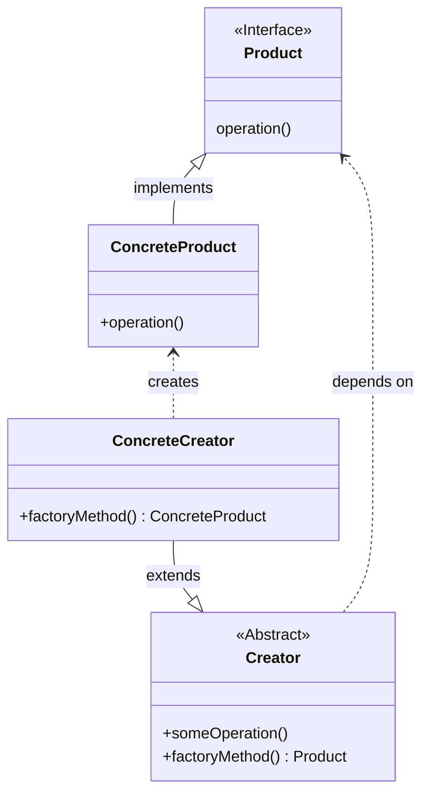

---
aliases:
  - Virtual Constructor
  - 工厂方法
creation date: 2025-09-16
tags:
  - "#creational"
---

> [!abstract] 一句话核心
> 定义一个用于创建对象的接口（工厂方法），但让子类决定到底要实例化哪一个具体的类。

---

## 1. 意图 / 要解决的问题 (The "Why")

> [!question] 这个模式解决了什么痛点？
> 核心痛点就是 **将对象的创建逻辑和使用逻辑混在了一起**，导致系统缺乏灵活性。

我们来想象一个场景：

假设你正在开发一个**物流管理应用**。第一个版本很简单，只支持**陆路运输**，所以你的代码里到处都是和 `Truck` (卡车) 类相关的逻辑。

业务发展得很好，现在客户希望增加**海路运输** (`Ship` 类)。

这时候，麻烦就来了。因为你的代码和 `Truck` 类“绑”得太死了（我们称之为**紧密耦合**），比如你可能在很多地方都写了 `new Truck()` 这样的代码。为了加入 `Ship`，你就不得不去修改所有这些地方的代码。

通常，这会导致代码里出现大量的 `if-else` 或 `switch` 语句来判断应该创建哪种对象：

```java
// "坏味道"：充满了条件判断
Transport transport;
if (order.getType() == "Road") {
    transport = new Truck();
} else if (order.getType() == "Sea") {
    transport = new Ship();
}
// 如果未来要增加空运(Air)呢？还得回来修改这里的代码！
transport.deliver();
```

这种写法的坏处显而易见： **违反了开闭原则** (对扩展开放，对修改关闭)。每次新增一种运输方式（比如未来的空运），都必须回来修改这段核心的创建逻辑，这让代码变得非常脆弱，难以维护和扩展。

或者还有个非常类似的例子：**文档编辑器**。

想象一下你做的 Word 或 Google Docs，它有一个核心功能是“导出”。最初，你可能只支持导出为 **PDF** 格式。你的代码可能很简单：

```java
class DocumentEditor {
    public void onExportButtonClick() {
        // ... 获取文档内容 ...
        String content = "Hello World";

        // **直接创建具体的导出器对象**
        PdfExporter exporter = new PdfExporter();
        exporter.export(content);
    }
}
```

这看起来没问题。但是，现在产品经理跑过来说：“用户反馈很棒，我们下个版本要增加导出为 **Word (.docx)** 和 **网页 (.html)** 的功能！”

你只好硬着头皮去修改 `onExportButtonClick` 方法：

```java
// "坏味道"再次出现
class DocumentEditor {
    public void onExportButtonClick(String format) {
        String content = "Hello World";

        // 核心业务逻辑中混入了创建对象的复杂判断
        if ("PDF".equals(format)) {
            PdfExporter exporter = new PdfExporter();
            exporter.export(content);
        } else if ("DOCX".equals(format)) {
            DocxExporter exporter = new DocxExporter();
            exporter.export(content);
        } else if ("HTML".equals(format)) {
            HtmlExporter exporter = new HtmlExporter();
            exporter.export(content);
        }
        // 下次要支持 Markdown, XML, TXT... 怎么办？
        // 这个 if-else 链条会变得越来越长，难以维护！
    }
}
```

这里的痛点和物流的例子一模一样：

**`DocumentEditor` (使用者) 不得不关心到底该如何创建 `PdfExporter`、`DocxExporter` (具体产品) 这些细节。** 它承担了不属于它的‘创建’职责，导致每次新增导出格式，都得冒着风险去修改这个已经很复杂的类。

---

## 2. 解决方案 / 核心思想 (The "What")

> [!tip] 它是如何解决上述问题的？
> 不要在你的主业务逻辑里（比如物流应用或文档编辑器里）直接用 `new` 来创建对象，而是把这个创建过程交给一个专门的方法——也就是‘工厂方法’来处理。

1. **定义一个共同的“产品”接口**：首先，我们为所有“产品”（卡车 `Truck`、轮船 `Ship`）定义一个共同的接口，比如叫 `Transport`。这个接口里有一个所有产品都必须实现的方法，例如 `deliver()`。
2. **定义一个“创建者”类和“工厂方法”**：然后，我们创建一个抽象的“创建者” (Creator) 类（比如 `Logistics` 物流公司）。在这个类里，我们声明一个抽象的工厂方法 `createTransport()`。这个方法的返回类型就是我们上面定义的 `Transport` 接口。这个创建者类还可以包含一些通用的业务逻辑，比如计划运输路线 `planDelivery()`，这个通用逻辑会调用工厂方法来获取产品。
3. **让“具体创建者”子类来决定生产什么**：这步是关键！我们不直接使用抽象的 `Logistics` 类。而是为每一种运输方式创建**具体的创建者子类**。
   - 创建一个 `RoadLogistics` (陆路运输) 子类，它去实现 `createTransport()` 方法，让这个方法返回一个 `new Truck()`。
   - 再创建一个 `SeaLogistics` (海路运输) 子类，同样实现 `createTransport()` 方法，但这次返回一个 `new Ship()`。

这个模式完美地遵循了：

- **开闭原则 (Open/Closed Principle)**: 当需要增加“空运”时，我们只需要新增一个 `Airplane` 产品类和一个 `AirLogistics` 创建者类，完全不需要修改任何现有代码。系统通过**扩展**而非**修改**来适应变化。
- **单一职责原则 (Single Responsibility Principle)**: 产品的创建逻辑被封装在各个具体的创建者子类中，而使用产品的业务逻辑则保留在抽象的创建者基类中。各司其职，代码更清晰。

---

## 3. 结构与角色 (The "Structure")

> [!note] 模式的蓝图

### UML 类图



### 参与角色

这个模式主要由以下四个角色构成：

- **`产品 (Product)`**
  - **职责**: 定义了工厂方法所创建的对象的通用接口。所有具体产品都必须实现这个接口。
  - _对应到我们的物流例子中，它就是 `Transport` 接口。_
- **`具体产品 (Concrete Product)`**
  - **职责**: 实现了产品接口的具体类。工厂方法最终创建并返回的就是这些类的实例。
  - _例如 `Truck` 和 `Ship` 类。_
- **`创建者 (Creator)`**
  - **职责**: 声明返回产品对象的**工厂方法**。它也可以包含一些依赖于产品接口的核心业务逻辑（如图中的 `someOperation`）。创建者只知道产品要符合 `Product` 接口，但不知道具体是哪个产品。
  - _在我们的例子中，这就是抽象的 `Logistics` 类。_
- **`具体创建者 (Concrete Creator)`**
  - **职责**: 重写（实现）基类中的工厂方法，从而改变最终创建出来的产品类型。每个具体创建者都知道自己要负责创建哪个具体产品。
  - _例如 `RoadLogistics` 和 `SeaLogistics` 类。_

---

## 4. 代码示例 (The "How")

> [!example] Talk is cheap. Show me the code.

### Before: 重构前的代码

这是我们之前讨论过的“糟糕”场景。所有的对象创建逻辑都挤在一个方法里，充满了 `if-else`。

```java
// 这是“产品”接口和它的实现类
interface Transport {
    void deliver();
}
class Truck implements Transport {
    public void deliver() { System.out.println("Deliver by land in a box."); }
}
class Ship implements Transport {
    public void deliver() { System.out.println("Deliver by sea in a container."); }
}

// 这是包含问题代码的类
public class ProblematicLogisticsApp {
    // 坏味道：这个方法违反了开闭原则。
    // 每次新增一种运输方式，都必须修改这里的 if-else 逻辑。
    public void planDelivery(String type) {
        Transport transport;
        if ("road".equals(type)) {
            // 问题：业务逻辑与 Truck 类的创建紧密耦合
            transport = new Truck();
        } else if ("sea".equals(type)) {
            // 问题：业务逻辑与 Ship 类的创建紧密耦合
            transport = new Ship();
        } else {
            throw new RuntimeException("Unsupported transport type");
        }

        // 使用产品
        transport.deliver();
    }
}
```

### After: 应用模式后的代码

现在，我们应用工厂方法模式来重构它。注意看每个类是如何扮演我们在上一节定义的“角色”的。

```java
// 1. Product: 产品接口 (保持不变)
interface Transport {
    void deliver();
}

// 2. ConcreteProduct: 具体产品 (保持不变)
class Truck implements Transport {
    public void deliver() { System.out.println("Deliver by land in a box."); }
}
class Ship implements Transport {
    public void deliver() { System.out.println("Deliver by sea in a container."); }
}


// 3. Creator: 创建者 (这是新增的核心抽象)
// 它包含业务逻辑 planDelivery() 和抽象的工厂方法 createTransport()
abstract class Logistics {
    // 核心业务逻辑，它不关心具体产品是什么，只依赖于产品接口 Transport
    public void planDelivery() {
        Transport t = createTransport();
        System.out.println("The plan is set, executing delivery...");
        t.deliver();
    }

    // 这就是工厂方法！它被声明为抽象的，强制子类去实现它。
    protected abstract Transport createTransport();
}


// 4. ConcreteCreator: 具体创建者
// 它们继承 Logistics 并实现工厂方法，决定到底创建哪个具体产品。
class RoadLogistics extends Logistics {
    @Override
    protected Transport createTransport() {
        // RoadLogistics 只负责创建 Truck
        return new Truck();
    }
}

class SeaLogistics extends Logistics {
    @Override
    protected Transport createTransport() {
        // SeaLogistics 只负责创建 Ship
        return new Ship();
    }
}


// 客户端如何使用？
public class Application {
    public static void main(String[] args) {
        Logistics logistics;

        // 假设根据配置或环境决定使用哪种物流方式
        String config = "sea";

        if ("road".equalsIgnoreCase(config)) {
            logistics = new RoadLogistics();
        } else {
            logistics = new SeaLogistics();
        }

        // 客户端代码只与抽象的 Logistics 类和 Transport 接口交互。
        // 它完全不知道具体的产品是 Truck 还是 Ship。
        logistics.planDelivery();
    }
}
```

主业务逻辑 `planDelivery()` 变得非常稳定，它再也不关心如何创建 `Transport` 对象了。

如果你想增加“空运”，只需要：

1. 新建一个 `Airplane` 类实现 `Transport` 接口。
2. 新建一个 `AirLogistics` 类继承 `Logistics` 并实现 `createTransport()` 方法返回 `new Airplane()`。

---

## 5. 优缺点 (Pros & Cons)

> [!todo] 权衡利弊

### 优点 (Pros)

- **避免了创建者与具体产品间的紧密耦合**
  - 创建者的代码只依赖于抽象的 `Product` 接口，完全不知道、也不关心具体是哪个 `ConcreteProduct`。这使得更换或增加产品变得非常容易，灵活性大大提高。
- **符合单一职责原则 (Single Responsibility Principle)**
  - 将产品创建的代码从使用产品的业务逻辑中分离出来，并集中到各个具体的创建者子类中。每个类都有自己清晰的职责：业务逻辑类负责业务，工厂子类负责创建。代码更易于理解和维护。
- **符合开闭原则 (Open/Closed Principle)**
  - 这是它最大的优点之一。当需要引入新产品时，你不需要修改任何现有的客户端代码或抽象创建者代码，只需要添加一个新的具体产品类和一个新的具体创建者类即可。系统对扩展是开放的，对修改是关闭的。

### 缺点 (Cons)

**代码复杂度增加，类的数量会成倍增长**

- 为了引入这个模式，你需要额外创建一系列的类：至少一个抽象创建者和多个具体创建者子类。如果你的产品类型非常多，那么类的数量可能会爆炸式增长，让整个项目的结构在宏观上看起来更复杂。对于一个非常简单、几乎不会变化的系统，直接使用 `new` 可能反而更直接。

**代码的导航和可读性可能降低**

- 当看到 `creator.planDelivery()` 时，无法立刻知道这里具体会创建和使用哪个 `Transport` 对象，必须去查找 `creator` 变量在运行时到底是哪个子类的实例，才能确定最终的行为。

---

## 6. 适用场景 (Applicability)

> [!check] 我应该在什么时候使用它？
>
> 列出一些明确的信号或场景，当你遇到这些情况时，就应该考虑使用此模式。
>
> - 当你发现你的代码里有大段的 `if-else` 或 `switch` 用于根据不同类型创建不同对象时，就是一个非常强烈的、需要使用工厂方法模式的信号。
> - 当一个类不知道它所必须创建的对象的类时。
> - 当一个类希望由它的子类来指定它所创建的对象时。
> - 当你希望将创建对象的职责集中管理，或者想复用现有对象以节省资源时。

---

## 7. 现实世界中的应用 (Real-World Examples)

> [!bug] 这个模式在哪些知名项目中被使用过？
>
> - **JDK**: 例如 `java.util.Comparator` 就是策略模式的绝佳例子。
> - **Spring Framework**: 例如...
> - **其他框架/库**: ...

---

## 8. 相关模式 (Related Patterns)

> [!link] 与其他模式的联系和区别
>
> - [[AbstractFactory]]: TODO, - [Abstract Factory](https://refactoring.guru/design-patterns/abstract-factory) classes are often based on a set of [Factory Methods](https://refactoring.guru/design-patterns/factory-method), but you can also use [Prototype](https://refactoring.guru/design-patterns/prototype) to compose the methods on these classes.
> - [[Iterator]]: TODO: - You can use [Factory Method](https://refactoring.guru/design-patterns/factory-method) along with [Iterator](https://refactoring.guru/design-patterns/iterator) to let collection subclasses return different types of iterators that are compatible with the collections.
> - [[Prototype]]: TODO: - [Prototype](https://refactoring.guru/design-patterns/prototype) isn’t based on inheritance, so it doesn’t have its drawbacks. On the other hand, *Prototype* requires a complicated initialization of the cloned object. [Factory Method](https://refactoring.guru/design-patterns/factory-method) is based on inheritance but doesn’t require an initialization step.
> - [[TemplateMethod]]: TODO [[FactoryMethod]]就是Template Method的特殊形式，At the same time, a *Factory Method* may serve as a step in a large *Template Method*.

## 9. 练习题

对于练习题的前置代码：

```java
// framework/Product.java
package framework;

public abstract class Product {
    public abstract void use();
}
```

```java
// idcard/IDCard.java
package idcard;

import framework.Product;

public class IDCard extends Product {
    private String owner;

    IDCard(String owner) {
        System.out.println("Made " + owner + "'s ID Card");
        this.owner = owner;
    }
    @Override
    public void use() {
        System.out.println("Use " + owner + "'s ID Card");
    }
    public String getOwner() {
        return owner;
    }
}
```

```java
// framework/Factory.java
package framework;

public abstract class Factory {
    public final Product create(String owner) {
        Product p = createProduct(owner);
        registerProduct(p);
        return p;
    }
    protected abstract Product createProduct(String owner);

    protected abstract void registerProduct(Product product);
}
```

```java
// idcard/IDCardFactory.java
package idcard;

import framework.Factory;
import framework.Product;

import java.util.ArrayList;
import java.util.List;

public class IDCardFactory extends Factory {
    private List owners = new ArrayList();

    @Override
    protected Product createProduct(String owner) {
        return new IDCard(owner);
    }
    @Override
    protected void registerProduct(Product product) {
        owners.add(((IDCard) product).getOwner());
    }
    public List getOwners() {
        return owners;
    }
}
```

### 习题 4-1

在下面的实例程序中，`IDCard`类的构造函数并不是`public`，请问这是想表达什么意思呢？

```java
public class IDCard extends Product {
	// ...
	IDCard(String owner) {
		this.owner = owner;
	}
	// ...
}
```

答：Java里面没有access modifier，则默认是package-private。`IDCard`类的构造函数并不是`public`，使得`idcard`包外的类不能`new`出`IDCard`类的实例。

### 习题 4-2

请修改示例程序，为`IDCard`类添加卡的编号，并在`IDCardFactory`类中保存编号与所有者之间的对应表。

答案：修改如下，值得注意的是在我们添加编号的过程中，我们不需要修改框架代码（framework包中的代码）以及外部调用代码，例如`Main.java`文件。

```java
// idcard/IDCard.java
package idcard;

import framework.Product;

public class IDCard extends Product {
    private String owner;
    private int serial;

    IDCard(String owner, int serial) {
        System.out.println("Made " + owner + "(" + serial + ")" + "'s ID Card");
        this.owner = owner;
        this.serial = serial;
    }
    @Override
    public void use() {
        System.out.println("Use " + owner + "(" + serial + ")" + "'s ID Card");
    }
    public String getOwner() {
        return owner;
    }
    public int getSerial() {
	    return serial;
    }
}
```

```java
// idcard/IDCardFactory.java
package idcard;

import framework.Factory;
import framework.Product;

import java.util.ArrayList;
import java.util.List;
import java.util.HashMap;

public class IDCardFactory extends Factory {
    // private List owners = new ArrayList();
    private HashMap database = new HashMap();
    private int serial = 100;

    @Override
    protected synchronized Product createProduct(String owner) {
        return new IDCard(owner, serial++);
    }
    @Override
    protected void registerProduct(Product product) {
	    IDCard card = (IDCard) product;
	    database.put(new Integer(card.getSerial()), card.getOwner());
        // owners.add(((IDCard) product).getOwner());
    }
    /*
    public List getOwners() {
        return owners;
    }
    */

    public Hashtable getDatabase() {
	    return database;
    }
}
```

### 习题 4-3

为了强制调用方向`Product`类的子类的构造函数中传入“产品名字”作为参数，我们采用了如下的定义方式。但是在编译代码时却出现了编译错误，请问这是为什么呢？

```java
public abstract class Product {
	public abstract Product(String name);
	public abstract void use();
}
```

答案：这是因为在Java中无法定义abstract的构造函数。

> `abstract` 意味着方法需要被子类**重写（override）**，而构造函数在 Java 中是**不能被重写**的，它们只能通过 `super()` 关键字被**调用（invoke）**。一个不能被继承和重写的东西，自然也就不存在“抽象”的概念，所以 `abstract` 构造函数在逻辑上是矛盾且无意义的。

要想实现习题中的需求，不应当在构造函数中设置产品的名字，而应当另外声明一个设置产品名字的专用方法。
