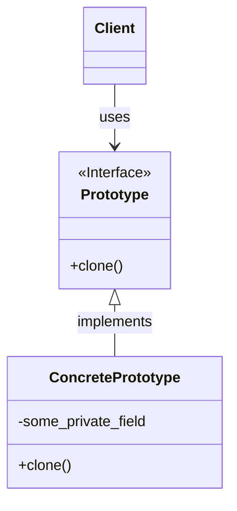

> [!abstract] 一句话核心
> Prototype 允许你复制现有的对象，而无需使你的代码依赖于它们的具体类。

---

## 1. 意图 / 要解决的问题 (The "Why")

> [!question] 这个模式解决了什么痛点？
> 从外部复制对象的时候可能会无法访问对象的私有成员，而且代码与具体类紧密耦合。

设想一个场景：你已经有了一个对象，现在需要一个和它一模一样的副本。你会怎么做？

最直接的想法是：

1. 创建一个属于**同一个类**的新对象。
2. 遍历原始对象的所有字段，把它们的值复制到新对象中。

这个看似简单的过程，其实隐藏着两个主要的痛点：

**痛点一：无法访问私有成员**

- 当你从外部代码尝试复制一个对象时，你可能无法访问它的 `private` 字段，这就导致你无法创建一个完整的副本。

**痛点二：代码与具体类紧密耦合**

- 为了创建副本，你的代码必须知道原始对象的具体类（例如 `Circle` 或 `Rectangle`），这样才能调用 `new Circle()` 或 `new Rectangle()`。 这种依赖关系使得代码缺乏灵活性。
- 更糟糕的是，有时你只知道对象遵循某个接口（比如 `Shape` 接口），但并不知道它的具体类是什么。

可以看下面这个代码例子：

```java
// 这是一个复制方法，它充满了“坏味道”
public Shape duplicate(Shape shape) {
    Shape newShape = null;

    // 坏味道1：必须知道所有的具体子类
    if (shape instanceof Circle) {
        // 坏味道2：代码与具体类 Circle 紧密耦合
        Circle original = (Circle)shape;
        Circle copy = new Circle();
        // copy.radius = original.radius; // 痛点1：如果 radius 是 private，这里会编译失败！
        newShape = copy;

    } else if (shape instanceof Rectangle) {
        // 代码与具体类 Rectangle 紧密耦合
        Rectangle original = (Rectangle)shape;
        Rectangle copy = new Rectangle();
        // copy.width = original.width; // 同样的问题，无法访问 private 成员
        // copy.height = original.height;
        newShape = copy;
    }

    // 如果未来增加了新的图形类（如 Triangle），就必须回来修改这里的 if-else 逻辑！

    return newShape;
}
```

这段代码的问题是，复制逻辑和具体的图形类被“写死”在了一起，每增加一种新的图形，都必须修改这个方法，这违反了“开闭原则”。

---

## 2. 解决方案 / 核心思想 (The "What")

> [!tip] 它是如何解决上述问题的？
> 核心思想非常直观：**与其从外部费力地复制一个对象，不如让对象自己去复制自己。**

为了实现这一点，原型模式提出以下方案：

1. **定义一个通用的克隆接口**：我们为所有支持克隆的对象声明一个共同的接口。这个接口通常只包含一个 `clone` 方法。
2. **由对象自身实现克隆过程**：每个具体的类（例如 `Circle` 和 `Rectangle`）都去实现这个 `clone` 方法。在这个方法内部，它会创建一个属于自己这个类的新实例，然后把原始对象的所有字段值（包括私有字段）都复制过去。

这个方案巧妙地解决了之前的两个痛点：

- **解决了私有字段的访问问题**：因为克隆操作是在对象自己的类中进行的，所以它可以访问到同类其他实例的私有字段。这样就能确保复制的完整性。
- **解决了与具体类的耦合问题**：客户端代码不再需要写 `if (shape instanceof Circle)` 这样的判断。无论拿到的是 `Circle` 对象还是 `Rectangle` 对象，客户端都一视同仁，只需调用 `shape.clone()` 方法即可。客户端代码从此不再依赖于任何具体的类，只依赖于那个通用的克隆接口。

一个支持克隆的对象，我们就称之为 **“原型” (Prototype)**。当需要一个新对象时，我们不再通过 `new` 从头构建，而是找到一个合适的“原型”实例，然后克隆它。

---

## 3. 结构与角色 (The "Structure")

> [!note] 模式的蓝图

### UML 类图



### 参与角色

**`Prototype` (原型接口)**

- **职责**: 声明一个用于克隆自身的接口。在大多数情况下，这个接口里只有一个 `clone` 方法。

- _对应到我们的例子中，就是那个通用的 `Shape` 接口，但我们会给它增加一个 `clone` 方法。_

**`Concrete Prototype` (具体原型)**

- **职责**: 实现 `Prototype` 接口中定义的克隆方法。除了将原始对象的数据复制到克隆体中，这个方法还可能处理一些克隆过程中的边界情况，例如处理循环引用等。
- _对应到我们的例子中，就是 `Circle` 和 `Rectangle` 这些具体的图形类。_

**`Client` (客户端)**

- **职责**: 客户端可以通过 `Prototype` 接口来克隆任何一个 `Concrete Prototype` 类的实例，而无需知道它的具体类是什么。
- _对应到我们的例子中，就是那个 `duplicate` 方法所在的类。_

---

## 4. 代码示例 (The "How")

> [!example] Talk is cheap. Show me the code.

### Before: 重构前的代码

```java
// 这个方法必须知道所有 Shape 的子类，并且无法访问它们的私有成员。
public Shape duplicate(Shape shape) {
    if (shape instanceof Circle) {
        // ... 依赖于 Circle 类 ...
    } else if (shape instanceof Rectangle) {
        // ... 依赖于 Rectangle 类 ...
    }
    // ...
    return null;
}
```

### After: 应用模式后的代码

现在，我们应用原型模式进行重构。我们将克隆的职责交给 `Shape` 对象自己。

> **注意**：在 Java 中，实现原型模式通常会利用内置的 `Cloneable` 接口和 `Object.clone()` 方法。一个类需要显式地实现 `Cloneable` 接口，才能表明它的对象可以被克隆。

```java
import java.util.ArrayList;
import java.util.List;

// 1. Prototype (原型)
// 我们创建一个抽象类作为所有图形的原型。
// 它实现了 Cloneable 接口，表明其子类可以被克隆。
abstract class Shape implements Cloneable {
    public int x;
    public int y;
    public String color;

    public Shape() {}

    // 原型构造函数，方便子类复制通用字段
    public Shape(Shape source) {
        this();
        this.x = source.x;
        this.y = source.y;
        this.color = source.color;
    }

    // 关键的 clone 方法
    @Override
    public abstract Shape clone();
}

// 2. Concrete Prototype (具体原型)
class Circle extends Shape {
    public int radius;

    public Circle() {}

    public Circle(Circle source) {
        // 调用父类构造函数复制 x, y, color
        super(source);
        this.radius = source.radius;
    }

    @Override
    public Shape clone() {
        // 调用原型构造函数来创建一个新副本
        return new Circle(this);
    }
}

// 2. Concrete Prototype (另一个具体原型)
class Rectangle extends Shape {
    public int width;
    public int height;

    public Rectangle() {}

    public Rectangle(Rectangle source) {
        super(source);
        this.width = source.width;
        this.height = source.height;
    }

    @Override
    public Shape clone() {
        return new Rectangle(this);
    }
}


// 3. Client (客户端)
public class Application {
    public static void main(String[] args) {
        List<Shape> shapes = new ArrayList<>();
        List<Shape> shapesCopy = new ArrayList<>();

        // 创建并配置一些原始对象
        Circle circle = new Circle();
        circle.x = 10;
        circle.y = 20;
        circle.radius = 15;
        circle.color = "red";
        shapes.add(circle);

        Rectangle rectangle = new Rectangle();
        rectangle.width = 10;
        rectangle.height = 20;
        rectangle.color = "blue";
        shapes.add(rectangle);

        // --- 克隆过程 ---
        // 客户端代码在这里进行复制，完全不需要知道对象的具体类型。
        // 它只知道每个 shape 对象都有一个 clone() 方法。
        for (Shape shape : shapes) {
            shapesCopy.add(shape.clone());
        }

        // 验证复制结果
        for (int i = 0; i < shapes.size(); i++) {
            System.out.println("Original object: " + shapes.get(i));
            System.out.println("Copied object:   " + shapesCopy.get(i));
            // 比较内存地址，证明它们是不同的对象
            System.out.println("Are they the same instance? " + (shapes.get(i) == shapesCopy.get(i)));
            System.out.println("---");
        }
    }
	}
```

---

## 5. 优缺点 (Pros & Cons)

> [!todo] 权衡利弊

### 优点 (Pros)

- **可以克隆对象而无需与它们的具体类耦合**：这是该模式最大的优点。客户端代码可以与任何实现了克隆接口的对象一起工作，而无需关心其具体类型。
- **可以避免重复的初始化代码**：如果你需要创建多个配置相似的对象，与其每次都 `new` 一个新对象并手动进行繁琐的设置，不如先配置好一个“原型”对象，然后通过克隆来快速生成副本。
- **可以更方便地创建复杂对象**：当一个对象的构造过程非常复杂时（例如需要多步配置或依赖注入），直接克隆一个已有的实例通常比从头创建一个新实例要简单得多。
- **是继承之外的另一种选择**：当处理复杂的对象配置时，你可能需要创建许多子类，唯一的目的只是为了设置不同的初始值。使用原型模式，你可以通过创建一组预先配置好的原型对象来代替这些子类。

### 缺点 (Cons)

- **克隆包含循环引用的复杂对象可能非常棘手**：当一个对象包含了对其他对象的引用时，克隆过程会变得复杂。你需要决定是进行“浅复制”（只复制引用）还是“深复制”（递归地克隆所有引用的对象）。默认的 `clone` 方法通常是浅复制，这可能会导致原始对象和克隆对象共享内部数据，从而引发意想不到的副作用。

假设我们有一个 `Resume` (简历) 类，它包含基本信息（如姓名）和一个 `WorkExperience` (工作经历) 对象。

```java
// 工作经历类 (这是一个可变对象)
class WorkExperience implements Cloneable {
    private String company;
    private String period;

    public void setCompany(String company) { this.company = company; }
    public String getCompany() { return company; }

    // ... period的getter/setter省略 ...

    @Override
    public String toString() {
        return "WorkExperience [company=" + company + "]";
    }

    // 为了实现深复制，WorkExperience自己也需要能被克隆
    @Override
    protected Object clone() throws CloneNotSupportedException {
        return super.clone();
    }
}

// 简历类 (原型)
class Resume implements Cloneable {
    private String name;
    private WorkExperience work; // 引用了另一个对象

    public Resume(String name) {
        this.name = name;
        this.work = new WorkExperience();
    }

    public void setWorkExperience(String company) {
        work.setCompany(company);
    }

    public void display() {
        System.out.println("Name: " + name + ", " + work);
    }

    // 克隆方法的实现
    @Override
    protected Object clone() throws CloneNotSupportedException {
        // 这是我们将要讨论的核心
        return super.clone(); // 默认实现是浅复制
    }
}
```

#### 场景1：浅复制 (Shallow Copy) 的问题

`Object.clone()` 的默认行为是 **浅复制**。它会创建一个新对象，然后将原始对象中的字段值**按位复制**到新对象中。

- 对于值类型（如 `int`, `double`），这会复制值本身。
- 对于引用类型（如我们的 `WorkExperience work`），这只会复制**引用的地址**，而不会复制引用所指向的对象。

让我们看看这会导致什么问题：

```java
public class ShallowCopyProblem {
    public static void main(String[] args) throws CloneNotSupportedException {
        // 创建一份原始简历
        Resume originalResume = new Resume("Alice");
        originalResume.setWorkExperience("Tech Corp A");

        // 使用默认的 clone 方法（浅复制）创建一份副本
        Resume clonedResume = (Resume) originalResume.clone();

        // ----------------------------------------------------
        // 关键点：修改副本的工作经历
        System.out.println("--- Changing work experience on the CLONED resume ---");
        clonedResume.setWorkExperience("Unicorn Startup B");
        // ----------------------------------------------------

        System.out.println("\n--- Displaying both resumes ---");
        System.out.print("Original: ");
        originalResume.display(); // 期望："Tech Corp A"

        System.out.print("Cloned:   ");
        clonedResume.display();   // 期望："Unicorn Startup B"
    }
}
```

**运行结果：**

```java
--- Changing work experience on the CLONED resume ---

--- Displaying both resumes ---
Original: Name: Alice, WorkExperience [company=Unicorn Startup B]
Cloned:   Name: Alice, WorkExperience [company=Unicorn Startup B]
```

**问题出现了！** 我们明明只修改了**副本 (`clonedResume`)** 的工作经历，但**原始简历 (`originalResume`)** 的工作经历也被一同修改了。

**原因**：因为浅复制只复制了 `work` 字段的引用地址。`originalResume` 和 `clonedResume` 内部的 `work` 字段指向的是**同一个 `WorkExperience` 对象**。修改任何一个，另一个自然会受到影响。

#### 场景2：深复制 (Deep Copy) 的解决方案

为了解决这个问题，我们必须实现 **深复制**。在克隆 `Resume` 对象的同时，必须**递归地克隆**它所引用的 `WorkExperience` 对象。

我们需要修改 `Resume` 类的 `clone` 方法：

```java
class Resume implements Cloneable {
    // ... 其他代码不变 ...

    @Override
    protected Object clone() throws CloneNotSupportedException {
        // 1. 先进行一次浅复制，得到一个基本复制的对象
        Resume cloned = (Resume) super.clone();

        // 2. 然后，手动对内部的引用类型对象也进行一次克隆
        cloned.work = (WorkExperience) this.work.clone();

        return cloned;
    }
}
```

现在，我们用同样的客户端代码再次运行：

**新的运行结果：**

```java
--- Changing work experience on the CLONED resume ---

--- Displaying both resumes ---
Original: Name: Alice, WorkExperience [company=Tech Corp A]
Cloned:   Name: Alice, WorkExperience [company=Unicorn Startup B]
```

这次结果就完全符合我们的预期了。修改副本不再影响原始对象，因为它们的 `work` 字段现在指向了各自独立的 `WorkExperience` 对象。

**总结一下这个缺点**： 原型模式的强大之处在于克隆，但它的实现复杂度完全取决于对象的结构。如果对象很简单，只有基本类型，那么克隆很简单。但一旦对象包含其他可变对象的引用，你就必须小心处理深复制，确保递归地克隆所有相关对象，这会增加代码的复杂度和维护成本。

---

## 6. 适用场景 (Applicability)

> [!check] 我应该在什么时候使用它？
>
> 你应该在以下情况中考虑使用原型模式：
>
> - **当你的代码需要复制一些对象，但又不希望依赖于这些对象的具体类时。** 这种情况经常发生，比如你的代码需要处理通过某个接口从第三方库传入的对象。由于你无法得知这些对象的具体类是什么，因此无法使用 `new` 来创建副本，此时使用原型模式就非常合适。
> - **当你希望减少子类的数量，而这些子类之间唯一的区别只是初始化方式不同时。** 假设你有一个复杂的类，它有多种常见的配置方式。你可能会为每一种配置创建一个子类，但这会导致类的数量激增。使用原型模式，你可以创建一组预先配置好的“原型”对象，当需要时直接克隆即可，从而避免了创建大量子类。
> - **当根据类来生成实例的过程非常复杂时。** 例如，一个实例的创建需要经过一系列复杂的计算或数据库查询。在这种情况下，复制一个已经创建好的实例，可能比从头开始创建一个新实例的成本要低得多。

---

## 7. 现实世界中的应用 (Real-World Examples)

> [!bug] 这个模式在哪些知名项目中被使用过？
>
> - **JDK 中的 `Object.clone()` 和 `Cloneable` 接口**：Java 语言通过 `java.lang.Object` 类中受保护的 `clone()` 方法和 `java.lang.Cloneable` 标记接口，为实现原型模式提供了原生的语言级支持。 许多 JDK 核心类都实现了 `Cloneable` 接口，使它们可以作为“原型”被复制，例如：

    - `java.util.Date`

    - `java.util.Calendar`

    - `java.util.ArrayList`

    - `java.util.HashMap`


当你调用一个 `ArrayList` 对象的 `clone()` 方法时，你就是在实践原型模式：你正在克隆一个现有实例来创建一个新实例，而无需关心 `ArrayList` 内部复杂的实现细节。

---

## 8. 相关模式 (Related Patterns)

> [!link] 与其他模式的联系和区别

- **[[FactoryMethod]] (工厂方法模式)**
  - **区别**：原型模式不依赖于继承，因此没有工厂方法模式的缺点（例如为了创建一个新产品就需要创建一个新的子类）。然而，原型模式需要对被克隆的对象进行复杂的初始化（例如实现深复制）。而工厂方法模式基于继承，但不需要这个初始化步骤。
  - **关系**：许多设计初期可能使用较为简单的工厂方法，但随着系统复杂度的增加，可能会演化为使用更灵活的原型模式。
- **[[AbstractFactory]] (抽象工厂模式)**
  - **关系**：抽象工厂的实现类通常基于一组工厂方法，但你也可以使用原型模式来构成这些方法。也就是说，抽象工厂中的某个创建方法，可以通过克隆一个预置的“原型”对象来实现，而不是每次都 `new` 一个新对象。
- **[[Singleton]] (单例模式)**
  - **关系**：抽象工厂、建造者和原型都可以被实现为单例模式。 例如，当使用“原型注册表”来管理一组原型对象时，这个注册表本身通常会被实现为一个单例，以确保全局只有一个原型对象目录。
- **Composite (组合模式) and Decorator (装饰器模式)**: `TODO`
  - 关系：大量使用组合模式和装饰器模式的设计，通常可以从原型模式中受益。该模式允许你克隆复杂的对象结构，而不是每次都从头开始重新构建它们。 （由于您未提供这两种模式的学习资料，我们暂不展开讨论）
- **Command (命令模式)**: `TODO`
  - 关系：当需要将命令的副本存入历史记录时，原型模式可以提供帮助。 （由于您未提供此模式的学习资料，我们暂不展开讨论）
- **Memento (备忘录模式)**: `TODO`
  - 关系：在某些情况下，原型模式可以作为备忘录模式的一个更简单的替代方案，用于保存对象的状态历史。 （由于您未提供此模式的学习资料，我们暂不展开讨论）

## 9. 练习题

### 练习题 1

示例程序中, `MessageBox` 类和 `UnderlinePen` 类中的 `createClone` 方法的处理是完全相同的。

```java
public Product createClone() {
    Product p = null;
    try {
        p = (Product)clone();
    } catch (CloneNotSupportedException e) {
        e.printStackTrace();
    }
    return p;
}
```

从代码维护的角度来看，在多个地方出现完全相同的方法是不太好的实践。我们希望让这两个类共用这个方法以消除重复代码。

**问题：** 请问应该如何修改程序结构来实现这一目标呢？

我们需要将 `Product` 从一个接口（interface）变成一个抽象类（abstract class）。

### framework/Product.java (修改后)

这个抽象类现在可以包含 `createClone` 方法的具体实现了。

Java

```
package framework;

public abstract class Product implements Cloneable {
    public abstract void use(String s);

    // 共用的克隆方法，被移动到了父类中
    public Product createClone() {
        Product p = null;
        try {
            // 调用 Java 内置的 clone() 方法来复制自身
            p = (Product)clone();
        } catch (CloneNotSupportedException e) {
            e.printStackTrace();
        }
        return p;
    }
}
```

### framework/Manager.java (保持不变)

这个类负责管理和克隆原型。

Java

```
package framework;
import java.util.HashMap;

public class Manager {
    private HashMap<String, Product> showcase = new HashMap<>();

    public void register(String name, Product proto) {
        showcase.put(name, proto);
    }

    public Product create(String protoname) {
        Product p = showcase.get(protoname);
        return p.createClone();
    }
}
```

### MessageBox.java (修改后)

现在它继承自 `Product` 抽象类，并且不再需要自己实现 `createClone` 方法。

Java

```
import framework.Product;

public class MessageBox extends Product {
    private char decochar;

    public MessageBox(char decochar) {
        this.decochar = decochar;
    }

    @Override
    public void use(String s) {
        int length = s.getBytes().length;
        for (int i = 0; i < length + 4; i++) {
            System.out.print(decochar);
        }
        System.out.println("");
        System.out.println(decochar + " " + s + " " + decochar);
        for (int i = 0; i < length + 4; i++) {
            System.out.print(decochar);
        }
        System.out.println("");
    }

    // createClone 方法已经被父类 Product 实现，这里无需再写
}
```

### UnderlinePen.java (修改后)

同理，这个类也继承 `Product` 抽象类。

Java

```
import framework.Product;

public class UnderlinePen extends Product {
    private char ulchar;

    public UnderlinePen(char ulchar) {
        this.ulchar = ulchar;
    }

    @Override
    public void use(String s) {
        int length = s.getBytes().length;
        System.out.println("\"" + s + "\"");
        System.out.print(" ");
        for (int i = 0; i < length; i++) {
            System.out.print(ulchar);
        }
        System.out.println("");
    }

    // createClone 方法已经被父类 Product 实现，这里无需再写
}
```

### Main.java (客户端，保持不变)

Java

```
import framework.*;

public class Main {
    public static void main(String[] args) {
        // 准备
        Manager manager = new Manager();
        UnderlinePen upen = new UnderlinePen('~');
        MessageBox mbox = new MessageBox('*');
        MessageBox sbox = new MessageBox('/');

        manager.register("strong message", upen);
        manager.register("warning box", mbox);
        manager.register("slash box", sbox);

        // 生成
        Product p1 = manager.create("strong message");
        p1.use("Hello, world.");

        Product p2 = manager.create("warning box");
        p2.use("Hello, world.");

        Product p3 = manager.create("slash box");
        p3.use("Hello, world.");
    }
}
```

---

现在，我来解释一下为什么我们要做这样的修改：

您之前的思路“移动到 `Product` 类”是完全正确的。但是，由于原始的 `Product` 是一个 **接口 (interface)**，它在 Java 8 之前是不能包含具体方法实现的。

为了能让 `Product` 持有 `createClone` 的公共代码，我们必须把它从 `interface` 变成 `abstract class` (抽象类)。抽象类既可以像接口一样包含必须由子类实现的抽象方法（如 `use` 方法），也可以包含带有具体实现的普通方法（如我们现在的 `createClone` 方法）。

通过让 `MessageBox` 和 `UnderlinePen` 继承这个新的 `Product` 抽象类，它们就自动获得了 `createClone` 的功能，从而完美地解决了代码重复的问题。

### 练习题 2

我们知道 `clone()` 方法是在 `java.lang.Object` 类中定义的。

**问题：** 那么，`java.lang.Object` 类自身是否实现了 `java.lang.Cloneable` 接口呢？

答案是：**不，`java.lang.Object` 类本身没有实现 `java.lang.Cloneable` 接口。**

这听起来可能有点奇怪，我来解释一下为什么会这样设计：

1. **`Object` 类提供了 `clone()` 方法**：Java 的设计者认为“克隆”是一个非常基础的功能，所以他们在所有对象的根父类 `Object` 中提供了一个 `clone()` 方法的**实现**。
2. **`Cloneable` 是一个“标记接口”**：`Cloneable` 接口非常特殊，它里面**没有任何方法**。 它的唯一作用就像一个通行证或许可证，用来告诉 Java 虚拟机：“这个类的对象是允许被克隆的”。这种没有任何方法的接口，我们称之为**标记接口 (Marker Interface)**。
3. **“先有方法，后有许可”的机制**：Java 的克隆机制是这样工作的：
   - `Object` 类的 `clone()` 方法在被调用时，会首先检查这个对象的类**是否拿到了“许可”**（也就是是否实现了 `Cloneable` 接口）。
   - 如果没有实现 `Cloneable` 接口，即使它从 `Object` 类继承了 `clone()` 方法，调用这个方法也会立刻抛出 `CloneNotSupportedException` (不支持克隆异常)。
   - 只有实现了 `Cloneable` 接口，`Object` 的 `clone()` 方法才会真正去执行内存复制操作。

**总结一下**： `Object` 类为你提供了克隆的**能力**（`clone`方法），但它默认是禁用的。你必须通过让你的类实现 `Cloneable` 接口来**显式地启用**这个能力。

这就是为什么在练习题 6-1 的示例代码中，`Product` 接口必须 `extends Cloneable`，或者 `MessageBox` 类必须 `implements Cloneable` 的原因。
