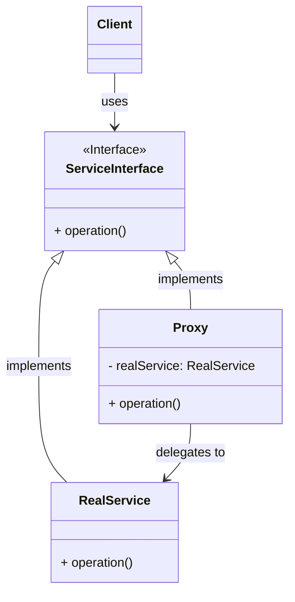

> [!abstract] 一句话核心
> 代理模式（Proxy Pattern）允许你提供一个替代品或占位符对象（代理对象），来控制对另一个原始对象（服务对象）的访问。代理对象充当了原始对象的“中介”，允许你在请求真正到达原始对象之前或之后执行某些操作。

---

## 1. 意图 / 要解决的问题 (The "Why")

> [!question] 这个模式解决了什么痛点？
>
> 痛点在于：我们想要控制对一个对象的访问，但是直接修改这个对象很困难或不合适，或者我们想在访问它之前/之后添加一些额外的逻辑。

我们来看一个具体的“糟糕”场景：

想象一下，你有一个功能强大的对象，但它非常“重”（Massive Object）。比如，一个类负责从数据库执行复杂的查询并加载大量数据。

```java
// 这是一个“重”对象，初始化(构造函数)非常耗时
public class HeavyDatabaseQuery {

    public HeavyDatabaseQuery() {
        // 模拟一个非常耗时的连接和数据加载过程
        System.out.println("Connecting to database, loading 10GB of data...");
        try {
            Thread.sleep(5000); // 假装加载了5秒钟
        } catch (InterruptedException e) {}
        System.out.println("Data loaded.");
    }

    public void runQuery() {
        System.out.println("Executing query...");
    }
}
```

现在，你的应用程序在启动时就创建了这个对象，但实际上**你只是偶尔才需要它**。

```java
// 客户端代码 (问题所在)
public class Application {
    // 问题1：应用一启动，就必须等待5秒钟，即使用户这次根本不用这个功能
    private HeavyDatabaseQuery queryEngine = new HeavyDatabaseQuery();

    public void onUserClickQueryButton() {
        queryEngine.runQuery();
    }

    public void onUserClickOtherButton() {
        // 用户可能只是点了别的按钮，但我们还是白白加载了数据库
        System.out.println("Doing something else...");
    }
}
```

你可能会想，那我就实现**“延迟初始化” (Lazy Initialization)**：只在它真正被需要（即 `onUserClickQueryButton` 被调用）时才创建它。

```Java
// "坏味道"：客户端自己处理复杂的初始化逻辑
public class Application {

    private HeavyDatabaseQuery queryEngine = null; // 1. 先设为 null

    public void onUserClickQueryButton() {
        // 2. 客户端被迫添加复杂的逻辑
        if (queryEngine == null) {
            System.out.println("Client: 'Oh, I need to create the query engine now.'");
            queryEngine = new HeavyDatabaseQuery();
        }
        queryEngine.runQuery();
    }

    // 如果还有其他10个地方也可能用到 queryEngine，怎么办？
    // public void onAdminCheck() {
    //     if (queryEngine == null) { ... } // 3. 到处都是重复代码！
    // }
}
```

这就是痛点：

1. **代码重复**：所有需要这个对象的客户端（`Application` 类，或者其他类）都必须自己实现一遍 `if (obj == null) { obj = new ... }` 这样的延迟初始化逻辑。
2. **违反开闭原则**：我们无法把这个“延迟初始化”逻辑直接塞进 `HeavyDatabaseQuery` 类，因为它可能是一个第三方库，我们无权修改它。

除了延迟初始化，我们还可能想控制访问（例如，检查权限）、记录日志、缓存结果等，这些都会遇到同样的问题。

---

## 2. 解决方案 / 核心思想 (The "What")

> [!tip] 它是如何解决上述问题的？
>
> 核心思想是：创建一个新的“代理”类（Proxy Class），它与原始对象（Service Object）实现相同的接口。 客户端不再直接与原始对象交互，而是转而与这个代理对象打交道。

这个代理类内部控制着对原始对象的访问。

我们来分解一下这个解决方案，看看它是如何解决“延迟初始化”这个痛点的：

1. **创建代理类**：我们创建一个新的 `HeavyDatabaseQueryProxy` 类。
2. **实现相同接口**：为了让客户端（`Application`）无法分辨它是在和“代理”还是“真实对象”打交道，这个代理类必须和原始类 `HeavyDatabaseQuery` 实现**同一个接口**（比如叫 `IQuery`）。（如果原始类没有接口，我们也可以让代理类继承原始类）。
3. **客户端转向**：我们修改客户端代码，让它持有的不再是 `HeavyDatabaseQuery`，而是 `IQuery` 接口，并且在初始化时，我们给它一个 `HeavyDatabaseQueryProxy` 的实例。
4. **代理“接管”工作**：
   - 代理类（`HeavyDatabaseQueryProxy`）在内部持有一个对真实对象（`HeavyDatabaseQuery`）的引用，但一开始将其设为 `null`。
   - 当客户端调用 `proxy.runQuery()` 时，代理会检查它的真实对象引用是否为 `null`。
   - 如果是 `null`，代理会**在这一刻**才去 `new HeavyDatabaseQuery()`，创建真实的“重”对象。
   - 创建完毕后，代理再将 `runQuery()` 这个请求**委托**给真实的 `HeavyDatabaseQuery` 对象去执行。

**最大的好处是什么？**

所有“延迟初始化”的 `if (obj == null)` 脏活累活，现在都**被封装到了代理类中**。

客户端（`Application`）的代码变得极其干净，它根本不知道什么延迟初始化，它只是像往常一样调用 `runQuery()` 方法。

最重要的是，我们**根本没有修改**那个我们不想（或不能）修改的 `HeavyDatabaseQuery` 原始类，就给它增加了新的行为。

---

## 3. 结构与角色 (The "Structure")

> [!note] 模式的蓝图
>
> refactoring-guru 上的 UML 图非常清晰地展示了这种“中介”关系。

### UML 类图



### 参与角色

根据 refactoring-guru 的定义，代理模式包含以下几个核心角色：

- **`Service Interface` (服务接口)**
  - **职责**: 声明了服务（原始对象）的接口。代理对象必须遵循这个接口，才能伪装成原始的服务对象。
  - _对应到我们之前的例子，这就是 `IQuery` 接口。_
- **`Service` (服务 / 真实对象)**
  - **职责**: 这是提供核心业务逻辑的类。它就是那个我们想要控制访问的“重”对象或“远程”对象。
  - _对应到我们之前的例子，这就是 `HeavyDatabaseQuery` 类。_
- **`Proxy` (代理)**
  - **职责**: 这个类拥有一个指向 `Service` 对象的引用字段。当代理完成了它的额外工作（如延迟初始化、日志记录、访问控制、缓存等）之后，它会将请求传递给真正的服务对象。通常，代理会负责管理其服务对象的完整生命周期。
  - _对应到我们之前的例子，这就是 `HeavyDatabaseQueryProxy` 类。_
- **`Client` (客户端)**
  - **职责**: 客户端通过同一个服务接口与服务对象和代理对象进行交互。这使得你可以将代理对象传递给任何期望接收服务对象的代码。
  - _对应到我们之前的例子，这就是 `Application` 类。_

---

## 4. 代码示例 (The "How")

> [!example] Talk is cheap. Show me the code.
>
> 我们将使用 refactoring-guru 提供的 YouTube 库的例子。这个例子不仅展示了延迟初始化，还额外展示了**缓存（Caching Proxy）**功能。

### Before: 重构前的代码

在这个场景中，客户端 `YouTubeManager` 直接依赖于一个效率低下的 `ThirdPartyYouTubeClass`。这个类每次被请求时，都会重新下载视频，即使是同一个视频。

```java
// 这是那个我们无法修改的、效率低下的第三方库
class ThirdPartyYouTubeClass {

    // 模拟API请求和下载
    public String downloadVideo(String videoId) {
        System.out.println("Downloading video " + videoId + " from YouTube...");
        // 模拟网络延迟
        try { Thread.sleep(2000); } catch (InterruptedException e) {}
        System.out.println("Download complete.");
        return "VideoData for " + videoId;
    }

    public String getVideoInfo(String videoId) {
        System.out.println("Fetching video metadata for " + videoId + "...");
        try { Thread.sleep(1000); } catch (InterruptedException e) {}
        return "Title: Cool Video, Duration: 5:00";
    }
}

// 客户端 (问题所在)
public class YouTubeManager {
    // 紧密耦合：直接依赖具体类
    private ThirdPartyYouTubeClass service = new ThirdPartyYouTubeClass();

    public void renderVideoPage(String videoId) {
        // "坏味道"：客户端直接调用了重量级对象
        String info = service.getVideoInfo(videoId);
        String videoData = service.downloadVideo(videoId);
        System.out.println("Rendering video page with info: " + info);
    }
}

// 主程序
public class Application {
    public static void main(String[] args) {
        YouTubeManager manager = new YouTubeManager();

        System.out.println("--- Rendering video 'cat_video_123' for the first time ---");
        manager.renderVideoPage("cat_video_123");

        System.out.println("\n--- Rendering video 'cat_video_123' for the second time ---");
        // 问题：明明是同一个视频，却要重新下载一遍，非常低效
        manager.renderVideoPage("cat_video_123");
    }
}
```

### After: 应用模式后的代码

现在，我们引入代理模式来增加**缓存**功能，而无需修改 `ThirdPartyYouTubeClass`。

```java
// 1. Service Interface (服务接口)
// 我们创建了一个接口，这是代理模式能工作的关键
interface ThirdPartyYouTubeLib {
    String downloadVideo(String videoId);
    String getVideoInfo(String videoId);
}

// 2. Service (真实服务)
// 原始的类现在实现了我们的接口
class ThirdPartyYouTubeClass implements ThirdPartyYouTubeLib {
    @Override
    public String downloadVideo(String videoId) {
        System.out.println("Downloading video " + videoId + " from YouTube...");
        try { Thread.sleep(2000); } catch (InterruptedException e) {}
        System.out.println("Download complete.");
        return "VideoData for " + videoId;
    }

    @Override
    public String getVideoInfo(String videoId) {
        System.out.println("Fetching video metadata for " + videoId + "...");
        try { Thread.sleep(1000); } catch (InterruptedException e) {}
        return "Title: Cool Video, Duration: 5:00";
    }
}

// 3. Proxy (代理)
// 这是我们新建的代理类，它也实现了相同的接口
// 它增加了缓存逻辑
class CachedYouTubeClass implements ThirdPartyYouTubeLib {
    // 持有对真实服务对象的引用
    private ThirdPartyYouTubeLib service;

    // 增加的额外功能：缓存
    private String cachedInfo;
    private String cachedVideo;

    public CachedYouTubeClass(ThirdPartyYouTubeLib service) {
        this.service = service;
    }

    @Override
    public String downloadVideo(String videoId) {
        // 代理的额外逻辑：检查缓存
        if (cachedVideo == null) {
            // 缓存未命中，才委托给真实对象
            cachedVideo = service.downloadVideo(videoId);
        } else {
            System.out.println("Returning cached video...");
        }
        return cachedVideo;
    }

    @Override
    public String getVideoInfo(String videoId) {
        // 代理的额外逻辑：检查缓存
        if (cachedInfo == null) {
            // 缓存未命中，才委托给真实对象
            cachedInfo = service.getVideoInfo(videoId);
        } else {
            System.out.println("Returning cached metadata...");
        }
        return cachedInfo;
    }
}

// 4. Client (客户端)
// 客户端现在通过接口与代理交互
public class YouTubeManager {
    // 客户端只依赖接口，不再依赖具体类
    protected ThirdPartyYouTubeLib service;

    public YouTubeManager(ThirdPartyYouTubeLib service) {
        this.service = service;
    }

    public void renderVideoPage(String videoId) {
        // 客户端的代码保持不变，它不知道自己用的是代理还是真实对象
        String info = service.getVideoInfo(videoId);
        String videoData = service.downloadVideo(videoId);
        System.out.println("Rendering video page with info: " + info);
    }
}

// 主程序 (配置层)
public class Application {
    public static void main(String[] args) {
        // 1. 创建真实的服务对象
        ThirdPartyYouTubeClass realService = new ThirdPartyYouTubeClass();

        // 2. 创建代理对象，并传入真实对象
        CachedYouTubeClass proxy = new CachedYouTubeClass(realService);

        // 3. 客户端现在使用的是代理对象
        YouTubeManager manager = new YouTubeManager(proxy);

        System.out.println("--- Rendering video 'cat_video_123' for the first time ---");
        manager.renderVideoPage("cat_video_123");

        System.out.println("\n--- Rendering video 'cat_video_123' for the second time ---");
        // 成功！第二次访问时，直接从缓存获取，没有重新下载
        manager.renderVideoPage("cat_video_123");
    }
}
```

---

## 5. 优缺点 (Pros & Cons)

> [!todo] 权衡利弊

### 优点 (Pros)

- **可以在客户端不知情的情况下控制服务对象**：代理隐藏了与服务对象的交互细节，客户端感觉就像在直接与服务对象通信。
- **可以在客户端不关心服务对象生命周期的情况下管理它**：例如，代理可以负责延迟初始化、在不再需要时销毁对象等。
- **即使服务对象尚未准备好或不可用，代理也可以工作**：例如，远程代理可以在网络连接断开时提供本地缓存，或者访问控制代理可以阻止未授权的访问。
- **符合开闭原则 (Open/Closed Principle)**：你可以在不修改服务对象或客户端代码的情况下引入新的代理类来增加功能。

### 缺点 (Cons)

- **代码可能变得更复杂**，因为你需要引入许多新的类。
- **服务的响应可能会延迟**：因为代理在将请求传递给服务对象之前或之后需要做额外的工作。

---

## 6. 适用场景 (Applicability)

> [!check] 我应该在什么时候使用它？
>
> - **延迟初始化 (Virtual Proxy)**：当你有一个“重量级”的服务对象，它会消耗大量系统资源，但你又不是时刻都需要它时。代理可以将该对象的初始化推迟到真正需要它的那一刻。
> - **访问控制 (Protection Proxy)**：当你希望只有特定的客户端才能使用服务对象时。代理可以在将请求传递给服务对象之前，检查客户端的凭据或权限。
> - **本地执行远程服务 (Remote Proxy)**：当你要访问的服务对象位于远程服务器上时。代理对象在本地运行，它会封装所有与网络相关的复杂通信细节（如打包请求、发送、接收、解包），让客户端感觉就像在调用本地对象一样。
> - **日志记录 (Logging Proxy)**：当你想要保留对服务对象的请求历史时。代理可以在将请求传递给服务之前记录下请求的详细信息。
> - **缓存请求结果 (Caching Proxy)**：当你需要缓存开销巨大的请求结果，并管理其生命周期时。代理可以为那些重复的、返回相同结果的请求提供缓存。

---

## 7. 现实世界中的应用 (Real-World Examples)

> [!bug] 这个模式在哪些知名项目中被使用过？
>
> - RPC(Remote Procedure Call) 客户端持有一个本地的代理对象（Stub），它看起来就像是远程服务本身。当你调用代理的方法时，代理负责将调用信息序列化，通过网络发送给服务器，接收结果，再反序列化返回给客户端。

---

## 8. 相关模式 (Related Patterns)

> [!link] 与其他模式的联系和区别

- **Adapter (适配器模式)**: `TODO`
  - refactoring.guru 指出，适配器（Adapter）为你提供一个**不同**的接口来访问一个现有对象，而代理（Proxy）提供的是**相同**的接口。装饰器（Decorator）提供的则是一个**增强**的接口。由于我们还没有学习适配器模式，这里暂时标记为 TODO。
- **Decorator (装饰器模式)**: `TODO`
  - refactoring.guru 提到，装饰器（Decorator）和代理（Proxy）的结构相似，但意图非常不同。两者都基于组合原则，即一个对象将部分工作委托给另一个对象。区别在于，代理通常自己管理其服务对象的生命周期，而装饰器的组合通常由客户端控制。由于我们还没有学习装饰器模式，这里暂时标记为 TODO。
- **Facade (外观模式)**: `TODO`
  - refactoring.guru 指出，外观（Facade）与代理（Proxy）相似，因为它们都缓冲了一个复杂实体并自行初始化它。与外观不同的是，代理与其服务对象具有相同的接口，这使得它们可以互换。由于我们还没有学习外观模式，这里暂时标记为 TODO。

## 9. 练习题

### 习题 21-1

在示例程序（代码清单 21-3）中，`PrinterProxy` 类在 `setPrinterName` 方法中生成了 `Printer` 类的实例。但是，`Printer` 类的实例原本不是应该在 `print` 方法中生成的吗？请修改 `PrinterProxy` 类，仅在实际需要执行 `print` 方法时才生成 `Printer` 类的实例。

**相关代码回顾：**

```java
// PrinterProxy.java (原始版本片段)
public class PrinterProxy implements Printable {
    private String name;
    private Printer real; // ★ Printer类的实例

    public PrinterProxy(String name) {
        this.name = name;
    }

    public synchronized void setPrinterName(String name) {
        if (real != null) {
            real.setPrinterName(name);
        }
        this.name = name;
    }

    public String getPrinterName() {
        return name;
    }

    public void print(String string) {
        realize(); // ★ 如果 real 为 null，则调用 realize 生成实例
        real.print(string);
    }

    private synchronized void realize() {
        if (real == null) {
            // ★ 痛点：这里没有生成实例，而是在构造函数或setPrinterName中生成
            // (原始代码并未在setPrinterName中生成，而是在构造函数中延迟生成，
            // 但题目假设它是在setPrinterName中生成的，这里按题意理解)
            // 修正理解：原始代码的realize方法负责生成实例，但题目想问
            // 如果把实例生成放在setPrinterName中会怎样？
            // 再次修正理解：《图解设计模式》P253 PrinterProxy类没有在构造函数生成
            // Printer实例，real初始为null。realize方法负责生成。
            // 题目问的是，为什么不在print方法中直接生成，而是通过realize方法？
            // 题目实际要求：修改代码，使得Printer实例只在print方法被调用时才生成。

            // 根据习题的意图，我们假定原始代码是这样的(虽然书中不是)：
            // public synchronized void setPrinterName(String name) {
            //     if (real == null) { // 假设实例在这里生成
            //          real = new Printer(name);
            //     } else {
            //          real.setPrinterName(name);
            //     }
            //     this.name = name; // 也更新代理的名字
            // }
            // public void print(String string) {
            //      if (real != null) { // 打印前需要确保实例存在
            //          real.print(string);
            //      } else {
            //          System.out.println("Printer not initialized yet via setName.");
            //      }
            // }

            // 现在要求修改为：只在 print 方法内生成
             real = new Printer(name);
        }
    }
}

// Printer.java (相关部分)
public class Printer implements Printable {
    private String name;
    public Printer(String name) { // ★ 构造函数耗时
        this.name = name;
        heavyJob("正在生成 Printer 的实例(" + name + ")");
    }
    // ... print 方法 ...
    private void heavyJob(String msg) { // 模拟耗时操作
        System.out.print(msg);
        for (int i = 0; i < 5; i++) {
            try {
                Thread.sleep(1000);
            } catch (InterruptedException e) {
            }
            System.out.print(".");
        }
        System.out.println("结束。");
    }
}
```

请你思考一下，如何修改 `PrinterProxy` 类来实现这个要求？请尝试写出修改后的 `PrinterProxy` 类的代码。

这部分内容清楚吗？有什么疑问吗？
