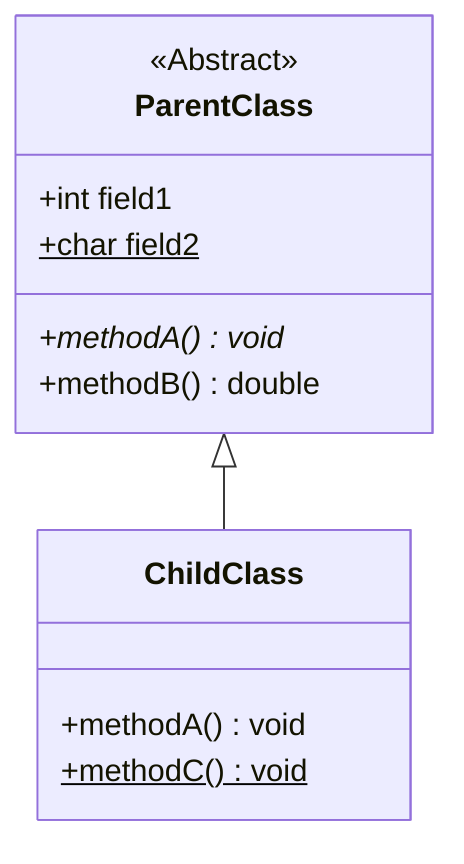

《图解设计模式》

Refactoring Guru

# UML

我感觉得先基本了解一下 UML

http://www.omg.org/spec/uml/

## Class Diagram

类图

```java
abstract class ParentClass {
	int field1;
	static char field2;
	abstract void methodA();
	double methodB() {
		// ...
	}
}

class ChildClass extends ParentClass {
	void methodA() {
		// ...
	}
	static void methodC() {
		// ...
	}
}
```



---

# ToC

## Creational Patterns

- [ ] Factory Method
- [ ] Abstract Factory
- [ ] Builder
- [ ] Prototype
- [ ] Singleton

## Structural Patterns

- [ ] Adapter
- [ ] Bridge
- [ ] Composite
- [ ] Decorator
- [ ] Facade
- [ ] Flyweight
- [ ] Proxy

## Behavioral Patterns

- [ ] Chain of Responsibility
- [ ] Command
- [ ] Iterator
- [ ] Mediator
- [ ] Memento
- [ ] Observer
- [ ] State
- [ ] Strategy
- [ ] Template Method
- [ ] Visitor
