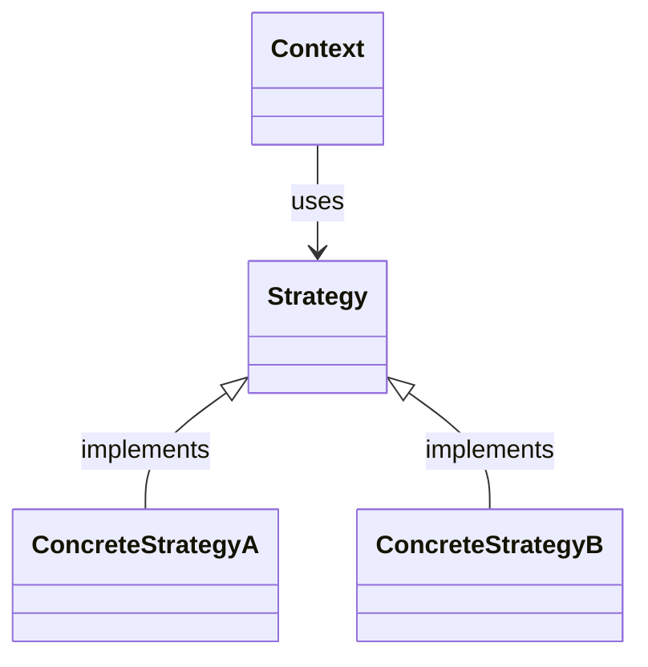

---
aliases:
  - singleton
  - 单例
creation date: 2025-09-02
tags:
  - "#creational"
---

# 模式名称：Singleton

> [!abstract] 一句话核心
> 确保一个类只有一个实例，并提供一个全局访问点来获取这个唯一的实例。

---

## 1. 意图 / 要解决的问题 (The "Why")

> [!question] 这个模式解决了什么痛点？
> 对于某些管理共享资源或全局状态的对象，假如不正确处理，我们可能会遇到两个核心痛点：**资源浪费**和**状态不一致**。

假设这样一个场景，我们需要一个应用程序配置类`AppConfig`，它负责从json或者yaml等等配置文件中读取配置信息，例如数据库地址、API密钥、主题颜色等等。

```plaintext
class AppConfig:
	String db_url;

	public AppConfig():
		// Read from the config
		// and set fields accordingly
		// db_url = ...
```

程序的不同部分可能都需要创建各自的实例，比如说：

`EmailService`模块创建了一个实例，`AppConfig config1 = new AppConfig();`
然后`ApiService`模块也创建了一个实例，`AppConfig config2 = new AppConfig();`

资源浪费：`config1`和`config2`都回去读取硬盘上的同一个配置文件，并且各自在内存中存储一份配置数据。这造成了不必要的I/O开销和内存占用。尤其是数据库连接池、线程池这类重量级资源，多个实例代价很高。

状态不一致：假如AppConfig里面的配置可以在运行时被修改，很有可能一个模块通过类似`config1.setFieldXXX(xxx)`的方式修改了数值而另一个模块持有`config2`并且不知道修改。

因此，需要一个机制来**强制**`AppConfig`这类管理共享资源或全局状态的对象，在整个应用的生命周期中，**有且仅有一个实例**。

---

## 2. 解决方案 / 核心思想 (The "What")

> [!tip] 它是如何解决上述问题的？
> 通过**控制类的实例化过程**来强制实现“唯一实例”的目标。核心思想建立在以下两个基本原则之上：**构造函数私有化**和**提供了一个全局静态访问方法**。

1. **构造函数私有化(Private Constructor):** 为了防止外部代码通过类似`new`这样的关键字随意创建类的实例，我们必须将构造函数声明为`private`也就是只有类本身可以调用它。
2. **提供一个全局静态访问方法(Public Static Access Method):** 类必须提供一个公开的、静态的方法，作为外界获取其唯一实例的**唯一通道**，这个方法通常叫做`getInstance()`。方法内部负责检查实例是否存在：如果已经创建则直接返回；如果尚未创建，先创建实例，然后再返回。

---

## 3. 结构与角色 (The "Structure")

> [!note] 模式的蓝图

### UML 类图

在这里嵌入UML图。你可以使用 PlantUML 插件、Mermaid 插件，或者直接粘贴图片。



### 参与角色

- **`角色A (英文名)`**
  - **职责**: 在此描述这个角色（类/接口）在这个模式中承担的责任。
- **`角色B (英文名)`**
  - **职责**: ...
- **`角色C (英文名)`**
  - **职责**: ...

---

## 4. 代码示例 (The "How")

> [!example] Talk is cheap. Show me the code.

### Before: 重构前的代码

在这里贴上未使用模式前的“坏”代码，并简要注释说明其问题所在。

Java

```
// 注释：这里的 if-else 结构导致每次新增类型都需要修改此类。
public class ProblematicCode {
    public void doSomething(String type) {
        if ("A".equals(type)) {
            // ...
        } else if ("B".equals(type)) {
            // ...
        }
    }
}
```

### After: 应用模式后的代码

在这里贴上应用了设计模式的“好”代码，并用注释标明哪个类对应UML中的哪个角色。

Java

```
// Strategy: 策略接口
interface Strategy {
    void execute();
}

// ConcreteStrategyA: 具体策略A
class ConcreteStrategyA implements Strategy {
    @Override
    public void execute() {
        // ...
    }
}

// Context: 上下文
class Context {
    private Strategy strategy;

    public Context(Strategy strategy) {
        this.strategy = strategy;
    }


    public void executeStrategy() {
        strategy.execute();
    }
}
```

---

## 5. 优缺点 (Pros & Cons)

> [!todo] 权衡利弊

### 优点 (Pros)

- 优点一：...
- 优点二：...

### 缺点 (Cons)

- 缺点一：...
- 缺点二：...

---

## 6. 适用场景 (Applicability)

> [!check] 我应该在什么时候使用它？
>
> 列出一些明确的信号或场景，当你遇到这些情况时，就应该考虑使用此模式。
>
> - 当...
> - 如果...
> - 在...的情况下...

---

## 7. 现实世界中的应用 (Real-World Examples)

> [!bug] 这个模式在哪些知名项目中被使用过？
>
> - **JDK**: 例如 `java.util.Comparator` 就是策略模式的绝佳例子。
> - **Spring Framework**: 例如...
> - **其他框架/库**: ...

---

## 8. 相关模式 (Related Patterns)

> [!link] 与其他模式的联系和区别
>
> - **[[另一个设计模式]]**: 与该模式的关系是...（例如，经常一起使用，或者结构相似但意图不同）。
> - **[[又一个设计模式]]**: 与该模式的区别在于...（帮助你辨析易混淆的模式）。

## 9. 练习题
