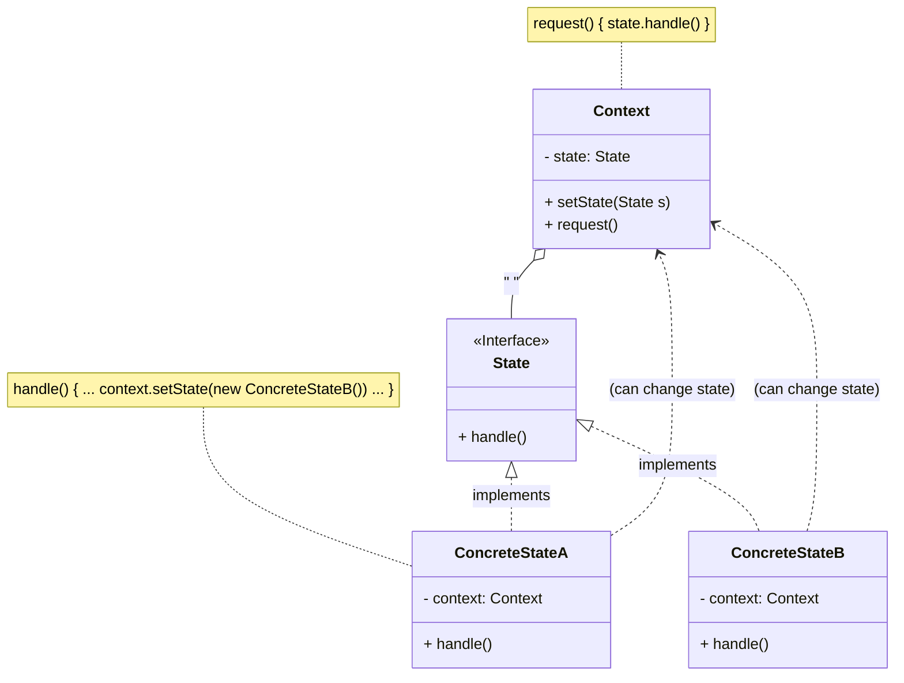

> [!abstract] 一句话核心
> 允许一个对象在其内部状态改变时改变其行为，看起来就好像这个对象改变了它的类。

---

## 1. 意图 / 要解决的问题 (The "Why")

> [!question] State 模式解决了什么痛点？
>
> 核心痛点是：当一个对象有大量状态，并且其行为根据状态的不同而有巨大差异时，使用条件语句（如 if 或 switch）来管理状态的逻辑会变得极其臃服和难以维护。

State 模式与**有限状态机（Finite-State Machine）**的概念密切相关。

我们来想象一个“糟糕”的场景，这在资料 中有详细描述：

假设我们有一个 `Document` (文档) 类。一个文档有三种状态：`Draft` (草稿)、`Moderation` (审核中) 和 `Published` (已发布)。

它的 `publish()` (发布) 方法在不同状态下，行为完全不同：

- 在 `Draft` 状态下，`publish()` 会将文档转为 `Moderation` 状态。
- 在 `Moderation` 状态下，只有当用户是管理员时，`publish()` 才能将其转为 `Published` 状态。
- 在 `Published` 状态下，`publish()` 什么也不做。

如果不使用 State 模式，我们通常会用一个字段来保存当前状态，然后在类的方法中使用巨大的 `switch` 语句来实现这种逻辑：

```java
// "坏味道"：充满了条件判断
class Document {
    private String state; // "draft", "moderation", "published"
    // ...

    public void publish() {
        switch (state) {
            case "draft":
                this.state = "moderation";
                break;
            case "moderation":
                if (currentUser.getRole() == "admin") {
                    this.state = "published";
                }
                break;
            case "published":
                // 什么也不做
                break;
        }
    }

    // 想象一下，如果还有 render(), archive() 等方法...
    // 它们内部也需要类似的 switch 语句
}
```

这种写法的坏处显而易见：

1. **庞大的条件语句**：如果未来增加了更多的状态（比如 `Archived` 归档状态），我们就必须修改 `Document` 类中**所有**包含状态判断的方法，在 `switch` 中增加新的 `case`。
2. **难以维护**：代码变得非常臃肿。对转换逻辑的任何更改都可能需要修改每个方法中的状态条件，这非常困难且容易出错。

---

## 2. 解决方案 / 核心思想 (The "What")

> [!tip] 它是如何解决上述问题的？
>
> 核心思想是：将所有特定于状态的代码提取到一组独立的类中。
>
> State 模式建议为对象的每一种可能状态创建一个新类，然后将所有特定于该状态的行为提取到这个类中。

它是这样做的：

1. **创建状态类（State Classes）**：我们为 `Draft`、`Moderation` 和 `Published` 每种状态都创建一个具体的类（例如 `DraftState`, `ModerationState`, `PublishedState`）。
2. **定义统一接口（State Interface）**：所有这些状态类都实现一个共同的 `State` 接口。这个接口定义了所有状态下都可能被调用的方法（例如 `publish()`）。
3. **引入上下文（Context）**：原始的 `Document` 对象现在被称为**上下文（Context）**。它不再自己实现所有行为，而是持有一个对当前状态对象（例如 `DraftState` 实例）的引用。
4. **委托行为（Delegation）**：当 `Document` 的 `publish()` 方法被调用时，它不再使用 `switch` 语句，而是将这个工作**委托**给它当前持有的那个状态对象来处理。
5. **处理状态转换**：要将 `Document` 转换到另一个状态，只需用代表新状态的新实例来替换掉上下文中引用的那个状态对象即可。

```java
import java.util.Objects; // For simulating currentUser

// --- 1. State: 状态接口 ---
// 定义所有状态共有的方法
interface DocumentState {
    void publish(Document document);
    // 假设还有其他方法，例如 render()
    void render(Document document);
}

// --- 2. Context: 上下文 ---
// Document 类现在是 Context
class Document {
    private DocumentState state; // 持有当前状态对象的引用
    private String content; // 文档内容

    // 模拟当前用户角色 - 在实际应用中会更复杂
    public static class CurrentUser {
        private String role = "user"; // 默认为普通用户
        public String getRole() { return role; }
        public void setRole(String role) { this.role = role; }
    }
    private CurrentUser currentUser = new CurrentUser(); // 模拟当前用户

    public Document() {
        // 初始状态为 DraftState
        this.state = new DraftState();
        this.content = "Initial content";
        System.out.println("Document created in Draft state.");
    }

    // Context 暴露 setter 来改变状态
    public void changeState(DocumentState newState) {
        this.state = newState;
    }

    // Context 将行为委托给当前状态对象
    public void publish() {
        state.publish(this);
    }

    public void render() {
        state.render(this);
    }

    // 供状态类使用的 getter/setter
    public String getContent() { return content; }
    public CurrentUser getCurrentUser() { return currentUser; }
}

// --- 3. Concrete States: 具体状态类 ---
// 实现特定状态下的行为和转换

// 草稿状态
class DraftState implements DocumentState {
    @Override
    public void publish(Document document) {
        System.out.println("Moving document from Draft to Moderation...");
        // 状态转换
        document.changeState(new ModerationState());
    }

    @Override
    public void render(Document document) {
        System.out.println("Rendering document in Draft state (may include watermark): " + document.getContent());
    }
}

// 审核中状态
class ModerationState implements DocumentState {
    @Override
    public void publish(Document document) {
        // 检查用户角色
        if (Objects.equals(document.getCurrentUser().getRole(), "admin")) {
            System.out.println("Admin approved. Moving document from Moderation to Published...");
            document.changeState(new PublishedState());
        } else {
            System.out.println("Only admins can publish from Moderation state. Action denied.");
        }
    }

    @Override
    public void render(Document document) {
        System.out.println("Rendering document in Moderation state (visible to reviewers): " + document.getContent());
    }
}

// 已发布状态
class PublishedState implements DocumentState {
    @Override
    public void publish(Document document) {
        // 在已发布状态下，publish 不做任何事
        System.out.println("Document is already published. No action taken.");
    }

    @Override
    public void render(Document document) {
        System.out.println("Rendering document in Published state (public view): " + document.getContent());
    }
}

// --- 客户端代码 ---
public class Client {
    public static void main(String[] args) {
        Document doc = new Document();

        System.out.println("\n--- Current user is 'user' ---");
        doc.render();
        doc.publish(); // 从 Draft -> Moderation
        doc.render();
        doc.publish(); // 尝试从 Moderation 发布 (失败)

        System.out.println("\n--- Setting current user to 'admin' ---");
        doc.getCurrentUser().setRole("admin");
        doc.publish(); // 从 Moderation -> Published (成功)
        doc.render();
        doc.publish(); // 尝试在 Published 状态发布 (无操作)
    }
}
```

这样一来，`Document` 类中的那些庞大的条件语句就被彻底消除了。

这种方法优雅地解决了第一部分提出的痛点，因为它遵循了两个重要的设计原则：

- **单一职责原则 (Single Responsibility Principle)**：与特定状态相关的代码被组织到各自独立的类中，`Document` 类（Context）不再负责所有状态的管理，只负责委托。
- **开闭原则 (Open/Closed Principle)**：当需要添加一个新状态（如 `Archived`）时，我们只需要创建一个新的状态类，而不需要修改现有的状态类或 `Document` (Context) 类。

---

## 3. 结构与角色 (The "Structure")

> [!note] 模式的蓝图

### UML 类图



### 参与角色

- **`Context` (上下文)**
  - **职责**: 存储一个对当前**具体状态 (Concrete State)** 对象的引用，并将所有与状态相关的工作委托给它。
  - 它通过 `State` 接口与状态对象通信。
  - `Context` 必须暴露一个 "setter" 方法，用于传入一个新的状态对象。
- **`State` (状态接口)**
  - **职责**: 声明特定于状态的方法。这些方法对于所有具体状态都应该是有意义的，以避免某些状态类中包含永远不会被调用的“空”方法。
- **`Concrete States` (具体状态)**
  - **职责**: 为 `State` 接口中声明的方法提供各自的实现。
  - 状态对象可能会持有一个对 `Context` 对象的**反向引用（backreference）**。通过这个引用，状态类可以从 `Context` 获取所需信息，并且能够**发起状态转换**。
  - `Context` 和 `Concrete States` 都可以设置 `Context` 的下一个状态，并通过替换 `Context` 中引用的状态对象来执行实际的状态转换。

---

## 4. 代码示例 (The "How")

> [!example] Talk is cheap. Show me the code.

我们将使用资料 中的 `AudioPlayer` (音频播放器) 示例，因为它非常经典地展示了状态模式。

### Before: 重构前的代码

在应用模式前，我们的 `AudioPlayer` 类会像之前讨论的 `Document` 类一样，内部充满了基于状态的条件判断。

```java
// "坏味道"：一个类中包含了所有状态的逻辑
public class AudioPlayer {
    // 使用一个字符串或枚举来跟踪状态
    private String state; // "READY", "PLAYING", "LOCKED"
    private boolean isPlaying;

    public AudioPlayer() {
        this.state = "READY";
        this.isPlaying = false;
    }

    // clickPlay 方法中充满了条件逻辑
    public void clickPlay() {
        switch (state) {
            case "READY":
                System.out.println("Starting playback...");
                this.isPlaying = true;
                this.state = "PLAYING";
                break;
            case "PLAYING":
                System.out.println("Stopping playback...");
                this.isPlaying = false;
                this.state = "READY";
                break;
            case "LOCKED":
                System.out.println("Player is locked. Do nothing.");
                break;
        }
    }

    // clickLock 方法也一样
    public void clickLock() {
        switch (state) {
            case "READY":
            case "PLAYING":
                System.out.println("Locking the player.");
                this.state = "LOCKED";
                break;
            case "LOCKED":
                System.out.println("Unlocking the player.");
                if (this.isPlaying) {
                    this.state = "PLAYING";
                } else {
                    this.state = "READY";
                }
                break;
        }
    }

    // 想象一下如果还有 clickNext(), clickPrevious()...
    // 这个类会变得非常臃肿！
}
```

### After: 应用模式后的代码

```java
// 1. State: 状态接口
// 定义了所有状态必须响应的方法
// 接口声明了 state-specific 方法
interface State {
    // 状态类可以持有对 Context 的引用，以便进行状态转换
    // Context 被传递到状态构造函数中
    void clickLock(AudioPlayer player);
    void clickPlay(AudioPlayer player);
    void clickNext(AudioPlayer player);
    void clickPrevious(AudioPlayer player);
}

// 2. Context: 上下文
// 存储对当前状态对象的引用
public class AudioPlayer {
    private State state; // 持有一个状态对象
    private boolean isPlaying; // 业务数据
    // ... 其他字段如 volume, playlist

    public AudioPlayer() {
        // 初始状态为 ReadyState
        this.isPlaying = false;
        // Context 总是链接到一个代表当前状态的状态对象
        this.state = new ReadyState();
    }

    // Context 暴露一个 setter 来改变状态
    public void changeState(State state) {
        this.state = state;
    }

    // Context 将执行委托给活动状态
    public void clickLock() {
        state.clickLock(this);
    }

    public void clickPlay() {
        state.clickPlay(this);
    }

    // ... 其他委托方法 ...

    // 状态类可以调用的业务方法
    public void startPlayback() {
        this.isPlaying = true;
        System.out.println("Starting playback...");
    }
    public void stopPlayback() {
        this.isPlaying = false;
        System.out.println("Stopping playback...");
    }
    public boolean isPlaying() {
        return isPlaying;
    }
}


// 3. ConcreteStrategy: 具体状态类
// 提供了 state-specific 方法的实现

// 准备状态
class ReadyState implements State {
    @Override
    public void clickLock(AudioPlayer player) {
        // 状态转换：切换到 LockedState
        player.changeState(new LockedState());
        System.out.println("Player locked.");
    }
    @Override
    public void clickPlay(AudioPlayer player) {
        player.startPlayback();
        // 状态转换：切换到 PlayingState
        player.changeState(new PlayingState());
    }
    // ... clickNext 和 clickPrevious 的实现 ...
    @Override
    public void clickNext(AudioPlayer player) { System.out.println("Playing next song."); }
    @Override
    public void clickPrevious(AudioPlayer player) { System.out.println("Playing previous song."); }
}

// 播放状态
class PlayingState implements State {
    @Override
    public void clickLock(AudioPlayer player) {
        player.changeState(new LockedState());
        System.out.println("Player locked.");
    }
    @Override
    public void clickPlay(AudioPlayer player) {
        player.stopPlayback();
        player.changeState(new ReadyState());
    }
    // ... clickNext 和 clickPrevious 的实现 ...
    @Override
    public void clickNext(AudioPlayer player) { System.out.println("Playing next song."); }
    @Override
    public void clickPrevious(AudioPlayer player) { System.out.println("Playing previous song."); }
}

// 锁定状态
class LockedState implements State {
    @Override
    public void clickLock(AudioPlayer player) {
        // 解锁，并根据之前的状态决定回到 Ready 还是 Playing
        if (player.isPlaying()) {
            player.changeState(new PlayingState());
            System.out.println("Player unlocked, now playing.");
        } else {
            player.changeState(new ReadyState());
            System.out.println("Player unlocked, now ready.");
        }
    }
    // 在锁定状态下，播放/下一首/上一首 按钮都无效
    @Override
    public void clickPlay(AudioPlayer player) { System.out.println("Locked! Do nothing."); }
    @Override
    public void clickNext(AudioPlayer player) { System.out.println("Locked! Do nothing."); }
    @Override
    public void clickPrevious(AudioPlayer player) { System.out.println("Locked! Do nothing."); }
}
```

---

## 5. 优缺点 (Pros & Cons)

> [!todo] 权衡利弊

### 优点 (Pros)

- **单一职责原则 (Single Responsibility Principle)**：该模式将与特定状态相关的代码组织到独立的类中, 使得代码更加清晰。
- **开闭原则 (Open/Closed Principle)**：你可以在不修改现有状态类或 Context 类的情况下, 轻松地引入新状态。
- **简化 Context 类的代码**：通过消除庞大的状态机条件语句 (if/switch)，Context 类的代码变得更加简洁易懂。

### 缺点 (Cons)

- **可能造成过度设计**：如果一个状态机只有少数几个状态, 或者状态很少发生变化, 那么应用这个模式可能会有点小题大做 (overkill)。

---

## 6. 适用场景 (Applicability)

> [!check] 我应该在什么时候使用它？
>
> 根据资料，你应该在以下情况考虑使用 State 模式：
>
> - **当**你有一个对象，它的行为取决于其当前状态，并且状态的数量很多（原文是 "enormous"，意指非常多），而且特定于状态的代码经常变动时。
>   > 该模式建议将所有特定于状态的代码提取到不同的类中。这样，你就可以独立于其他状态添加新状态或更改现有状态，从而降低维护成本。
> - **当**你的类中充斥着庞大的条件语句（`if` 或 `switch`），这些语句根据类字段的当前值来改变类的行为时。
>   > State 模式允许你将这些条件语句的分支提取到相应状态类的方法中。这样做的时候，你还可以清理掉主类中那些只与特定状态相关的临时字段和辅助方法。
> - **当**你在基于条件的状态机中，发现相似状态和转换之间存在大量重复代码时。
>   > State 模式允许你通过创建状态类的层次结构，并将通用代码提取到抽象基类中来减少重复。

---

## 7. 现实世界中的应用 (Real-World Examples)

> [!bug] 这个模式在哪些知名项目中被使用过？

TODO

---

## 8. 相关模式 (Related Patterns)

> [!link] 与其他模式的联系和区别

根据资料，State 模式与其他几个模式有相似之处，但意图不同：

- **[[Strategy]]**:
  - **关系**: State 模式可以被看作是 Strategy 模式的一种扩展。两者都基于**组合 (composition)**：它们都通过将部分工作委托给辅助对象来改变 Context 的行为。
  - **区别**: Strategy 模式通常使得这些策略对象完全**独立**且**互相不知道**对方的存在。然而，State 模式**不限制**具体状态之间的依赖关系，允许它们**随意改变 Context 的状态**。在 State 模式中，状态转换的逻辑通常放在具体状态类内部，或者放在 Context 类内部；而在 Strategy 模式中，通常是由客户端代码来决定何时切换策略。
- **[[Bridge]]**: `TODO`
  - **说明**: 你的学习资料中没有 Bridge 模式的笔记，因此我们暂时不展开讲解 State 与 Bridge 的关系。
- **[[Adapter]]**: `TODO`
  - **说明**: 你的学习资料中没有 Adapter 模式的笔记，因此我们暂时不展开讲解 State 与 Adapter 的关系。
- **共性**: Bridge, State, Strategy (以及某种程度上的 Adapter) 模式具有非常相似的结构。它们都基于**组合**，即将工作委托给其他对象。然而，它们解决的问题是不同的，理解一个模式不仅仅是看它的结构，更要理解它所要解决的问题。

## 9. 练习题
