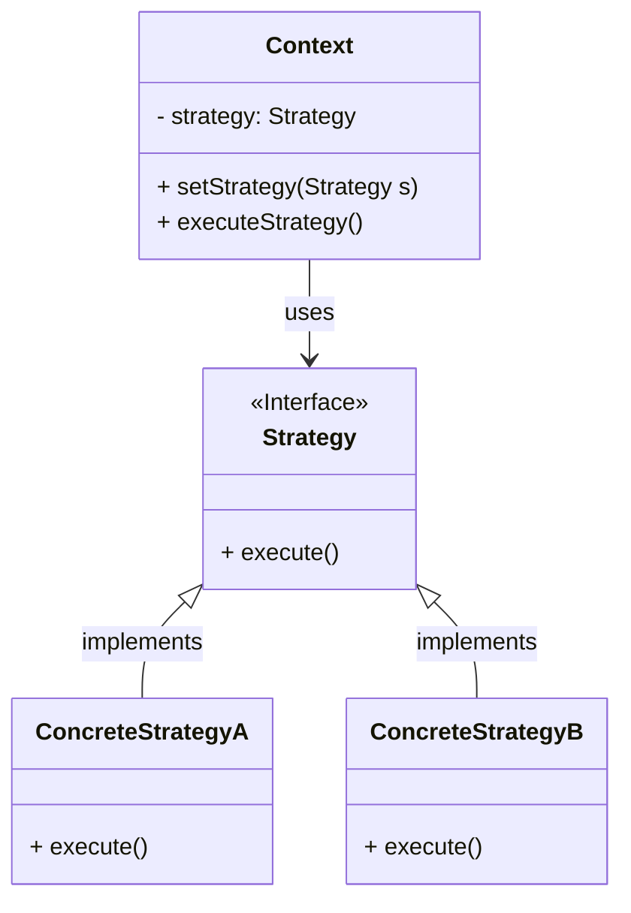

---
aliases:
creation date: 2025-09-17
tags:
  - "#behavioral"
---

> [!abstract] 一句话核心
> 定义一组算法，将每个算法都封装起来，并使它们可以相互替换，从而让算法的变化独立于使用它的客户端。

---

## 1. 意图 / 要解决的问题 (The "Why")

> [!question] 这个模式解决了什么痛点？
> 将一个对象的多种行为（算法）分离开来，使得它们可以独立变化和自由切换。

假设你正在开发一个导航应用。一开始，功能很简单：输入目的地，规划出**驾车**的最快路线。这个功能大受欢迎。

很快，用户需求来了：

- “我喜欢步行，能不能规划**步行**路线？”
- “在大城市，我主要靠**公共交通**，请支持这个功能！”
- “我是个骑行爱好者，想要**自行车**路线。”

如果你把所有这些路径规划算法都写在导航器的同一个主类里，代码会变成什么样子？很可能会是这样：

```java
public class Navigator {
    public Route buildRoute(Point a, Point b, String transportMode) {
        if ("CAR".equals(transportMode)) {
            // 计算驾车路线的复杂逻辑...
            System.out.println("Building a driving route...");
            return new Route();
        } else if ("WALKING".equals(transportMode)) {
            // 计算步行路线的复杂逻辑...
            System.out.println("Building a walking route...");
            return new Route();
        } else if ("PUBLIC_TRANSPORT".equals(transportMode)) {
            // 计算公共交通路线的复杂逻辑...
            System.out.println("Building a public transport route...");
            return new Route();
        }
        // ... 未来可能还有自行车、旅游路线等更多的 else if
        return new Route();
    }
}
```

1. **巨型类 (God Class)**: `Navigator` 类随着新路线规划算法的增加而无限膨胀，违反了**单一职责原则**。它既要负责UI交互，又要知道所有路径规划的细节。
2. **违反开闭原则**: 每当需要添加一种新的交通方式（例如自行车），你都必须修改 `Navigator` 类的 `buildRoute` 方法，在那个巨大的 `if-else` 结构中再加一个分支。这使得代码非常脆弱，修改很容易引入新的bug。
3. **紧密耦合**: `Navigator` 类与所有具体的路径规划算法紧密地耦合在一起。你无法在不改变 `Navigator` 的情况下，独立地测试或复用某一个具体的算法。
4. **难以维护和协作**: 如此庞大的 `if-else` 语句块使得代码难以阅读和维护。如果团队协作，不同的人修改不同的路径算法，会频繁地导致代码合并冲突。

---

## 2. 解决方案 / 核心思想 (The "What")

> [!tip] 它是如何解决上述问题的？
> 策略模式的核心思想是**“分离变化”**。它将易于变化的部分（也就是那些路径规划算法）从不怎么变化的部分（导航器本身）中抽离出来。

做法如下：

1. **识别变化**：我们识别出“路径规划”是应用中变化的部分。驾车、步行、公交，这些都是实现“路径规划”这个概念的不同策略。
2. **定义统一接口（Strategy）**: 创建一个策略接口，比如 `RouteStrategy`。这个接口定义了一个所有具体算法都必须实现的方法，例如 `buildRoute(Point a, Point b)`。这个接口就是它们之间的共同契约。
3. **封装具体算法（Concrete Strategy）**: 为每一种路径规划算法创建一个单独的类，并实现上述的 `RouteStrategy` 接口。例如，我们可以有 `CarStrategy`、`WalkingStrategy` 和 `PublicTransportStrategy` 等类。每个类都只专注于实现自己的算法，完全不知道其他策略的存在。
4. **引入上下文（Context）**: 改造原来的 `Navigator` 类（现在我们称它为 `Context`）。它不再包含庞大的 `if-else` 逻辑。取而代之的是，它内部会持有一个 `RouteStrategy` 接口的引用。
5. **委托执行**: 当 `Navigator` 需要规划路径时，它不会自己去计算，而是将这个任务**委托**给它当前持有的那个策略对象来完成。它只管调用策略接口定义的方法，而无需关心具体是哪个算法在执行。

这样做的优雅之处在于：

- **遵循开闭原则**: 当需要添加新的路径规划方式（比如自行车策略）时，我们只需要创建一个新的策略类 `CyclingStrategy` 即可，完全不需要修改 `Navigator` (Context) 类。系统对扩展是开放的，对修改是关闭的。
- **遵循单一职责原则**: `Navigator` 类的职责变得清晰了，它只负责协调和调用，而每个策略类也只负责一个具体的算法。
- **用组合替代继承**: 对象（`Navigator`）的行为不是在编译时通过继承固定的，而是通过在运行时动态地组合不同的策略对象来改变的。这提供了极大的灵活性。

---

## 3. 结构与角色 (The "Structure")

> [!note] 模式的蓝图

### UML 类图



### 参与角色

- **`Context` (上下文)**
  - **职责**: 维护一个对 `Strategy` 对象的引用。它不执行具体的算法，而是将工作委托给当前关联的策略对象。它提供一个方法（如 `setStrategy`）让客户端可以在运行时更换策略。在我们的例子中，`Navigator` 就是上下文。
- **`Strategy` (策略接口)**
  - **职责**: 定义所有支持的算法的公共接口。`Context` 使用这个接口来调用由 `ConcreteStrategy` 实现的算法。在我们的例子中，这将是 `RouteStrategy` 接口。
- **`ConcreteStrategy` (具体策略)**
  - **职责**: 实现 `Strategy` 接口，封装了具体的算法或行为。每个具体策略类都代表一种算法的实现。例如 `CarStrategy`、`WalkingStrategy`。
- **`Client` (客户端)**
  - **职责**: 创建一个具体的策略对象，并将其传递给 `Context` 对象。客户端需要了解不同的策略，并根据需要决定在何时使用哪种策略。例如，UI上的按钮点击事件处理程序就是客户端。

---

## 4. 代码示例 (The "How")

> [!example] Talk is cheap. Show me the code.

### Before: 重构前的代码

这段代码将所有运算逻辑都耦合在一个类的方法中，每次新增运算（如除法、取模）都需要修改这个方法。

```java
// 注释：这里的 if-else 结构导致每次新增运算都需要修改此类，违反了开闭原则。
public class Calculator {
    public int execute(int a, int b, String operation) {
        if ("add".equals(operation)) {
            return a + b;
        } else if ("subtract".equals(operation)) {
            return a - b;
        } else if ("multiply".equals(operation)) {
            return a * b;
        }
        // 如果要加一个除法，就必须在这里加一个 else if
        return 0; // or throw exception
    }
}

// Client code
public class Main {
    public static void main(String[] args) {
        Calculator calculator = new Calculator();
        int resultAdd = calculator.execute(10, 5, "add");
        System.out.println("10 + 5 = " + resultAdd); // 15

        int resultSubtract = calculator.execute(10, 5, "subtract");
        System.out.println("10 - 5 = " + resultSubtract); // 5
    }
}
```

### After: 应用模式后的代码

应用策略模式后，我们将每种运算都封装到独立的策略类中。`Context` 类负责调用，但不关心具体实现。

```java
// Strategy: 策略接口
interface OperationStrategy {
    int doOperation(int num1, int num2);
}

// ConcreteStrategyA: 具体策略 - 加法
class OperationAdd implements OperationStrategy {
    @Override
    public int doOperation(int num1, int num2) {
        return num1 + num2;
    }
}

// ConcreteStrategyB: 具体策略 - 减法
class OperationSubtract implements OperationStrategy {
    @Override
    public int doOperation(int num1, int num2) {
        return num1 - num2;
    }
}

// ConcreteStrategyC: 具体策略 - 乘法
class OperationMultiply implements OperationStrategy {
    @Override
    public int doOperation(int num1, int num2) {
        return num1 * num2;
    }
}

// Context: 上下文
class Context {
    private OperationStrategy strategy;

    // 可以在构造时传入，也可以通过 setter 动态改变策略
    public void setStrategy(OperationStrategy strategy) {
        this.strategy = strategy;
    }

    public int executeStrategy(int num1, int num2) {
        // 委托给策略对象执行
        return strategy.doOperation(num1, num2);
    }
}

// Client code
public class Main {
    public static void main(String[] args) {
        Context context = new Context();

        // 执行加法
        context.setStrategy(new OperationAdd());
        int resultAdd = context.executeStrategy(10, 5);
        System.out.println("10 + 5 = " + resultAdd); // 15

        // 执行减法
        context.setStrategy(new OperationSubtract());
        int resultSubtract = context.executeStrategy(10, 5);
        System.out.println("10 - 5 = " + resultSubtract); // 5

        // 执行乘法
        context.setStrategy(new OperationMultiply());
        int resultMultiply = context.executeStrategy(10, 5);
        System.out.println("10 * 5 = " + resultMultiply); // 50

        // **重点**：如果现在要增加一个除法运算，只需要增加一个 OperationDivide 类，
        // Context 和其他策略类完全不需要改动！
    }
}
```

---

## 5. 优缺点 (Pros & Cons)

> [!todo] 权衡利弊

### 优点 (Pros)

- **符合开闭原则**：你可以在不修改现有 `Context` 或其他策略的情况下，轻松地引入新的策略。
- **算法实现与客户端代码解耦**：将算法的实现细节从使用它的 `Context` 中分离出来，使得代码更清晰，职责更分明。
- **运行时动态切换算法**：`Context` 可以在运行时根据需要更换其内部的策略对象，从而改变其行为。
- **用组合替代继承**：这是一种比继承更灵活的方式。继承是静态的，在编译时就确定了；而组合是动态的，可以在运行时改变。
- **提高算法的可复用性**：每个算法都被封装在独立的类中，可以在不同的上下文中复用。

### 缺点 (Cons)

- **类数量增加**：该模式会引入许多新的类和接口，如果你的策略数量很少且很少变化，可能会过度设计，使程序结构变得复杂。
- **客户端必须了解所有策略**：客户端需要知道有哪些具体的策略，并自行决定使用哪一个。这种额外的责任有时会使客户端变得复杂。
- **增加了对象间的通信开销**：`Context` 和 `Strategy` 之间需要进行通信。有时 `Context` 可能需要将自身（`this`）传递给 `Strategy` 对象，以便策略能回调 `Context` 获取所需数据，这会造成一定的耦合。

---

## 6. 适用场景 (Applicability)

> [!check] 我应该在什么时候使用它？
>
> - **当**一个对象需要执行某个任务，但该任务有多种不同的实现方式（算法），并且你希望在运行时能动态地选择其中一种。例如，排序有冒泡、快排、归并等算法。
> - **如果**你的代码中有一个庞大的 `if-else` 或 `switch` 语句，用于根据某个条件选择不同的行为。策略模式可以优雅地替代这种结构。
> - **在**你需要将一个类的业务逻辑与其具体的算法实现细节隔离开来的情况下，以便它们可以独立演化。
> - **当**你有许多相似的类，它们唯一的区别就是执行的行为不同时。通过策略模式，可以将这些不同的行为提取出来，用一个 `Context` 类来组合它们，减少代码重复。

---

## 7. 现实世界中的应用 (Real-World Examples)

> [!bug] 这个模式在哪些知名项目中被使用过？
>
> - **JDK**: 例如 `java.util.Comparator` 就是策略模式的绝佳例子。

---

## 8. 相关模式 (Related Patterns)

> [!link] 与其他模式的联系和区别
>
> - **[[333-课程笔记/Others/设计模式/Decorator|Decorator]]**: TODO: lets you change the skin of an object, while [Strategy](https://refactoring.guru/design-patterns/strategy) lets you change the guts.
> - **[[TemplateMethod]]**: TODO: is based on inheritance: it lets you alter parts of an algorithm by extending those parts in subclasses. [Strategy](https://refactoring.guru/design-patterns/strategy) is based on composition: you can alter parts of the object’s behavior by supplying it with different strategies that correspond to that behavior. *Template Method* works at the class level, so it’s static. *Strategy* works on the object level, letting you switch behaviors at runtime.
> - [[State]]: TODO: can be considered as an extension of [Strategy](https://refactoring.guru/design-patterns/strategy). Both patterns are based on composition: they change the behavior of the context by delegating some work to helper objects. *Strategy* makes these objects completely independent and unaware of each other. However, *State* doesn’t restrict dependencies between concrete states, letting them alter the state of the context at will.
> - [[Command]]: TODO: may look similar because you can use both to parameterize an object with some action. However, they have very different intents.

- You can use *Command* to convert any operation into an object. The operation’s parameters become fields of that object. The conversion lets you defer execution of the operation, queue it, store the history of commands, send commands to remote services, etc.
- On the other hand, *Strategy* usually describes different ways of doing the same thing, letting you swap these algorithms within a single context class.

## 9. 练习题

本章练习题对应代码如下：

```java
// Hand.java
package strategy;

public class Hand {
    public static final int HANDVALUE_ROCK = 0;
    public static final int HANDVALUE_SCISSOR = 1;
    public static final int HANDVALUE_PAPER = 2;
    public static final Hand[] hand = {
            new Hand(HANDVALUE_ROCK),
            new Hand(HANDVALUE_SCISSOR),
            new Hand(HANDVALUE_PAPER)
    };
    public static final String[] name = {
            "Rock", "Scissor", "Paper"
    };

    private int handvalue;

    public Hand(int handvalue) {
        this.handvalue = handvalue;
    }

    public static Hand getHand(int handvalue) {
        return hand[handvalue];
    }

    public boolean isStrongerThan(Hand hand) {
        return fight(hand) == 1;
    }

    public boolean isWeakerThan(Hand hand) {
        return fight(hand) == -1;
    }

    private int fight(Hand hand) {
        if (this == hand) {
            return 0;
        } else if ((this.handvalue + 1) % 3 == hand.handvalue) {
            return 1;
        } else {
            return -1;
        }
    }

    public String toString() {
        return name[handvalue];
    }
}
```

```java
// Strategy.java
package strategy;

public interface Strategy {
    public abstract Hand nextHand();

    public abstract void study(boolean win);
}
```

```java
// ProbStrategy.java
package strategy;

import java.util.Random;

public class ProbStrategy implements Strategy{
    private Random random;
    private int prevHandValue = 0;
    private int currHandValue = 0;
    private int[][] history = {
            {1, 1, 1},
            {1, 1, 1},
            {1, 1, 1}
    };

    public ProbStrategy(int seed) {
        random = new Random(seed);
    }


    @Override
    public Hand nextHand() {
        int bet = random.nextInt(getSum(currHandValue));
        int handvalue = 0;
        if (bet < history[currHandValue][0]) {
            handvalue = 0;
        } else if (bet < history[currHandValue][0] + history[currHandValue][1]) {
            handvalue = 1;
        } else {
            handvalue = 2;
        }

        prevHandValue = currHandValue;
        currHandValue = handvalue;
        return Hand.getHand(handvalue);
    }

    @Override
    public void study(boolean win) {
        if (win) {
            history[prevHandValue][currHandValue]++;
        } else {
            history[prevHandValue][(currHandValue + 1) % 3]++;
            history[prevHandValue][(currHandValue + 2) % 3]++;
        }
    }

    private int getSum(int hv) {
        int sum = 0;
        for (int i = 0; i < 3; i++) {
            sum += history[hv][i];
        }
        return sum;
    }
}
```

```java
// WinningStrategy.java
package strategy;

import java.util.Random;

public class WinningStrategy implements Strategy{
    private Random random;
    private boolean won = false;
    private Hand prevHand;

    public WinningStrategy(int seed) {
        random = new Random(seed);
    }

    @Override
    public Hand nextHand() {
        if (!won) {
            prevHand = Hand.getHand(random.nextInt(3));
        }
        return prevHand;
    }

    @Override
    public void study(boolean win) {
        won = win;
    }
}
```

```java
// Player.java
package strategy;

public class Player {
    private String name;
    private Strategy strategy;
    private int wincount;
    private int losecount;
    private int gamecount;

    public Player(String name, Strategy strategy) {
        this.name = name;
        this.strategy = strategy;
    }

    public Hand nextHand() {
        return strategy.nextHand();
    }

    public void win() {
        strategy.study(true);
        wincount++;
        gamecount++;
    }

    public void lose() {
        strategy.study(false);
        losecount++;
        gamecount++;
    }

    public void even() {
        gamecount++;
    }

    public String toString() {
        return "[" + name + ":" + gamecount + " games, " + wincount + " win, " + losecount + " lose]";
    }
}
```

```java
// Main.java
package strategy;

public class Main {
    public static void main(String[] args) {
        int seed1 = 314;
        int seed2 = 15;
        Player player1 = new Player("Taro", new WinningStrategy(seed1));
        Player player2 = new Player("Hana", new ProbStrategy(seed2));

        for (int i = 0; i < 10000; i++) {
            Hand nextHand1 = player1.nextHand();
            Hand nextHand2 = player2.nextHand();
            if (nextHand1.isStrongerThan(nextHand2)) {
                System.out.println("Winner:" + player1);
                player1.win();
                player2.lose();
            } else if (nextHand1.isWeakerThan(nextHand2)) {
                System.out.println("Winner:" + player2);
                player2.win();
                player1.lose();
            } else {
                System.out.println("Even...");
                player1.even();
                player2.even();
            }
        }

        System.out.println("Total result:");
        System.out.println(player1);
        System.out.println(player2);
    }
}
```

### 习题 1

请编写一个随机出手势的`RandomStrategy`类

```java
import java.util.Random;

public class RandomStrategy implements Strategy {
	private Random random;

	public RandomStrategy(int seed) {
		random = new Random(seed);
	}

	public Hand nextHand() {
		return Hand.getHand(random.nextInt(3));
	}

	public void study(boolean win) {
		return;
	}
}
```

### 习题 2

在本章的示例程序中，`Hand`类（代码清单 10-1）的 `fight` 方法负责判断平局。在进行判断时，它使用的表达式不是 `this.handValue == h.value`，而是 `this == h`，请问为什么可以这样写？

### 习题 3

### 习题 4
