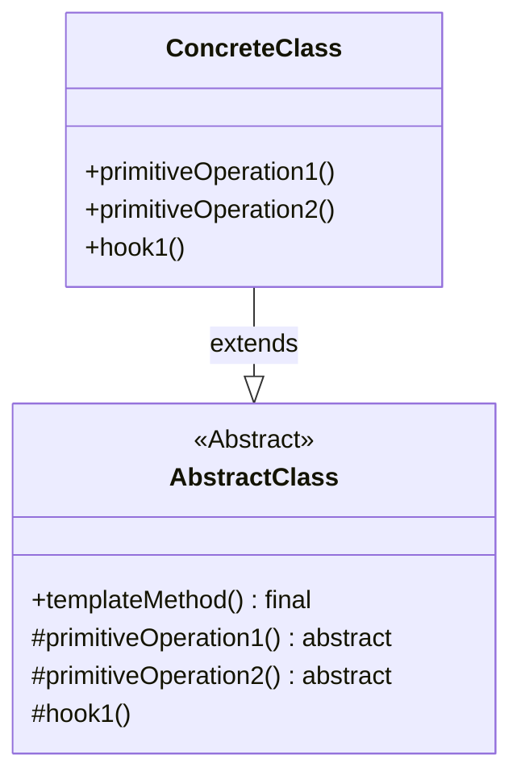

---
aliases:
  - 模版方法
creation date: 2025-10-25
tags:
  - "#behavioral"
---

> [!abstract] 一句话核心
> 模板方法（Template Method）是一种行为设计模式。它在一个父类中定义了一个算法的骨架（即固定的步骤顺序），同时允许子类在不改变该算法结构的前提下，重新定义（覆盖）这个算法中的某些特定步骤。

---

## 1. 意图 / 要解决的问题 (The "Why")

> [!question] 这个模式解决了什么痛点？
>
> 核心痛点是：多个类中存在相同算法骨架，但具体步骤实现不同，导致代码大量重复，且难以维护。

想象一下，你正在创建一个数据挖掘应用程序，用于分析企业文档。用户可以上传不同格式的文档（如 PDF、DOC、CSV），应用程序需要从中提取有用的数据，并以统一的格式生成分析报告。

在应用的第一个版本中，你可能只支持 DOC 文件。接着，在下一个版本中，你增加了对 CSV 文件的支持。一个月后，你又“教会”了它从 PDF 文件中提取数据。

这时，你可能会发现一个问题：这三个用于处理不同文件格式的类（`DocDataMiner`, `CsvDataMiner`, `PdfDataMiner`）中**包含了大量相似的代码**。

虽然解析不同数据格式（如 DOC、CSV、PDF）的代码是完全不同的，但是**数据处理和分析的代码几乎是相同的**。

例如，一个完整的数据挖掘流程可能是这样的：

1. **打开**文件。（_不同格式的文件，打开方式不同_）
2. **提取**数据。（_不同格式的文件，提取逻辑不同_）
3. **解析**数据。（_不同格式的文件，解析逻辑不同_）
4. **分析**数据。（_对所有格式都是通用的分析逻辑_）
5. **生成**报告。（_对所有格式都是通用的报告逻辑_）
6. **关闭**文件。（_不同格式的文件，关闭方式可能不同_）

未使用模板方法模式时，你的代码可能会像这样（伪代码）：

```java
// "坏味道"：三个类中存在大量重复代码
// 处理 DOC 文件
class DocDataMiner {
    public void mineDoc(String path) {
        File file = openFile(path); // 1. 打开 DOC
        String rawData = extractData(file); // 2. 提取 DOC 数据
        Data parsedData = parseData(rawData); // 3. 解析 DOC 数据

        // --- 重复的代码块 开始 ---
        Data analysisResult = analyzeData(parsedData); // 4. 分析数据
        Report report = generateReport(analysisResult); // 5. 生成报告
        System.out.println("Generated report: " + report);
        // --- 重复的代码块 结束 ---

        closeFile(file); // 6. 关闭 DOC
    }
    // ... 打开、提取、解析、关闭 DOC 的私有方法 ...
}

// 处理 CSV 文件
class CsvDataMiner {
    public void mineCsv(String path) {
        File file = openFile(path); // 1. 打开 CSV
        String rawData = extractData(file); // 2. 提取 CSV 数据
        Data parsedData = parseData(rawData); // 3. 解析 CSV 数据

        // --- 重复的代码块 开始 ---
        Data analysisResult = analyzeData(parsedData); // 4. 分析数据
        Report report = generateReport(analysisResult); // 5. 生成报告
        System.out.println("Generated report: " + report);
        // --- 重复的代码块 结束 ---

        closeFile(file); // 6. 关闭 CSV
    }
    // ... 打开、提取、解析、关闭 CSV 的私有方法 ...
}

// 处理 PDF 文件
class PdfDataMiner {
    public void minePdf(String path) {
        // ... 类似的结构，只是打开、提取、解析、关闭的实现不同 ...

        // --- 重复的代码块 开始 ---
        Data analysisResult = analyzeData(parsedData); // 4. 分析数据
        Report report = generateReport(analysisResult); // 5. 生成报告
        // --- 重复的代码块 结束 ---
    }
}
```

这种写法的“坏味道”很明显：

1. **代码重复**：`analyzeData` 和 `generateReport` 的逻辑在所有类中都是相同的。如果你想修改分析算法或报告格式，你必须**同时修改所有这三个类**，非常容易出错且难以维护。
2. **结构不清晰**：算法的整体流程（即那 6 个步骤的顺序）被淹没在每个类的具体实现中。
3. **客户端代码臃肿**：使用这些类的客户端代码（Client）可能还需要写很多 `if-else` 来判断到底该用哪个类的哪个方法，例如：
   ```java
   if (fileType == "DOC") {
       new DocDataMiner().mineDoc(path);
   } else if (fileType == "CSV") {
       new CsvDataMiner().mineCsv(path);
   } else if (fileType == "PDF") {
       new PdfDataMiner().minePdf(path);
   }
   ```

模板方法模式就是要解决这种“**算法结构相同，但具体步骤实现不同**”所导致的代码重复问题。

---

## 2. 解决方案 / 核心思想 (The "What")

> [!tip] 它是如何解决上述问题的？
>
> 模板方法模式建议你将一个算法分解为一系列的步骤，然后将这些步骤转换成方法，最后在一个单独的“模板方法”中定义这些方法的调用顺序。

这个解决方案的核心思想是 **“继承与反转控制”**。

1. 定义算法骨架 (Skeleton)：

   我们创建一个抽象的父类（例如 DataMiner）。在这个父类中，我们定义一个模板方法（例如 mine(path)）。这个模板方法是 final 的（即不许子类重写），它内部明确规定了算法的执行顺序（即骨架）。

   ```java
   // 抽象父类 (AbstractClass)
   public abstract class DataMiner {

       // 这就是 "模板方法"
       public final void mine(String path) {
           File file = openFile(path);       // 1. 打开
           String rawData = extractData(file);   // 2. 提取 (抽象)
           Data parsedData = parseData(rawData); // 3. 解析 (抽象)
           Data analysisResult = analyzeData(parsedData); // 4. 分析 (具体)
           Report report = generateReport(analysisResult); // 5. 生成报告 (具体)
           System.out.println("Generated report: " + report);
           closeFile(file);         // 6. 关闭
       }

       // --- 步骤实现 ---

       // 4, 5: 重复的代码被抽离到父类，成为具体方法
       protected Data analyzeData(Data data) {
           System.out.println("Analyzing data...");
           // ...通用的分析逻辑...
           return new Data(); // analysisResult
       }

       protected Report generateReport(Data data) {
           System.out.println("Generating report...");
           // ...通用的报告逻辑...
           return new Report();
       }

       // 1, 6: 可以是通用的，也可以是抽象的（取决于需求）
       protected File openFile(String path) {
           System.out.println("Opening file at " + path);
           return new File(path);
       }
       protected void closeFile(File file) {
           System.out.println("Closing file...");
       }

       // 2, 3: 变化的步骤，定义为 "抽象步骤"
       protected abstract String extractData(File file);
       protected abstract Data parseData(String rawData);
   }
   ```

2. **分离“不变”与“可变”**：
   - **不变的部分**：算法的**结构**（`mine` 方法中的调用顺序）和**通用步骤**（如 `analyzeData`、`generateReport`）被定义在父类中。
   - **可变的部分**：那些因情况而异的具体步骤（如 `extractData`、`parseData`）在父类中被声明为 `abstract` (抽象) 方法。

3. 子类实现细节：

   现在，我们让 DocDataMiner、CsvDataMiner 和 PdfDataMiner 继承这个抽象的 DataMiner 父类。它们不再需要重复编写通用的分析和报告逻辑，它们唯一的职责就是实现那些抽象的、特有的步骤。

   ```java
   // 具体的子类 (ConcreteClass)
   public class DocDataMiner extends DataMiner {
       @Override
       protected String extractData(File file) {
           // ... 实现 DOC 特有的数据提取逻辑 ...
           return "doc_raw_data";
       }
       @Override
       protected Data parseData(String rawData) {
           // ... 实现 DOC 特有的数据解析逻辑 ...
           return new Data(); // parsedData
       }
   }

   public class CsvDataMiner extends DataMiner {
       @Override
       protected String extractData(File file) {
           // ... 实现 CSV 特有的数据提取逻辑 ...
           return "csv_raw_data";
       }
       @Override
       protected Data parseData(String rawData) {
           // ... 实现 CSV 特有的数据解析逻辑 ...
           return new Data(); // parsedData
       }
   }
   ```

4. 钩子 (Hooks)：

   有时候，某些步骤不是必须的，而是“可选”的。这时，我们可以在父类中提供一个默认的空实现（而不是 abstract 方法）。这就称为“钩子”。子类可以选择性地覆盖（Override）这个钩子方法，以在算法的特定位置“挂上”额外的行为。

   例如，我们可以在 `analyzeData` 之前加一个 `beforeAnalyze` 钩子：

   ```java
   // 在 DataMiner 父类中
   protected void beforeAnalyze() {
       // 默认什么也不做
   }

   // 在模板方法 mine() 中调用它
   // ...
   Data parsedData = parseData(rawData);
   beforeAnalyze(); // <-- 调用钩子
   Data analysisResult = analyzeData(parsedData);
   // ...
   ```

   如果 `CsvDataMiner` 在分析前需要特殊的预处理，它就可以覆盖这个钩子，而 `DocDataMiner` 则可以忽略它。

通过这种方式，模板方法模式将算法的骨架固定在父类，将变化的实现细节“外包”给了子类，从而消除了重复代码，并保持了算法结构的统一。

---

## 3. 结构与角色 (The "Structure")

> [!note] 模式的蓝图

### UML 类图

这是模板方法模式的UML类图，它清晰地展示了父类和子类之间的关系。



### 参与角色

这个模式主要由两个角色构成：

1. **`AbstractClass` (抽象类)**
   - **职责**:
     1. 它定义了一个或多个**抽象的**步骤（`primitiveOperation`），这些步骤由子类来实现。
     2. 它实现了一个**模板方法**（`templateMethod`），这个方法是算法的骨架。模板方法会按照既定的顺序调用各个步骤（包括抽象步骤和其他具体步骤）。
     3. （可选）它还可以包含一些所有子类共享的具体步骤（通用实现）或“钩子”（`hook`，即提供默认空实现的可选步骤）。
   - _在《图解设计模式》的例子中，`AbstractDisplay` 类扮演此角色。_

2. **`ConcreteClass` (具体类)**
   - **职责**:
     1. 它继承 `AbstractClass`。
     2. 它负责实现（或覆盖）父类中定义的一个或多个**抽象步骤**（`primitiveOperation`）。
     3. 它**不能**覆盖模板方法本身（通常模板方法被声明为 `final`）。
   - _在《图解设计模式》的例子中，`CharDisplay` 和 `StringDisplay` 类扮演此角色。_

---

## 4. 代码示例 (The "How")

> [!example] Talk is cheap. Show me the code.

我们将使用《图解设计模式》第 3 章中的示例程序。这个程序的功能是定义一个“显示”的框架，该框架会“打开”，然后“打印”5 次，最后“关闭”。

### Before: 重构前的代码

想象一下，在没有使用模板方法模式之前，如果你想实现两种显示方式：一种是显示字符，一种是显示字符串。你可能会写出两个独立的类，它们内部的逻辑非常相似：

```java
// "坏味道"：display() 方法中的算法结构（先 open，再循环 print，最后 close）是重复的。

// 假设这是显示字符的类
class CharDisplay {
    private char ch;
    public CharDisplay(char ch) {
        this.ch = ch;
    }

    public void display() {
        // 1. 打开
        System.out.print("<<");

        // 2. 循环打印 5 次
        for (int i = 0; i < 5; i++) {
            System.out.print(ch);
        }

        // 3. 关闭
        System.out.println(">>");
    }
}

// 假设这是显示字符串的类
class StringDisplay {
    private String str;
    private int width;
    public StringDisplay(String str) {
        this.str = str;
        this.width = str.getBytes().length;
    }

    public void display() {
        // 1. 打开
        printLine();

        // 2. 循环打印 5 次
        for (int i = 0; i < 5; i++) {
            System.out.println("|" + str + "|");
        }

        // 3. 关闭
        printLine();
    }

    private void printLine() {
        System.out.print("+");
        for (int i = 0; i < width; i++) {
            System.out.print("-");
        }
        System.out.println("+");
    }
}
```

这里的痛点是：`display()` 方法中“循环 5 次”这个**算法骨架**在两个类中都重复了。如果将来需求改成“循环 3 次”，你就必须修改所有这些类。

### After: 应用模式后的代码

现在，我们应用模板方法模式，将这个固定的算法骨架抽离到父类中。

#### 1. AbstractClass (抽象类)

`AbstractDisplay` 类定义了模板方法 `display()`。这个方法是 `final` 的，它规定了算法的骨架（`open` -> 5 次 `print` -> `close`）。而变化的步骤 `open`, `print`, `close` 则被声明为 `abstract`，交由子类实现。

```java
// 代码清单 3-1: AbstractDisplay.java
public abstract class AbstractDisplay {
    // 抽象方法 (1): 交给子类去实现
    public abstract void open();

    // 抽象方法 (2): 交给子类去实现
    public abstract void print();

    // 抽象方法 (3): 交给子类去实现
    public abstract void close();

    // 模板方法：实现了算法的骨架
    public final void display() {
        open();                     // 首先打开
        for (int i = 0; i < 5; i++) {
            print();                // 循环调用 5 次 print
        }
        close();                    // 最后关闭
    }
}
```

#### 2. ConcreteClass (具体类)

`CharDisplay` 类继承 `AbstractDisplay`，它只需要关心如何实现 `open`, `print`, `close` 三个步骤即可，无需关心它们何时被调用。

```java
// 代码清单 3-2: CharDisplay.java
public class CharDisplay extends AbstractDisplay { // 是 AbstractDisplay 的子类
    private char ch;

    // 构造函数
    public CharDisplay(char ch) {
        this.ch = ch;
    }

    @Override
    public void open() {
        // 重写父类的抽象方法，显示开始字符 "<<"
        System.out.print("<<");
    }

    @Override
    public void print() {
        // 重写父类的抽象方法，显示字段 ch 中的字符
        System.out.print(ch);
    }

    @Override
    public void close() {
        // 重写父类的抽象方法，显示结束字符 ">>"
        System.out.println(">>");
    }
}
```

`StringDisplay` 是另一个具体类，它也只实现这三个抽象方法。

```java
// 代码清单 3-3: StringDisplay.java
public class StringDisplay extends AbstractDisplay { // 是 AbstractDisplay 的子类
    private String string;
    private int width;

    public StringDisplay(String string) {
        this.string = string;
        this.width = string.getBytes().length; // 计算字节长度
    }

    @Override
    public void open() {
        // 重写的 open 方法，调用 printLine 画线
        printLine();
    }

    @Override
    public void print() {
        // print 方法，给字符串前后加上 "|" 并显示
        System.out.println("|" + string + "|");
    }

    @Override
    public void close() {
        // close 方法，也调用 printLine 画线
        printLine();
    }

    private void printLine() {
        System.out.print("+");
        for (int i = 0; i < width; i++) {
            System.out.print("-");
        }
        System.out.println("+");
    }
}
```

#### 3. 客户端 (Main)

客户端 `Main` 类使用这些子类。注意，它将子类实例（`d1`, `d2`）保存在了父类 `AbstractDisplay` 类型的变量中。客户端只管调用 `display()` 方法，具体的行为（是打印 `H` 还是打印 `Hello, world.`）则由传入的具体子类决定。

```java
// 代码清单 3-4: Main.java
public class Main {
    public static void main(String[] args) {
        // 生成一个 CharDisplay 类的实例
        AbstractDisplay d1 = new CharDisplay('H');

        // 生成一个 StringDisplay 类的实例
        AbstractDisplay d2 = new StringDisplay("Hello, world.");

        // 客户端调用 display，实际行为取决于 d1 (CharDisplay) 的实现
        d1.display();

        // 客户端调用 display，实际行为取决于 d2 (StringDisplay) 的实现
        d2.display();
    }
}
```

**运行结果：**

```text
<<HHHHH>>
+-------------+
|Hello, world.|
|Hello, world.|
|Hello, world.|
|Hello, world.|
|Hello, world.|
+-------------+
```

---

## 5. 优缺点 (Pros & Cons)

> [!todo] 权衡利弊

### 优点 (Pros)

1. **代码复用和消除重复**：
   - 你可以将多个子类共有的算法骨架以及通用的步骤实现一次性地放在父类中，避免在每个子类中重复编写相同的逻辑。这使得代码更易于维护，如果需要修改通用逻辑，只需修改父类一处即可。

2. **定义算法框架，让子类专注细节**：
   - 模板方法模式允许你在父类中定义一个算法的整体结构（骨架），而将具体实现的细节（抽象步骤）留给子类。这使得子类的开发者可以专注于实现特定的步骤，而不必关心整个算法的流程。

3. **限制子类的修改范围**：
   - 通过将模板方法声明为 `final`，你可以确保算法的核心结构不会被子类意外修改。子类只能改变算法中的特定步骤，而不能改变步骤的顺序或省略某些步骤。

### 缺点 (Cons)

1. **对子类的限制**：
   - 有些客户端（子类）可能会觉得父类提供的算法骨架限制太多，无法满足它们特定的需求。因为算法的结构是固定的，子类只能填充特定的“坑”，不能改变流程。

2. **可能违反里氏替换原则 (LSP)**：
   - 当子类通过覆盖父类中的具体步骤（尤其是钩子方法）来抑制或改变父类的默认行为时，可能会引入违反里氏替换原则的风险。即，一个期望使用父类对象的代码，如果传入了一个行为大相径庭的子类对象，可能会出错。

3. **维护困难（当步骤过多时）**：
   - 如果模板方法包含的步骤非常多，那么这个模板方法本身以及需要子类实现的抽象方法也会很多，这可能会使得代码难以理解和维护。

---

## 6. 适用场景 (Applicability)

> [!check] 我应该在什么时候使用它？
>
> 在以下情况下，你应该考虑使用模板方法模式：
>
> - 当你想让客户端（子类）只扩展算法中的特定步骤，而不是整个算法或其结构时。
> - 当你手头有多个类，它们包含几乎相同的算法，只在某些微小的步骤上有所不同时。如果不使用此模式，当算法发生变化时，你可能需要去修改所有这些相关的类。模板方法可以将这些重复的代码抽离到父类中。

---

## 7. 现实世界中的应用 (Real-World Examples)

> [!bug] 这个模式在哪些知名项目中被使用过？
> TODO

---

## 8. 相关模式 (Related Patterns)

> [!link] 与其他模式的联系和区别

1. **[[FactoryMethod|Factory Method (工厂方法)]]**
   - **关系**：工厂方法模式可以看作是模板方法模式的一个**特殊应用**或**特例**。在工厂方法模式中，父类（Creator）定义了一个创建产品对象的**模板方法**（通常包含一个调用抽象 `factoryMethod` 的步骤），而将**具体创建哪个产品**的决定权留给了子类（ConcreteCreator）去实现那个抽象的 `factoryMethod`。
   - **反之**：同样，一个工厂方法（即子类实现的具体创建逻辑）也可以作为一个大型模板方法算法中的**一个步骤**。

2. **[[Strategy|Strategy (策略)]]**
   - **核心区别**：两者都允许改变算法的某些部分，但实现方式不同。
     - **模板方法** 使用 **继承**：它在父类中定义算法骨架，子类通过**覆盖**（override）父类的某些（抽象）方法来改变特定步骤的行为。这种改变是**静态**的，在编译时确定。
     - **策略模式** 使用 **组合/委托**：它将不同的算法封装在独立的策略对象中，`Context` 类通过**持有**一个策略对象的引用，并将工作**委托**给它来改变行为。这种改变是**动态**的，可以在运行时切换策略对象。
   - **改变范围**：模板方法通常只改变算法的**部分步骤**，而策略模式倾向于替换**整个算法**。

## 9. 练习题

### 习题 3-1

Java `java.io.InputStream` 类使用了 Template Method 模式。请阅读官方文档（JDK 的参考资料），从中找出需要用 `java.io.InputStream` 的子类去实现的方法。

根据《图解设计模式》附录 A 提供的解答，`java.io.InputStream` 类中需要子类去实现的（即扮演抽象步骤角色的）是 `read()` 方法。

其他方法，如 `read(byte b[], int off, int len)`、`skip`、`available`、`close` 等，它们会调用这个抽象的 `read()` 方法，因此它们可以被看作是模板方法（或者说，它们构成了使用 `read()` 这个基本操作的算法骨架的一部分）。

### 习题 3-2

`AbstractDisplay` 类 (代码清单 3-1) 的 `display` 方法如下所示：

```java
public final void display() {
    open();
    for (int i = 0; i < 5; i++) {
        print();
    }
    close();
}
```

这里使用了修饰符 `final`。请问这是想表达什么意思呢？

在 Java 中，`final` 关键字用在方法上，意味着这个方法**不能被子类覆盖 (override)**。

在模板方法模式中，`display()` 方法定义了算法的**骨架**或**流程**（先 `open`，再 5 次 `print`，最后 `close`）。这个流程是父类 `AbstractDisplay` 规定好的，不希望子类去修改这个固定的流程。子类的责任仅仅是实现 `open`, `print`, `close` 这些**具体步骤**，而不是改变步骤的**顺序**或**次数**。

因此，将 `display()` 方法声明为 `final`，就是为了强制**保护这个算法骨架不被子类篡改**，确保模板方法定义的流程得以严格执行。

### 习题 3-3

如果想要让示例程序中的 `open`、`print`、`close` 方法可以被具有继承关系的类（即子类）和同一程序包中的类调用，但是不能被无关的其他类调用，应当怎么做呢？

应该使用 `protected` 访问修饰符。

- **同一包内 (Same Package)**：同一个包内的所有类都可以访问被声明为 `protected` 的成员（方法或字段）。
- **子类 (Subclass)**：即使子类位于不同的包中，它也可以访问其父类中被声明为 `protected` 的成员。
- **其他包中的非子类 (Other Packages, Non-Subclass)**：无法访问。

这正好满足了题目的要求：允许子类和同包类访问，但不允许无关的其他类访问。

在 `AbstractDisplay` 类中将 `open`、`print`、`close` 声明为 `protected` 是一个常见且合理的设计选择。

```java
public abstract class AbstractDisplay {
    // 使用 protected
    protected abstract void open();
    protected abstract void print();
    protected abstract void close();

    public final void display() {
        open();
        for (int i = 0; i < 5; i++) {
            print();
        }
        close();
    }
}
```

### 习题 3-4

Java 中的接口 (Interface) 与抽象类 (Abstract Class) 很相似。接口同样也是抽象方法的集合。但是在 Template Method 模式中，我们却**无法**使用接口来扮演 `AbstractClass` (抽象类) 角色。

请问这是为什么呢？

提示：思考一下 `AbstractClass` 角色的两个主要职责。

`AbstractClass` 角色有两个关键职责：

1. **声明**抽象方法（`open`, `print`, `close`），这些方法的具体实现交给子类。
2. **实现**一个具体的模板方法（`display`），这个方法定义了调用各个步骤（包括抽象方法）的**固定顺序和逻辑**，也就是算法的骨架。

而 Java 中的接口（在 Java 8 引入默认方法之前）**只能包含抽象方法**，它本身**无法提供具体的方法实现**。因此，接口无法实现那个包含算法骨架的、具体的 `display()` 方法。

虽然 Java 8 之后接口可以有 `default` 方法（即具体实现），理论上可以用接口模拟模板方法，但通常还是使用抽象类，因为：

- 抽象类更能清晰地表达“这是一个基础实现骨架，需要子类来完善”的意图。
- 抽象类可以包含实例变量（字段）和 `protected` 成员，这在实现模板方法时可能更方便。

所以，结论就是：因为模板方法模式需要在父类中**实现**算法的骨架（模板方法），而不仅仅是声明接口，所以通常使用抽象类而不是接口来扮演 `AbstractClass` 角色。
