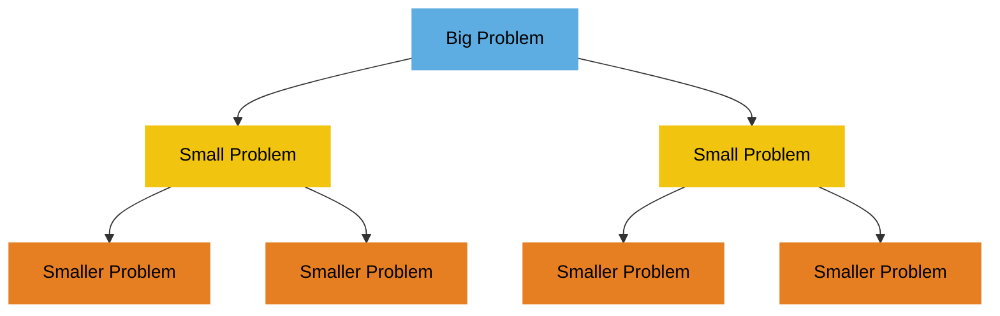

# Divide and Conquer

## Toc

1. slides02 - Karatsuba 乘法 & BigO
2. slides03 - Merge Sort
3. slides04 - Selection
4. SLides05 - Closest Pair
5. slides06 - FFT

TODO: 上面的这点内容需要调整格式

## 第二课 Karatsuba & BigO

### 一、 课程主题与目标 [cite: 2, 81]

- **核心主题:**
  - 分治算法 (Divide and Conquer) [cite: 2, 11]
  - Karatsuba 整数乘法 [cite: 2, 27]
  - Strassen 矩阵乘法 [cite: 50]
  - 算法时间复杂度分析 (渐进分析) [cite: 2, 52]
- **学习目标:**
  - 理解分治算法的基本思想和应用 [cite: 81]
  - 掌握 Karatsuba 和 Strassen 算法的原理和复杂度分析 [cite: 81]
  - 掌握 Big O 等渐进符号的定义和使用，用于分析算法效率 [cite: 81]

### 二、 整数乘法 (Integer Multiplication)

#### 1. 基础方法 (小学乘法 / Grade School Multiplication)

- **过程:** 模拟手算过程 [cite: 4]。
- **复杂度分析:**
  - 大约需要 $n^2$ 次个位数乘法 [cite: 5]。
  - 总共大约 $O(n^2)$ 次个位数操作 (包括加法) [cite: 6, 7]。

#### 2. 分治法的初步尝试

- **思路:** 将 n 位数 x 和 y 分别拆成两半：$x = a \cdot 10^{n/2} + b$, $y = c \cdot 10^{n/2} + d$ [cite: 15]。
- **计算:** $xy = ac \cdot 10^n + (ad+bc) \cdot 10^{n/2} + bd$ [cite: 15]。需要计算 $ac, ad, bc, bd$ 四个 $n/2$ 位数的乘积 [cite: 26]。
- **复杂度分析:**
  - 递归关系: $T(n) = 4T(n/2) + O(n)$ (加法和移位操作为 $O(n)$)。
  - 结果: $O(n^2)$ [cite: 21, 22]，与基础方法相同，没有改进 [cite: 25]。
  - 分析方法: 递归树，叶子节点总数为 $4^{\log_2 n} = n^2$ [cite: 20, 21, 22]。

#### 3. Karatsuba 算法 [cite: 27]

- **核心思想:** 减少乘法次数。计算 $ac$, $bd$, 以及 $z = (a+b)(c+d)$ [cite: 29]。
- **关键:** $ad+bc = z - ac - bd$ [cite: 29]。这样只需要三次 $n/2$ 位数的乘法 [cite: 30]。
- **计算:** $xy = ac \cdot 10^n + (z - ac - bd) \cdot 10^{n/2} + bd$ [cite: 29]。
- **复杂度分析:**
  - 递归关系: $T(n) = 3T(n/2) + O(n)$ [cite: 80] (加减法和移位仍为 $O(n)$ [cite: 79])。
  - 结果: $O(n^{\log_2 3}) \approx O(n^{1.58})$ [cite: 32, 33, 80]。
  - **结论:** Karatsuba 算法优于基础乘法和朴素分治法 [cite: 8, 9]。

#### 4. 更优算法简介 (可选) [cite: 39, 41]

- Toom-Cook: 分成更多块，如 $n/3$，复杂度 $O(n^{\log_3 5}) \approx O(n^{1.465})$ [cite: 39, 40]。
- Schonhage-Strassen (基于 FFT): $O(n \log n \log \log n)$ [cite: 41]。
- Furer (2007): $O(n \log n \log^* n)$ [cite: 41]。
- Harvey and van der Hoeven (2019): $O(n \log n)$ [cite: 41]。

### 三、 矩阵乘法 (Matrix Multiplication)

#### 1. 基础方法

- **过程:** 根据定义 $Z_{ik} = \sum_{j=1}^n X_{ij} Y_{jk}$ [cite: 43]。
- **复杂度分析:** 需要计算 $n^2$ 个元素，每个元素需要 n 次乘法，总共 $O(n^3)$ 次乘法 [cite: 44]。

#### 2. 分治法的初步尝试

- **思路:** 将 n x n 矩阵拆分为 4 个 n/2 x n/2 的子矩阵 [cite: 46]。
- **计算:** $[\begin{smallmatrix} A & B \\ C & D \end{smallmatrix}] [\begin{smallmatrix} E & F \\ G & H \end{smallmatrix}] = [\begin{smallmatrix} AE+BG & AF+BH \\ CE+DG & CF+DH \end{smallmatrix}]$ [cite: 46]。需要 8 次 n/2 规模的矩阵乘法 [cite: 47]。
- **复杂度分析:**
  - 递归关系: $T(n) = 8T(n/2) + O(n^2)$ (矩阵加法为 $O(n^2)$)。
  - 结果: $O(n^3)$ [cite: 48]，没有改进。

#### 3. Strassen 算法 [cite: 50]

- **核心思想:** 通过巧妙的加减法构造 7 个中间矩阵 ($P_1$ 到 $P_7$)，使得最终结果可以用这 7 个矩阵的线性组合表示，从而将乘法次数降为 7 次 [cite: 50]。
- **复杂度分析:**
  - 递归关系: $T(n) = 7T(n/2) + O(n^2)$。
  - 结果: $O(n^{\log_2 7}) \approx O(n^{2.81})$ [cite: 51]。
  - **结论:** Strassen 算法优于基础矩阵乘法和朴素分治法。

### 四、 算法分析基础

#### 1. 计算模型 (Computation Model) [cite: 53]

- **Word RAM 模型:** [cite: 56]
  - 模拟 C 等语言，内存随机访问 (RAM) [cite: 56, 58]。
  - 基本操作 (算术运算、逻辑运算、内存访问) 视为单位时间 $O(1)$ [cite: 56]。
  - 字长 (Word Size) w: 假设 $w = O(\max\{\log n, \log a_i\})$，即字长足够存储地址和输入数据的大小 [cite: 60, 61]。

#### 2. 时间复杂度 (Time Complexity)

- **定义:** $T(n)$ = 算法处理规模为 n 的输入所需的最大（最坏情况 Worst-case）单位操作次数 [cite: 66, 67]。

#### 3. 渐进分析符号 (Asymptotic Notations)

- **Big O (O) - 上界:** $T(n) = O(g(n))$ 表示 $\exists C>0, n_0$, 使得 $\forall n > n_0, T(n) \le C \cdot g(n)$ [cite: 72, 73]。关注增长趋势，忽略常数因子和低阶项 [cite: 71]。
- **Big Omega (Ω) - 下界:** $T(n) = \Omega(g(n))$ 表示 $\exists C>0, n_0$, 使得 $\forall n > n_0, T(n) \ge C \cdot g(n)$ [cite: 73, 74]。
- **Big Theta (Θ) - 紧界:** $T(n) = \Theta(g(n))$ 表示 $T(n) = O(g(n))$ 且 $T(n) = \Omega(g(n))$ [cite: 74]。
- **Little o (o) - 严格上界:** $T(n) = o(g(n))$ 表示 $\forall C>0, \exists n_0$, 使得 $\forall n > n_0, T(n) < C \cdot g(n)$ (即 $T(n)$ 的增长比 $g(n)$ 慢) [cite: 77]。
- **Little omega (ω) - 严格下界:** $T(n) = \omega(g(n))$ 表示 $\forall C>0, \exists n_0$, 使得 $\forall n > n_0, T(n) > C \cdot g(n)$ (即 $T(n)$ 的增长比 $g(n)$ 快) [cite: 77]。
- **示例:** $103n^2+5n+101 = \Theta(n^2)$[cite: 68, 75], $n^2 = \omega(n)$, $\log_2 n = \Theta(\ln n)$ [cite: 75]。

### 五、 总结与思考

- **分治法:** 重要的算法设计策略，将大问题分解为小问题解决 [cite: 12]。
- **复杂度优化:** Karatsuba 和 Strassen 通过减少递归中的乘法次数来降低整体复杂度。
- **渐进分析:** Big O 等符号是衡量和比较算法效率的关键工具。
- **课堂思考题:** (记录 PPT 中提出的问题，例如 $n^2$ is not $O(n)$, $3^n \ne O(2^n)$ 的证明[cite: 75], 函数 f, g 使得 $f(n) \ne O(g(n))$ 且 $f(n) \ne \Omega(g(n))$ 是否存在？[cite: 76] 等)

---

TODO: 下面全都是临时笔记，

引例：整数相乘

两个 n 位数的整数相乘：

- $n^2$次 1 位数相乘
- $n^2$次进位加法
- $n$次$2n$个数相加

所以总共$5n^2$次 1 位数的运算，时间复杂度是$O(n^2)$

有没有别的更好的办法。



# 分治法与运行时间分析：整数乘法

## 第 1 页：标题页

大家好！今天我们要学习的主题是"分治法与运行时间分析"，特别聚焦在整数乘法上。这是算法设计与分析中非常基础且重要的内容，将为我们后续学习更复杂的算法打下基础。

## 第 2 页：今日目标

在开始正式内容前，让我们先明确今天的学习目标：

1. 我们将学习 Karatsuba 整数乘法算法，这是一个经典的分治算法
2. 我们会深入理解"分治法"这一重要的算法设计技术
3. 我们会介绍算法分析的基础工具——渐近分析

这些内容不仅对理解算法非常重要，也是你们未来设计高效算法的基础。

## 第 3 页：算法的起源

在深入算法之前，让我们先了解一下"算法"这个词的起源。这个词来源于 9 世纪波斯数学家 Muhammad ibn Musa al-Khwarizmi 的名字。

"Dixit algorizmi"是一本介绍他工作的拉丁文著作，意为"算法说"。在古法语中，"Algorisme"指的是阿拉伯数字系统，最终演变为我们今天使用的"Algorithm"。

所以，当我们讨论算法时，我们实际上是在延续一个有着 1200 多年历史的数学传统！这是不是很有趣？

## 第 4 页：整数乘法

现在，让我们从一个简单的问题开始：如何计算两个整数的乘积？

比如，44×34，我们在小学就学过怎么计算。再比如 123555589×987555321，虽然数字大了些，但方法是一样的。

【在黑板上写出计算过程】

这种方法看起来很直观，对吧？但当我们面对非常大的数字时，这种方法的效率如何呢？

## 第 5 页：算法效率问题

想象一下，如果我们需要计算这样两个超大数字的乘积：
123555589124435234523465324 × 875553211231231231231233123

这时，我们就需要考虑算法的效率了。我们需要问：这种传统的乘法算法需要执行多少次基本操作？

## 第 6 页：传统乘法的复杂度

让我们分析一下传统乘法算法的复杂度。假设我们有两个 n 位数相乘：

首先，我们需要进行约 n² 次单位数字乘法，因为每一位都需要与另一个数的每一位相乘。

然后，我们还需要约 n² 次加法操作来处理进位。

最后，我们需要约 n² 次加法来合并所有部分积。

总的来说，我们大约需要 5n² 次基本操作。这个 5 是个常数，不太重要，但 n² 这个增长率是我们关心的。

## 第 7 页：时间复杂度表示

当我们讨论算法效率时，常常使用大 O 表示法来描述时间复杂度。

无论是 5n²、4n² 还是 100000n²，我们都可以简单地表示为 O(n²)，因为我们关心的是增长率，而不是具体的常数系数。

现在，假设我们有两个算法：

- 算法 A 需要 5n² 次操作
- 算法 B 需要 100n^1.6 次操作

哪个更好？对于足够大的 n 值，100n^1.6 比 5n² 更优，因为 n^1.6 的增长率慢于 n²。

这就是为什么我们说 O(n^1.6)比 O(n²)更好。

## 第 8 页：提出问题

那么问题来了：我们能否设计出比传统乘法更高效的算法？有没有比 O(n²)更好的整数乘法算法？

这就是我们今天要探讨的核心问题。

## 第 9 页：分治法

为了解决这个问题，我们需要引入一个强大的算法设计技术：分治法。

分治法的基本思想是：

1. 将一个大问题分解为几个小问题
2. 递归地解决这些小问题
3. 将小问题的解组合起来得到大问题的解

【指着幻灯片上的图】看这个图，我们从一个大问题开始，将它分解为更小的问题，然后再分解，直到问题足够小，可以直接解决。

这种方法在很多经典算法中都有应用，比如归并排序、快速排序等。现在，我们来看看如何将它应用到整数乘法中。

## 第 10 页：乘法的分治法应用

让我们以 1234×5678 为例，看看如何应用分治法：

我们可以将 1234 分解为 12×100 + 34，将 5678 分解为 56×100 + 78。

然后：
1234×5678 = (12×100 + 34)(56×100 + 78)
= 12×56×10000 + 12×78×100 + 34×56×100 + 34×78

这样，我们就将一个 4 位数的乘法分解为 4 个 2 位数的乘法。

大家能看出这种方法的优势吗？【等待学生回应】

## 第 11 页：一般化分治乘法

现在，让我们将这种思想一般化。对于两个 n 位数 x 和 y 的乘法：

我们可以将 x 表示为 a·10^(n/2) + b，将 y 表示为 c·10^(n/2) + d，其中 a、b、c、d 都是 n/2 位数。

那么：
x·y = (a·10^(n/2) + b)(c·10^(n/2) + d)
= ac·10^n + (ad + bc)·10^(n/2) + bd

这样，我们就将一个 n 位数乘法分解为几个 n/2 位数乘法。

如果 n 不是 2 的幂怎么办？实际应用中，我们可以通过补零使其成为 2 的幂，或者调整算法以处理任意长度。

## 第 12 页：分析运行时间

现在，关键问题来了：这种分治方法是否比传统方法更高效？

对于 n 位数乘法，我们需要多少次单位数字乘法？
A: n² B: n³ C: n D: nlogn

让我们通过分析来回答这个问题。

首先，考虑 1234×5678 这个例子。我们将其分解为 4 个 2 位数乘法：12×56、12×78、34×56、34×78。每个 2 位数乘法又可以进一步分解...

对于 8 位数乘法，我们需要多少次单位数字乘法？让我们通过递归树来分析。

## 第 13 页：分析

【在黑板上画递归树】

第 0 层：1 个问题，规模为 n×n
第 1 层：4 个问题，每个规模为(n/2)×(n/2)
第 2 层：16 个问题，每个规模为(n/4)×(n/4)
...

第 k 层：4^k 个问题，每个规模为(n/2^k)×(n/2^k)
...
第 log₂n 层：4^(log₂n)个问题，每个规模为 1×1

在最后一层，我们有 4^(log₂n) = n² 个单位乘法。

## 第 14 页：分析(续)

所以，我们的结论是：这种分治方法需要 n² 次单位数字乘法，与传统方法相同！

这可能让人有些失望，因为我们希望分治法能带来效率提升。但别急，我们还有改进的空间。

问题出在哪里呢？让我们仔细分析一下。

## 第 15 页：实验结果

如果我们实际测试这两种方法，会发现传统的乘法算法在实践中表现更好。这是因为分治法引入了额外的递归开销，而没有减少基本操作的数量。

但这只是我们第一次尝试应用分治法。接下来，让我们看看如何真正提高效率。

## 第 16 页：问题所在

问题出在哪里？让我们再看一下分解公式：

x·y = (a·10^(n/2) + b)(c·10^(n/2) + d)
= ac·10^n + (ad + bc)·10^(n/2) + bd

我们需要计算 ac、ad+bc 和 bd。但在当前的方法中，我们分别计算了 ac、ad、bc 和 bd，总共 4 个乘法。

有没有办法减少乘法次数呢？

## 第 17 页：Karatsuba 算法

这就是 Karatsuba 在 1960 年代提出的巧妙方法。他发现，我们可以只用 3 次乘法就完成计算：

1. 计算 ac
2. 计算 bd
3. 计算(a+b)(c+d)

然后，我们可以通过以下方式得到 ad+bc：
(a+b)(c+d) - ac - bd = ac + ad + bc + bd - ac - bd = ad + bc

最终：
x·y = ac·10^n + [(a+b)(c+d) - ac - bd]·10^(n/2) + bd

这样，我们就将 4 次乘法减少到了 3 次！这看似微小的改进，实际上会带来显著的效率提升。

## 第 18 页：改进

让我们总结一下改进：

- 原来：1 个 n 位数乘法需要 4 个 n/2 位数乘法
- 现在：1 个 n 位数乘法只需要 3 个 n/2 位数乘法

这个改进会如何影响时间复杂度呢？让我们分析一下。

## 第 19 页：时间复杂度分析

与之前类似，我们通过递归树分析 Karatsuba 算法的复杂度：

第 0 层：1 个问题
第 1 层：3 个问题，每个规模为 n/2
第 2 层：9 个问题，每个规模为 n/4
...
第 t 层：3^t 个问题，每个规模为 n/2^t
...
第 log₂n 层：3^(log₂n)个问题，每个规模为 1

3^(log₂n) = n^(log₂3) ≈ n^1.585

所以，Karatsuba 算法的时间复杂度为 O(n^1.585)，明显优于传统算法的 O(n²)！

## 第 20 页：考虑加法操作

当然，我们还需要考虑加法操作。在每一层，我们需要进行一定数量的加法：

第 0 层：O(n)的加法
第 1 层：3 个问题，每个需要 O(n/2)的加法，总共 O(3n/2)
...

分析表明，加法操作的总复杂度也是 O(n^1.585)，所以整体复杂度仍为 O(n^1.585)。

这是一个显著的改进！从 O(n²)到 O(n^1.585)，对于大数字乘法，这意味着巨大的速度提升。

## 第 21 页：更好的算法

实际上，整数乘法算法的发展并没有止步于 Karatsuba。后来又出现了更高效的算法：

- Toom-Cook 算法(1963)：O(n^1.465)
- Schönhage-Strassen 算法(1971)：O(n log n log log n)
- Fürer 算法(2007)：O(n log n log\* n)
- Harvey 和 van der Hoeven 算法(2019)：O(n log n)

这些算法越来越复杂，但效率也越来越高。特别是最新的 Harvey 和 van der Hoeven 算法，他们认为这可能是整数乘法问题的理论极限。

下周我们将学习 FFT(快速傅里叶变换)，它是 Schönhage-Strassen 算法的基础。

## 第 22 页：矩阵乘法

现在，让我们转向另一个重要问题：矩阵乘法。

对于两个 2×2 矩阵的乘法：
[2 9] [1 2] = [2×1+9×3 2×2+9×4] = [29 40]
[7 5] [3 4] [7×1+5×3 7×2+5×4] [22 34]

对于 n×n 矩阵，传统的乘法需要 n³ 次标量乘法。我们能否应用类似的分治思想来提高效率呢？

## 第 23 页：矩阵乘法的分治法

我们可以将 n×n 矩阵分解为 4 个 n/2×n/2 的子矩阵：

[A B] [E F] = [AE+BG AF+BH]
[C D] [G H] [CE+DG CF+DH]

这需要 8 次 n/2×n/2 矩阵乘法。通过递归分析，我们发现这种方法的复杂度仍为 O(n³)。

所以，简单的分治并没有提高矩阵乘法的效率。但是，有没有更巧妙的方法呢？

## 第 24 页：Strassen 的方法

1969 年，Strassen 提出了一个惊人的发现：矩阵乘法可以只用 7 次(而不是 8 次)n/2×n/2 矩阵乘法！

他定义了 7 个巧妙的中间结果：
P₁ = A(F-H)
P₂ = (A+B)H
...
P₇ = (A-C)(E+F)

然后通过这些中间结果计算最终结果。

这将时间复杂度降为 O(n^(log₂7)) ≈ O(n^2.81)，是一个显著的改进！

## 第 25 页：运行时间分析

现在，让我们进入算法分析的更形式化部分：运行时间分析。

## 第 26 页：计算模型

当我们讨论算法的"快慢"时，我们实际上是在讨论什么？

对于整数乘法，我们计算单位数字乘法的次数。
对于矩阵乘法，我们计算整数乘法的次数。

但对于一般算法，我们需要一个更通用的计算模型。计算机的基本操作是什么？这就引出了我们下一个话题：计算模型。

## 第 27 页：Word RAM 模型

在本课程中，我们主要使用 Word RAM 模型，这是由 Michael Fredman 和 Dan Willard 在 1990 年提出的，用来模拟 C 等编程语言的行为。

在这个模型中，以下操作被视为单位时间操作：

- 数组访问：a[i] ← a[j]
- 基本算术：a[i] ← a[j] + a[k]
- 基本乘法：a[i] ← a[j] × a[k]
  ...

这个模型假设内存是随机访问的，每个内存单元可以存储一个"字"(word)，通常是 O(log n)位。

## 第 28 页：课程中的大多数问题

在本课程中，我们处理的大多数问题都是：

- 输入：n 个不同的整数/单词
- 任务：排序、查找最大值等

我们引入"transdichotomous"假设：

- n ≤ 2^w (需要一个指针来存储地址)
- a_i ≤ 2^w (希望在一个字中存储每个整数)

为了避免字长 w 对算法效率的不公平影响，我们假设 w = O(max{log n, log a_i})，这是满足基本需求的最小值。

## 第 29 页：图灵机模型

简要提一下图灵机模型，它与 Word RAM 模型有两个主要区别：

1. w = O(1)，即字长是常数
2. 单位操作更基本：
   - 移动一步
   - 只有逻辑操作

图灵机是理论计算机科学的基础，但在算法分析中，我们通常使用更实用的 Word RAM 模型。

## 第 30 页：示例程序

让我们通过一个简单的程序来理解时间复杂度分析：

```
1: int sum=0,n;         +1
2: input(n);            +1
3: int a[n];            +n
4: input(a);            +n
5: for i=0 to n         +n
6:    sum+=a[i];        +n
7: output(sum);         +1
```

我们逐行分析每行代码执行的次数，最终得出总复杂度为 O(n)。

## 第 31 页：时间复杂度

形式化定义算法的运行时间：

- 给定算法和大小为 n 的输入 I(n)
- 运行时间 t_I(n)是执行的单位时间操作数

这个定义帮助我们精确地讨论算法效率。

## 第 32 页：最坏情况时间复杂度

在实践中，我们通常关注最坏情况时间复杂度：
T(n) = max\_{所有输入 I(n)} t_I(n)

这是因为最坏情况给出了算法性能的上界，保证算法在任何输入下都不会比这更差。

## 第 33 页：大 O 表示法

时间复杂度表达式通常很复杂，比如：
T(n) = 103n² + 5n + 101

为了简化，我们使用大 O 表示法，只关注增长率最快的项，忽略常数因子和低阶项：
T(n) = O(n²)

这使我们能够更清晰地比较不同算法的效率。

## 第 34 页：大 O 表示法的定义

正式定义大 O 表示法：

- f(n) = O(g(n))表示存在常数 c 和 n₀，使得对所有 n > n₀，有 f(n) ≤ c·g(n)

类似地，我们定义：

- 大 Ω 表示法(下界)：f(n) = Ω(g(n))表示存在常数 c 和 n₀，使得对所有 n > n₀，有 f(n) ≥ c·g(n)
- 大 Θ 表示法(紧确界)：f(n) = Θ(g(n))当且仅当 f(n) = O(g(n))且 f(n) = Ω(g(n))

这些表示法帮助我们精确描述算法的效率特性。

## 第 35 页：讨论

让我们思考一些关于渐近表示法的问题：

1. 证明 n² 不是 O(n)
   如果 n² 是 O(n)，则存在常数 c，使得对于足够大的 n，有 n² ≤ c·n，即 n ≤ c。但 n 可以任意大，所以这是不可能的。

2. 对于多项式 p(n) = a_k·n^k + ... + a_1·n + a_0，其中 a_k > 0，证明 p(n) = Θ(n^k)
   对于足够大的 n，高阶项 a_k·n^k 会主导整个多项式的增长。

3. 证明 3^n 不是 O(2^n)
   如果 3^n 是 O(2^n)，则存在常数 c，使得对于足够大的 n，有 3^n ≤ c·2^n，即(3/2)^n ≤ c。但(3/2)^n 随 n 增长而无限增大，所以这是不可能的。

这些问题帮助我们深入理解渐近表示法的含义和应用。

## 第 36 页：小 o 和小 ω 表示法

除了大 O、大 Ω 和大 Θ，我们还有小 o 和小 ω 表示法：

- 小 o 表示法(非紧上界)：f(n) = o(g(n))表示对任意常数 c > 0，存在 n₀，使得对所有 n > n₀，有 f(n) < c·g(n)
- 小 ω 表示法(非紧下界)：f(n) = ω(g(n))表示对任意常数 c > 0，存在 n₀，使得对所有 n > n₀，有 f(n) > c·g(n)

这些表示法提供了更精细的增长率比较。

## 第 37-38 页：Karatsuba 算法伪代码

让我们回顾 Karatsuba 算法的伪代码：

```
Karatsuba(n, x[n], y[n]):
1. if n = 1 return x × y
2. a ← x[1:n/2], b ← x[n/2+1:n]
3. c ← y[1:n/2], d ← y[n/2+1:n]
4. ac ← Karatsuba(n/2, a, c)
5. bd ← Karatsuba(n/2, b, d)
6. z ← Karatsuba(n/2, a+b, c+d)
7. xy ← ac·10^n + (z - ac - bd)·10^(n/2) + bd
8. return xy
```

这个伪代码清晰地展示了 Karats

---

# Slides03

## ToC

1. 排序问题与插入排序 (Insertion Sort)：首先明确排序问题的定义，然后复习一个基础的排序算法——插入排序，分析它的工作原理和时间复杂度。(幻灯片 2-17 页)
2. 归并排序 (Merge Sort)：深入学习另一个基于分治思想的排序算法——归并排序。重点理解其“分”、“治”、“合”的步骤，特别是如何高效地合并两个已排序的列表。(幻灯片 19-49 页)
3. 归并排序的效率分析: 建立归并排序运行时间的递推关系式，并学习使用主定理 (Master Theorem) 来求解这个关系式，从而得到其时间复杂度。(幻灯片 50-62 页)
4. 计算逆序对 (Counting Inversions)：理解逆序对的概念及其应用场景，并思考如何使用分治法来解决这个问题。(幻灯片 63-67 页)
5. 合并与计数 (Merge & Count)：学习如何在归并排序的“合并”步骤中同时计算跨越两个子列表的逆序对数量，从而设计出一个高效的计算逆序对的算法。(幻灯片 75-94 页)

# 课堂笔记：分治法 - 排序与计算逆序对

**上下文**: 此笔记承接 Karatsuba 乘法、分治法 (Divide and Conquer) 基础概念及渐近分析 (大 O 表示法) 的学习。

**本节目标**: [source: 206]

- 学习两种排序算法：插入排序和归并排序。
- 学习计算逆序对的问题及其与归并排序的联系。
- 理解算法正确性的证明方法（主要是归纳法和循环不变式）。
- 掌握算法时间复杂度的分析方法（递推关系、主定理、摊还分析/Charging Argument）。

---

## 1. 排序问题 (Sorting Problem)

[source: 2]

- **输入**: 一个包含 $n$ 个（无序）整数的集合 $X = \{x_1, x_2, ..., x_n\}$。
- **输出**: 包含同样 $n$ 个整数的序列，但按照升序（从小到大）排列。
- **例子**: 输入 `[1, 10, 5, 26, 3, 4, 16, 4, 2]`，输出 `[1, 2, 3, 4, 4, 5, 10, 16, 26]`。

---

## 2. 插入排序 (Insertion Sort)

[source: 4, 5]

- **算法思想**: 模拟整理扑克牌的过程。维护一个已排序子序列，从未排序部分每次取出一个元素，插入到已排序子序列的**正确位置**，使得子序列保持有序。
- **过程**:
  1.  从第二个元素开始，将其视为待插入元素。
  2.  将待插入元素与已排序子序列中的元素从后向前比较。
  3.  如果已排序元素大于待插入元素，则将该元素后移一位。
  4.  重复步骤 3，直到找到一个小于等于待插入元素的已排序元素，或达到子序列开头。
  5.  将待插入元素插入到最后空出的位置。
  6.  对所有未排序元素重复此过程。
- **例子 (简要)**: 对 `[1, 10, 5, 26, ...]` 排序
  - `[1]` -> `[1, 10]`
  - 插入 5: 与 10 比 (小)，与 1 比 (大)，插入 -> `[1, 5, 10]`
  - 插入 26: 与 10 比 (大)，插入 -> `[1, 5, 10, 26]`
  - ...以此类推 [source: 6-39]
- **时间复杂度分析**: [source: 41, 44]
  - 需要插入 $n-1$ 个元素。
  - 对于第 $k$ 个元素，在**最坏情况**下（例如输入是逆序的），需要与前面 $k-1$ 个已排序元素进行比较和移动。
  - 总操作次数大约为 $1 + 2 + ... + (n-1) = \frac{n(n-1)}{2}$。
  - 因此，时间复杂度为 $O(n^2)$。
- **正确性证明 (归纳法)**: [source: 45-48]
  - **循环不变式**: 在第 $k$ 次迭代（插入第 $k$ 个元素）**完成之后**，数组的前 $k$ 个元素是排序好的。
  - **基础情况 (k=1)**: 处理完第一个元素后，只包含一个元素的子数组自然是有序的。
  - **归纳假设**: 假设处理完前 $k-1$ 个元素后，它们是有序的。
  - **保持**: 当插入第 $k$ 个元素时，算法通过比较找到其正确的位置 $i$，使得 $a_1, ..., a_{i-1} \le a_k \le a_{i+1}, ..., a_k$ （$a_{i+1}$ 到 $a_k$ 是原 $i$ 到 $k-1$ 的元素后移）。将 $a_k$ 放入位置 $i$ 后，前 $k$ 个元素仍然保持有序。
  - **结论**: 循环结束后（$k=n$），整个数组有序。

---

## 3. 归并排序 (Merge Sort)

$O(n^2)$ 在 $n$ 较大时效率较低，归并排序是基于分治法的更优选择。

- **算法思想 (分治法)**: [source: 50-52]
  1.  **分解 (Divide)**: 将 $n$ 个元素的序列分成两个各含 $n/2$ 个元素的子序列。 [source: 54]
  2.  **解决 (Recurse)**: 递归地使用归并排序对两个子序列进行排序。 [source: 54]
  3.  **合并 (Combine)**: 将两个**已排序**的子序列合并成一个最终的有序序列。 [source: 55]
- **关键步骤：合并 (Merge)**: [source: 70-73]
  - **目标**: 将两个已排序的列表 A (长度 $n$) 和 B (长度 $m$) 合并成一个有序列表 C。
  - **低效方法**: 将 B 中元素逐个插入 A ($O(nm)$)。[source: 71]
  - **高效方法 (线性时间 $O(n+m)$)**: [source: 72, 73]
    1.  设置两个指针 $i=1$ (指向 A), $j=1$ (指向 B)。
    2.  比较 $A[i]$ 和 $B[j]$。
    3.  将较小的元素复制到 C，并移动相应指针 ($i++$ 或 $j++$)。
    4.  重复直至一个列表遍历完。
    5.  将另一列表中剩余元素直接复制到 C 末尾。
  - **Merge 函数正确性证明 (循环不变式)**: [source: 121, 46]
    - **循环不变式**: 在 `Merge` 函数主循环的每次迭代开始时，已生成的输出列表 C 包含 A 和 B 中全局最小的 $k = (i-1) + (j-1)$ 个元素，并且 C 本身是有序的。
    - **初始化**: 循环前 $i=1, j=1$, $C$ 为空 ($k=0$)，不变式成立。
    - **保持**: 假设不变式成立。若 $A[i] \le B[j]$，将 $A[i]$ 加入 C， $i++$。由于 $A[i]$ 是 A, B 剩余元素中最小的之一，且 $\ge$ C 中所有元素，故新 C 有序。新 C 包含 $k+1$ 个最小元素（因为 $A[i]$ 就是第 $k+1$ 小的）。若 $B[j] < A[i]$ 同理。不变式得以保持。
    - **终止**: 循环结束时（如 B 耗尽），C 包含最小的 $k$ 个元素且有序。将 A 中剩余的 $A[i...n]$ 追加到 C。由于 A 剩余元素 $\ge$ C 中所有元素，且自身有序，最终 C 包含所有元素且完全有序。
- **归并排序整体正确性证明 (归纳法)**: [source: 122]
  - **基础情况 (n=0 或 n=1)**: 列表已有序，算法正确返回。
  - **归纳假设**: 假设对所有规模小于 $n$ 的列表，归并排序都能正确排序。
  - **归纳步骤 (规模为 n)**:
    1.  **分解**: 分成两个规模约为 $n/2$ 的子列表 L 和 R ($< n$)。
    2.  **解决**: 根据归纳假设，`MergeSort(L)` 和 `MergeSort(R)` 返回正确排序的 `SortedL` 和 `SortedR`。
    3.  **合并**: 调用 `Merge(SortedL, SortedR)`。根据 `Merge` 函数的正确性证明，它会返回一个包含 L 和 R 所有元素且完全有序的列表。
  - **结论**: 归并排序对任意 $n$ 都能正确排序。
- **时间复杂度分析**: [source: 130-132]
  - **递推关系**:
    - 分解: $O(1)$
    - 解决: $2T(n/2)$
    - 合并: $O(n)$ (使用高效 Merge)
    - $T(n) = 2T(n/2) + O(n)$
  - **主定理 (Master Theorem)**: [source: 134] 用于求解 $T(n) = aT(n/b) + O(n^d)$
    1.  若 $a < b^d \implies T(n) = O(n^d)$
    2.  若 $a > b^d \implies T(n) = O(n^{\log_b a})$
    3.  若 $a = b^d \implies T(n) = O(n^d \log n)$
  - **应用于归并排序**: [source: 141, 142]
    - $a=2, b=2, d=1$。
    - $a = 2$, $b^d = 2^1 = 2$。
    - $a = b^d$，属于情况 3。
    - $T(n) = O(n^1 \log n) = O(n \log n)$。
  - **主定理证明思路 (递归树)**: [source: 143-147]
    - 树高 $\approx \log_b n$。
    - 第 $k$ 层有 $a^k$ 个节点，每个规模 $n/b^k$，该层合并/分解总代价 $a^k \times O((n/b^k)^d) = O(n^d) (\frac{a}{b^d})^k$。
    - 总时间是所有层代价之和: $T(n) = \sum_{k=0}^{\log_b n} O(n^d) (\frac{a}{b^d})^k$。
    - 这是一个公比为 $r = a/b^d$ 的几何级数。
    - 若 $r < 1$ (Case 1)，和由首项 $O(n^d)$ 决定。
    - 若 $r > 1$ (Case 2)，和由末项 $O(n^d) r^{\log_b n} = O(n^{\log_b a})$ 决定。
    - 若 $r = 1$ (Case 3)，和等于项数 $\times$ 每项代价 = $O(\log n) \times O(n^d) = O(n^d \log n)$。

---

## 4. 计算逆序对 (Counting Inversions)

[source: 148, 149]

- **定义**: 对于序列 $x_1, ..., x_n$，若 $i < j$ 但 $x_i > x_j$，则 $(x_i, x_j)$ 或索引对 $(i, j)$ 称为一个逆序对。
- **目标**: 计算序列中逆序对的总数。
- **应用**: 比较排名相似度。逆序对越少，排名越相似。[source: 150-152]
- **暴力方法**: 检查所有 $\binom{n}{2}$ 对 $(i, j)$，时间复杂度 $O(n^2)$。[source: 154]
- **分治策略**: [source: 155-158]
  1.  **分解**: 将序列分成左右两半 L 和 R。
  2.  **解决**: 递归计算 L 内部逆序数 $c_1 = \text{Count}(L)$ 和 R 内部逆序数 $c_2 = \text{Count}(R)$。
  3.  **合并**: 计算**跨越 L 和 R** 的逆序对数量 $c_3 = \text{CountSplit}(L, R)$。
  4.  **总数**: 返回 $c_1 + c_2 + c_3$。
- **高效计算跨越逆序对 (Merge-and-Count)**: [source: 180-182]
  - **思想**: 在归并排序的 `Merge` 步骤中同时进行计数。
  - **前提**: 递归调用返回已排序的 L (`SortedL` 或 A) 和已排序的 R (`SortedR` 或 B)。
  - **算法**:
    1.  初始化跨越逆序计数器 $c_3 = 0$。
    2.  使用指针 $i$ (for A), $j$ (for B) 进行合并。
    3.  **关键**: 当从 A 中取元素 $A[i]$ 加入到输出 C 时（即 $A[i] \le B[j]$），说明 $A[i]$ 比 B 中**已经**放入 C 的 $j-1$ 个元素都要大（因为 B 中已放入的元素 $B[1...j-1]$ 肯定都小于当前的 $B[j]$, 而 $B[j] \ge A[i]$）。由于 $A[i]$ 来自左半，而 $B[1...j-1]$ 来自右半，这就形成了 $j-1$ 个跨越逆序对。此时 $c_3 = c_3 + (j-1)$。 然后 $i++$。
    4.  当从 B 中取元素 $B[j]$ 加入到输出 C 时（即 $B[j] < A[i]$），不增加 $c_3$。然后 $j++$。
    5.  处理完一个列表后，将另一个列表剩余部分加入 C。
    6.  返回合并后的有序列表和计算出的 $c_3$。
  - **例子**: 合并 `A = [1, 5, 10, 26]` 和 `B = [2, 3, 4, 4, 16]` 时，当 5 被选入 C 时 (此时 B 中 2,3,4,4 已选入, j=5)， $c_3$ 增加 $j-1=4$。当 10 被选入 C 时 (j 仍为 5)， $c_3$ 再增加 $j-1=4$。当 26 被选入 C 时 (j=6)， $c_3$ 再增加 $j-1=5$。总 $c_3=13$。[source: 183-202]
  - **时间复杂度**: `Merge-and-Count` 步骤仍然是 $O(n)$。 [source: 204] 整体算法递推关系 $T(n) = 2T(n/2) + O(n)$，所以总时间复杂度 $O(n \log n)$。[source: 205]
  - **正确性**: [source: 203] 该方法能确保每个跨越逆序对 $(a_i, b_j)$ ($a_i \in L, b_j \in R, a_i > b_j$) 被精确计算一次。这个计算发生在 $a_i$ 被复制到输出 C 的那一刻，此时 $b_j$ 必然已经被复制到 C 中了，所以 $b_j$ 会被包含在当时的 $j-1$ 计数之内。

---

**总结**:
本节课我们学习了两种排序算法：插入排序 ($O(n^2)$) 和归并排序 ($O(n \log n)$)。归并排序利用了分治思想，其效率的关键在于线性时间的合并步骤。我们还学习了使用主定理分析分治算法的时间复杂度，并通过递归树理解了其原理。最后，我们将分治和归并排序的思想应用于计算逆序对问题，设计出了同样高效的 $O(n \log n)$ 算法。整个过程也涉及了算法正确性的证明技巧（归纳法、循环不变式）。

---
