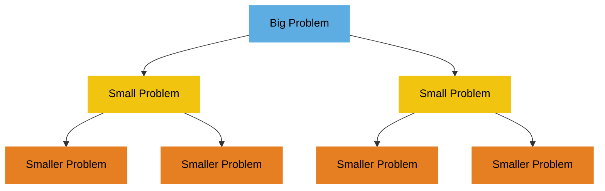

引例：整数相乘

两个n位数的整数相乘：

- $n^2$次1位数相乘
- $n^2$次进位加法
- $n$次$2n$个数相加

所以总共$5n^2$次1位数的运算，时间复杂度是$O(n^2)$

有没有别的更好的办法。

```mermaid
graph TD
    A["Big Problem"] --> B["Small Problem"]
    A --> C["Small Problem"]
    B --> D["Smaller Problem"]
    B --> E["Smaller Problem"]
    C --> F["Smaller Problem"]
    C --> G["Smaller Problem"]

    style A fill:#5DADE2,stroke:#5DADE2,color:black
    style B fill:#F1C40F,stroke:#F1C40F,color:black
    style C fill:#F1C40F,stroke:#F1C40F,color:black
    style D fill:#E67E22,stroke:#E67E22,color:black
    style E fill:#E67E22,stroke:#E67E22,color:black
    style F fill:#E67E22,stroke:#E67E22,color:black
    style G fill:#E67E22,stroke:#E67E22,color:black

```
