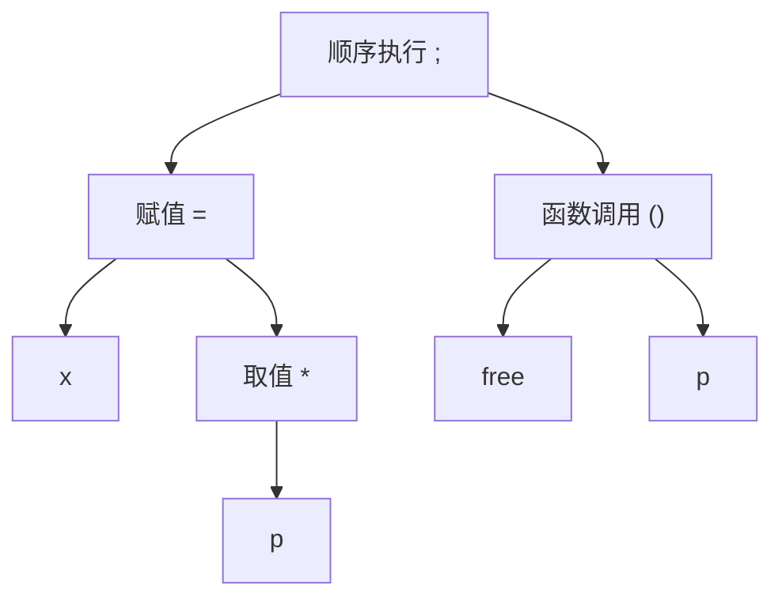

## ToC

- AST
- While语言

## AST

先比较下面三组C语言程序：

第一组：代码中的空格数量不同

```c
y=x+1;
y = x + 1;
```

第二组：代码中包含多余的括号

```c
y = (x) + 1;
y = x + 1;
```

第三组：运算顺序不一样

```c
y = 1 + x;
y = x + 1;
```

对于描述程序行为与程序正确性的理论而言，像第一组例子中的多余空格与第二组例子中的多余括号并不重要，因此，我们认为第一组与第二组都包含了相同的程序语句。**而第三组中的两句程序语句则是不同的程序语句。**

所以我们提出一种树状结构来表示程序语言：

对于C表达式`* (P + 1) ++`的结构：

```text
	++
	 |
	 *
	 |
	( )
	 |
	 +
    / \
   p   1
```

或者另一个表达式：`x = *p; free(p);`的结构

```text
TODO: 调整格式对齐字符
顺 序 执 行
/ \
; ;
| |
= ( ) 函 数 调 用
/ \ / \
x * free p
|
p
```

在这些树结构中，有些信息是多余的，例如第一个例子里面的括号， 第二个例子里面的分号。

于是我们把精简之后的树结构称为这个程序的**抽象语法树（Abstract Syntax Tree, AST）**。



## While 语言

我们这里提出一个While语言，并对它所支持的语法进行一些简化，以便于后续分析举例.

### BNF

BNF（Backus-Naur Form，巴科斯-瑙尔范式）是一种用于描述计算机语言语法的标记技术。它使用一系列推导规则来定义语言的语法结构。

**BNF的基本符号：**

- `::=` 表示"定义为"或"产生"
- `|` 表示"或者"，用于分隔不同的选择
- `< >` 用于包围非终结符（语法变量）
- 终结符直接写出，不用特殊符号包围
- `...` 表示省略或重复

> 上面的这一部分上课没讲，不是很重要。

### 常数 - Number

- `N ::= 0 | 1 | ...`
- While语言的常数是以非0数字开头的一串数字或者0.

### 保留字

- While语言的保留字有：`if`, `then`, `else`, `while`, `do`

### 变量名 - Variable

- `V ::= ...`
- While语言变量名的第一个字符为字母或下划线，while语言的变量名可以包含字母、下划线与数字。
- 保留字不是变量名。
- 例如：`a0`、`x`、`leaf_counter`等等都可以是while语言的变量名。

### 表达式 - Expression

- `E ::= N | V | -E | E+E | E-E | E*E | E/E | E%E | E<E | E<=E | E==E | E!=E | E>=E | E>E | E&&E | E||E | !E`
- 优先级：`|| < && < ! < Comparisons < +,- < *,/,%`
- 同优先级运算符之间左结合，可以使用小括号改变优先级。
- 例如：`a0+1`、`x<=y&&x>0`等等都是while语言的表达式。

### 语句 - Command

```text
C ::= V = E |
	  C; C |
	  if (E) then { C } else { C } |
	  while (E) do { C }
```

> TODO: 我们到底为什么需要区分表达式和语句？https://www.reddit.com/r/ProgrammingLanguages/comments/ya1b6l/why_do_we_have_a_distinction_between_statements/

---

上面这些看起来While语言没啥用，甚至不能和外界交互，因此我们再添加一些功能：

- dereference
- builtin functions
  - 内存分配
  - 输入输出

### 完整表达式

```text
E :: = 之前的表达式 |
	*E |
	malloc(E) | read_int() | read_char()
```

### 完整语句

```text
C :: = var V |
	write_int(E) |
	write_char(E) |
	E = E |
	C; C |
	之前的语句
```

### While程序示例

**示例程序1**

```text
var x;
var n;
var flag;
x = read_int ();
n = 2;
flag = 1;
while (n * n <= x && flag) do {
	if (x % n == 0)
	then { flag = 0 }
	else { n = n + 1 }
};
write_int (flag)
```

**示例程序2**

```text
var x;
var l;
var h;
var mid;
x = read_int();
l = 0;
h = x + 1;
while (l + 1 < h) do {
	mid = (l + h) / 2;
	if (mid * mid <= x)
	then { l = mid }
	else { h = mid }
};
write_int (l)
```

**示例程序3**

```text
var n;
var s;
s = 0;
n = 1;
while (n != 0) do {
	n = read_int();
	s = s + n;
};
write_int(s);
```
