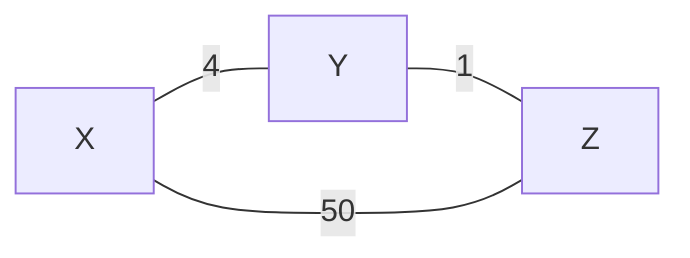
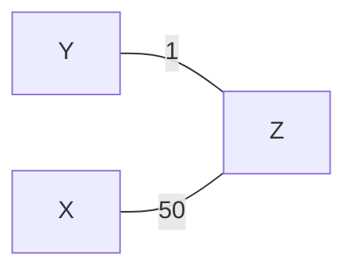
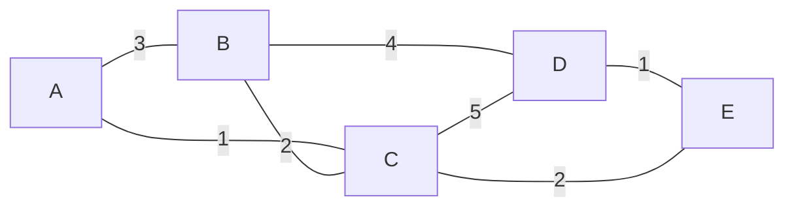
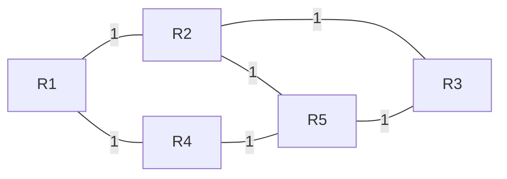
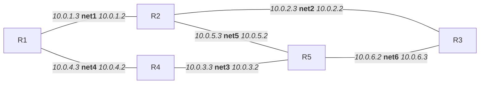

# 简答题

## 第一题

假设网络中有三个路由器 X、Y、Z，初始链路代价如下：

- X 与 Y 直连，代价=4
- Y 与 Z 直连，代价=1
- X 与 Z 直连，代价=50

1. 如果采用距离向量路由协议，假设某时刻链路X-Y突然断开（代价变为$\infty$），请分析路由更新过程中可能出现的“计数到无穷”问题，并说明 Y 和 Z 的路由表如何变化。
2. 若网络改用OSPF 协议（链路状态路由）并划分区域：
   1. OSPF 为什么要划分区域（Area）？至少列出两点原因。
   2. 假设将Y 设为区域边界路由器（ABR），区域 0（骨干区域）包含X 和 Y，区域1 包含Y 和Z。描述链路X-Y 断开后，OSPF 的路由更新过程。
   3. 对比距离向量协议（如 RIP），说明OSPF 如何避免“计数到无穷”问题。

### 答案

网络的初始拓扑结构如下：



#### 1 如果采用距离向量路由协议

那么收敛后的路由表：

- 从X出发：
  - 到Y：直接链路，代价=4
  - 到Z：通过Y转发，代价=5
- 从Y出发：
  - 到X：直接链路，代价=4
  - 到Z：直接链路，代价=1
- 从Z出发：
  - 到X：通过Y转发，代价=5
  - 到Y：直接链路，代价=1

| `From\To` | X   | Y   | Z   |
| --------- | --- | --- | --- |
| X         | 0   | 4   | 5   |
| Y         | 4   | 0   | 1   |
| Z         | 5   | 1   | 0   |

当X-Y链路断开后，X将到Y的代价更新为$\infty$，同时将到Z的代价也更新为$\infty$，Y将到X的代价更新为$\infty$

下一个周期，Z给Y发送自己的路由向量`(5,1,0)`，Y根据协议计算出新的通过Z到X的路由，代价为6

再下一个周期，Y给Z发送自己的路由向量`(6,0,1)`，Z根据协议计算出新的通过Y到X的路由，代价为7

这就会导致Y和Z循环更新（因为形成了环路），最终达到 $\infty$

#### 2.1 如果改用OSPF协议

OSPF划分区域可以减少每个路由器需要知道的拓扑结构，降低路由器存储/计算的负载，也减少了LSA泛洪范围。

#### 2.2 链接断开后的更新

假设X-Y的链接突然断开，二者通过HELLO报文发现链接断开；

随后X再自己的区域0内泛洪以及Y也在区域0和区域1内泛洪。最终所有路由器达到一致的新的网络拓扑结构如下：



路由器重新计算后：

| `From\To` | X   | Y   | Z   |
| --------- | --- | --- | --- |
| X         | 0   | 51  | 50  |
| Y         | 51  | 0   | 1   |
| Z         | 50  | 1   | 0   |

#### 2.3 OSPF避免“计数到无穷”

我认为主要是因为OSPF协议下每个路由器有完整的（或者至少自己所在区域的）网络拓扑图，因此可以更容易获取各个链路的链接状态。不像距离向量协议里面会因为只有距离和下一跳信息而导致陷入环路。

同时泛洪的LSA信息会明确标记链路状态，因此能够避免“计数到无穷”的问题。

## 第二题

某自治系统 AS100 通过两个 ISP（AS200 和 AS300）连接到互联网。AS200 是 AS100的提供商（provider），AS300 是 AS100 的对等节点（peer）。

1. 当AS100 收到来自 AS200 和 AS300 的同一目的网络的路由通告时，根据BGP 路由选择规则，AS100 会优先选择哪条路径？为什么？

2. 如果AS100 希望将自身作为流量中转节点（transit AS），需要如何调整其 BGP 策略？可能存在哪些风险？

### 答案

#### 问题 1

这个取决于AS100的BGP配置的路由选择策略。尤其是第一条规则：最高本地偏好，也就是看LOCAL_PREF。考虑到对等节点的传输费用一般较低，这里应该会优先选择 AS300

#### 问题 2

AS100需要：

- 向AS200（提供商）通告从AS300（对等节点）学习到的路由
- 向AS300（对等节点）通告从AS200（提供商）学习到的路由

并且需要注意存在的风险：安全层面需要考虑流量大幅度增长。商业层面需要考虑AS200提供商和AS300的对等节点是否限制这种流量转发的行为。

## 第三题

假设某网络的拓扑结构如下，各边权重表示链路代价。使用 Dijkstra 算法，计算以节点A 为源节点到其他所有节点的最短路径和总代价，给出每一步中间结果。

```plaintext
A -- 3 -- B
A -- 1 -- C
B -- 2 -- C
B -- 4 -- D
C -- 5 -- D
D -- 1 -- E
C -- 2 -- E
```

### 答案



| Step | N'          | D(B),p(B) | D(C),p(C) | D(D),p(D) | D(E),p(E) |
| ---- | ----------- | --------- | --------- | --------- | --------- |
| 0    | {A}         | 3,A       | 1,A       | $\infty$  | $\infty$  |
| 1    | {A,C}       | 3,A       | 1,A       | 6,C       | 3,C       |
| 2    | {A,C,B}     | 3,A       | 1,A       | 6,C       | 3,C       |
| 3    | {A,C,B,E}   | 3,A       | 1,A       | 4,E       | 3,C       |
| 4    | {A,C,B,E,D} | 3,A       | 1,A       | 4,E       | 3,C       |

所以最终的路由表如下：

| Dest | Link  |
| ---- | ----- |
| B    | {A,B} |
| C    | {A,C} |
| D    | {A,C} |
| E    | {A,C} |

# Lab5 基于 RIP 的路由配置实验

## 目标

通过实验理解距离向量路由协议的基本原理，掌握简单路由配置。

## 实验工具与环境配置：

- Mininet 或者 Docker 模拟网络拓扑
- 支持RIP 协议的软件：FRR

### 环境配置：FRR + Docker

#### 先创建Ubuntu镜像

我用的是macOS上`orbstack`。这里要注意的是后续用的`frr`镜像似乎只提供了`linux/amd64`版本。

```bash
> orb create ubuntu:24.04 -a amd64 -m cs3611-lab5
...
> orb run -m cs3611-lab5
```

#### 安装docker软件

参考[官方文档](https://docs.docker.com/engine/install/ubuntu/)即可，这里省略，最后的结果看到：

```bash
> sudo docker version
Client: Docker Engine - Community
 Version:           28.2.2
 API version:       1.50
 Go version:        go1.24.3
 Git commit:        e6534b4
 Built:             Fri May 30 12:07:27 2025
 OS/Arch:           linux/amd64
 Context:           default

Server: Docker Engine - Community
 Engine:
  Version:          28.2.2
  API version:      1.50 (minimum version 1.24)
  Go version:       go1.24.3
  Git commit:       45873be
  Built:            Fri May 30 12:07:27 2025
  OS/Arch:          linux/amd64 <-- 注意这里的架构
  Experimental:     false
 containerd:
  Version:          1.7.27
  GitCommit:        05044ec0a9a75232cad458027ca83437aae3f4da
 runc:
  Version:          1.2.2
  GitCommit:        v1.2.2-0-g7cb3632-dirty
 docker-init:
  Version:          0.19.0
  GitCommit:        de40ad0
```

#### 配置dockerhub镜像源

```bash
> # 需要先登录
> sudo docker login
...

> sudo docker pull cf-dockerhub-6hm.pages.dev/hello-world
Using default tag: latest
latest: Pulling from hello-world
c9c5fd25a1bd: Pull complete
Digest: sha256:0b6a027b5cf322f09f6706c754e086a232ec1ddba835c8a15c6cb74ef0d43c29
Status: Downloaded newer image for cf-dockerhub-6hm.pages.dev/hello-world:latest
cf-dockerhub-6hm.pages.dev/hello-world:latest
```

上面这里用的是我在cloudflare上配置的反向代理镜像源。

### 环境配置：FRR + Mininet

TODO：后续补充

## 实验步骤：

1. 搭建如下拓扑，所有链路初始代价设为1.



2. 在每台路由器上配置 RIP 协议，确保路由收敛
3. 测试连通性：从 R1 ping R3 和 R5，记录结果
4. 断开R2-R5 的链路，观察路由表更新
5. 重新连接R2-R5，观察路由表更新

## 报告要求：

1. 提供各路由器的初始路由表和更新后的路由表截图。
2. 分析 RIP 协议在链路故障时的收敛时间及路由环路避免机制。
3. 回答：如果将所有链路代价改为非对称值（如 ${ R 1 - R 2 } = 1$ ， $R 2 - R 1 = 5$ ），RIP 协议能否正常工作？为什么？

## 实验具体步骤:

先看 `FRR` + `Docker` 的实验步骤

### 1. 编写 `docker-compose.yml` 配置文件

> **Note:**
>
> 1. the attribute `version` is obsolete, it will be ignored, please remove it to avoid potential confusion. 所以我在助教提供的版本上，移除了`version`这个字段
> 2.

```yaml
services:
  r1:
    image: cf-dockerhub-6hm.pages.dev/frrouting/frr:latest
    container_name: r1
    command: /usr/lib/frr/docker-start
    privileged: true
    cap_add:
      - NET_ADMIN
    volumes:
      - ./configs/r1/:/etc/frr/
    networks:
      net1:
        ipv4_address: 10.0.1.3
      net4:
        ipv4_address: 10.0.4.3

  r2:
    image: cf-dockerhub-6hm.pages.dev/frrouting/frr:latest
    container_name: r2
    command: /usr/lib/frr/docker-start
    privileged: true
    cap_add:
      - NET_ADMIN
    volumes:
      - ./configs/r2/:/etc/frr/
    networks:
      net1:
        ipv4_address: 10.0.1.2
      net2:
        ipv4_address: 10.0.2.3
      net5:
        ipv4_address: 10.0.5.3

  r3:
    image: cf-dockerhub-6hm.pages.dev/frrouting/frr:latest
    container_name: r3
    command: /usr/lib/frr/docker-start
    # command: /bin/sh -c "/usr/lib/frr/start-frr.sh && sleep infinity"
    privileged: true
    cap_add:
      - NET_ADMIN
    volumes:
      - ./configs/r3/:/etc/frr/
    networks:
      net2:
        ipv4_address: 10.0.2.2
      net6:
        ipv4_address: 10.0.6.3

  r4:
    image: cf-dockerhub-6hm.pages.dev/frrouting/frr:latest
    container_name: r4
    command: /usr/lib/frr/docker-start
    privileged: true
    cap_add:
      - NET_ADMIN
    volumes:
      - ./configs/r4/:/etc/frr/
    networks:
      net4:
        ipv4_address: 10.0.4.2
      net3:
        ipv4_address: 10.0.3.3

  r5:
    image: cf-dockerhub-6hm.pages.dev/frrouting/frr:latest
    container_name: r5
    command: /usr/lib/frr/docker-start
    privileged: true
    cap_add:
      - NET_ADMIN
    volumes:
      - ./configs/r5/:/etc/frr/
    networks:
      net3:
        ipv4_address: 10.0.3.2
      net5:
        ipv4_address: 10.0.5.2
      net6:
        ipv4_address: 10.0.6.2

networks:
  net1:
    driver: bridge
    ipam:
      config:
        - subnet: 10.0.1.0/24

  net2:
    driver: bridge
    ipam:
      config:
        - subnet: 10.0.2.0/24

  net3:
    driver: bridge
    ipam:
      config:
        - subnet: 10.0.3.0/24

  net4:
    driver: bridge
    ipam:
      config:
        - subnet: 10.0.4.0/24

  net5:
    driver: bridge
    ipam:
      config:
        - subnet: 10.0.5.0/24

  net6:
    driver: bridge
    ipam:
      config:
        - subnet: 10.0.6.0/24
```

根据这个配置，我们实际上的网络结构是：



### 2. 创建 `frr` 配置文件

```bash
> tree configs
configs
├── r1
│   └── ripd.conf
├── r2
│   └── ripd.conf
├── r3
│   └── ripd.conf
├── r4
│   └── ripd.conf
└── r5
    └── ripd.conf

6 directories, 5 files
```

具体的配置文件：

#### R1

```plaintext
hostname R1
password zebra
!
router rip
version 2
network 10.0.1.0/24
network 10.0.4.0/24
!
log stdout
```

#### R2

```plaintext
hostname R2
password zebra
!
router rip
version 2
network 10.0.1.0/24
network 10.0.2.0/24
network 10.0.5.0/24
!
log stdout
```

#### R3

```plaintext
hostname R3
password zebra
!
router rip
version 2
network 10.0.2.0/24
network 10.0.6.0/24
!
log stdout
```

#### R4

```plaintext
hostname R4
password zebra
!
router rip
version 2
network 10.0.4.0/24
network 10.0.3.0/24
!
log stdout
```

#### R5

```plaintext
hostname R5
password zebra
!
router rip
version 2
network 10.0.3.0/24
network 10.0.5.0/24
network 10.0.6.0/24
!
log stdout
```

### 3. 运行 `docker`

```bash
> ls -al
total 16
drwxr-xr-x@   8 uke  staff   256 Jun  2 14:40 .
drwxrwxr-x@ 110 uke  staff  3520 Jun  2 14:13 ..
-rw-r--r--@   1 uke  staff    43 Jun  2 14:13 README
drwxr-xr-x@   7 uke  staff   224 Jun  2 14:37 configs
-rw-r--r--@   1 uke  staff  2653 Jun  2 15:47 docker-compose.yml

> sudo docker compose up -d
```

### 4. 进入路由器命令行

```bash
> docker exec -it r1 vtysh
Hello, this is FRRouting (version 8.4_git).
Copyright 1996-2005 Kunihiro Ishiguro, et al.
```

### 5. 查看RIP路由表

```bash
d02ec0fa3a3a# show ip rip
Codes: R - RIP, C - connected, S - Static, O - OSPF, B - BGP
Sub-codes:
      (n) - normal, (s) - static, (d) - default, (r) - redistribute,
      (i) - interface

     Network            Next Hop         Metric From            Tag Time
C(i) 10.0.1.0/24        0.0.0.0               1 self              0
R(n) 10.0.2.0/24        10.0.4.2              4 10.0.4.2          0 02:25
C(i) 10.0.4.0/24        0.0.0.0               1 self              0
R(n) 10.0.5.0/24        10.0.4.2              3 10.0.4.2          0 02:25
R(n) 10.0.6.0/24        10.0.4.2              3 10.0.4.2          0 02:25
d02ec0fa3a3a# show ip route
Codes: K - kernel route, C - connected, S - static, R - RIP,
       O - OSPF, I - IS-IS, B - BGP, E - EIGRP, N - NHRP,
       T - Table, v - VNC, V - VNC-Direct, A - Babel, F - PBR,
       f - OpenFabric,
       > - selected route, * - FIB route, q - queued, r - rejected, b - backup
       t - trapped, o - offload failure

K>* 0.0.0.0/0 [0/0] via 10.0.1.1, eth0, 00:11:09
C>* 10.0.1.0/24 is directly connected, eth0, 00:11:09
R>* 10.0.2.0/24 [120/4] via 10.0.4.2, eth1, weight 1, 00:11:06
C>* 10.0.4.0/24 is directly connected, eth1, 00:11:09
R>* 10.0.5.0/24 [120/3] via 10.0.4.2, eth1, weight 1, 00:11:06
R>* 10.0.6.0/24 [120/3] via 10.0.4.2, eth1, weight 1, 00:11:06
```

### 6. 测试连通性

```bash
> sudo docker exec r1 ping -c 3 10.0.6.1
PING 10.0.6.1 (10.0.6.1): 56 data bytes
64 bytes from 10.0.6.1: seq=0 ttl=64 time=0.333 ms
64 bytes from 10.0.6.1: seq=1 ttl=64 time=0.225 ms
64 bytes from 10.0.6.1: seq=2 ttl=64 time=0.226 ms

--- 10.0.6.1 ping statistics ---
3 packets transmitted, 3 packets received, 0% packet loss
round-trip min/avg/max = 0.225/0.261/0.333 ms
```

### 7. 模拟故障

断开 R2和 R5之间的链路（在宿主机操作）

```bash
> sudo docker network inspect cs3611-lab5_net5
[
    {
        "Name": "cs3611-lab5_net5",
        "Id": "7e5b5bb3af45eab2117b68d77ceaeed4e6e7fd0d67119ce2fe1819df5ba7d3f7",
        "Created": "2025-06-03T00:32:35.438001288+08:00",
        "Scope": "local",
        "Driver": "bridge",
        "EnableIPv4": true,
        "EnableIPv6": false,
        "IPAM": {
            "Driver": "default",
            "Options": null,
            "Config": [
                {
                    "Subnet": "10.0.5.0/24"
                }
            ]
        },
        "Internal": false,
        "Attachable": false,
        "Ingress": false,
        "ConfigFrom": {
            "Network": ""
        },
        "ConfigOnly": false,
        "Containers": {
            "8ba8b50323f70b98c038cb09af86c9518abff5065a7466824d810c40ac3ad5cc": {
                "Name": "r5",
                "EndpointID": "7eacb3eb1dd478583a8c511a62dae358221f7b24c166faae0055abe24df0b3c7",
                "MacAddress": "76:b3:f5:46:8a:42",
                "IPv4Address": "10.0.5.2/24",
                "IPv6Address": ""
            },
            "ae25215f0c2b5497c290a71576fa285c6ffe32e182e9eab2855722a481d94e2d": {
                "Name": "r2",
                "EndpointID": "21bc1c8bc9c6810812fff3995efe08aa2c6b06993c0add53112fd2a517fdfbbc",
                "MacAddress": "42:f1:21:a3:1c:22",
                "IPv4Address": "10.0.5.3/24",
                "IPv6Address": ""
            }
        },
        "Options": {},
        "Labels": {
            "com.docker.compose.config-hash": "c427567cd1f71bc1230a42a8e9838af4b8d604ff8eb5bc02978fb5ac3d3ba7c2",
            "com.docker.compose.network": "net5",
            "com.docker.compose.project": "cs3611-lab5",
            "com.docker.compose.version": "2.36.2"
        }
    }
]
> sudo docker network disconnect cs3611-lab5_net5 r2
> sudo docker network inspect cs3611-lab5_net5
[
    {
        "Name": "cs3611-lab5_net5",
        "Id": "7e5b5bb3af45eab2117b68d77ceaeed4e6e7fd0d67119ce2fe1819df5ba7d3f7",
        "Created": "2025-06-03T00:32:35.438001288+08:00",
        "Scope": "local",
        "Driver": "bridge",
        "EnableIPv4": true,
        "EnableIPv6": false,
        "IPAM": {
            "Driver": "default",
            "Options": null,
            "Config": [
                {
                    "Subnet": "10.0.5.0/24"
                }
            ]
        },
        "Internal": false,
        "Attachable": false,
        "Ingress": false,
        "ConfigFrom": {
            "Network": ""
        },
        "ConfigOnly": false,
        "Containers": {
            "8ba8b50323f70b98c038cb09af86c9518abff5065a7466824d810c40ac3ad5cc": {
                "Name": "r5",
                "EndpointID": "7eacb3eb1dd478583a8c511a62dae358221f7b24c166faae0055abe24df0b3c7",
                "MacAddress": "76:b3:f5:46:8a:42",
                "IPv4Address": "10.0.5.2/24",
                "IPv6Address": ""
            }
        },
        "Options": {},
        "Labels": {
            "com.docker.compose.config-hash": "c427567cd1f71bc1230a42a8e9838af4b8d604ff8eb5bc02978fb5ac3d3ba7c2",
            "com.docker.compose.network": "net5",
            "com.docker.compose.project": "cs3611-lab5",
            "com.docker.compose.version": "2.36.2"
        }
    }
]
```

上面可以直观地看到断开前后R2链路的变化

```bash
> sudo docker exec -it r2 vtysh

Hello, this is FRRouting (version 8.4_git).
Copyright 1996-2005 Kunihiro Ishiguro, et al.

ae25215f0c2b# show ip rip
Codes: R - RIP, C - connected, S - Static, O - OSPF, B - BGP
Sub-codes:
      (n) - normal, (s) - static, (d) - default, (r) - redistribute,
      (i) - interface

     Network            Next Hop         Metric From            Tag Time
C(i) 10.0.1.0/24        0.0.0.0               1 self              0
C(i) 10.0.2.0/24        0.0.0.0               1 self              0
R(n) 10.0.3.0/24        10.0.2.2              3 10.0.2.2          0 02:33
R(n) 10.0.5.0/24        10.0.1.3              4 10.0.1.3          0 02:34
R(n) 10.0.6.0/24        10.0.5.2             16 10.0.5.2          0 01:22
ae25215f0c2b#
```

### 8. 恢复链路

```bash
> sudo docker network connect cs3611-lab5_net5 r2 --ip 10.0.5.1
```

---

然后是 `FRR` + `Mininet` 的方案

TODO：下面的内容等待后续完成。本次实验我的操作全都是上文的`frr`+`docker`方案。

### 1. 创建拓扑脚本 rip_lab.py

<html><body><table><tr><td>from mininet.net import Mininet</td></tr><tr><td>from mininet.node import Controller，OvSSwitch</td></tr><tr><td>from mininet.cli import CLI</td></tr><tr><td>from mininet.link import TCLink</td></tr><tr><td>from mininet.log import setLogLevel</td></tr><tr><td>def create_topology():</td></tr><tr><td>net = Mininet(controller=Controller, switch=OvsSwitch, link=TCLink)</td></tr><tr><td></td></tr><tr><td># 添加5台路由器（使用Switch模拟）</td></tr><tr><td>r1 = net.addSwitch('r1')</td></tr><tr><td>r2 = net.addSwitch('r2')</td></tr><tr><td>r3 = net.addSwitch('r3')</td></tr><tr><td>r4 = net.addSwitch('r4')</td></tr><tr><td>r5 = net.addSwitch('r5')</td></tr><tr><td>#创建链路（带宽=10Mbps，延迟=1ms）</td></tr><tr><td>net.addLink(r1，r2，bw=10，delay='1ms'） # R1-R2</td></tr><tr><td>net.addLink(r2，r3，bw=10，delay='1ms'） # R2-R3 net.addLink(r1，r4，bw=10，delay='1ms'） # R1-R4</td></tr><tr><td>net.addLink(r4，r5，bw=10，delay='1ms'） # R4-R5 net.addLink(r2，r5，bw=10，delay='1ms'） # R2-R5 net.addLink(r3，r5，bw=10，delay='1ms'） # R3-R5</td></tr><tr><td>#启动网络 net.start() #配置 IP 地址 (每个接口一个子网) r1.cmd('ifconfig r1-eth0 10.0.1.1/24') r1.cmd('ifconfig r1-eth1 10.0.4.1/24')</td></tr></table></body></html>

<html><body><table><tr><td>r2.cmd('ifconfig r2-eth0 10.0.1.2/24')</td></tr><tr><td>r2.cmd('ifconfig r2-eth1 10.0.2.1/24')</td></tr><tr><td>r2.cmd('ifconfig r2-eth2 10.0.5.1/24') r3.cmd('ifconfig r3-eth0 10.0.2.2/24') r3.cmd('ifconfig r3-eth1 10.0.6.1/24') r4.cmd('ifconfig r4-eth0 10.0.4.2/24')</td></tr><tr><td>r4.cmd('ifconfig r4-eth1 10.0.3.1/24') r5.cmd('ifconfig r5-eth0 10.0.3.2/24')</td></tr><tr><td>r5.cmd('ifconfig r5-eth1 10.0.5.2/24') r5.cmd('ifconfig r5-eth2 10.0.6.2/24')</td></tr><tr><td>#启动FRR 的RIP守护进程（每台路由器） for router in [r1，r2，r3，r4，r5]: router.cmd('/usr/lib/frr/ripd -f /etc/frr/ripd.conf -i /tmp/ripd_{}.pid -d'.format(router.name))</td></tr><tr><td>router.cmd('vtysh -b'） # 进入 FRR 配置模式</td></tr><tr><td></td></tr><tr><td>#进入命令行交互</td></tr><tr><td>CLI(net) net.stop()</td></tr><tr><td>if _name == main setLogLevel('info')</td></tr></table></body></html>

### 2. 修改 FRR 配置文件：

```plaintext
! RIP configuration for R1
hostname R1
password zebra
router rip
version 2 network 10.0.1.0/24 network 10.0.4.0/24
log stdout
# 其他路由器的配置类似（修改network 声明对应的子网）
# R2: network 10.0.1.0/24, 10.0.2.0/24, 10.0.5.0/24
# R3: network 10.0.2.0/24, 10.0.6.0/24
# R4: network 10.0.4.0/24, 10.0.3.0/24
# R5: network 10.0.3.0/24, 10.0.5.0/24, 10.0.6.0/24
```

### 3. 启动拓扑：

```bash
sudo python3 rip_lab.py
```

### 4. 在 Mininet CLI 中验证 RIP 路由表

```bash
mininet> r1 vtysh -c "show ip rip"
mininet> r2 vtysh -c "show ip route"
```

### 5. 测试连通性：

```bash
mininet> r1 ping -c3 10.0.6.1  # R1 ping R3 的接口
```

### 6. 模拟链路故障：

```bash
7. mininet> link r2 r5 down # 断开R2-R5 链路
8. mininet> r2 vtysh -c "show ip rip"  # 观察路由更新
```

### 注意事项:

1. 确保/etc/frr/目录下为每台路由器生成独立的配置文件。
2. 运行 Mininet 和 FRR 可能需要 sudo 权限
