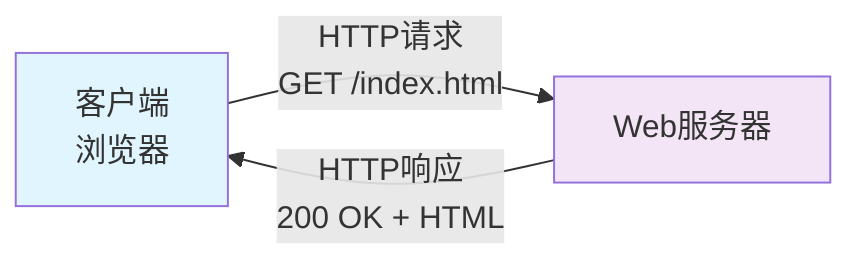
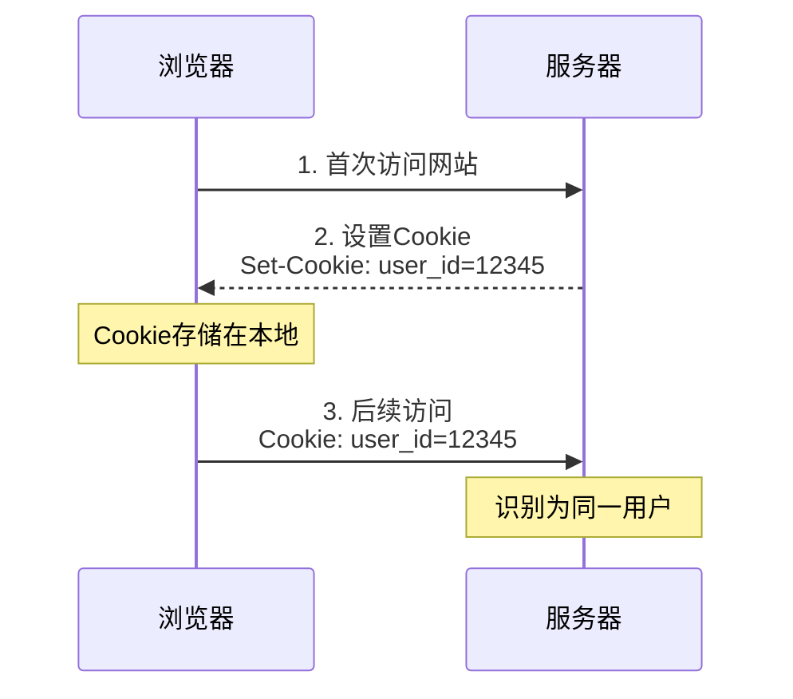
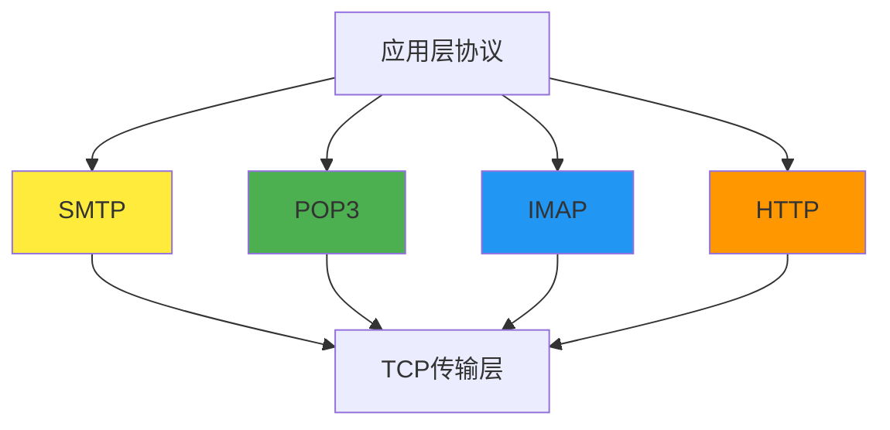
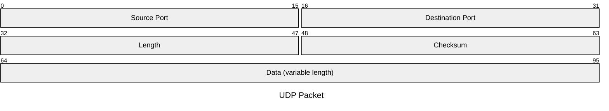
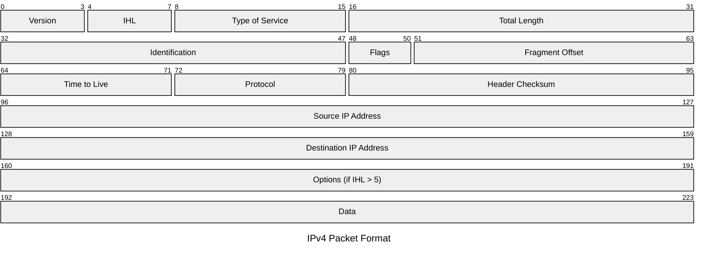
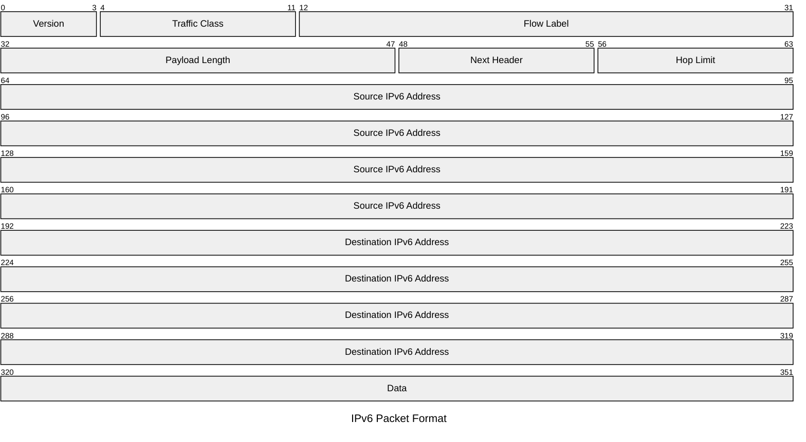

# 期末复习：协议三要素

我们以生活中最常见的 HTTP 协议为例来看三要素分别是什么：

#### 1. 格式 - 数据如何组织

HTTP 消息有固定的格式结构：

**请求格式：**

```
GET /index.html HTTP/1.1
Host: www.example.com
User-Agent: Mozilla/5.0
Accept: text/html

[可选的请求体]
```

**响应格式：**

```
HTTP/1.1 200 OK
Content-Type: text/html
Content-Length: 1234

<html>网页内容</html>
```

- 第一行：请求行/状态行
- 中间部分：头部字段
- 空行分隔
- 最后：消息体

#### 2. 顺序 - 通信步骤

HTTP 遵循严格的请求-响应顺序：

```
客户端 → 服务器：发送HTTP请求
客户端 ← 服务器：返回HTTP响应
```

**具体步骤：**

1. 客户端建立 TCP 连接
2. 发送 HTTP 请求
3. 服务器处理请求
4. 返回 HTTP 响应
5. 关闭连接（HTTP/1.0）或保持连接（HTTP/1.1）

#### 3. 动作 - 收到消息后的行为

**服务器收到请求后的动作：**

- `GET`请求 → 返回指定资源
- `POST`请求 → 处理提交的数据
- `404`错误 → 返回"页面未找到"

**客户端收到响应后的动作：**

- `200 OK` → 显示网页内容
- `301重定向` → 跳转到新地址
- `404错误` → 显示错误页面

#### 4. 完整流程

当你在浏览器输入网址时：

1. **格式**：浏览器按 HTTP 格式组织请求
2. **顺序**：先发请求，再等响应
3. **动作**：根据状态码决定显示内容还是报错

这就是 HTTP 协议如何通过三要素实现可靠的网页通信！

---

# 期末复习：TCP/IP 和 OSI 模型的具体结构和区别

> 注意：书本上只讲了因特网协议栈也就是 TCP/IP 模型

### 模型结构对比

| OSI 七层模型               | TCP/IP 四层模型                 | 主要功能                     | 典型协议/技术                       |
| -------------------------- | ------------------------------- | ---------------------------- | ----------------------------------- |
| **应用层** (Application)   | **应用层** (Application)        | 为用户应用程序提供网络服务   | HTTP, HTTPS, FTP, SMTP, DNS, Telnet |
| **表示层** (Presentation)  | ↗️ 合并到应用层                 | 数据格式转换、加密解密、压缩 | SSL/TLS, JPEG, MPEG, ASCII          |
| **会话层** (Session)       | ↗️ 合并到应用层                 | 建立、管理、终止会话连接     | NetBIOS, RPC, SQL sessions          |
| **传输层** (Transport)     | **传输层** (Transport)          | 端到端可靠数据传输           | **TCP, UDP**                        |
| **网络层** (Network)       | **网络层** (Internet)           | 路径选择和逻辑地址           | **IP, ICMP**, ARP, OSPF, BGP        |
| **数据链路层** (Data Link) | **网络接口层** (Network Access) | 帧封装、错误检测、MAC 地址   | Ethernet, WiFi, PPP                 |
| **物理层** (Physical)      | ↗️ 合并到网络接口层             | 比特流的物理传输             | 电缆、光纤、无线信号                |

### 详细层次分析

#### OSI 模型 (理论标准)

##### 上三层 - 面向应用

- **应用层**: 直接为用户程序提供服务
- **表示层**: 处理数据的语法和语义（加密、压缩、格式转换）
- **会话层**: 管理应用程序间的对话

##### 下四层 - 面向通信

- **传输层**: 提供端到端的数据传输服务
- **网络层**: 处理数据包的路由和转发
- **数据链路层**: 在直连节点间可靠传输帧
- **物理层**: 传输原始比特流

#### TCP/IP 模型 (实际实现)

##### 应用层

- **功能**: 整合了 OSI 的应用层、表示层、会话层功能
- **特点**: 更加实用，直接面向具体应用需求

##### 传输层

- **TCP**: 面向连接，可靠传输，流量控制，拥塞控制
- **UDP**: 无连接，不可靠但高效，适合实时应用

##### 网络层 (Internet 层)

- **IP 协议**: 核心协议，提供无连接的数据包传输
- **路由功能**: 在复杂网络中找到最佳路径

##### 网络接口层

- **功能**: 整合了 OSI 的数据链路层和物理层
- **特点**: 与具体的网络硬件技术相关

### 主要区别总结

#### 1. 层次数量

- **OSI**: 7 层（理论完整）
- **TCP/IP**: 4 层（实用简化）

#### 2. 设计理念

- **OSI**: 先有理论模型，后有协议实现
- **TCP/IP**: 先有协议实现，后总结出模型

#### 3. 实际应用

- **OSI**: 主要用作教学和理论参考
- **TCP/IP**: 互联网的实际标准

#### 4. 协议绑定

- **OSI**: 模型与协议相对独立
- **TCP/IP**: 模型与具体协议紧密结合

#### 5. 灵活性

- **OSI**: 层次分工明确，但可能过于复杂
- **TCP/IP**: 层次合并，更加灵活实用

---

# 期末复习：常见网络攻击类型

### Malware 恶意软件攻击

通过互联网感染各类设备或者自我复制并传播

### DoS(Deny of Service)

使网络、主机或服务对合法用户不可用

| 攻击类型     | 攻击机制           | 攻击效果               |
| ------------ | ------------------ | ---------------------- |
| **漏洞攻击** | 发送特殊构造的报文 | 利用系统缺陷使目标崩溃 |
| **带宽洪泛** | 发送海量数据包     | 堵塞目标的接入链路     |
| **连接洪泛** | 建立大量 TCP 连接  | 耗尽目标主机连接资源   |

利用僵尸网络中的多个主机同时攻击就升级为：DDoS

### DDos

总流量巨大，攻击源分散，更难防御

### 伪装攻击 (IP Spoofing)

通过发送**源地址为伪造地址**的数据包来攻击

- **隐藏身份**：掩盖真实攻击源（恶意身份可以冒充客户/服务器）
- **绕过认证**：欺骗基于 IP 地址的访问控制
- **身份冒充**：伪装成可信主机

可以需要**端点认证机制**来验证通信方的真实身份，具体来说：

- HTTPS 通过数字证书，CA 签名来防止恶意冒充服务器
- 第三方 OAuth 登陆防止恶意冒充用户

### 整理

| 攻击类型     | 主动/被动 | 检测难度 | 主要危害           | 防御重点             |
| ------------ | --------- | -------- | ------------------ | -------------------- |
| **恶意软件** | 主动      | 中等     | 系统控制、数据窃取 | 防病毒软件、系统更新 |
| **DoS/DDoS** | 主动      | 容易     | 服务中断           | 流量过滤、负载均衡   |
| **分组嗅探** | 被动      | 困难     | 隐私泄露           | 数据加密             |
| **IP 伪装**  | 主动      | 中等     | 身份欺骗           | 端点认证             |

---

# 期末复习：各种时延以及吞吐量计算

### 节点总时延

$$d_{nodal} = d_{proc} + d_{queue} + d_{trans} + d_{prop}$$

### 各类时延计算

| 时延类型                 | 公式                  | 影响因素               | 量级          |
| ------------------------ | --------------------- | ---------------------- | ------------- |
| **处理时延** $d_{proc}$  | -                     | 硬件性能               | μs 级         |
| **排队时延** $d_{queue}$ | 取决于流量强度 $La/R$ | 网络拥塞程度           | μs~ms         |
| **传输时延** $d_{trans}$ | $L/R$                 | 分组长度 L，链路速率 R | μs~ms         |
| **传播时延** $d_{prop}$  | $d/s$                 | 物理距离 d，传播速度 s | ms 级(广域网) |

### 端到端时延（无拥塞）

$$d_{end-to-end} = N \times (d_{proc} + d_{trans} + d_{prop})$$

### 关键概念

### 流量强度与排队时延

- **流量强度**: $\rho = La/R$ （L=分组长度，a=到达速率，R=链路速率）
- **设计原则**: 必须保证 $La/R \leq 1$
- **性能特点**: 当 $\rho \to 1$ 时，排队时延急剧增长

### 吞吐量计算

- **平均吞吐量**: $\text{Throughput} = F/T$ （F=总比特数，T=传输时间）
- **瓶颈原理**: 端到端吞吐量 = $\min\{R_1, R_2, ..., R_N\}$
- **共享链路**: 实际吞吐量还需考虑其他流量的影响

### 计算公式

#### 1. 传输 vs 传播时延对比

- **传输时延**: 把整个分组"推出去"的时间 = $L/R$
- **传播时延**: 单个比特"跑过去"的时间 = $d/s$

#### 2. 存储转发时延

- **单个分组经过 N 条链路**: $d = N \times L/R$
- **P 个分组经过 N 条链路**: $d = (N+P-1) \times L/R$

#### 3. 丢包分析

- 当队列满且新分组到达时发生丢包
- 丢包率随流量强度增加而上升
- 需要端到端重传机制处理

### 重要参数值

- **光速**: $s \approx 2 \times 10^8 \sim 3 \times 10^8$ m/s
- **处理时延**: 通常 μs 级或更低
- **关键阈值**: 流量强度接近 1 时性能急剧恶化

---

# 期末复习：分组交换和电路交换的对比

#### 分组交换 vs 电路交换对比

| 对比维度       | 分组交换 (Packet Switching)                                             | 电路交换 (Circuit Switching)                     |
| -------------- | ----------------------------------------------------------------------- | ------------------------------------------------ |
| **基本原理**   | 将报文分割成小的分组，每个分组独立路由传输                              | 建立专用的端到端连接，整个会话期间独占电路       |
| **连接建立**   | 无需建立连接，直接发送分组                                              | 必须先建立专用电路连接（需要 500ms 等建立时间）  |
| **传输机制**   | 存储转发传输：路由器接收完整分组后再转发                                | 电路建立后直接传输，无需存储转发                 |
| **资源分配**   | 资源共享，按需使用                                                      | 资源预留，连接期间独占（即使沉默期间也占用）     |
| **多路复用**   | 统计多路复用，动态共享链路                                              | FDM（频分）或 TDM（时分）多路复用                |
| **时延特性**   | 存在排队时延，时延不确定                                                | 时延固定且较低（与经过链路数无关）               |
| **端到端时延** | N 条链路：$d_{end-end}=N\frac{L}{R}$<br/>P 个分组：$(N+P-1)\frac{L}{R}$ | 传输时间与路径链路数无关，仅取决于分配的电路速率 |
| **缓存需求**   | 需要输出缓存/输出队列存储等待分组                                       | 无需缓存，直接传输                               |
| **丢包处理**   | 缓存满时发生分组丢失，需要重传机制                                      | 电路建立后无丢包问题                             |
| **资源利用率** | 高，多用户共享网络资源                                                  | 低，沉默期间资源闲置浪费                         |
| **路由选择**   | 使用转发表和路由选择协议动态路由                                        | 电路建立时确定固定路径                           |
| **适用场景**   | 突发性数据传输，如互联网应用                                            | 持续、稳定、实时通信，如传统电话                 |
| **网络复杂度** | 较复杂，需要路由协议和缓存管理                                          | 相对简单，但需要复杂的信令软件                   |
| **典型应用**   | 互联网、局域网、数据传输                                                | 传统电话网络(PSTN)                               |
| **传输保证**   | 不保证带宽和时延，尽力而为                                              | 保证固定带宽和传输速率                           |

#### 关键差异总结

- **分组交换**：灵活高效，适合突发数据，但时延不确定
- **电路交换**：稳定可靠，适合实时通信，但资源利用率低

这两种交换方式各有优势，现代网络往往结合两者特点来满足不同应用需求。

---

# 期末复习：不同应用程序体系结构的区别（C-S 结构、P2P 结构）

| 对比维度       | 客户-服务器体系结构 (C-S)                            | 对等体系结构 (P2P)                           |
| -------------- | ---------------------------------------------------- | -------------------------------------------- |
| **核心特点**   | 集中式架构，服务器提供服务                           | 分布式架构，节点间直接通信                   |
| **服务器依赖** | 高度依赖专用服务器                                   | 对专用服务器依赖最小化或无依赖               |
| **通信模式**   | 客户端与服务器通信，客户端间不直接通信               | 对等方之间直接通信                           |
| **服务器特征** | • 始终在线<br>• 固定的周知 IP 地址<br>• 处理客户请求 | 无专用服务器或服务器作用最小                 |
| **节点特征**   | 客户端间歇性连接，发起请求                           | 对等方间歇性连接，用户控制                   |
| **扩展性**     | 需要数据中心支持大规模应用                           | 自扩展性 (Self-scalability)                  |
| **成本**       | 需要维护专用服务器，成本较高                         | 成本效益高 (Cost-effective)                  |
| **优势**       | • 集中管理<br>• 安全性相对较好<br>• 性能稳定         | • 自扩展性强<br>• 成本低<br>• 资源利用率高   |
| **挑战**       | • 服务器负载压力<br>• 单点故障风险<br>• 扩展成本高   | • 安全性问题<br>• 性能不稳定<br>• 可靠性挑战 |
| **典型应用**   | Web、FTP、Telnet、电子邮件                           | BitTorrent、Skype (部分功能)                 |

---

# 期末复习：进程通信的寻址方式

进程通信的寻址需要**两个关键信息**：

**1. 主机地址 (Host Address)**

- **IP 地址** - 32 位数字，唯一标识网络中的主机
- 例如：192.168.1.100

**2. 进程标识符 (Process Identifier)**

- **端口号 (Port Number)** - 标识主机中的特定接收进程/套接字
- 例如：
  - Web 服务器：端口 80
  - 邮件服务器(SMTP)：端口 25

**3. 完整寻址格式**

```plaintext
目标地址 = IP地址 + 端口号
例如：192.168.1.100:80
```

---

# 期末复习：流行的因特网应用及其应用协议和支撑的运输协议

| 应用         | 应用层协议                                            | 运输协议   |
| ------------ | ----------------------------------------------------- | ---------- |
| 电子邮件     | SMTP [RFC 5321]                                       | TCP        |
| 远程终端访问 | Telnet [RFC 854]                                      | TCP        |
| Web          | HTTP 1.1 [RFC 7230]                                   | TCP        |
| 文件传输     | FTP [RFC 959]                                         | TCP        |
| 流媒体       | HTTP (如 YouTube), DASH                               | TCP        |
| 网络电话     | SIP [RFC 3261], RTP [RFC 3550], 或专有协议 (如 Skype) | UDP 或 TCP |

---

# 期末复习：HTTP 协议的运作方式、持续与非持续连接、报文格式、底层的运输协议、常用 http 响应状态码

### HTTP 协议的运作方式

#### 基本工作模式

- **客户端-服务器模式**：浏览器作为客户端，Web 服务器作为服务器
- **请求-响应模式**：客户端发送 HTTP 请求，服务器返回 HTTP 响应
- **无状态协议**：每个请求都是独立的，服务器不保存客户端状态

#### 通信流程

```plaintext
客户端 → HTTP请求 → 服务器
客户端 ← HTTP响应 ← 服务器
```



### 持续与非持续连接

### 报文格式

### 底层运输协议

底层传输协议使用 TCP。并且由 TCP 来提供数据丢失和重排的处理机制，HTTP 并不关心。

### 常见 http 响应状态码

书本上的：

| 状态码 | 状态描述                   | 含义说明                                 |
| ------ | -------------------------- | ---------------------------------------- |
| 200    | OK                         | 请求成功，服务器正常返回请求的资源       |
| 301    | Moved Permanently          | 永久重定向，请求的资源已永久移动到新位置 |
| 400    | Bad Request                | 客户端请求语法错误，服务器无法理解       |
| 404    | Not Found                  | 请求的资源在服务器上不存在               |
| 505    | HTTP Version Not Supported | 服务器不支持请求中使用的 HTTP 协议版本   |

---

# 期末复习：cookie 的作用

允许服务器能够识别和跟踪用户。Cookie 可以在用户不登陆的情况下标记用户，即使关闭浏览器再打开，仍能识别同一用户。



---

# 期末复习：收发电子邮件使用的协议



| 协议 | 默认端口 | 传输层 | 用途                 |
| ---- | -------- | ------ | -------------------- |
| SMTP | 25/587   | TCP    | 发送邮件             |
| POP3 | 110      | TCP    | 接收邮件(下载后删除) |
| IMAP | 143      | TCP    | 接收邮件(服务器保存) |
| HTTP | 80       | TCP    | Web 浏览             |

---

# 期末复习：DNS 协议的服务内容、工作机理、服务器结构层次、缓存

### 服务内容

**四大核心服务：**

1. **主机名到 IP 地址转换** - DNS 最基本功能，应用程序通过 DNS 查询获取目标服务器 IP 地址
2. **主机别名服务** - 通过 CNAME 记录将复杂的规范主机名映射为易记的别名（如  `www.example.com` → `server-farm-west.example.com`）
3. **邮件服务器别名** - 通过 MX 记录实现邮件地址简化（如  `user@company.com`），Web 服务器和邮件服务器可共用域名别名
4. **负载分配** - 将一个主机名映射到多个 IP 地址，通过轮换地址顺序实现流量分散

### 服务器结构层次

**4 层**

1. **根 DNS 服务器** - 全球 13 个逻辑根服务器（上千物理实例），指向相应 TLD 服务器
2. **顶级域 TLD 服务器** - 管理`.com`、`.org`等顶级域名，存储权威 DNS 服务器地址信息
3. **权威 DNS 服务器** - 组织机构管理的服务器，包含域内主机的官方 DNS 记录（最终映射）
4. **本地 DNS 服务器** - 由 ISP/机构提供，用户查询首先发送到此，作为代理执行迭代查询

### 工作机理

DNS 被设计为一个**分布式、层次化**的系统。


### 缓存

- **目的：**  提高查询效率，减少网络流量和根/TLD 服务器负载
- **机制：** DNS 服务器将查询响应存储在本地缓存中，后续相同查询直接由缓存响应
- **TTL 控制：**  每个 DNS 记录设有生存时间，过期后缓存记录自动丢弃
- **效果：**  大多数 DNS 查询实际由本地缓存解决，避免完整层次查询过程

---

# 期末复习：DNS 协议常面临的安全问题（DNS 缓存投毒，DDoS 攻击）

### 1. DNS 缓存投毒（DNS Cache Poisoning）

- **原理：** 攻击者向 DNS 服务器发送虚假响应，将错误的 IP 地址缓存到 DNS 服务器中
- **危害：** 用户访问合法域名时被重定向到恶意网站
- **防护：** 使用 DNSSEC、随机化查询 ID、源端口随机化

### 2. DDoS 攻击

- **DNS 放大攻击：** 利用 DNS 查询的放大效应，小请求获得大响应，消耗目标带宽
- **DNS 服务器攻击：** 直接攻击 DNS 服务器，使其无法正常提供解析服务
- **防护：** 限制查询速率、使用 anycast、部署 DDoS 防护设备

---

# 期末复习：内容分发网络（CDNs）的作用

- **降低延迟：**  用户就近访问内容，减少传输距离
- **提高可用性：**  分布式架构避免单点故障
- **减少带宽成本：**  缓解源服务器压力，优化网络流量

---

# 期末复习：传输层的通信主体（进程）

| 层次       | 通信主体 | 标识符   |
| ---------- | -------- | -------- |
| 应用层     | 应用程序 | 应用协议 |
| 传输层     | 进程     | 端口号   |
| 网络层     | 主机     | IP 地址  |
| 数据链路层 | 网络接口 | MAC 地址 |

---

# 期末复习：TCP 和 UDP 通过什么字段寻址（目的端口号）、常见应用层协议的默认端口号

TCP 和 UDP 协议通过**端口号**进行寻址，具体是在其协议头部的**源端口号**和**目的端口号**字段中实现的。这些字段都是 16 位的，允许使用 0-65535 范围内的端口号。其中，0-1023 叫做**周知端口号**，是为一些标准服务保留的。

| 协议         | 端口号 | 传输层协议 | 用途                       |
| ------------ | ------ | ---------- | -------------------------- |
| FTP 数据传输 | 20     | TCP        | 文件传输协议数据通道       |
| FTP 控制连接 | 21     | TCP        | 文件传输协议控制通道       |
| SSH          | 22     | TCP        | 安全 Shell 远程登录        |
| Telnet       | 23     | TCP        | 远程终端协议               |
| SMTP         | 25     | TCP        | 简单邮件传输协议(发送邮件) |
| DNS          | 53     | TCP/UDP    | 域名系统(域名解析)         |
| DHCP         | 67/68  | UDP        | 动态主机配置协议           |
| HTTP         | 80     | TCP        | 超文本传输协议             |
| POP3         | 110    | TCP        | 邮局协议第 3 版(接收邮件)  |
| IMAP         | 143    | TCP        | 互联网消息访问协议         |
| HTTPS        | 443    | TCP        | 安全 HTTP(加密)            |
| RDP          | 3389   | TCP        | 远程桌面协议               |
| MySQL        | 3306   | TCP        | MySQL 数据库服务           |

> 注意：虽然说 TCP 和 UDP 协议都是通过**端口号**进行寻址，**但** UDP 和 TCP 在实现分解时使用了不同的标识符（UDP 用二元组，TCP 用四元组），这导致了它们在处理多个并发通信时的行为差异。

---

# 期末复习：UDP 协议的特点、使用 UDP 的应用层协议、UDP 报文段结构

### UDP 协议的特点

- 无连接，无拥塞控制：不需要建立连接即可立即传输数据，发送速率不受网络拥塞影响
- 不可靠传输：不保证数据包的可靠到达
- 无状态跟踪：不维护连接状态信息
- 低开销：头部仅 8 字节，远小于 TCP 的 20 字节

### 使用 UDP 的应用层协议

- DNS（域名系统）：域名解析
- DHCP（动态主机配置协议）：动态分配 IP 地址
- SNMP（简单网络管理协议）：网络设备管理
- 流媒体应用：视频直播、音频广播

### UDP 报文段结构



---

# 期末复习：可靠数据传输协议的不同版本（ARQ 协议、停等协议）

| 协议版本   | 信道假设           | 核心机制                                             | 主要特点                                       | 缺陷                      |
| ---------- | ------------------ | ---------------------------------------------------- | ---------------------------------------------- | ------------------------- |
| **rdt1.0** | 完全可靠信道       | 无特殊机制                                           | 简单直接传输，无需反馈                         | 不适用于实际网络环境      |
| **rdt2.0** | 有比特错误，无丢包 | ARQ 协议基础： <br>- 检验和 <br>- ACK/NAK <br>- 重传 | 通过 ACK/NAK 反馈处理比特错误                  | 无法处理 ACK/NAK 本身损坏 |
| **rdt2.1** | 有比特错误，无丢包 | 引入序号(0,1 交替)                                   | 能处理 ACK/NAK 损坏 <br>能识别重复分组         | 仍无法处理分组丢失        |
| **rdt2.2** | 有比特错误，无丢包 | 取消 NAK，只用 ACK，重复 ACK 作为 NAK                | 协议简化 <br>重复 ACK 表示"仍在等待下一个分组" | 仍无法处理分组丢失        |
| **rdt3.0** | 有比特错误，有丢包 | 引入倒计数定时器，超时重传                           | 完备的可靠传输协议 <br>能处理所有类型的错误    | 性能低下(停等方式)        |

---

# 期末复习：流水线可靠数据传输协议的运行过程，GBN 和 SR 协议对应的信道利用率计算

---

# 期末复习：流水线可靠数据传输协议 (GBN & SR)

停止-等待协议 (rdt3.0) 效率极低，因为在任何时刻信道中最多只有一个未确认的分组。为了提高信道利用率，引入**流水线 (Pipelining)** 技术，允许发送方在收到 ACK 前连续发送多个分组。这引出了两种主要的实现协议：**回退 N 步 (GBN)** 和 **选择重传 (SR)**。

### 1. Go-Back-N (GBN) 回退 N 步协议

GBN 的设计哲学是“接收方逻辑简单，发送方来承担更多工作”。

- **工作过程**:
  - **发送方**:
    - 维护一个大小为 N 的发送窗口，所有已发送但未被确认的分组都在此窗口内。
    - 使用**单个计时器**，它与最早发送但未被确认的分组绑定 1。
    - 收到 ACK `n` 时，采用**累积确认**。这意味着序号直到 `n`（包括`n`）的所有分组都已被正确接收。窗口基站（`base`）滑动到 `n+1`。
    - 如果发生**超时**，发送方认为从 `base` 开始的所有分组（即整个窗口内的分组）都已丢失，因此它会**重传所有已发送但未被确认的分组**。
  - **接收方**:
    - 逻辑非常简单：**只按序接收**。
    - 维护一个 `expectedseqnum` 变量，表示下一个期望收到的分组序号。
    - 如果收到的分组序号等于 `expectedseqnum`，则接收并交付给上层，然后 `expectedseqnum` 加一。
    - 如果收到任何**失序的分组**，**一律丢弃**，并重新发送上一个按序收到的 ACK。
- **核心特点**: GBN 的接收方无需缓存失序分组，实现简单。但当信道丢包率高时，其重传效率较低，会浪费带宽。

### 2. Selective Repeat (SR) 选择重传协议

SR 的设计哲学是“只重传真正丢失的分组”，这要求收发双方都更加智能。

- **工作过程**:
  - **发送方**:
    - 为**每个已发送但未被确认的分组**维护一个独立的**逻辑计时器** 2。
    - 收到 ACK `n` 时，采用**单个确认**。只标记分组 `n` 已被正确接收。如果 `n` 是窗口的第一个分组，则窗口向前滑动。
    - 如果某个分组的计时器**超时**，发送方**只重传那一个分组**。
  - **接收方**:
    - 逻辑复杂：**确认并缓存**窗口内所有正确接收的分组，即使它们是失序的。
    - 对于每个正确收到的分组（无论顺序如何），都发送一个对应的 ACK。
    - 一旦某个分组（例如，序号为`n`的分组）被接收，如果它是接收窗口的第一个未收到的分组，那么接收方会将从`n`开始的一批连续已缓存的分组交付给上层，然后接收窗口向前滑动。
- **核心特点**: SR 通过避免不必要的重传来实现了高效率，但代价是发送方和接收方的逻辑都更加复杂。此外，为避免序号混淆，SR 协议的窗口大小 N 必须小于或等于序号空间大小的一半。

### 3. 信道利用率计算 (Pipelined Protocols)

信道利用率 Usender​ 指的是发送方在一段时间内，真正用于发送数据的时间所占的比例。对于流水线协议，在无差错的情况下，其利用率主要取决于窗口大小是否能“填满”信道。

- 核心公式:
  $$U_{sender}=\frac{N\times(L/R)}{RTT+L/R}$$
- **变量解释**:
  - **N**: 发送窗口大小 (单位: 分组数)。
  - **L**: 分组大小 (单位: bits)。
  - **R**: 链路带宽 (单位: bps)。
  - **RTT**: 往返时延 (Round-Trip Time)，单位为秒。
  - **L/R**: 发送一个分组所需的传输时延。
- **理解与应用**:
  - 这个公式的分母 (RTT+L/R) 表示从发送第一个分组的第一位到接收到该分组的确认之间的时间。
  - 分子 N×(L/R) 表示在这段时间内，发送方因窗口足够大而能够持续发送数据的时间。
  - **关键点**: 为了达到高利用率，窗口大小 N 必须足够大，以确保在等待第一个 ACK 返回的`RTT`时间内，发送方始终有数据可发。这个能让信道“充满”的最小窗口大小约等于**带宽时延积 (Bandwidth-Delay Product)**。 BDP (bits)=R×RTT 理想窗口大小  N≈LR×RTT​ (packets)

---

# 期末复习：TCP 协议的特点、使用 TCP 的应用层协议、报文段结构、首部各字段含义、确认机制、连接建立过程、连接断开过程

### 1. TCP 协议的特点

- **面向连接 (Connection-oriented)**：通信前必须通过**三次握手**建立连接，结束后通过**四次挥手**断开连接。
- **可靠的数据传输 (Reliable)**：通过**序号、确认、超时重传、检验和**等机制保证数据无差错、不丢失、不重复且按序到达。
- **全双工通信 (Full-duplex)**：连接双方可以在同一时间进行数据的收发。
- **流量控制 (Flow Control)**：使用**接收窗口 (rwnd)** 控制发送方速率，防止淹没接收方。
- **拥塞控制 (Congestion Control)**：感知网络拥塞状况，动态调整发送速率，防止淹没网络。

### 2. 使用 TCP 的应用层协议

需要高可靠性的应用，例如：

- **HTTP/HTTPS** (Web 网页浏览)
- **FTP** (文件传输)
- **SMTP** (电子邮件发送)
- **Telnet/SSH** (安全远程登录)

### 3. 报文段结构与首部各字段含义

TCP 首部通常为 **20 字节**（无选项字段时）。

- **源/目的端口号 (Source/Dest Port)**：各 16 位，用于标识发送和接收方的应用进程（实现多路复用）。
- **序号 (Sequence Number)**：32 位，数据部分**第一个字节**在字节流中的编号，是实现可靠传输的基础。
- **确认号 (Acknowledgment Number)**：32 位，**期望收到的下一个字节的序号**。这是**累积确认**的核心。
- **首部长度 (Header Length)**：4 位，标识 TCP 首部的长度（以 4 字节为单位）。
- **标志位 (Flags)**：6 位，用于控制连接状态。
  - `SYN`: (Synchronize) **请求建立连接**。
  - `ACK`: (Acknowledge) **确认号字段有效**。
  - `FIN`: (Finish) **请求断开连接**。
  - `RST`: (Reset) **复位连接**，用于异常中断。
  - `PSH`: (Push) 提示接收方尽快将数据交付应用层。
  - `URG`: (Urgent) 紧急指针有效。
- **接收窗口 (Receive Window, rwnd)**：16 位，用于**流量控制**，告知对方自己还有多少接收缓存空间。
- **检验和 (Checksum)**：16 位，用于**差错检测**，覆盖首部和数据部分。

### 4. 确认机制 (可靠传输的核心)

- **累积确认 (Cumulative ACK)**：确认号 $y$ 表示 $y-1$ 及之前的所有字节都已正确收到。
- **超时重传 (Timeout Retransmission)**：为最早未确认的报文段设置定时器。若超时，则重传该报文段。
  - 超时时间动态计算：$TimeoutInterval = EstimatedRTT + 4 \cdot DevRTT$
- **快速重传 (Fast Retransmit)**：当收到 **3 个**对同一数据的**重复 ACK** 时，不等定时器超时，立即重传被认为丢失的报文段。这是对超时重传的重要优化。

### 5. 连接建立过程 (三次握手)

1. **C -> S**: `SYN=1`, `Seq=x` - _客户端请求连接，并发送自己的初始序号 `x`。_
2. **S -> C**: `SYN=1`, `ACK=1`, `Seq=y`, `Ack=x+1` - _服务器同意连接，发送自己的初始序号 `y`，同时确认收到了客户端的序号 `x`。_
3. **C -> S**: `ACK=1`, `Seq=x+1`, `Ack=y+1` - _客户端确认收到了服务器的序号 `y`，连接建立。_

### 6. 连接断开过程 (四次挥手)

（假设客户端 C 主动断开）

1. **C -> S**: `FIN=1`, `Seq=x` - _客户端请求关闭连接。_
2. **S -> C**: `ACK=1`, `Ack=x+1` - _服务器确认收到关闭请求。此时连接处于半关闭状态，服务器仍可向客户端发送数据。_
3. **S -> C**: `FIN=1`, `Seq=y` - _服务器确认数据已发送完毕，发送自己的关闭请求。_
4. **C -> S**: `ACK=1`, `Ack=y+1` - _客户端确认收到服务器的关闭请求。等待 `TIME_WAIT` 计时结束后，连接彻底关闭。_

---

# 期末复习：TCP 协议的拥塞控制机制，慢启动、拥塞避免、快速恢复的过程


**核心思想：加性增、乘性减 (Additive-Increase, Multiplicative-Decrease)** TCP 的目标是在不知道网络实际容量的情况下，高效且公平地使用带宽。其策略是：谨慎地增加发送速率来探测可用带宽（加性增），一旦检测到拥塞（丢包），就迅速降低速率（乘性减），为其他连接让出空间。

- **`cwnd` (Congestion Window / 拥塞窗口)**: 发送方动态调整的窗口大小，直接控制其发送速率。发送数据量上限为 `min(cwnd, rwnd)`。
- **`ssthresh` (Slow Start Threshold / 慢启动阈值)**: 一个动态阈值，用于决定何时从激进的“慢启动”阶段切换到保守的“拥塞避免”阶段。

#### 1. 慢启动 (Slow Start)

- **目的**: 连接建立初期，快速将发送速率提升到一个合理的水平。
- **行为**: `cwnd` 以 **1 MSS** (Maximum Segment Size) 起始，**每个 RTT 翻倍** (指数增长)。
- **退出条件**: 当 `cwnd` 增长到 `ssthresh` 的值时，增长方式必须放缓，随即进入“拥塞避免”阶段。

#### 2. 拥塞避免 (Congestion Avoidance)

- **目的**: 已经接近网络容量，需谨慎地探测更多可用带宽。
- **行为**: `cwnd` **每个 RTT 增加 1 MSS** (线性增长)。这是**加性增**的体现。
- **退出条件**: 检测到丢包事件（超时或 3 个重复 ACK）。

#### 3. 快速恢复 (Fast Recovery) - 响应拥塞

当检测到丢包时，TCP 执行**乘性减**，并根据丢包类型采取不同恢复策略：

- **情况 A: 超时 (Timeout) → 判断为严重拥塞**
  1. `ssthresh` 设为 `cwnd / 2`。
  2. `cwnd` **重置为 1 MSS**。
  3. **重新进入慢启动阶段**。这是最严厉的惩罚，速率降至最低。
- **情况 B: 收到 3 个重复 ACK (3 Duplicate ACKs) → 判断为轻微拥塞**
  - **触发快速重传**: 不用等待超时，立即重传被认为丢失的报文段。
  - **执行快速恢复**:
    1. `ssthresh` 设为 `cwnd / 2`。
    2. `cwnd` **直接降为新的 `ssthresh` 值** (而不是 1 MSS)。
    3. **跳过慢启动，直接进入拥塞避免阶段**。因为收到重复 ACK 说明网络并未完全瘫痪，仍有数据包在传输，因此惩罚较轻。

**总结**: 整个过程使 `cwnd` 的变化呈现出经典的“**锯齿形**”：指数增长（慢启动）→ 线性增长（拥塞避免）→ 减半（丢包）→ 再次线性增长... 循环往复。

---

# 期末复习：TCP 协议吞吐量计算

一条连接的平均吞吐量：$$\frac{0.75\times \text{W}}{\text{RTT}}$$

---

# 期末复习：路由器功能，做分组转发时匹配原则

**路由器功能：**

- 转发：当一个分组到达路由器的输入链路时，路由器将其移动到合适的输出链路的过程。
- 路由：网络层决定分组从源到目的地所经过的路径或路由的过程。

**分组转发时匹配原则**：最长前缀匹配原则（Longest Prefix Match, LPM）

- **定义**：在路由表中找到与目的地址**匹配的前缀最长**的那一项。
- **原因**：这样可以保证分组被转发到最精确、最合适的下一跳。
- **应用**：IPv4、IPv6 路由器的标准查表原则。

---

# 期末复习：IPv4 数据报格式、分片方式

IPv4 数据报格式见图：



其中关键内容：

1. **版本 (Version)**：4 比特，IPv4 版本为 4。
2. **首部长度 (IHL)**：4 比特，表示首部长度（最小 5，最大 15，以 4 字节为单位）。
3. **数据报长度 (Total Length)**：16 比特，表示整个数据报（首部+数据）的长度，最大 65535 字节。
4. **标识 (Identification)**：16 比特，唯一标识一个 IP 数据报，分片时所有分片共享相同标识。
5. **标志 (Flags)**：3 比特，分片相关：
   - **DF (Don't Fragment)**：1 表示禁止分片。
   - **MF (More Fragments)**：1 表示后续还有分片，0 表示最后一个分片。
6. **片偏移 (Fragment Offset)**：13 比特，指示分片在原始数据报中的位置（以 8 字节为单位）。
7. **生存时间 (TTL)**：8 比特，数据报可通过的最大跳数，每经过一个路由器减 1，TTL=0 时数据报被丢弃。
8. **上层协议 (Protocol)**：8 比特，指明数据部分交付的协议（如 TCP=6, UDP=17, ICMP=1）。
9. **首部检验和 (Header Checksum)**：16 比特，仅对 IP 首部进行差错检测。
10. **源 IP 地址**：32 比特，发送主机的 IP 地址。
11. **目的 IP 地址**：32 比特，接收主机的 IP 地址。

---

# 期末复习：编址方式、CIDR 如何编址

IPv4 为每个**接口**（主机或路由器与物理链路的连接点）分配一个唯一的 32 位地址，以点分十进制表示（如 `192.168.1.1`）。

IPv4 编址主要有两种方式：**分类编址**和**无分类编址（CIDR）**。

#### 分类编址

将 IPv4 地址划分为 A、B、C、D、E 类，网络部分和主机部分长度固定：

- **A 类**：`0.0.0.0 - 127.255.255.255`（网络 8 位，主机 24 位）
- **B 类**：`128.0.0.0 - 191.255.255.255`（网络 16 位，主机 16 位）
- **C 类**：`192.0.0.0 - 223.255.255.255`（网络 24 位，主机 8 位）

但分类编址的问题在于：

- **地址浪费**：固定划分无法灵活分配
- **路由表膨胀**：无法进行地址聚合

#### CIDR（无分类编址）

使用 **"IP 地址/网络前缀长度"** 表示法，网络前缀长度可为任意值（0-32）。

#### **(1) CIDR 表示法**

- `10.0.0.0/8`：前 8 位为网络部分
- `192.168.1.0/28`：前 28 位为网络部分

#### **(2) 主机数量计算**

- 主机部分位数 = `32 - n`
- 可分配主机数 = `2^(32-n) - 2`

**示例**：

- `192.168.1.0/24`：主机数 = `2^8 - 2 = 254`
- `192.168.1.0/30`：主机数 = `2^2 - 2 = 2`

#### **(3) 子网划分**

将 `192.168.0.0/24` 划分为 4 个子网：

- 子网 1：`192.168.0.0/26`（主机：`192.168.0.1 - 192.168.0.62`）
- 子网 2：`192.168.0.64/26`（主机：`192.168.0.65 - 192.168.0.126`）
- 子网 3：`192.168.0.128/26`（主机：`192.168.0.129 - 192.168.0.190`）
- 子网 4：`192.168.0.192/26`（主机：`192.168.0.193 - 192.168.0.254`）

#### **(4) 路由聚合**

将多个连续网络聚合减少路由表规模：

- `192.168.0.0/24`、`192.168.1.0/24`、`192.168.2.0/24`、`192.168.3.0/24`
- 聚合为：`192.168.0.0/22`

---

# 期末复习：DHCP 协议的作用

自动为网络中的设备分配 IP 地址和其他网络配置参数。

---

# 期末复习：NAT 地址转换协议的作用，NAT 转换表的内容

#### NAT 的作用

- **解决 IPv4 地址短缺问题**：允许多台设备共享单个公网 IP 地址
- **隐藏内部网络结构**：对外只暴露 NAT 路由器的公网 IP，增强安全性
- **实现 SOHO 网络连接互联网**：小型办公室/家庭办公室网络共享上网

#### NAT 转换表的内容

NAT 转换表记录了内外网通信的映射关系，主要包含：

- **内部主机信息**：私有 IP 地址 + 源端口号
- **外部映射信息**：NAT 路由器公网 IP + 分配的新端口号
- **示例映射**：(10.0.0.1, 3345) → (138.76.29.7, 5001)

#### NAT 工作原理

1. **出站流量处理**：

   - 修改源 IP：私有 IP → 公网 IP
   - 修改源端口：原始端口 → 新分配的唯一端口
   - 记录映射关系到 NAT 转换表

2. **入站流量处理**：
   - 根据目的 IP 和端口查询 NAT 转换表
   - 将目的地址还原为内部私有 IP 和原始端口
   - 转发数据包到内部主机

---

# 期末复习：输出端口排队的处理

1. **FIFO**：简单但无法区分分组重要性。
2. **优先权排队**：支持优先级分类，但可能导致低优先级饥饿。
3. **循环排队与加权公平排队**：
   - 循环排队：轮流服务，简单高效。
   - 加权公平排队：支持带宽保证与公平性分配。

---

# 期末复习：路由器的三种交换结构（内存、总线、互联网络）

路由器的三种交换结构：

1. **内存交换**：由 CPU 控制，一次一分组，受内存带宽限制: $B/2$。
2. **总线交换**：通过共享总线传输，一次一分组，受总线速率限制。
3. **互联网络交换**：支持并行转发，但可能发生阻塞。

---

# 期末复习：IPv6 协议的改进，v4 和 v6 如何混合使用



#### 地址空间扩展

- **128 位地址**：从 IPv4 的 32 位扩展到 128 位，解决地址耗尽问题
- **新增任播地址**：允许数据报交付给一组主机中最近的一个

#### 首部优化

- **精简 40 字节定长首部**：提高路由处理效率
- **移除分片/重组功能**：中间路由器不再进行分片，简化处理
- **移除首部检验和**：减少每跳处理开销
- **扩展首部机制**：将可选功能移至主首部之外

#### 新增功能字段

- **流标签(20 比特)**：标识数据流，支持 QoS 和实时服务
- **流量类型(8 比特)**：类似 IPv4 的 TOS，用于服务区分
- **下一个首部(8 比特)**：指示后续首部类型(TCP/UDP 或扩展首部)
- **跳数限制(8 比特)**：替代 TTL，功能相同

#### 隧道技术(Tunneling)

- **核心原理**：将 IPv6 数据报封装在 IPv4 数据报中穿越 IPv4 网络
- **工作流程**：
  1. 发送端将整个 IPv6 数据报作为 IPv4 数据报的载荷
  2. 设置 IPv4 首部的协议字段为 41(表示 IPv6)
  3. IPv4 网络中正常路由传输
  4. 接收端提取 IPv6 数据报并继续处理
- **优势**：允许 IPv6 孤岛通过现有 IPv4 基础设施互连
- **缺点**：增加额外开销，可能引入 MTU 问题

---

# 期末复习：路由选择算法，距离向量路由选择算法和链路状态路由选择算法的对比

路由选择算法的目标通常是找到从源节点到目的节点的**最低开销路径 (least-cost path)**。如果所有链路的开销都相同（例如，都为 1），那么最低开销路径就是**最短路径 (shortest path)**，即跳数最少的路径。

| 特点                           | 链路状态 (LS) 路由选择算法                                                                                        | 距离向量 (DV) 路由选择算法                                                                                                                             |
| :----------------------------- | :---------------------------------------------------------------------------------------------------------------- | :----------------------------------------------------------------------------------------------------------------------------------------------------- |
| **算法类别**                   | 全局信息 (Global Information)                                                                                     | 分散式 (Decentralized)                                                                                                                                 |
| **基本思想**                   | 每个节点拥有完整的网络拓扑图和所有链路开销，然后在本地运行最短路径算法（如 Dijkstra）计算到达所有其他节点的路径。 | 每个节点只知道到其直接邻居的开销。通过与邻居交换距离向量（包含到所有已知目的地的估计开销），逐步学习到目的地的最低开销路径（基于 Bellman-Ford 方程）。 |
| **信息共享**                   | 节点广播其直连接链路的状态给网络中所有其他节点 (泛洪)。                                                           | 节点仅与其直接邻居交换其当前的距离向量。                                                                                                               |
| **网络视图**                   | 每个节点都有一个完整的网络拓扑视图。                                                                              | 每个节点只对其邻居有直接了解，对更远的网络结构依赖于邻居通告的信息。                                                                                   |
| **计算量**                     | 节点本地计算 Dijkstra 算法，对于大型网络可能计算量较大。                                                          | 节点本地计算 Bellman-Ford 方程，相对简单，但需要多次迭代。                                                                                             |
| **对变化的响应**               | 链路开销改变后，源节点广播更新，所有节点重新计算。对动态负载敏感的开销可能导致振荡。                              | 好消息（开销减小）传播快。坏消息（开销增加）传播慢，易引发无穷计数。                                                                                   |
| **健壮性 (对路由器故障/错误)** | 一个节点广播错误的链路开销，其他节点会基于此错误信息计算路径，但错误相对可控。节点独立计算自己的路由表。          | 一个节点通告错误的路径信息，此错误会通过邻居传播到网络中其他节点，可能导致大范围的路由错误。                                                           |
| **主要问题**                   | 报文开销可能较大；对动态负载敏感的链路开销可能导致振荡。                                                          | 无穷计数问题；路由环路；收敛缓慢。                                                                                                                     |
| **解决方案/改进**              | 随机化通告时间等。                                                                                                | 水平分割 (Split Horizon)；毒性逆转 (Poisoned Reverse)；触发更新；设置最大跳数限制。                                                                    |
| **典型协议举例**               | OSPF, IS-IS                                                                                                       | RIP, IGRP (较老), EIGRP (混合型，结合了 DV 和 LS 的一些优点）                                                                                          |

---

# 期末复习：dijkstra 算法执行过程

##### 核心思想

Dijkstra 算法是一种**贪心算法**，用来寻找从单个源节点 `u` 到图中所有其他节点的最短路径。

它的工作方式就像是在“地图”上逐步扩张“已知最短路径区域” `N'`。每一步，它都贪心地选择一个在“未知区域”中、离源点 `u` **当前已知距离最近**的节点，并将其纳入“已知区域” `N'`。然后，利用这个新加入的节点，去看看能不能“抄近路”来缩短到它邻居节点的距离。

##### 关键术语

- `N'`：**“已确定”集合**。这里面的节点，我们已经找到了从源点出发的**最终**最短路径。
- `D(v)`：从源点 `u` 到节点 `v` **当前已知**的最短路径开销。这个值在算法过程中可能会被更新（变得更小）。
- `p(v)`：路径追踪器。记录了在当前最短路径上，到达节点 `v` 之前的**上一个节点**是谁。用于最后回溯找出完整路径。
- `c(x,y)`：从节点 `x` 直连到节点 `y` 的边的权重（开销）。

##### 算法步骤

**目标：** 以 `u` 为源点，找出到所有其他节点的最短路径。

1. **初始化 (Initialization):**

   - “已确定”集合 `N'` 只包含源点 `u`。
   - `D(u) = 0` (自己到自己距离是 0)。
   - 对于 `u` 的所有邻居 `v`，设置 `D(v) = c(u,v)`，并且 `p(v) = u`。
   - 所有其他非邻居节点的 `D(·) = ∞`。

2. **循环 (The Loop):** 只要 `N'` 还没包含所有节点，就一直重复：

   - **a. 选择 (Select):** 在所有**不属于** `N'` 的节点中，挑出那个 `D(·)` 值最小的节点，称之为 `w`。
   - **b. 加入 (Add):** 把 `w` 加入 `N'`。现在，`D(w)` 就是从 `u`到`w`的**最终最短距离**，不会再变了。
   - **c. 更新 (Update):** 检查 `w` 的每一个**不在** `N'` 中的邻居 `v`：
     - 计算新路径：`D(w) + c(w,v)` (从 `u` 经 `w` 到 `v` 的总距离)。
     - 如果 `D(w) + c(w,v) < D(v)` (发现了一条更近的路！)，就更新：
       - `D(v) = D(w) + c(w,v)` (记录更短的距离)
       - `p(v) = w` (更新路径，现在要通过 `w` 才能到 `v`)

**算法结束：** 当 `N'` 包含了所有节点时，`D(·)` 数组里存的就是 `u` 到所有节点的最终最短距离。

---

# 期末复习：OSPF 协议适用场景

在**单个自治系统内部**进行路由选择，例如大中型企业网络，ISP 网络、大学校园网络等等。

---

# 期末复习：BGP 协议适用场景、iBGP 和 eBGP 的区别

BGP 协议是目前互联网上唯一在广泛使用的**外部网关协议(EGP - Exterior Gateway Protocol)**。它是互联网中用于在不同自治系统 (AS) 之间交换路由信息的关键协议，它可以从相邻的 AS 哪里获取 IP 前缀的可达性信息；可以将外部可达性信息传播到 AS 内部所有路由器；可以根据可达性和 AS 自身路由策略，确定到达各个前缀的最佳路径。为此，需要两种会话类型：外部 BGP(eBGP)在不同 AS 的两个 BGP 路由器之间，一般物理相连，一个 AS 像另一个 AS 通告网络前缀；内部 BGP(iBGP)在同一个 AS 哪的 BGP 路由器之间，边界路由器通过 eBGP 学习到外部 AS 的路由后，需要 iBGP 向 AS 内部其他 BGP 路由器通告消息，确保 AS 内部对外部目的地可达性一致。

---

# 期末复习：SDN 控制平面结构

**软件定义网络 (SDN) 核心思想**是将传统网络设备中紧密集成的**控制平面**（决定如何路由）和**数据平面**（实际转发数据包）分离开来。数据平面由简单的**SDN 交换机**组成，它们根据控制平面下发的**流表 (flow tables)** 进行转发。控制平面则被逻辑上集中到**SDN 控制器**中，它拥有网络全局视图，负责计算和下发流表，并通过**网络应用程序**实现各种网络功能，如路由、负载均衡和防火墙。

**SDN 控制器**是网络的大脑，扮演**网络操作系统**的角色。它通过**南向接口 (SBI)** 与底层的 SDN 交换机通信，**OpenFlow**是最著名的 SBI 协议。控制器通过 SBI 下发流规则并收集网络状态。同时，它通过**北向接口 (NBI)** 为上层的网络应用程序提供 API，以实现**网络可编程性**。当控制器采用分布式部署时，实例间通过**东西向接口**同步状态。

**OpenFlow 协议**定义了控制器和交换机之间的通信标准。交换机内部维护的**流表**由多个**流表项**组成。每个流表项包含三个关键部分：**匹配字段**（用于匹配数据包头部，如 IP 地址、MAC 地址、端口号等）、**计数器**（统计匹配的数据包）和**动作**（定义如何处理数据包，如转发、丢弃、修改字段或**发送给控制器**）。

**SDN 交互流程示例**：当一个新数据流的第一个数据包到达交换机且**没有匹配的流表项**时，交换机会通过**Packet-In**消息将该数据包上报给控制器。控制器（上的网络应用程序）分析该数据包，计算出转发路径，然后通过**Modify-State (Flow-Mod)** 消息向路径上的所有交换机**下发新的流规则**。一旦规则安装完毕，后续属于同一数据流的数据包将直接在数据平面被交换机**快速转发**，无需再与控制器交互。这个过程被称为**反应式流建立**。

---

# 期末复习：ICMP 协议的作用以及报文种类

**因特网控制报文协议 (ICMP)** 是 IP 协议的辅助协议，用于在主机和路由器间传递**网络层的控制与错误信息**。ICMP 报文被封装在**IP 数据报**中传输，其核心字段是**类型(Type)**和**代码(Code)**，用以指明具体事件。对于错误报告，ICMP 报文会包含引发错误的**原始 IP 包的头部和前 8 字节数据**，以便源头定位问题。

ICMP 是网络诊断工具的基石。**Ping**程序通过发送 ICMP **Type 8 (回显请求)**并接收 **Type 0 (回显应答)**来测试主机的连通性。**Traceroute**则利用 ICMP 来发现路径：它发送 TTL 值从 1 开始递增的数据包，路径上的每个路由器在 TTL 减为 0 时会返回一个 ICMP **Type 11 (传输超时)**报文，从而暴露自己的身份。当数据包最终到达目的地时，目标主机会返回一个 ICMP **Type 3 (目标不可达)**，通常是**Code 3 (端口不可达)**，标志着追踪结束。

---

# 期末复习：差错检测和纠正技术，奇偶校验和循环冗余检测

### 核心思想：冗余 (Redundancy)

所有差错控制技术的基础是在原始数据 D 上附加额外的**冗余比特 (EDC - Error-Detection and Correction bits)**。发送方计算并附加 EDC，接收方利用这些 EDC 来检查甚至修复在传输中可能发生的比特差错。差错**纠正**比差错**检测**需要更多的冗余信息，也更复杂。链路层协议（如以太网）通常只进行差错检测，检测到错误后直接**丢弃该帧**，依赖上层协议（如 TCP）负责重传。

### 1. 奇偶校验 (Parity Check)

这是最简单的差错检测方法。

- **一维奇偶校验**: 附加单个**奇偶校验比特**，使得整个比特序列中“1”的个数为奇数（奇校验）或偶数（偶校验）。
  - **优点**: 简单。
  - **缺点**: 只能检测出**奇数个比特**的差错。如果发生偶数个比特的差错，校验会失效。它也**无法纠正**任何错误。
- **二维奇偶校验**: 将数据比特排成矩阵，对每行和每列都计算奇偶校验。
  - **能力**: 这种方法不仅能检测错误，还能**纠正单个比特的差错**。单个比特错误会导致其所在的**行和列**的校验都失败，通过行列交叉点即可精确定位并翻转错误的比特。它也能检测出许多（但不是全部）多比特差错。

### 2. 检验和 (Checksum)

常用于因特网协议栈的传输层（TCP/UDP）和网络层（IP），因为它易于用软件实现。

- **因特网检验和算法**:
  1. **发送方**: 将要保护的数据看作一系列 16 比特的整数。使用**反码算术**（若求和过程中有进位，则将进位加到结果的最低位）将所有这些整数相加。最后，对得到的和**取反码**，结果就是检验和。
  2. **接收方**: 将接收到的所有数据（包括检验和字段）同样视为 16 比特整数序列，并使用反码算术求和。
  3. **校验**: 如果数据无差错，接收方计算出的最终和的所有比特都将是 **1**（即十六进制的 `FFFF`）。如果结果中包含任何 **0**，则表明传输中发生了差错。

### 3. 循环冗余检测 (CRC - Cyclic Redundancy Check)

CRC 是一种非常强大且在链路层（如以太网）广泛使用的差错检测技术。它基于**多项式编码**和**模 2 除法**。

#### 理论基础与关键术语

我们将比特串视为多项式。例如，比特串 `1011` 对应多项式 1⋅x3+0⋅x2+1⋅x1+1⋅x0=x3+x+1。

- **D**: 原始数据比特串，长度为 d 比特。
- **G**: **生成多项式 (Generator)**，一个预先商定的比特串，长度为 r+1 比特。
- **R**: **冗余比特 (CRC 比特或余数)**，长度为 r 比特。
- **模 2 运算**: 在 CRC 计算中，加法和减法都等同于**异或 (XOR)** 操作，不考虑进位或借位。

#### CRC 计算过程 (发送方)

发送方的目标是计算出一个 r 比特的 R，当它附加到 D 后面时，组成的新的 d+r 比特串可以被 G **精确整除**（即余数为 0）。

**步骤：**

1. **选择生成多项式 G**: G 的长度为 r+1 比特。r 是我们想要的 CRC 比特的数量。
2. **扩展数据 D**: 将 D 左移 r 位，相当于在 D 后面补 r 个 0。在多项式中，这相当于计算 D⋅2r。这个操作的目的是为余数 R 留出空间。
3. **模 2 除法**: 用 G 去除扩展后的数据 D⋅2r。这个除法过程就是一系列的异或操作。
4. **得到余数 R**: 上一步除法得到的余数就是 CRC 校验码 R。R 的长度恰好是 r 比特。
5. **构造最终帧**: 将原始数据 D 和计算出的余数 R 拼接起来形成最终要发送的数据帧 T=D⊕R（这里 ⊕ 代表拼接）。

#### CRC 校验过程 (接收方)

1. **接收数据**: 接收到可能出错的数据帧 T^。
2. **模 2 除法**: 用与发送方**相同**的生成多项式 G 去除接收到的数据 T^。
3. **检查余数**:
   - 如果余数为**全 0**，则认为数据**没有差错**，接收方接受该数据。
   - 如果余数为**非 0**，则表明传输过程中**发生了差错**，接收方丢弃该帧。


---

# 期末复习：信道划分方式

**信道划分协议**将一个共享的通信信道资源，划分为多个更小的、专用的“片段”，并为每个节点分配一个固定的片段。这种方式可以确保不同节点间的传输不会互相干扰，做到公平分配，但可能导致效率低下。

#### **时分多路复用 (Time Division Multiplexing, TDM)**

TDM 通过**时间**来划分信道。整个时间轴被切分为重复的**帧 (frame)**，每个帧又被划分为 N 个**时隙 (time slot)**，每个节点分配一个专用的时隙。节点只能在轮到自己时隙的时候发送数据。

- **核心思想**: 按**时间**“切片”。
- **主要缺点**: 如果一个节点没有数据要发送，它被分配到的时间片就会被**浪费**掉。

#### **频分多路复用 (Frequency Division Multiplexing, FDM)**

FDM 将信道的总**频率带宽**划分为 N 个更小的**频带 (frequency band)**。每个节点被分配一个唯一的频带用于数据传输。

- **核心思想**: 按**频率**“切片”。
- **主要缺点**: 与 TDM 类似，如果一个节点处于非活动状态，它所占有的频率带宽同样会被**浪费**。

#### **码分多址 (Code Division Multiple Access, CDMA)**

CDMA 允许所有节点在**同一时间、使用相同的全部频率**进行传输。为了区分不同节点的信号，系统为每个节点分配一个唯一的**编码 (code)**。接收方可以通过这个唯一的编码，从所有混合在一起的信号中，准确地分离出特定发送方的数据。

- **核心思想**: 所有节点共享整个信道，但使用**唯一的编码**来区分彼此。
- **优点**: 比 TDM 和 FDM 更灵活高效，因为它不预留可能被闲置的资源片段。

---

# 期末复习：纯 ALOHA 和时隙 ALOHA 的对比

| 特性 (Characteristic) | 时隙 ALOHA (Slotted ALOHA)                                     | 纯 ALOHA (Pure ALOHA)                                         |
| :-------------------- | :------------------------------------------------------------- | :------------------------------------------------------------ |
| **同步要求**          | **需要**，所有节点必须同步到统一的时间时隙。                   | **不需要**，完全异步，实现更简单。                            |
| **传输时机**          | 有数据时，必须**等待下一个时隙的开始处**才能传输。             | 有数据时**立即传输**，无需等待。                              |
| **碰撞窗口**          | 较小，仅为一个时隙的长度。只有在同一时隙开始传输的帧才会碰撞。 | 较大，为一个帧传输时间的两倍。碰撞风险更高。                  |
| **最大效率**          | 较高，约为 **37%** ($\frac{1}{e}$​)。                          | 较低，约为 **18%** ($\frac{1}{2e}$​)，仅为时隙 ALOHA 的一半。 |
| **核心优点**          | 效率相对较高。                                                 | 思想和实现都非常简单。                                        |
| **核心缺点**          | 需要额外的同步机制，增加了实现复杂度。                         | 信道利用率非常低，碰撞浪费严重。                              |

---

# 期末复习：CSMA 的不同类型对于繁忙信道的处理方式

| 特性                 | 基础 CSMA (载波侦听多路访问)                             | CSMA/CD (带碰撞检测的载波侦听多路访问)                                                    |
| :------------------- | :------------------------------------------------------- | :---------------------------------------------------------------------------------------- |
| **核心原则**         | 先听后说                                                 | 先听后说，**边说边听**                                                                    |
| **侦听到信道繁忙时** | **推迟传输**，等待信道变为空闲。                         | **推迟传输**，等待信道变为空闲。                                                          |
| **发生碰撞时**       | **没有明确的恢复机制**。协议本身未定义如何从碰撞中恢复。 | **有主动的恢复机制**：<br>1. **中止**传输<br>2. 发送**拥塞信号**<br>3. **指数退避**后重试 |
| **总体策略**         | 被动的**避让**策略。                                     | 主动的**避让 + 恢复**策略，效率和稳定性更高。                                             |

---

# 期末复习：CSMA/CD 中的碰撞后的处理方式

- **中止传输**：节点立刻停止发送其数据帧。
- **发送拥塞信号**：节点会发送一个 48 比特的**拥塞信号 (jam signal)**。这确保了网络上所有其他正在传输的节点都能明确地感知到碰撞的发生。
- **指数退避**：发送完拥塞信号后，节点进入**指数退避 (exponential backoff)** 等待阶段。对于第 $n$ 次连续发生的碰撞，节点会从 $0$ 到 $2^m-1$ 的范围内随机选择一个整数 $K$，其中 $m=\min(n,10)$。这个随机选择的范围会随着碰撞次数的增加而**指数级增大**（上限为 1023），从而大大降低了节点们在下一次同时重传的概率。
- **等待并重试**：节点会等待 $K \cdot 512$ 比特时长的延迟，然后返回到初始的"侦听信道"步骤，准备重新尝试发送。

---

# 期末复习：MAC 地址含义和 ARP 协议的作用过程

在网络通信中，IP 地址和 MAC 地址扮演着不同但互补的角色，而 ARP 协议则是连接这两者的关键桥梁。

#### **1. MAC 地址 (Media Access Control Address)**

MAC 地址是网络接口（如网卡）的**硬件地址或物理地址**，用于在**单个局域网（LAN）内部**实现设备间的通信。

- **格式与长度**
  - MAC 地址是一个全球唯一的**6 字节（48 比特）**的地址。
  - 通常用 12 位十六进制数表示，字节之间用冒号或短横线分隔，例如：`00-16-EA-AE-3C-40`。
- **唯一性与管理**
  - MAC 地址由**IEEE（电气和电子工程师协会）**统一管理，以确保其全球唯一性。
  - 地址的前 3 个字节是**组织唯一标识符 (OUI)**，由 IEEE 分配给硬件制造商。后 3 个字节由制造商自行分配给每个设备。
- **扁平结构**
  - 与具有层级结构的 IP 地址不同，MAC 地址是**扁平的**。这意味着地址本身不包含任何位置信息。一个设备的 MAC 地址是永久固定的，无论它连接到哪个网络，都如同一个人的**身份证号**，不会改变。
- **广播地址**
  - 一个特殊的 MAC 地址 `FF-FF-FF-FF-FF-FF` 被用作**广播地址**。向这个地址发送的帧，会被局域网内的**所有**设备接收。

#### **2. ARP 协议 (Address Resolution Protocol)**

ARP 协议的核心作用是**“地址解析”**，即在一个局域网（同一子网）内，根据一个设备已知的**IP 地址**，找出其对应的**MAC 地址**。这个过程是数据在链路层能正确封装和发送的前提。

- **ARP 表 (ARP Table)**
  - 每个主机和路由器都会在内存中维护一个**ARP 表**（或 ARP 缓存）。
  - 这个表存储了近期查询到的 `IP地址 -> MAC地址` 的映射关系。
  - 表中的每个条目都有一个**生存时间（TTL）**，过期后会自动删除，以确保信息的时效性。

#### **ARP 工作全过程**

假设主机 A (`IP_A`, `MAC_A`) 要向**同一子网内**的主机 B (`IP_B`) 发送数据，但 A 只知道 B 的 IP 地址，不知道其 MAC 地址。

1. **查询自身缓存**

   - 主机 A 首先检查自己的 ARP 表中是否存在`IP_B`的条目。
   - **缓存命中 (Hit)**：如果找到了对应的`MAC_B`，A 会直接用`MAC_B`作为目的地址来封装数据帧并发送。过程结束。
   - **缓存未命中 (Miss)**：如果未找到，则启动 ARP 查询过程。

2. **构造并广播 ARP 查询**

   - 主机 A 会创建一个**ARP 查询分组**。这个分组的核心内容是：“**我是`IP_A`和`MAC_A`，请问谁是`IP_B`？请告诉我你的 MAC 地址。**”
   - 然后，A 将这个 ARP 查询分组放入一个链路层帧中，并将该帧的目标 MAC 地址设置为**广播地址 (`FF-FF-FF-FF-FF-FF`)**。
   - 最后，A 将这个广播帧发送到局域网上。

3. **处理 ARP 查询**

   - 局域网上的**所有设备**都会收到这个广播帧。
   - 每个设备都会检查 ARP 查询中的目标 IP 地址（`IP_B`）是否是自己的 IP 地址。
   - 如果不是，设备会**忽略**这个查询分组。
   - 只有主机 B 发现目标 IP 地址是自己，它才会进行下一步。

4. **单播 ARP 响应**

   - 主机 B 准备一个**ARP 响应分组**，其中包含自己的 MAC 地址`MAC_B`。
   - B 将这个响应分组放入一个**单播**帧中，目标 MAC 地址设置为`MAC_A`（主机 A 的 MAC 地址已包含在第一步的查询分组中）。
   - B 将这个单播帧直接发送回给主机 A。

5. **更新缓存并发送数据**

   - 主机 A 收到主机 B 的 ARP 响应后，就获得了`MAC_B`。
   - A 会将这个 `IP_B -> MAC_B` 的映射关系**存入自己的 ARP 表**中，以备后用。
   - 最后，A 将最初要发送的 IP 数据报封装成以`MAC_B`为目的地址的帧，并将其发送出去。

---

# 期末复习：交换机与路由器的比较

| 特性名称 | 集线器 | 路由器 | 交换机 |
| -------- | ------ | ------ | ------ |
| 流量隔离 | 无     | 有     | 有     |
| 即插即用 | 有     | 无     | 有     |
| 优化路由 | 无     | 有     | 无     |

交换机可以用于：几百台主机组成的小网络，它通常有几个局域网网段；而对于几千台主机组成的更大网络需要包括路由器来提供更健壮的流量隔离方式和对广播风暴的控制。
