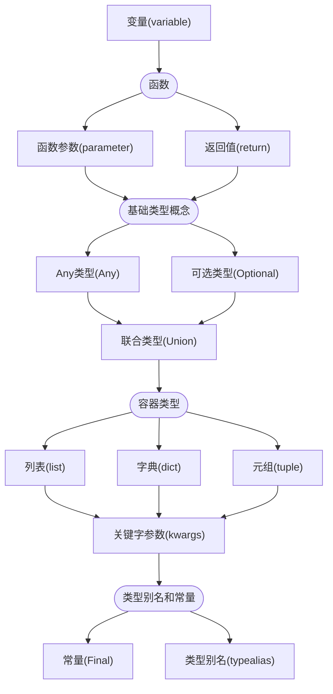
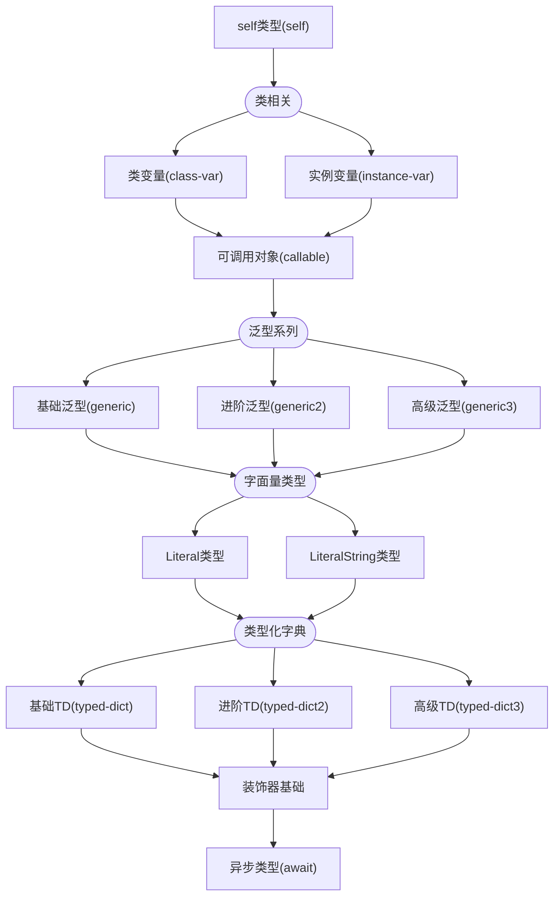
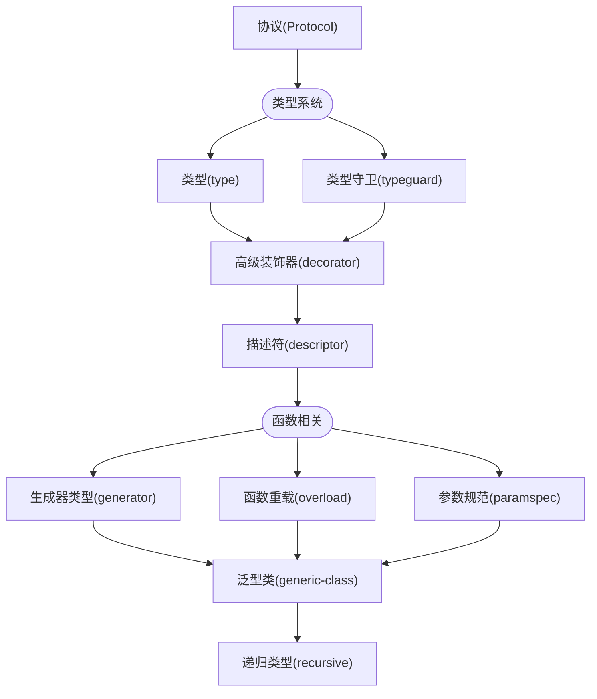
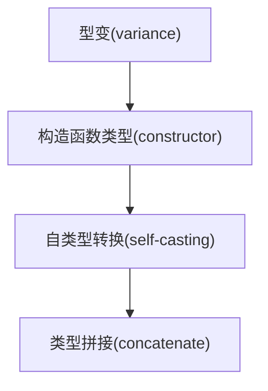

本系列为Python类型挑战系列的解答。挑战网址链接：[https://python-type-challenges.zeabur.app/]

也可以GitHub下载源码本地部署：[https://github.com/laike9m/Python-Type-Challenges]

TODO: 什么是静态类型检查，什么是运行时类型判断

有些题目存在多解的情况。

## 学习路线

我自己做题的时候发现这个网站上的题目是按照题目名字的字母顺序排列的，如果你想通过练习做题来学习Python的类型的话，我建议你按照下面的顺序开始这个挑战，尽可能减少出现做前面的题目需要后面的知识点的情况。

### 基础阶段（BASIC）：

### 进阶阶段（INTERMEDIATE）

### 高级阶段 (ADVANCED)

### 专家阶段 (EXTREME)

