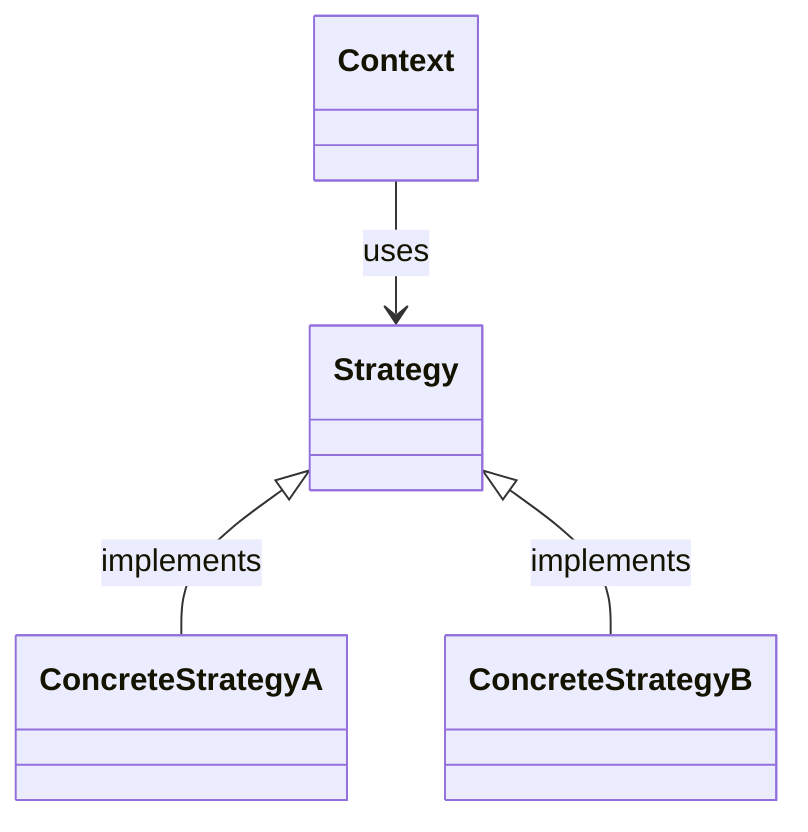

> [!abstract] 一句话核心
> 在这里用你自己的话，凝练地总结这个模式的本质。这是为了快速回顾时，能在3秒内唤醒记忆。

---

## 1. 意图 / 要解决的问题 (The "Why")

> [!question] 这个模式解决了什么痛点？
> 在这里详细描述一个未使用该模式前的“糟糕”场景。描绘代码的“坏味道”，例如充满了 `if-else`、模块紧密耦合、难以扩展等。解释为什么这种写法不好。

---

## 2. 解决方案 / 核心思想 (The "What")

> [!tip] 它是如何解决上述问题的？
> 阐述该模式的核心设计思想。它是如何通过引入新的角色、抽象或改变结构来优雅地解决第一部分提出的“痛点”的。这里应该着重描述其遵循的设计原则（如开闭原则、单一职责原则等）。

---

## 3. 结构与角色 (The "Structure")

> [!note] 模式的蓝图

### UML 类图

在这里嵌入UML图。你可以使用 PlantUML 插件、Mermaid 插件，或者直接粘贴图片。



### 参与角色

- **`角色A (英文名)`**
  - **职责**: 在此描述这个角色（类/接口）在这个模式中承担的责任。
- **`角色B (英文名)`**
  - **职责**: ...
- **`角色C (英文名)`**
  - **职责**: ...

---

## 4. 代码示例 (The "How")

> [!example] Talk is cheap. Show me the code.

### Before: 重构前的代码

在这里贴上未使用模式前的“坏”代码，并简要注释说明其问题所在。

```java
// 注释：这里的 if-else 结构导致每次新增类型都需要修改此类。
public class ProblematicCode {
    public void doSomething(String type) {
        if ("A".equals(type)) {
            // ...
        } else if ("B".equals(type)) {
            // ...
        }
    }
}
```

### After: 应用模式后的代码

在这里贴上应用了设计模式的“好”代码，并用注释标明哪个类对应UML中的哪个角色。

```java
// Strategy: 策略接口
interface Strategy {
    void execute();
}

// ConcreteStrategyA: 具体策略A
class ConcreteStrategyA implements Strategy {
    @Override
    public void execute() {
        // ...
    }
}

// Context: 上下文
class Context {
    private Strategy strategy;

    public Context(Strategy strategy) {
        this.strategy = strategy;
    }


    public void executeStrategy() {
        strategy.execute();
    }
}
```

---

## 5. 优缺点 (Pros & Cons)

> [!todo] 权衡利弊

### 优点 (Pros)

- 优点一：...
- 优点二：...

### 缺点 (Cons)

- 缺点一：...
- 缺点二：...

---

## 6. 适用场景 (Applicability)

> [!check] 我应该在什么时候使用它？
>
> 列出一些明确的信号或场景，当你遇到这些情况时，就应该考虑使用此模式。
>
> - 当...
> - 如果...
> - 在...的情况下...

---

## 7. 现实世界中的应用 (Real-World Examples)

> [!bug] 这个模式在哪些知名项目中被使用过？
>
> - **JDK**: 例如 `java.util.Comparator` 就是策略模式的绝佳例子。
> - **Spring Framework**: 例如...
> - **其他框架/库**: ...

---

## 8. 相关模式 (Related Patterns)

> [!link] 与其他模式的联系和区别
>
> - **[[另一个设计模式]]**: 与该模式的关系是...（例如，经常一起使用，或者结构相似但意图不同）。
> - **[[又一个设计模式]]**: 与该模式的区别在于...（帮助你辨析易混淆的模式）。

## 9. 练习题
